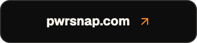

<div align="center">


<h1>PwrSnap</h1>

<strong>Screen capture for the agent age.</strong>

<p>
  <a href="https://github.com/pwrdrvr/PwrSnap/releases/latest/download/PwrSnap-arm64.dmg"></a>
  <a href="https://github.com/pwrdrvr/PwrSnap/releases/latest/download/PwrSnap.dmg"></a>
  <a href="https://github.com/pwrdrvr/PwrSnap/releases/latest/download/PwrSnap.Setup.exe"></a>
</p>

<p>
  <a href="https://docs.pwrsnap.com"></a>
  <a href="https://pwrsnap.com"></a>
  <a href="https://pwrdrvr.com/about"></a>
</p>

<sub>macOS 14 or newer · Windows 10 or newer · MIT · Developer ID-signed and Apple-notarized; the Windows installer is Authenticode-signed
No account, no telemetry, no PwrSnap server. AI is optional, and rides the Codex you already have.</sub>

<br>


</div>

Not sure which Mac? **Apple Silicon** is the right download for an M-series
Mac, and the smaller one. **Universal** runs natively on both Intel and Apple
Silicon. The Apple Silicon chip downloads the native `PwrSnap-arm64.dmg` from
the latest stable release.

A local-first macOS and Windows capture + library app with global hotkeys for
region, window, and full-screen snaps. A float-over toast that copies a Low /
Med / High render to the clipboard in one click. A menu-bar or system-tray
surface that keeps the last capture ready for instant re-copy or edit. And —
because the AI brain is the Codex CLI / Codex Desktop you already have
installed — annotation, smart filenames, descriptions, and sensitive-data
review go through your existing OpenAI Codex plan, billed to the AI cloud
provider you've already set Codex up with.

## Why you might want it

- **Capture is instant, and it's where your fingers already are.** `⌘⇧C` on
  macOS or `Ctrl+Shift+C` on Windows for quick capture (snap to a window, drag
  a region, or hold `Shift` at commit time for occlusion-free full-window).
  Dedicated chords cover region-only and window-only modes. Every binding is
  editable from **Settings → Hotkeys** and rebinds without a restart.
- **The library knows where the snap came from.** Captures auto-group by
  source app (Chrome, Slack, Xcode, Figma…) with first-class buckets in
  the sidebar. Filter by app. Virtualized grid stays smooth at thousands
  of rows. Drag a capture straight out to Finder, Messages, or any drop
  target.
- **One-click copy at the resolution you actually want.** Right after
  every capture, the float-over toast pops up with **Low**, **Med**, and
  **High** preset copies. The renderer caches the bytes per preset, so
  the second paste — including from a global copy hotkey while the toast
  is up — is instant.
- **Menu-bar or system-tray surface for the last snap.** The tray popover
  always shows the most recent capture with an Edit button and quick re-copy.
  One click away from anywhere on the OS, no Library window needed.
- **AI rides the Codex you already have, on your existing plan.** PwrSnap
  is a Codex App Server *client* — it talks stdio JSON-RPC to your local
  Codex CLI / Codex Desktop install for annotation, description
  generation, smart filenames, sensitive-data scan, and (Phase 5+) voice
  describe. The image-bearing turns then hit whichever AI cloud provider
  Codex is set to talk to (OpenAI by default — Codex itself is an OpenAI
  product — but Codex can be configured to route elsewhere), billed to
  the plan you already have with that provider through Codex. PwrSnap
  itself opens no new account, holds no API key of its own, and never
  calls a model provider directly. Settings → AI Providers auto-discovers
  every Codex binary on the system and lets you pin a specific path.
- **Local-first and quiet.** Durable captures and chat threads live in the OS
  Documents folder under `PwrSnap` (`~/Documents/PwrSnap` on macOS and normally
  `%USERPROFILE%\Documents\PwrSnap` on Windows). The database, settings,
  encrypted secrets, and regenerable caches stay in the platform app-data
  directory: `~/Library/Application Support/PwrSnap` on macOS or
  `%APPDATA%\PwrSnap` on Windows. A denied Documents write can select the
  sticky `~/PwrSnap` or `%USERPROFILE%\PwrSnap` fallback instead. No telemetry.
  No PwrSnap-owned account or cloud sync. (AI features, when enabled, do ride
  your existing Codex/provider plan — see the AI bullet above.)

The longer-form pitch is at **[pwrsnap.com](https://pwrsnap.com)**;
operator setup + feature reference at
**[docs.pwrsnap.com](https://docs.pwrsnap.com)**.

## Get it

### Supported desktop releases

| Platform | Release artifact | Native architecture | Minimum OS | Release verification |
| --- | --- | --- | --- | --- |
| macOS | ARM64 and universal DMG / updater ZIP | Apple Silicon; universal also supports Intel | macOS 14 or later | Developer ID signed, hardened, and Apple-notarized |
| Windows | Per-user NSIS installer | x64 | Windows 10 or Windows 11 | Authenticode-signed; installer and app signatures are verified before publication |
| Linux | No distributed package | — | — | Linux builds gate releases, but Linux desktop support is not shipped |

Every tagged desktop release is published only after the macOS
sign/notarization job, Windows signing job, and Linux build gate all succeed.
Release installers include the controlled FFmpeg sidecar used for video
processing; normal users do not need to install FFmpeg separately.

### Install a stable release

1. **Download PwrSnap.** The chips at the top of this page are the shortest
   route; every file below is also on the
   [latest stable release](https://github.com/pwrdrvr/PwrSnap/releases/latest)
   under a version-stamped name.
   - macOS, universal —
     [`PwrSnap.dmg`](https://github.com/pwrdrvr/PwrSnap/releases/latest/download/PwrSnap.dmg).
     One build for Apple Silicon + Intel, running natively on both, and the
     right choice if you are not sure which Mac you have.
   - macOS on Apple Silicon —
     [`PwrSnap-arm64.dmg`](https://github.com/pwrdrvr/PwrSnap/releases/latest/download/PwrSnap-arm64.dmg),
     the native build and a substantially smaller download.
   - Windows —
     [`PwrSnap.Setup.exe`](https://github.com/pwrdrvr/PwrSnap/releases/latest/download/PwrSnap.Setup.exe),
     the x64 installer. Every release also carries the same bytes version-
     stamped as `PwrSnap-<version>-windows-x64-setup.exe`, which is the name
     you will see in the release's asset list.
2. **Install it.** On macOS, open the DMG and drag PwrSnap to Applications;
   both macOS builds are Developer ID-signed and Apple-notarized, so first
   launch is a single Gatekeeper prompt. On Windows, run the per-user
   installer; its default location is `%LOCALAPPDATA%\Programs\PwrSnap`.
3. Optionally connect Codex from **Settings → AI Providers**. Capture, editing,
   the Library, and export continue to work without an AI provider.

GitHub's `releases/latest` route serves the current stable release. For
prerelease testing, use the main
[Releases page](https://github.com/pwrdrvr/PwrSnap/releases) and choose the
versioned artifact for your platform. Pull-request preview artifacts are not
production-signed and expire after 14 days; the Windows preview is unsigned,
and the macOS preview is not notarized. They are for development testing rather
than normal installation.

Detailed Windows installation, storage, limitations, troubleshooting, and
source-build notes live in [docs/windows/README.md](docs/windows/README.md).

Signed release builds update through `electron-updater` using the `latest-mac.yml`
and `latest.yml` metadata published beside their installers. Choose Stable or
Beta and Latest or Prerelease under **Settings → General → Updates**. The Help
menu's **Check for Updates** runs the same check on demand; after a download,
PwrSnap offers **Restart to Update**. When a release contains both macOS
architectures, Apple Silicon (including Rosetta) receives the ARM64 ZIP and
Intel receives universal. Existing universal installations follow the same
routing; older universal-only releases remain compatible.

### Want to hack on it

```bash
git clone https://github.com/pwrdrvr/PwrSnap.git
cd PwrSnap
source ~/.nvm/nvm.sh
nvm use
pnpm install
pnpm dev
```

For Linux development, install and desktop dev/preview warn when Electron's
setuid sandbox helper lacks root ownership or mode `4755`. If Electron reports
the SUID sandbox error, run these commands from the repository root:

```bash
pnpm fix:linux-sandbox
pnpm dev
```

The fixer resolves this checkout's installed Electron helper, runs `sudo chown
root:root` followed by `sudo chmod 4755`, and verifies the result. It is safe to
repeat; run PwrSnap as your normal user. Reinstallation or Electron replacement
may require repeating the repair. `pnpm check:linux-sandbox` repeats the read-only
advisory check. User namespaces may permit launch without the setuid helper;
mount policy (such as `nosuid`) and other security restrictions can still prevent
startup after repair. Install and launch never request sudo automatically or
disable sandboxing. Both commands safely do nothing on non-Linux platforms.

Keep a separate `pnpm install` in each worktree. Sharing root `node_modules`
does not supply all package-local dependency links, and sharing package
`node_modules` can bind workspace imports to the donor checkout's source and
make native staging mutate shared dependencies. Sharing a repaired helper is
not a complete setup fix.

PwrSnap is a pnpm workspace (`apps/desktop` + `packages/*`). The Codex
App Server protocol types are consumed from
`@pwrdrvr/codex-app-server-protocol`, pinned in
`apps/desktop/package.json`; publish that package from its own repo before
bumping PwrSnap to a newer Codex protocol surface. Full dev workflow,
conventions, and the architecture overview live in
**[AGENTS.md](AGENTS.md)** and **[docs/architecture.md](docs/architecture.md)**.

## How it's built

| Layer                | Stack                                                    | Where it lives                                  |
| -------------------- | -------------------------------------------------------- | ----------------------------------------------- |
| Desktop shell        | Electron + TypeScript + React 19 + electron-vite         | `apps/desktop/`                                 |
| Capture pipeline     | Electron/OS capture + `sharp`; Swift/C++ window helpers | `apps/desktop/src/main/capture/`                  |
| Render pipeline      | `sharp` for resize + crop + thumbnail caching            | `apps/desktop/src/main/render/`                 |
| Persistence          | `better-sqlite3` (WAL) + durable `.pwrsnap` bundles      | `apps/desktop/src/main/persistence/`            |
| Codex App Server     | Published protocol contracts, stdio JSON-RPC client      | `@pwrdrvr/codex-app-server-protocol` + `apps/desktop/src/main/ai/` |
| Shared types         | Cross-process commands + IPC channels + result envelopes | `packages/shared/`                              |
| Settings + secrets   | Single substrate (JSON + Electron `safeStorage`)         | `apps/desktop/src/main/settings/`               |

A few load-bearing design rules:

- **Single command bus.** Every IPC verb routes through
  [`apps/desktop/src/main/command-bus.ts`](apps/desktop/src/main/command-bus.ts) —
  ipcMain today, HTTP RPC and MCP later. Exactly one place to register
  a command; exactly one place to enforce auth + capability checks.
- **Renderers stay sandboxed.** Every `BrowserWindow` is
  `contextIsolation: true, sandbox: true, nodeIntegration: false`.
- **Result-pattern for cross-process errors.** Electron `invoke` strips
  `instanceof`. All handlers return `Result<Res, PwrSnapError>` —
  `{ ok: false, error: { kind, code, message, cause? } }`.

## Roadmap

macOS and Windows are shipping desktop targets. The 1.1 release line ships an
Apple Silicon macOS DMG, a universal macOS DMG for Intel and Apple Silicon, and
a signed Windows x64 installer through the same guarded release; Linux remains
a build-only release gate with no supported installer. The
durable architecture and direction live in
[docs/architecture.md](docs/architecture.md); platform specifics are in the
[Windows guide](docs/windows/README.md).

What's shipped vs. what's still in flight — including video capture, the
sizzle-reel composer, and presenter video — is tracked at
**[docs.pwrsnap.com](https://docs.pwrsnap.com)**.

The desktop release pipeline (universal DMG, Windows x64 installer, signing,
notarization, updater metadata, and stable-name aliases) is documented in
[docs/desktop-release-runbook.md](docs/desktop-release-runbook.md).

## Going deeper

| Doc                                                                                                | What it covers                                                                            |
| -------------------------------------------------------------------------------------------------- | ----------------------------------------------------------------------------------------- |
| **[pwrsnap.com](https://pwrsnap.com)**                                                             | Marketing landing — the WHY in 60 seconds.                                                |
| **[docs.pwrsnap.com](https://docs.pwrsnap.com)**                                                   | Operator reference — capture modes, hotkeys, settings, AI configuration.                  |
| [AGENTS.md](AGENTS.md)                                                                             | Project conventions, brand rules, "how the load-bearing pieces fit together." Read first. |
| [docs/desktop-release-runbook.md](docs/desktop-release-runbook.md)                                 | One-time setup, CI release path, local fallback, universal DMG verification.              |
| [docs/architecture.md](docs/architecture.md)                                                       | What PwrSnap is, the storage/AI/library decisions that still hold, and what's unresolved.  |
| [docs/solutions/](docs/solutions/)                                                                 | Post-incident notes + gotchas — read before re-solving an old problem.                    |

## License

PwrSnap is licensed under the [MIT License](LICENSE). Third-party
dependency notices are aggregated in
[THIRD_PARTY_LICENSES](THIRD_PARTY_LICENSES) and shipped with desktop
distributions. The bundled FFmpeg sidecar is LGPL-2.1, so every release also
publishes its `ffmpeg-<version>-…-LGPL-NOTICE.txt` and `-SOURCE-OFFER.txt`
beside the installers — legal disclosures rather than downloads. How all of it
is generated and gated is in
[docs/third-party-license-notices.md](docs/third-party-license-notices.md).

Created by [PwrDrvr LLC](https://pwrdrvr.com). Copyright © 2026 PwrDrvr LLC.
