

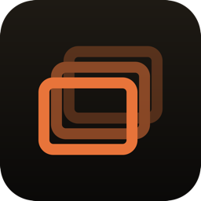

<h1>PwrSnap</h1>

<strong>Screen capture for the agent age.</strong>

Capture, annotate, record, and keep every snap in a searchable library. 
macOS and Windows. Local-first, and AI only when you turn it on.

  
  
  

Homebrew: <code>brew install --cask pwrdrvr/tap/pwrsnap</code>

  <a href="https://docs.pwrsnap.com">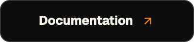</a>
  <a href="https://pwrsnap.com">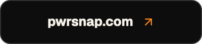</a>
  

macOS 14 Sonoma or newer · Windows 10 or newer, x64 · MIT 
No account, no telemetry, no PwrSnap server.

  

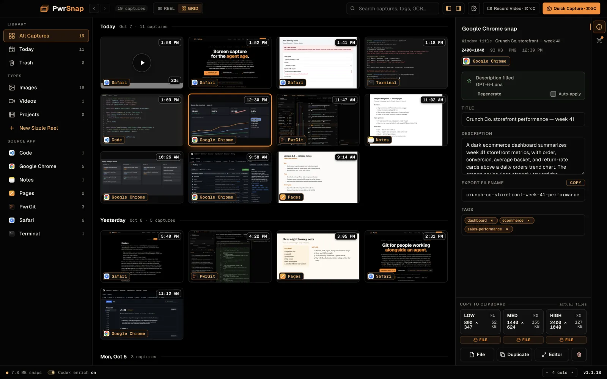

## Why PwrSnap

A screenshot is usually on its way somewhere: a chat, a ticket, an agent's
context window. PwrSnap is built to get it there fast and to find it again
later.

- **One shortcut.** <kbd>Command+Shift+C</kbd> (<kbd>Ctrl+Shift+C</kbd> on
  Windows) opens Quick Capture: hover a window to take it, drag a rectangle,
  or take the whole screen. Press <kbd>R</kbd> instead of <kbd>Enter</kbd>
  and the same selection becomes a recording; on macOS,
  <kbd>Command+Option+C</kbd> goes straight to recording. Region, window,
  full-screen, and timed captures have their own bindable shortcuts.
- **Copy at the size you meant.** A toast appears after every capture with
  **Low**, **Med**, and **High** renders, one click or
  <kbd>Command+1</kbd>–<kbd>Command+3</kbd> to the clipboard, or drag one out
  as a file.
- **An editor that leaves the original alone.** Arrows, shapes, freehand
  pen, marker and airbrush, highlights, text, crop, and blur in three
  strengths — Gaussian, pixelate, or solid redact. Every mark is a layer you
  can move, restyle, or delete later. **Duplicate** keeps edited copies
  together as a family.
- **A library that remembers where things came from.** Captures are grouped
  by the app they were taken from, by type, and by day, in a grid or a reel.
  Search covers titles, descriptions, tags, and text read out of the image.
- **Video in the same place.** Record a region or a window with microphone
  and system audio on macOS. Trim, cut out sections, or let **Cut idle**
  remove the stretches where nothing moved; export GIF or MP4 at three sizes.
- **Sizzle reels.** Pick captures, write or generate a script, and render a
  narrated video from them.
- **Agents can use it too.** A local, OAuth-protected MCP server lets an
  agent you approve search your captures, read them, and export them. Each
  agent gets a named session and a role you can change or revoke in
  **Settings → Local Agents**.

## A closer look

<table>
  <tr>
    <td width="50%">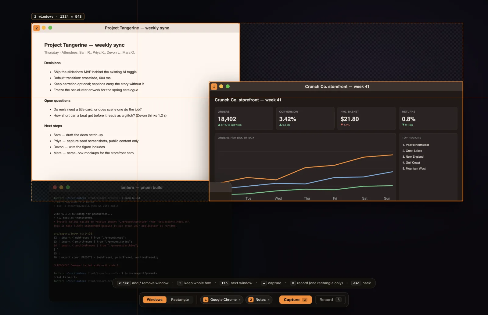</td>
    <td width="50%">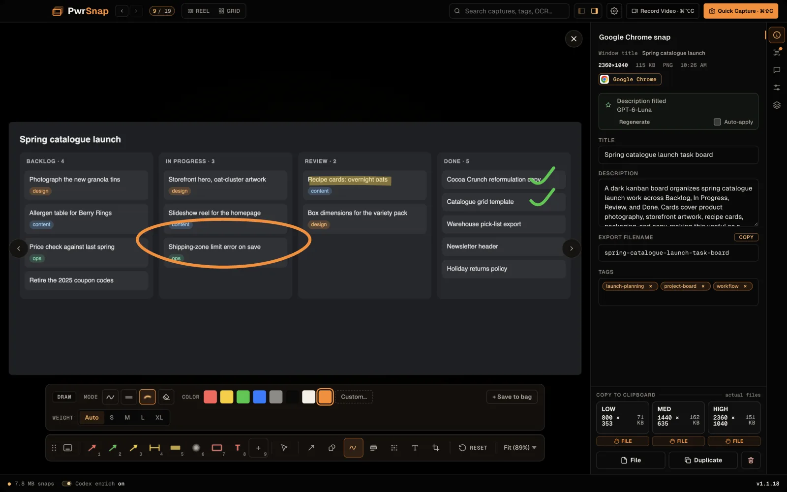</td>
  </tr>
  <tr>
    <td><b>Window, region, or screen.</b> Hover to pick a window; drag for a region.</td>
    <td><b>Draw on it.</b> Pen, marker, airbrush, and an eraser that cuts strokes.</td>
  </tr>
  <tr>
    <td width="50%">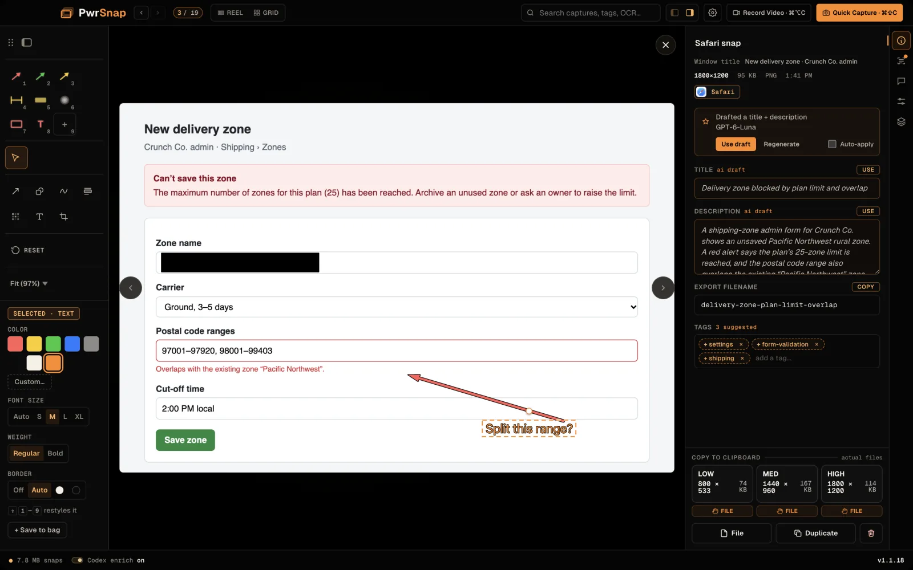</td>
    <td width="50%">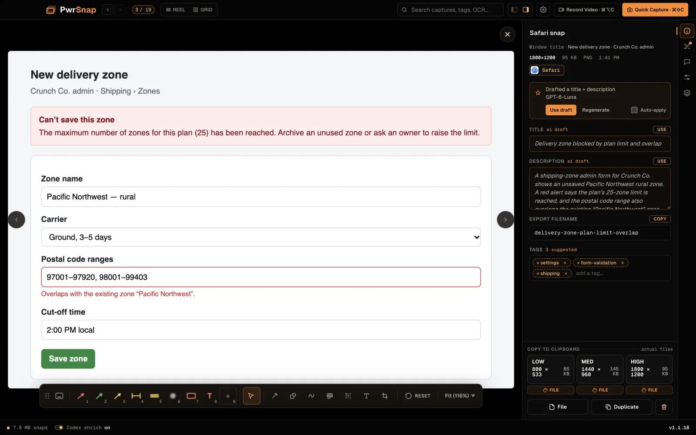</td>
  </tr>
  <tr>
    <td><b>Redact before you send.</b> Solid redaction, pixelate, or blur; the toolbar docks to any edge.</td>
    <td><b>Optional AI drafts.</b> Title, description, filename, and tags, waiting for you to accept.</td>
  </tr>
  <tr>
    <td width="50%">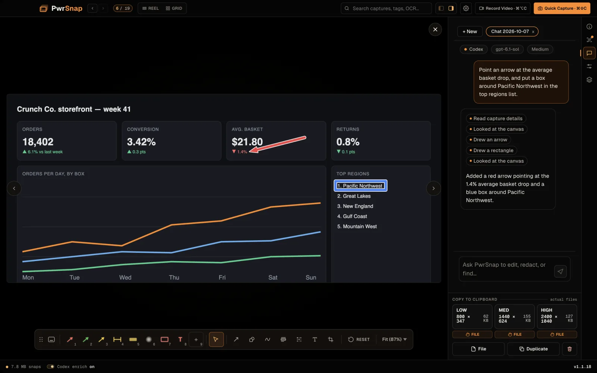</td>
    <td width="50%">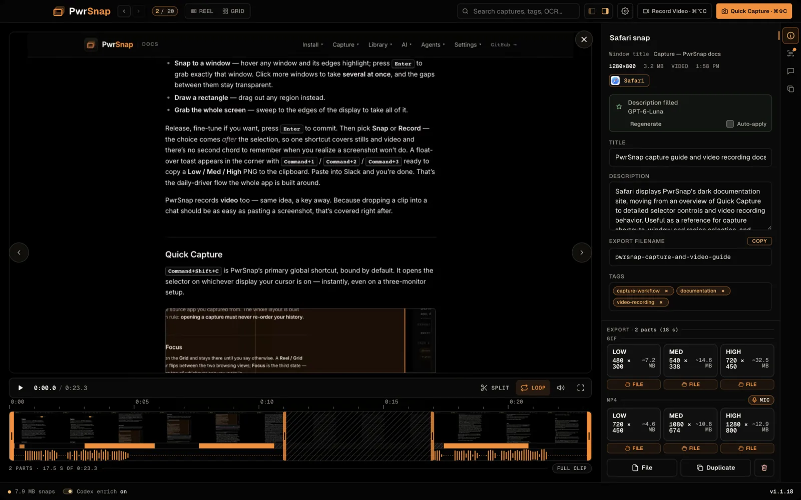</td>
  </tr>
  <tr>
    <td><b>Ask about a capture.</b> Library chat can describe it, or annotate it for you.</td>
    <td><b>Recordings, trimmed.</b> Cut idle, split, and export GIF or MP4.</td>
  </tr>
  <tr>
    <td width="50%">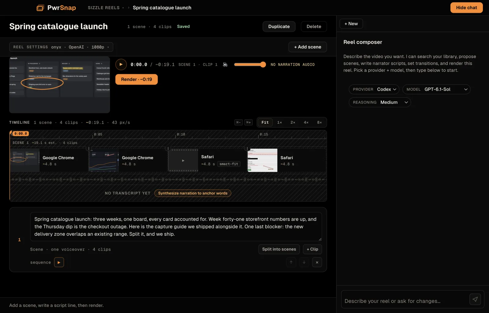</td>
    <td width="50%">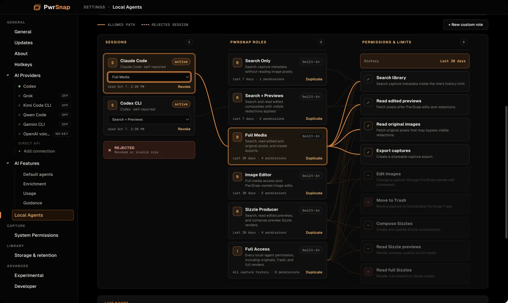</td>
  </tr>
  <tr>
    <td><b>Sizzle reels.</b> Captures and clips on a timeline, with narration.</td>
    <td><b>Agent access you can see.</b> Every session, its role, and what that role allows.</td>
  </tr>
</table>

## Install

| Platform | Download | Notes |
|---|---|---|
| macOS, Apple Silicon | [PwrSnap-arm64.dmg](https://github.com/pwrdrvr/PwrSnap/releases/latest/download/PwrSnap-arm64.dmg) | M1 or newer. The smaller download. |
| macOS, Intel or not sure | [PwrSnap.dmg](https://github.com/pwrdrvr/PwrSnap/releases/latest/download/PwrSnap.dmg) | Universal. On Apple Silicon it moves itself to the arm64 build on its next update. |
| macOS, Homebrew | `brew install --cask pwrdrvr/tap/pwrsnap` | Picks the right build for your Mac. |
| Windows 10 / 11, x64 | [PwrSnap.Setup.exe](https://github.com/pwrdrvr/PwrSnap/releases/latest/download/PwrSnap.Setup.exe) | Per-user installer, no administrator prompt. |

macOS builds are Developer ID signed, hardened, and Apple-notarized, and run on
macOS 14 or later; the universal DMG runs natively on Apple Silicon + Intel.
The Windows installer is Authenticode-signed and runs on
Windows 10 or Windows 11, x64. A release lists it as `PwrSnap-<version>-windows-x64-setup.exe`;
`PwrSnap.Setup.exe` is the same file under a stable name, and
`PwrSnap-windows-SHA256SUMS` carries its checksum. There is no Windows arm64
build. Linux desktop support is not shipped.

On Windows, recordings have no audio yet. The details are in the
[Windows guide](docs/windows/README.md).

**Updates** come from GitHub Releases, on a Stable or Beta train with Latest
and Prerelease tracks (**Settings → General → Updates**). **Check for
Updates…** in the app's menu checks on demand, and an update installs when you
choose **Restart to Update**. The download links above always serve
[the latest stable release](https://github.com/pwrdrvr/PwrSnap/releases/latest).
For prerelease testing, pick the versioned file for your platform from the
[Releases page](https://github.com/pwrdrvr/PwrSnap/releases).

Full walkthrough, permissions, and first launch:
[docs.pwrsnap.com/install](https://docs.pwrsnap.com/install/).

## AI features are opt-in

Off by default. Capture, editing, the Library, video, and export all work
without any AI provider.

When you turn it on, PwrSnap can draft a title, description, filename, and
tags for each new capture and read the text in it; answer questions about a
capture in Library chat and draw annotations on request; and help write a
Sizzle reel. It runs through whichever you choose:

- an agent CLI you already have and are signed in to — the Codex CLI, or an
  ACP agent such as Gemini CLI, Qwen Code, or Kimi Code CLI; or
- **Sign in with ChatGPT**, which calls OpenAI’s Responses API from PwrSnap
  using your eligible ChatGPT plan, with no Codex install or API key; or
- a direct API connection you configure yourself: OpenAI Responses, any
  Chat Completions-compatible endpoint (including a server on your own
  machine), or Anthropic Messages.

Background enrichment runs with no tools, no file access, and no network of
its own; the image goes in as image input and one JSON object comes back.
Keys you enter are stored encrypted by the operating system and never shown
again. Sizzle narration uses a text-to-speech key you add separately.

PwrSnap is free; **Use your ChatGPT plan** requires no paid PwrSnap upgrade.
Automatic post-capture use requires separate consent. ChatGPT OAuth tokens
stay in the local encrypted secret store under your control.
[Learn more](https://help.openai.com/en/articles/20001542-using-your-chatgpt-plan-in-other-apps-and-sites)
and see [connection details and operator steps](docs/sign-in-with-chatgpt.md).

## Privacy

No account, no telemetry, no PwrSnap server. Captures live in
`~/Documents/PwrSnap` on macOS and `%USERPROFILE%\Documents\PwrSnap` on
Windows. The database, settings, and caches stay in
`~/Library/Application Support/PwrSnap` or `%APPDATA%\PwrSnap`. Nothing leaves
the machine unless you copy it, send it, turn on an AI provider, or approve an
agent.

## Ways to help

- **[Star the repository](https://github.com/pwrdrvr/PwrSnap)** — it is the
  main way anyone else finds PwrSnap.
- **[Open an issue](https://github.com/pwrdrvr/PwrSnap/issues)** for a bug or
  a rough edge. A capture that lands on the wrong display or with the wrong
  bounds is worth reporting even if nothing crashed.
- **Send a pull request.** Development setup, architecture, and the checks CI
  runs are in [CONTRIBUTING.md](CONTRIBUTING.md).
- **Report vulnerabilities privately** — see [SECURITY.md](SECURITY.md).

What changed in each release: [CHANGELOG.md](CHANGELOG.md).

## License

[MIT](LICENSE). Third-party dependency notices are in
[THIRD_PARTY_LICENSES](THIRD_PARTY_LICENSES) and ship with every release. The
bundled FFmpeg is LGPL-2.1; each release publishes its notice and source offer
beside the installers. How the notices are generated and checked:
[docs/third-party-license-notices.md](docs/third-party-license-notices.md).

Created by [PwrDrvr LLC](https://pwrdrvr.com). Copyright © 2026 PwrDrvr LLC.
