# PwrSnap full feature buildout

## Enhancement Summary

**Deepened on:** 2026-05-03 (same day as authorship; ultrathink + deepen-plan).
**Sections enhanced:** every phase, plus three new top-level sections (Cross-cutting primitives, Native artifact bundle, Agent control plane).
**Research probes used:** macOS capture stack 2026, better-sqlite3 + Electron 41, sharp pipeline on Apple Silicon, Electron IPC for image data, Codex/Responses API 2026, Remotion-in-Electron, TCC permissions, safeStorage vs Keychain, presenter background-removal, tray popover patterns.
**Review agents used:** architecture-strategist, security-sentinel, performance-oracle, data-integrity-guardian, code-simplicity-reviewer, agent-native-reviewer, pattern-recognition-specialist, kieran-typescript-reviewer, julik-frontend-races-reviewer.

### Key Improvements (load-bearing — change the shape of Phase 1)

1. **Single command-bus + multi-transport.** Promote `apps/desktop/src/main/command-bus.ts` as the *only* place where commands are registered. ipcMain, the local HTTP server (Phase 7 → pulled forward), and a future MCP transport all dispatch through it. Without this, agent-native parity is a slogan; with it, every UI action is a tool by construction. (agent-native review)
2. **Shared workspace package — extract from PwrAgnt before Phase 1.** A `packages/shared/` workspace lifts PwrAgnt's settings + secrets infra, renderer-error reporting, runtime-identity, app-metadata, auto-updater, *and* the Codex App Server stdio client. Phase 1 and Phase 3 stop re-implementing things that already work. Channel constants live there too — drop the `pwrsnap:` prefix; PwrAgnt uses bare `<domain>:<verb>`. (pattern-recognition, TS)
3. **AbortController + per-window state machines as Phase 1 primitives.** Float-over is `IDLE → SHOWING → COPYING → DISMISSED` (show-while-copying queues, never destroys). Tray is `OPEN → MAYBE_DISMISSING → DISMISSED` with 120ms debounce + cursor-bounds + DevTools guards. Every async IPC call propagates an AbortSignal. Retrofitting these in Phase 4 when Codex fans out four parallel requests per capture would be a brutal week. (frontend-races)
4. **Self-host fonts; pre-warm region-selector + float-over windows.** `index.html` currently fetches Geist from Google Fonts CDN at runtime — switch to `@fontsource/geist`. Region-selector is a singleton hidden window pre-warmed at boot (cold create is 150–400ms; the ⌘⇧P → paint budget is 120ms). Float-over is also a singleton — hide and reload `?capture=<id>`, never destroy + recreate. (performance)
5. **Custom `protocol.handle()` schemes for image display, no IPC bytes.** `pwrsnap-capture://<id>` for source PNGs and `pwrsnap-cache://<id>/<width>w.png` for renders. Sandbox-clean, streams natively, decodes off-thread. The Phase 7 HTTP server caching pipeline lands in Phase 1 as a custom protocol — it's the same code path. No multi-MB PNG ever crosses the structured-clone boundary. (IPC research, performance)
6. **Local sensitive-data pre-pass *gates* clipboard; Codex blur is additive.** Auto-blur as written (Codex round-trip 4–8s, user can ⌘1 in 200ms) is theatre — by the time the network blur lands the secret is in Slack. Phase 1 ships a synchronous regex/Luhn pre-pass (OpenAI/Anthropic/AWS/GitHub keys, JWTs, PANs) that runs *before* the float-over and that the clipboard handler awaits. Codex blur layers on top. Auto-applied blurs are excluded from the standard undo stack — require ⌘⇧Z. (security)
7. **Schema gets every UNIQUE/index/cascade it was missing.** `captures.sha256 UNIQUE`, `capture_tags(capture_id, tag_id) UNIQUE`, `tag_destinations(tag_id, destination_id) UNIQUE`, `tags(label, kind) UNIQUE`, `render_cache(capture_id, render_inputs_hash, format) UNIQUE`, `uploads(capture_id, destination_id) UNIQUE` (idempotent retries), partial index for the timeline-by-app-and-date hot path. `PRAGMA foreign_keys = ON` and explicit `ON DELETE CASCADE`/`RESTRICT`. AI-suggestion lifecycle gains `rejected_at` + `superseded_by` + `ai_run_id` so analytics has a denominator. Soft-delete moves files to `<root>/.trash/` atomically; GC just `rm -rf` after 14d. (data-integrity)
8. **TypeScript discipline before any feature lands.** `exactOptionalPropertyTypes: true` in `tsconfig.base.json`, single `packages/shared/src/protocol.ts` typed channel registry as the lockstep source of truth (mapped types over preload + main + RPC), Zod for `Overlay` discriminated union with runtime validation at every IPC boundary (Codex injects overlays — never trust LLM structured output without a runtime validator), `useSyncExternalStore` for the live-query hook (StrictMode-safe), Result-pattern for cross-process errors (`invoke` strips `instanceof`). (TS review)
9. **`screencapture(1)` CLI stays for stills; `@nonstrict/recordkit` for Phase 5 video.** Don't switch the still path to ScreenCaptureKit — for one-shot region the CLI is faster cold (~70ms) than SCKit's framework-load (~120ms). For video, RecordKit is actively maintained and Electron-first; don't hand-roll a Swift helper unless you outgrow it. (capture research)
10. **Direct OpenAI Responses API for Phase 4 — *not* App Server.** Reviewed PwrAgnt's `codex-app-server/` (stdio JSON-RPC for multi-turn agent threads). PwrSnap's fan-out is stateless and one-shot; the App Server is overkill. Use `service_tier: "flex"` (~50% cheaper, async semantics fit "low-priority background"), `gpt-5.4-nano` for cheap pipelines + `gpt-5.5` for vision-grounded annotation, perceptual-hash cache to reuse annotations on near-dup re-captures. AI default-off until first-run consent modal records explicit opt-in. (Codex research, security)
11. **Auto-update is missing entirely — add it in Phase 3.** Mirror PwrAgnt's `electron-updater` pattern. Without it, the Electron/sharp/better-sqlite3 vulnerability that lands next year leaves every user permanently exposed. (security)
12. **Native artifact bundle layout — design the signing table now, append-rows later.** `better-sqlite3.node`, `sharp` `@img/sharp-darwin-arm64` + `@img/sharp-libvips-darwin-arm64`, the Phase 5 RecordKit/AVFoundation helper, and the eventual `chromium-headless-shell` for Remotion all need explicit `asarUnpack`, hardened-runtime entitlements, and notarization rows. Plan the Bundle Layout & Signing section in Phase 1 (only sqlite + sharp present) so Phase 3/5/6 just append. (architecture)

### New Considerations Discovered

- **DNS-rebinding** for the local HTTP server (Phase 7) — token-in-URL alone is insufficient. HMAC-signed URLs scoped to `(capture_id, width, exp)`, validate `Host:` header is exactly `127.0.0.1:51729`, reject foreign Origins.
- **safeStorage trust model.** Industry consensus over keytar in 2026 (keytar archived March 2026); but the encrypted blob is *not* portable across reinstalls (Migration Assistant survives, fresh reinstall doesn't). Plan re-auth as the recovery path; surface "Reconnect" when decrypt fails.
- **Remotion does *not* require contextIsolation: false.** The Player runs in a sandboxed renderer; `renderMedia` runs in a Node child process. Drop the planned regression — the renderer never needs Node access. Lazy-download the Chrome Headless Shell on first reel render (~180MB).
- **Apple Vision PersonSegmentation `.balanced`** beats Mediapipe Selfie Segmentation on Apple Silicon: ~5–8ms/frame at 1080p on the ANE, vs ~30–60% of one P-core for Mediapipe. Use Vision via a Swift helper. ProRes 4444 with alpha for editor delivery; VP9-alpha for live preview.
- **Tray popover convention shift:** drop `transparent: true`, switch `vibrancy` from `under-window` to `popover` (matches Raycast/Linear NSPopover), ship a real 16×16/@2x template PNG (template images adapt to dark/light/accent menubars; `setTitle("P")` does not).
- **`overlay_set_hash` was under-specified.** Cache key needs: format, target_width, color_profile, *applied-overlay subset filter* (Phase 2's "copy renders only `applied_at != null`" rule), canonical JSON of overlays ordered by `(z_index, id)`. Becomes `render_inputs_hash`. Recompute lazily via a monotonic `captures.overlays_version` int — never per drag-frame.
- **AI-result vs user-edit ordering.** Test scenario #2 in the plan handwaves "user's arrow is preserved." Concretely: AI inserts are append-only, keyed by `ai_run_id`; "regenerate" deletes by `ai_run_id`, never by `(capture_id, source)`. User-edited AI overlays get `source='user'` and are never touched by AI sweeps.

---

## Overview

PwrSnap is a Mac-first agentic screen-capture tool meant to replace SnagIt. The Electron shell, design system, Library/Float-Over/Tray screens, tray icon, and ⌘⇧P global shortcut are already wired (see [apps/desktop/src/main/index.ts](apps/desktop/src/main/index.ts), [apps/desktop/src/renderer/src/App.tsx](apps/desktop/src/renderer/src/App.tsx)). Everything below the UI is fixture data.

This plan walks the project from "shell with mocks" to "uninstall SnagIt today" in two weeks, then layers on annotation, tags, cloud sync, Codex AI assist, video capture, and the sizzle-reel composer over the next ~4 months. It also locks down the two open architectural questions the founder flagged in the brief — **edit storage** and **library layout when an item is being viewed/edited** — because both decisions ripple through every later phase.

## Problem Statement

SnagIt is the incumbent the founder has been using "for years and loves but drives him crazy." Specific pain points the founder named, each becoming an acceptance criterion below:

1. **Hostile pricing model.** Switched to a yearly subscription while shipping ~zero substantial improvements in 15 years.
2. **Slow on Splashtop / remote desktop.** SnagIt's region-selector animates poorly on top of any remote-desktop window.
3. **Crayola-box arrows.** Hand-configured stroke / color / head size, all of which look like needles on 2× retina images.
4. **History browser eats your spot.** Double-clicking an item drops you out of history, opens it in the editor, then the edited copy gets reinserted at the front of recent history — overwriting what you were last looking at. Tagging is also a chore.
5. **No AI.** Manual annotation, manual blur of sensitive data, manual filename/description.
6. **Limited storage targets.** No first-class Drive / Dropbox / S3 / R2.
7. **No on-demand image scaling.** Want a virtual `<id>/500w.png` style address.
8. **Camtasia tier is a separate $300 product.** Want video + presenter cam + per-channel editing in the same tool.
9. **No way to easily compose a "sizzle reel"** from tagged captures.

**Shortest goal:** ⌘⇧P → screenshot → clipboard → paste into Slack/Notion/Mail. Solve that and the founder uninstalls SnagIt.

## Proposed Solution

A phased buildout that lands the MVP in two weeks, then adds capability in coherent slices. Two architectural decisions made up front so they stop blocking everything else:

### Decision 1 — Edit storage: overlay-as-data, not render-as-history

The founder asked: *"Maybe we keep raw .png as the source on disk and store overlays in sqlite. Or maybe save a .png original and a rendered image with changes applied and have the change history in sqlite so we can revert them."*

**Choice: overlay-as-data.** Source PNG is immutable on disk. Every annotation (arrow, rect, text, highlight, blur, crop, numbered step) is a row in `overlays` keyed to `capture_id`. The renderer composites the overlay layer onto the source on demand for: clipboard copy, drag-out, share, upload. We render once per format and cache the result keyed by `(capture_id, overlay_set_hash, target_width)` — invalidate on any overlay change.

Why this beats save-rendered-with-history:
- **Per-overlay revert is one DELETE.** No frame reconstruction, no walking a history list.
- **Half the disk footprint** (no second PNG per snap).
- **AI suggestions are first-class.** Codex returns "add an arrow at (x1,y1)→(x2,y2) labeled 'model picker'" — that's literally an `overlays` row with `applied_at: null`. User clicks Apply → set `applied_at`. Reject → stays unapplied. We can Re-suggest by deleting old AI rows and inserting new ones.
- **Smart arrows recompute on demand.** Stroke width is a function of source image short-side; if we baked the rendered PNG, every smart-arrow tweak invalidates the cache anyway, so the source-of-truth is already the overlay data.
- **Search/OCR/AI runs against the source.** Rendered images would lose the sensitive-data blur the moment we ran OCR over the rendered file; running OCR over the source (then composing blurs over the result) keeps the searchable text intact while the user sees the redacted version.

Tradeoff accepted: clipboard copy needs a synchronous render. Use **`sharp`** (libvips bindings — fast, native) in the main process; the largest realistic capture is ~12MP at 2× retina, sharp handles that in <50ms. Cache results in `~/Library/Application Support/PwrSnap/cache/<capture_id>/<width>w.png`. (See on-demand resize work in Phase 7.)

### Decision 2 — Library layout: reel as time-anchor, main pane swaps mode

The founder's stream-of-consciousness already proposed this: *"the scrubber for history might make sense with an editor screen showed where the grid library is right now... when grid is selected you can zoom in on an item and maybe edit it in that zoomed in preview. Key is we don't want to change the time order of capture when looking at an item or editing it."*

**Choice: the reel is always pinned to the top of the main pane and never re-orders.** The center pane below it is a *mode* slot:

- **Browse mode** (default) — day-grouped grid, like the current wireframe.
- **Inspect mode** (single-click in reel or grid) — selected item zooms to fill the canvas; right-rail Detail/Codex content collapses into a thin meta strip under the image; ESC returns to Browse.
- **Edit mode** (E key or click toolbar in Inspect) — same canvas, but tool palette becomes a floating toolbar over the image; right rail surfaces an Overlays list (one row per annotation, click to focus, x to delete).
- **Sizzle compose mode** (in Phase 6) — center becomes a Remotion-style timeline; reel still pinned at top so you can drag frames down into the composition.

Concretely this means refactoring the current `.psl` grid from `220px 1fr 360px / 52px 1fr 32px` into `220px 1fr / 52px 1fr 32px` plus a slide-in right drawer (340px) that opens contextually. The reel sits inside the center column at the top, fixed-height (116px). Time order is preserved by construction — the reel's source-of-truth is `captures.captured_at DESC` and we never edit that field.

This also fixes the founder's "history eats your spot" complaint: there's no separate history-browser screen to *exit*, because the reel is always present and your selection doesn't change the order of anything.

**Refinement (architecture review):** model modes as a discriminated union with a `ModeProvider` per mode, each owning its own selection-model, keymap, and right-rail. `Library.tsx` becomes the chrome (reel + drawer host); each mode lives under `features/library/modes/{browse,inspect,edit,compose}/` and the Compose-mode bundle (Remotion) is lazy-loaded so it stays out of Phase 1.

### Decision 3 — Single command bus, multiple transports (the agent-native seam)

Originally the plan said `pwrsnapApi` (contextBridge) was the contract surface. The agent-native review caught the gap: `contextBridge` is reachable only from inside an Electron renderer. Codex App Server, MCP clients, or PwrAgnt running in another process cannot call it. Without a control-plane surface, "every UI action is a tool" is rhetoric.

**Choice:** all commands route through `apps/desktop/src/main/command-bus.ts`. ipcMain is one transport. The Phase-7 local HTTP server gets pulled forward to ship a JSON-RPC namespace (`POST /rpc/capture.region`, `POST /rpc/overlays.upsert`, etc.) backed by the same handlers. A future MCP server proxies into the same registry.

```ts
// packages/shared/src/protocol.ts
export type Commands = {
  'capture:region':      { req: CaptureRegionRequest;      res: CaptureRecord };
  'capture:fullScreen':  { req: { displayId: number };     res: CaptureRecord };
  'capture:window':      { req: { windowId: number };      res: CaptureRecord };
  'capture:interactive': { req: Record<string, never>;     res: CaptureRecord };
  'overlays:upsert':     { req: { captureId: string; overlay: Overlay }; res: Overlay };
  // ...all other commands
};

// apps/desktop/src/main/command-bus.ts
type Handler<C extends keyof Commands> = (
  req: Commands[C]['req'],
  ctx: { signal: AbortSignal; principal: 'ipc' | 'rpc:bearer' | 'mcp' },
) => Promise<Commands[C]['res']>;

export const bus = new CommandBus<Commands>();
bus.register('capture:region', captureRegionHandler);
// ...

// apps/desktop/src/main/ipc.ts — ONE transport
ipcMain.handle('cmd', (_e, name, req) => bus.dispatch(name, req, { principal: 'ipc' }));

// apps/desktop/src/main/http-server.ts — Phase 1 already
http.post('/rpc/:cmd', requireBearer, (req) => bus.dispatch(req.params.cmd, req.body, { principal: 'rpc:bearer' }));
```

This also fixes the headless-capture gap from the agent-native review: split `capture:interactive` (opens selector, returns the resulting record) from `capture:region({rect, displayId})` (deterministic, no UI). Agents call the deterministic path; humans implicitly call interactive via ⌘⇧P.

### Decision 4 — Shared workspace package; lift PwrAgnt's solved problems

**Choice:** before Phase 1 ships, extract `packages/shared/` containing what PwrAgnt has already solved. Both apps depend on it.

What lifts: IPC channel constants, `runtime-identity`, `app-metadata`, `renderer-error` reporting + boundary, settings service + secret store (`FileBackedSafeStorageSecretStore` already handles `safeStorage.isEncryptionAvailable()` + basic-text fallback), `auto-updater` wiring, and the `codex-app-server/` stdio client.

What this prevents: Phase 3 from re-implementing settings + secrets from scratch (a week saved); Phase 4 from re-implementing the Codex client; the renderer-error reporting gap the plan never named; auto-update missing entirely (security review caught it).

Channel naming convention follows PwrAgnt: bare `<domain>:<verb>` (`capture:region`, `library:list`, `overlays:upsert`, `settings:read`). The `pwrsnap:` prefix from the original plan is dropped.

## Cross-cutting primitives (build in Phase 1, used by every later phase)

These are the scaffolds that retrofitting in Phase 4 would be a brutal week. All four ship in week 1 of Phase 1 even though they're not user-visible.

### 1. AbortController everywhere

Every command handler accepts an `AbortSignal` from `command-bus`. Every async hop (sharp ops, fetch to Codex, fetch to S3/Drive, child-process Remotion render) re-checks `signal.aborted` between hops. Cancellation is keyed by `captureId` in main; dismissal/delete aborts.

```ts
// main/render/compose.ts
async function compose(req, signal) {
  const src = await sharp(srcPath);
  if (signal.aborted) throw new AbortError();
  const composited = await src.extract(crop).composite(layers).toBuffer();
  if (signal.aborted) throw new AbortError();
  return composited;
}
```

This is the cross-cutting answer to: ⌘⇧P during in-flight ⌘1 copy, Esc-during-Codex zombie ai_runs, mid-drag window close, capture deletion mid-fan-out.

### 2. Per-window state machines

Float-over: `IDLE → SHOWING → COPYING → DISMISSED`. Show-while-copying queues the new capture; the prior `SHOWING` state transitions to `COPYING_THEN_REPLACE` and only after the abort+settle does it move to the new capture. Never destroy + recreate.

Tray: `OPEN → MAYBE_DISMISSING → DISMISSED`. `MAYBE_DISMISSING` debounces 120ms, checks `screen.getCursorScreenPoint()` is outside tray window bounds, and refuses to advance while DevTools is open or a child popover (tag chooser) has focus.

Region selector: `HIDDEN → ACTIVE → COMMITTING → HIDDEN`. The window is created once at boot (`show: false`) and reloaded only on display-config change. ⌘⇧P just calls `show()` on the existing window.

### 3. Single keydown dispatcher with mode + interaction substate

`Library.tsx` owns one keydown listener that dispatches by `(mode, interaction)`. Esc semantics resolve substate first, mode second: arrow-tool drag in progress + Esc → cancel the drag (still in Edit mode); no drag + Esc in Edit → return to Inspect; Esc in Inspect → return to Browse. The reel's arrow-key handler bails when a tool palette or text input has focus (`document.activeElement` check). No sprinkled listeners across slots.

### 4. Custom protocol handlers for image bytes

`pwrsnap-capture://<id>` resolves to `captures.src_path` via the `captures-repo`. `pwrsnap-cache://<id>/<width>w/<format>` resolves through the render pipeline (cache hit serves from disk, miss composes synchronously). Both registered via `protocol.handle()` at `app.whenReady()`. Renderers display images via `` and never see raw bytes.

```ts
// main/protocols.ts
protocol.handle('pwrsnap-cache', async (req) => {
  const { captureId, width, format } = parseCacheUrl(req.url);
  const buf = await renderCoordinator.get(captureId, { width, format });
  return new Response(buf, { headers: { 'content-type': mime(format), 'cache-control': 'private, max-age=300' } });
});
```

This is the answer to "how does the canvas display a 12MP source PNG without crossing the IPC boundary." It also gives Phase 7's HTTP server an obvious internal API to wrap.

## Native artifact bundle layout (ship the table in Phase 1; append rows later)

Every native binary inside the .app needs a row in this table by Phase 1. Phases 3/5/6 only append.

| Artifact | Phase | Path | `asarUnpack` | Hardened-runtime entitlement | Notarization | Notes |
|---|---|---|---|---|---|---|
| `better-sqlite3.node` | 1 | `node_modules/better-sqlite3/build/Release/` | yes | none extra | inherit | otherwise "Module did not self-register" in production-only |
| `sharp` darwin-arm64 + libvips dylibs | 1 | `node_modules/@img/sharp-darwin-arm64/`, `node_modules/@img/sharp-libvips-darwin-arm64/` | yes | `com.apple.security.cs.disable-library-validation`, `cs.allow-unsigned-executable-memory` | inherit + `codesign --force --deep` every dylib in afterPack | universal builds drop one arch (sharp#3622); ship arm64-only |
| Local HTTP server bind | 1 | n/a | n/a | `com.apple.security.network.server` (only if non-loopback; 127.0.0.1 alone doesn't need it) | n/a | only add server entitlement in Phase 7 if you ever bind beyond loopback |
| Swift app-source helper (NSWorkspace bridge) | 3 | `Contents/Resources/PwrSnapAppInfo` | n/a | sign with parent Team ID | own notarize entry | called via `child_process` |
| `@nonstrict/recordkit` helper bundle | 5 | bundled | follow RecordKit docs | own `NSScreenCaptureUsageDescription` plist | own notarize entry | TCC prompt attaches to parent if helper signed with same Team ID |
| Apple Vision presenter helper (Swift) | 5 | `Contents/Resources/PwrSnapPresenter` | n/a | sign with parent Team ID, `cs.allow-jit` if needed | own notarize entry | runs `VNGeneratePersonSegmentationRequest`; emits BGRA+alpha over UDS |
| Chromium Headless Shell (Remotion) | 6 | `~/Library/Application Support/PwrSnap/remotion-chrome/` | n/a | `cs.allow-jit`, `cs.allow-unsigned-executable-memory` | sign in afterSign | lazy-downloaded on first reel render; ~180MB |
| Bundled ffmpeg (Remotion 4.x ships its own) | 6 | inside `@remotion/renderer` | yes | `cs.allow-unsigned-executable-memory` | sign in afterSign | do NOT also add ffmpeg-static — Remotion ships its own |

Hard rules: do **not** add `com.apple.security.cs.allow-dyld-environment-variables` or `inherit` entitlements anywhere. The helpers must be *separately* signed binaries, not loaded as dylibs into the parent. Every helper that touches screen/mic/cam needs its own usage-description plist or TCC prompts attach to the wrong identity.

## Technical Approach

### Architecture

#### Process layout (Electron)

| Process | Lives where | Responsibility |
|---|---|---|
| Main | `apps/desktop/src/main/` | Tray, global shortcut, capture orchestration, SQLite, sharp render pipeline, upload queue, Codex client, app-menu |
| Preload | `apps/desktop/src/preload/` | typed `pwrsnapApi` surface — capture, library queries, overlay CRUD, copy/share, settings, Codex |
| Library renderer | `apps/desktop/src/renderer/` (no hash) | The main window — Browse/Inspect/Edit/Sizzle modes |
| Tray renderer | same bundle, `#stage=tray` | Anchored under the menubar icon |
| Float-over renderer | same bundle, `#stage=float-over` | Bottom-right toast post-capture |
| Region-selector renderer | same bundle, `#stage=region` (new) | Frameless transparent fullscreen overlay during capture |
| Editor renderer | same bundle, `#stage=editor` (Phase 5+) | Optionally separate window for video editing |
| Sizzle composer renderer | same bundle, `#stage=compose` (Phase 6) | Remotion preview + timeline |

Stage routing already exists in [App.tsx](apps/desktop/src/renderer/src/App.tsx) via `window.location.hash`. New stages plug into that switch.

#### Module layout (after Phase 1)

```
apps/desktop/src/
├── main/
│   ├── index.ts                  ← bootstrap, app menu, lifecycle (exists)
│   ├── window.ts                 ← createMainWindow + create…Window helpers (exists)
│   ├── tray.ts                   ← Tray + popover (exists)
│   ├── float-over.ts             ← lifecycle for float-over windows (exists)
│   ├── ipc.ts                    ← thin handler registry (exists)
│   ├── capture/
│   │   ├── region-selector.ts    ← frameless overlay window
│   │   ├── screencapture.ts      ← shells out to /usr/sbin/screencapture
│   │   ├── permission.ts         ← TCC prompt handling
│   │   └── source-app.ts         ← detect frontmost app at trigger time
│   ├── persistence/
│   │   ├── db.ts                 ← better-sqlite3 connection, migrations
│   │   ├── migrations/           ← raw SQL files
│   │   ├── captures-repo.ts
│   │   ├── overlays-repo.ts
│   │   ├── tags-repo.ts
│   │   └── settings-repo.ts
│   ├── render/
│   │   ├── compose.ts            ← sharp pipeline (overlays + crops + blurs)
│   │   ├── arrow.ts              ← smart-arrow geometry
│   │   ├── blur.ts
│   │   ├── cache.ts              ← `<cache_root>/<capture_id>/<hash>.<format>` keyed by render_inputs_hash
│   │   ├── coordinator.ts        ← single-flight: coalesce concurrent same-key requests
│   │   ├── overlay-hash.ts       ← canonical hash over applied overlays only
│   │   └── arrow.ts              ← smart-arrow geometry (shared with renderer SVG)
│   ├── persistence/
│   │   ├── source-store.ts       ← THE only writer of <root>/captures/...
│   │   ├── captures-repo.ts
│   │   └── ...
│   ├── sensitive-data/
│   │   └── local-scan.ts         ← regex/Luhn pre-pass — gates clipboard
│   ├── command-bus.ts            ← single registry; ipcMain + http + future MCP all dispatch through it
│   ├── http-server.ts            ← Phase 1 already (custom protocol + Phase 7 RPC namespace)
│   ├── protocols.ts              ← pwrsnap-capture://, pwrsnap-cache://
│   ├── clipboard.ts              ← awaits sensitive-data/local-scan before writeImage
│   ├── upload/
│   │   ├── queue.ts              ← retry, backoff, idempotency via captures.sha256
│   │   ├── drive.ts
│   │   ├── dropbox.ts
│   │   └── s3.ts
│   ├── ai/
│   │   ├── responses-client.ts   ← direct OpenAI Responses API (NOT App Server)
│   │   ├── suggest.ts            ← annotate/blur/tag/filename pipelines
│   │   ├── phash-cache.ts        ← perceptual-hash cache for re-captures
│   │   └── transcribe.ts         ← Whisper passthrough
│   ├── video/                    ← Phase 5+ (RecordKit + Vision presenter helper)
│   ├── sizzle/                   ← Phase 6+ (Remotion in Node child process)
│   └── auto-updater.ts           ← Phase 3 (lifted from PwrAgnt's pattern)
└── renderer/src/
    ├── App.tsx                   ← stage router (exists)
    ├── features/
    │   ├── library/
    │   │   ├── Library.tsx       ← shell only — chrome + reel + drawer host
    │   │   ├── Reel.tsx          ← pinned-top scrubber (always present)
    │   │   ├── DetailDrawer.tsx  ← right slide-in
    │   │   ├── modes/
    │   │   │   ├── browse/       ← grid (Phase 1)
    │   │   │   ├── inspect/      ← zoomed canvas (Phase 2)
    │   │   │   ├── edit/         ← edit-mode body + tool palette (Phase 2)
    │   │   │   └── compose/      ← lazy-loaded; Remotion player (Phase 6)
    │   │   └── useLibrary.ts     ← useSyncExternalStore over command-bus events
    │   ├── float-over/           ← exists
    │   ├── tray/                 ← exists
    │   ├── region/               ← Phase 1 — pre-warmed singleton
    │   ├── editor-tools/         ← Phase 2 (smart arrows etc)
    │   └── settings/             ← Phase 3 (lifted scaffolding from packages/shared)
    └── styles/                   ← exists, gets new mode-aware rules

packages/shared/src/             ← extracted before Phase 1
├── ipc.ts                       ← channel constants (bare <domain>:<verb>)
├── protocol.ts                  ← typed Commands map (single source of truth)
├── overlay-schemas.ts           ← Zod discriminated union
├── result.ts                    ← Result-pattern for cross-process errors
├── runtime-identity.ts          ← lifted from PwrAgnt
├── app-metadata.ts              ← lifted
├── renderer-error.ts            ← lifted
├── settings/                    ← lifted FileBackedSafeStorageSecretStore + service
└── codex-app-server/            ← lifted (only used in Phase 4+ optional path)
```

### Database schema

```mermaid
erDiagram
    captures ||--o{ overlays : has
    captures ||--o{ capture_tags : tagged
    tags ||--o{ capture_tags : applies
    captures ||--o{ uploads : queued
    destinations ||--o{ uploads : target
    tags ||--o{ tag_destinations : routes
    destinations ||--o{ tag_destinations : routed
    captures ||--o{ ai_runs : described
    captures ||--o{ descriptions : has
    captures ||--o{ render_cache : caches

    captures {
        uuid id PK
        string kind "image|video"
        timestamp captured_at
        string source_app_bundle_id
        string source_app_name
        string src_path "absolute path to immutable source"
        int width_px
        int height_px
        int device_pixel_ratio "DPR at capture time"
        int byte_size
        string sha256 "UNIQUE — dedup + content-addressed upload key"
        int overlays_version "monotonic int — bumped per overlay write; cache key input"
        timestamp deleted_at "soft delete; file moved to .trash/ atomically"
    }
    overlays {
        uuid id PK
        uuid capture_id FK
        string kind "arrow|rect|text|highlight|blur|step|crop"
        json data "geometry, color, label — canonicalized JSON only"
        int schema_version "for future data shape evolution"
        timestamp created_at
        timestamp applied_at "null = unaccepted suggestion"
        timestamp rejected_at "null = not rejected"
        uuid superseded_by FK "points at newer ai_runs row when regenerated"
        uuid ai_run_id FK "null for user-drawn overlays"
        string source "user|codex|local-scan"
        int z_index
    }
    tags {
        uuid id PK
        string label
        string color "hex"
        string kind "user|app|smart"
    }
    capture_tags {
        uuid capture_id FK
        uuid tag_id FK
        string source "user|codex|auto"
    }
    descriptions {
        uuid id PK
        uuid capture_id FK
        text body
        string source "user|codex"
        timestamp created_at
    }
    ai_runs {
        uuid id PK
        uuid capture_id FK
        string kind "annotate|describe|tag|filename|transcribe"
        string model
        string status "pending|streaming|done|failed|cancelled"
        json request "image redacted after retention TTL"
        json response
        int latency_ms
        text error "null on success"
        timestamp created_at
        timestamp completed_at
    }
    destinations {
        uuid id PK
        string kind "drive|dropbox|s3|r2"
        json config "scoped paths, bucket, region, etc."
        json secrets_ref "safeStorage handle reference, never the secret"
    }
    tag_destinations {
        uuid tag_id FK
        uuid destination_id FK
    }
    uploads {
        uuid id PK
        uuid capture_id FK
        uuid destination_id FK
        string remote_key "deterministic: path_template/{sha256}.{ext}"
        string remote_id "filled after successful upload; never re-PUT once set"
        string status "pending|in_flight|done|failed"
        int attempt_count
        timestamp last_attempt_at
        timestamp completed_at
        text error
    }
    render_cache {
        uuid capture_id FK
        int overlays_version "snapshot of captures.overlays_version when rendered"
        string render_inputs_hash "canonical hash over applied overlays + format + width + crop + color profile"
        int target_width
        string format "png|webp"
        string path
        timestamp created_at
    }
```



Required indexes / constraints (per data-integrity review):

- `UNIQUE(captures.sha256)` — dedup, content-addressed uploads.
- `UNIQUE(capture_tags.capture_id, capture_tags.tag_id)` — kill silent dupes.
- `UNIQUE(tag_destinations.tag_id, tag_destinations.destination_id)`.
- `UNIQUE(tags.label, tags.kind)` — Codex auto-tag won't dupe.
- `UNIQUE(render_cache.capture_id, render_cache.render_inputs_hash, render_cache.format)`.
- `UNIQUE(uploads.capture_id, uploads.destination_id)` — retries reuse the row, never duplicate.
- Partial index `captures(source_app_bundle_id, captured_at DESC) WHERE deleted_at IS NULL` for the timeline query.
- Partial index `overlays(capture_id, applied_at) WHERE source = 'codex' AND applied_at IS NULL` for the AI-suggestion list.
- `PRAGMA foreign_keys = ON;` per connection. `ON DELETE CASCADE` for `overlays`/`descriptions`/`ai_runs`/`capture_tags`/`render_cache`. `ON DELETE RESTRICT` for `uploads` (refuse to hard-delete a capture with an in-flight upload).

Stack: `better-sqlite3` (synchronous, fast, native; pinned to `better-sqlite3@12.6+`). Boot pragmas in `db.ts`:

```ts
db.pragma('journal_mode = WAL');
db.pragma('synchronous = NORMAL');
db.pragma('temp_store = MEMORY');
db.pragma('mmap_size = 268435456');     // 256 MB
db.pragma('cache_size = -65536');       // 64 MB page cache
db.pragma('busy_timeout = 5000');
db.pragma('foreign_keys = ON');
```

Migrations as numbered raw `.sql` files in `apps/desktop/src/main/persistence/migrations/`, applied at boot in one transaction (skip umzug/Knex — overkill for single-writer desktop). Filename convention `0001_init.sql`, `0002_add_render_cache.sql`. Never edit an applied migration. ASAR-pack the migrations dir; `__dirname` resolves correctly inside ASAR for `fs.readFileSync`.

DB file: `~/Library/Application Support/PwrSnap/pwrsnap.db`. Source PNGs: `~/Library/Application Support/PwrSnap/captures/<yyyy>/<mm>/<uuid>.png` (immutable, only `source-store.ts` writes). Soft-delete moves the file to `<root>/.trash/<uuid>.png` atomically (same-volume rename); GC `rm -rf` after 14d. Render cache: `~/Library/Application Support/PwrSnap/cache/<capture_id>/<render_inputs_hash>.<format>`.

**`render_inputs_hash` canonicalization** (in `render/overlay-hash.ts`): SHA-256 over the deterministic JSON of `{ format, target_width, color_profile, crop, applied_overlays_ordered }` where `applied_overlays_ordered` is overlays with `applied_at IS NOT NULL` sorted by `(z_index ASC, id ASC)`, and each overlay's `data` is canonicalized via `safe-stable-stringify`. Property test: shuffling insert order, key order in `data`, irrelevant whitespace must produce the same hash. Lazy: only recomputed when `captures.overlays_version` differs from the cached row's version *and* a cache miss occurs.

**Backup / portability.** `pwrsnap export <dir>` ships in Phase 1: `VACUUM INTO '<dir>/pwrsnap.db'`, hardlink `captures/` and `cache/`, write a manifest with sha256 of the DB. Refuses to export `safeStorage`-encrypted secrets (the encryption key is bound to the user's login keychain, not portable). Pair with `pwrsnap import` in Phase 3 once destinations exist.

### Smart arrow algorithm (locks down "no crayola box")

Inputs: source `(width, height)` in pixels, display `devicePixelRatio` from when the snap was taken (saved on capture), arrow `from`/`to` points in image-relative coords (0..1).

1. `shortSide = min(width, height)` in image pixels (already DPR-aware).
2. `stroke = clamp(shortSide / 220, 4, 14)` — gives ~6–9px on a typical 2× retina capture, scales sanely up and down.
3. `headLength = stroke * 3.5`, `headWidth = stroke * 2.6`.
4. **Color:** sample the underlying pixel at `to` — if its perceived luminance is in the amber-confusion band (high-warmth midtones), the arrow uses the system accent (`#e8743a`) with a 1px white outline; otherwise plain accent. Outline is always drawn for legibility on busy images. No user choice.
5. **Tail:** when an arrow is short (`length < headLength * 2`), thicken the tail proportionally so it doesn't look like a needle.

This is one ~80 LOC function in `main/render/arrow.ts`, reused by the on-screen overlay (rendered as SVG in the renderer, scaled with the canvas) and by the bake step (sharp composite call in main).

### Capture pipeline (Phase 1)

⌘⇧P trigger flow (refined per macOS-capture research + performance review):

1. **Region-selector window is already open and hidden** — pre-warmed at boot. Cold create is 150–400ms; the ⌘⇧P → paint budget is 120ms. Reload only on display-config change.
2. **Capture screen state synchronously.** Read `screen.getCursorScreenPoint()`, `screen.getAllDisplays()`. Sub-ms. We do *not* take a full screenshot to back-paint behind the selector — that was SnagIt's mistake on Splashtop (the snapshot is one frame stale and re-encodes through the remote codec, which causes the laggy/jittery feel).
3. **Show the selector.** Frameless, transparent, alwaysOnTop at level `screen-saver`, `hasShadow: false` (otherwise the macOS window shadow gets captured). CSS-only — four `position: fixed` quadrants of `rgba(8,7,6,0.62)` and a 1.5px `--accent` border on the live region rect. Avoid `backdrop-filter` (single biggest cause of jank over Splashtop because it forces the compositor to read back the framebuffer every frame).
4. **User drags.** Renderer does pure CSS positioning + a dimensions chip; total work per frame < 1ms even on remote desktop.
5. **Confirm (mouse up or Enter).** Renderer dispatches `command-bus → 'capture:region'({rect, displayId})`.
6. **Hide the selector window for one frame** before invoking screencapture so the overlay isn't captured. SCKit can `excludingWindows:` exclude it; the CLI path does the hide/show dance.
7. **Main shells out.** `child_process.execFile('/usr/sbin/screencapture', ['-x', '-R', `${x},${y},${w},${h}`, '-t', 'png', tempPath])`. Never `exec` with shell:true; never interpolate user-controllable strings into a shell string. ~70–120ms cold, ~40–70ms warm. CLI stays even after Phase 5's SCKit lands — it's faster cold than SCKit (~120–200ms cold for SCKit framework load).
8. **Local sensitive-data pre-pass** (synchronous, gates clipboard from this moment on). Shell `screencapture` was synchronous; before the float-over appears, run `sensitive-data/local-scan.ts`: macOS Vision OCR (free, ~50ms) → regex/Luhn for OpenAI/Anthropic/AWS/GitHub keys, JWTs, PANs, SSN, emails. Each hit becomes an `overlays` row with `kind='blur', source='local-scan', applied_at=NOW(), z_index=999`. The clipboard handler awaits this pass before writing.
9. **Persist via `source-store.ts`** — the only writer of `<root>/captures/...`. It exposes `put(tempPath) → {srcPath, sha256}`. Move (same-volume rename) to `<root>/captures/<yyyy>/<mm>/<uuid>.png`. INSERT into `captures` with `device_pixel_ratio` from `screen.getPrimaryDisplay().scaleFactor`, `source_app_bundle_id` (Phase 3 has the helper; MVP defaults to "unknown"). `sha256` is UNIQUE — if dedup hits, return the existing capture instead of inserting.
10. **Show float-over.** Singleton window — hidden, not destroyed; reload `?capture=<id>`. Float-over reads the source via `">` (custom protocol), never via IPC bytes.

**Cancellation.** ⌘⇧P during step 5+ aborts via the float-over's AbortController and queues the new capture instead of destroying.

### TCC permission flow

Wraps every capture (per TCC research):

```ts
// permissions.ts
type Status = 'granted' | 'denied' | 'not-determined' | 'restricted' | 'unknown';
function check(perm: 'screen' | 'microphone' | 'camera'): Status;
async function request(perm): Promise<boolean>;          // triggers TCC prompt
function openSettings(perm): void;                       // x-apple.systempreferences deep link
function classifyCaptureError(stderr: string, exitCode: number): 'revoked' | 'cancelled' | 'error';
```

Deep link (works macOS 14/15/26): `x-apple.systempreferences:com.apple.preference.security?Privacy_ScreenCapture`. Detect mid-session revocation by classifying capture errors — preflight does *not* flip back to false reliably after revocation. On Sequoia (15+) users get re-consent prompts weekly; mitigated by signing + notarizing with a stable Team ID and using SCKit (Phase 5+). For Phase 1, the CLI will exit non-zero and stderr contains `cannot be completed`/`not authorized` — surface a system notification + open Settings → Privacy & Security → Screen Recording.

### IPC contract — typed channel registry, single source of truth

The flat `pwrsnapApi` sketch from the original plan is replaced by a typed `Commands` map in `packages/shared/src/protocol.ts` (see Decision 4). Mapped types over the registry produce the preload, the main-side handler signatures, and the HTTP-RPC validator. No drift possible. Channel names are bare `<domain>:<verb>` (matches PwrAgnt; the `pwrsnap:` prefix is dropped).

```ts
// packages/shared/src/protocol.ts
export type Commands = {
  // capture
  'capture:region':      { req: { rect: Rect; displayId: number }; res: CaptureRecord };
  'capture:fullScreen':  { req: { displayId: number };             res: CaptureRecord };
  'capture:window':      { req: { windowId: number };              res: CaptureRecord };
  'capture:interactive': { req: Record<string, never>;             res: CaptureRecord };

  // library
  'library:list':        { req: CaptureFilter;            res: CaptureRecord[] };
  'library:byId':        { req: { id: string };           res: CaptureRecord };

  // overlays
  'overlays:list':       { req: { captureId: string };    res: Overlay[] };
  'overlays:upsert':     { req: { captureId: string; overlay: Overlay }; res: Overlay };
  'overlays:delete':     { req: { id: string };           res: void };

  // copy / share
  'clipboard:copy':      { req: { captureId: string; preset: 'low' | 'med' | 'high' }; res: void };
  'capture:reveal':      { req: { captureId: string };    res: void };
  'capture:prepareDrag': { req: { captureId: string; preset: 'low' | 'med' | 'high' }; res: { path: string; iconPath: string } };

  // float-over
  'float-over:dismiss':  { req: Record<string, never>;    res: void };

  // settings (Phase 3, lifted from packages/shared)
  'settings:read':       { req: Record<string, never>;    res: Settings };
  'settings:write':      { req: SettingsPatch;            res: Settings };

  // codex (Phase 4)
  'codex:annotate':      { req: { captureId: string };    res: AnnotationSuggestion[] };
  'codex:describe':      { req: { captureId: string };    res: DescriptionSuggestion };
};

// derive everything else
export type ChannelName = keyof Commands;
export type Req<C extends ChannelName> = Commands[C]['req'];
export type Res<C extends ChannelName> = Commands[C]['res'];
```

Every handler returns a typed `Result<Res<C>, PwrSnapError>` (Result-pattern; Electron strips `instanceof` over `invoke`). Error wire format: `{ ok: false, error: { kind, code, message, cause? } }`. Validation at every boundary uses Zod schemas mirrored from the same `Commands` map — Codex injects overlays in Phase 4 and we never trust LLM structured output without runtime validation.

The renderer's hook for live data is `useLibrary.ts` over `useSyncExternalStore` (StrictMode-safe; the original `useEffect` + `watchCaptures` would register two listeners in dev). Live updates arrive via `webContents.send('events:captures:changed', { changedIds })`; renderer refetches deltas. No snapshot push.

### IPC contract (preload surface)

The preload's `pwrsnapApi` grows feature-by-feature. By end of Phase 3 it looks roughly:

```ts
// apps/desktop/src/preload/index.ts (sketch)
const pwrsnapApi = {
  // capture
  captureRegion(req: CaptureRegionRequest): Promise<CaptureRecord>,
  cancelRegionSelection(): Promise<void>,

  // library
  listCaptures(filter: CaptureFilter): Promise<CaptureRecord[]>,
  watchCaptures(cb: (snapshot: CapturesSnapshot) => void): () => void, // long-poll via ipcRenderer.on

  // overlays
  listOverlays(captureId: string): Promise<Overlay[]>,
  upsertOverlay(captureId: string, overlay: Overlay): Promise<Overlay>,
  deleteOverlay(overlayId: string): Promise<void>,

  // copy / share
  copyToClipboard(captureId: string, preset: "low" | "med" | "high"): Promise<void>,
  revealInFinder(captureId: string): Promise<void>,

  // float-over
  dismissFloatOver(): Promise<void>,    // exists today

  // settings (Phase 3)
  readSettings(): Promise<Settings>,
  writeSettings(patch: Partial<Settings>): Promise<Settings>,

  // codex (Phase 4)
  runCodexAnnotate(captureId: string): Promise<AnnotationSuggestion[]>,
  runCodexDescribe(captureId: string): Promise<DescriptionSuggestion>,
};
```

### Implementation Phases

#### Phase 0.5: Extract shared package (Days 1–3, before any feature work)

Lift from PwrAgnt into `packages/shared/`:
- IPC channel constants + the typed `Commands` map in `protocol.ts`
- `runtime-identity`, `app-metadata`, `renderer-error` (boundary + reporting)
- Settings service + `FileBackedSafeStorageSecretStore`
- `auto-updater` wiring (electron-updater)
- `codex-app-server/` stdio client (used in Phase 4 if we ever need a multi-turn surface; not the primary AI path)

Result: Phase 1–4 stop re-implementing solved problems. Channel naming convention follows PwrAgnt: bare `<domain>:<verb>`.

#### Phase 1: MVP capture-to-clipboard (Weeks 1–2)

**Goal:** ⌘⇧P → region-select → toast → ⌘1/⌘2/⌘3 copies to clipboard. Founder uninstalls SnagIt.

**Skinny schema for Phase 1.** Only `captures` and `render_cache` go into `0001_init.sql`. `overlays`, `tags`, `capture_tags`, `descriptions`, `ai_runs` defer to the migration that introduces their first reader (Phase 2 / Phase 3 / Phase 4 respectively).

**Cuts from the original plan** (per simplicity reviewer):
- ❌ Drag-out — defer to Phase 2 (separate code path with platform quirks; clipboard alone unblocks "uninstall SnagIt").
- ❌ The mode-router layout refactor — defer to Phase 2 where it's load-bearing. Phase 1 keeps the existing fixture-shaped Library, just pointed at real data.
- ❌ Live `watchCaptures` snapshot subscription — Phase 1 just emits `events:captures:changed` after INSERT and renderers refetch deltas.

Tasks:
- [ ] **Workspace + cross-cutting primitives.**
  - [ ] `pnpm approve-builds` for native modules.
  - [ ] Add deps: `better-sqlite3@12.6+`, `sharp@0.34+`, `nanoid`, `safe-stable-stringify`, `zod`.
  - [ ] Self-host fonts: `@fontsource/geist`, `@fontsource/geist-mono`. Remove the Google Fonts CDN `<link>` in `apps/desktop/src/renderer/index.html`.
  - [ ] `tsconfig.base.json`: enable `exactOptionalPropertyTypes: true`.
  - [ ] Create `apps/desktop/src/main/command-bus.ts` + `apps/desktop/src/main/ipc.ts` (one transport).
  - [ ] Create `apps/desktop/src/main/protocols.ts` registering `pwrsnap-capture://` and `pwrsnap-cache://` via `protocol.handle()` at `app.whenReady()`.
- [ ] **Persistence.**
  - [ ] `apps/desktop/src/main/persistence/db.ts` with boot pragmas (WAL, mmap_size, foreign_keys, busy_timeout) + migration runner over numbered `.sql` files.
  - [ ] `0001_init.sql` — `captures` + `render_cache` + the `schema_migrations` table; `UNIQUE(captures.sha256)`; partial timeline index; `PRAGMA foreign_keys` baked into open hook.
  - [ ] `source-store.ts` — sole writer of `<root>/captures/...`; soft-delete moves files atomically to `<root>/.trash/`.
  - [ ] Boot-time GC: clean `/tmp/pwrsnap-*` older than 1h; clean `<root>/.trash` older than 14d.
- [ ] **Capture pipeline.**
  - [ ] `capture/permissions.ts` (TCC check + classify + deep-link).
  - [ ] `capture/region-selector.ts` — pre-warmed singleton window per display; `vibrancy: false`, `transparent: true`, `hasShadow: false`, `level: 'screen-saver'`.
  - [ ] `features/region/RegionSelector.tsx` — pure CSS only; no `backdrop-filter`.
  - [ ] `capture/screencapture.ts` — `child_process.execFile`, never `exec`.
  - [ ] Validate `rect` and `displayId` against `screen.getAllDisplays()`; reject anything not finite or out of bounds.
  - [ ] Wire `command-bus` → `capture:region` and `capture:interactive` (split per agent-native review).
- [ ] **Sensitive-data local pre-pass.**
  - [ ] `sensitive-data/local-scan.ts` — Vision OCR + regex/Luhn for OpenAI/Anthropic/AWS/GitHub keys, JWTs, PANs, SSN, emails. Emits `overlays` rows synchronously before the float-over renders.
  - [ ] Clipboard handler awaits the local scan before `clipboard.writeImage` — non-negotiable safety floor.
  - [ ] Auto-applied blurs are excluded from the standard undo stack — require `⌘⇧Z` to remove.
- [ ] **Float-over.**
  - [ ] Convert to a singleton in `main/float-over.ts` (hide+reload, never destroy+recreate). State machine `IDLE | SHOWING | COPYING | DISMISSED`. Show-while-copying queues the new capture; abort the prior in-flight copy.
  - [ ] Refactor `FloatOver.tsx` to read `?capture=<id>` and display via `">`.
- [ ] **Render + clipboard.**
  - [ ] `render/compose.ts` — sharp pipeline using `extract → composite → resize → encode` (single `composite([...])` call; mask-style blur per region). `VIPS_CONCURRENCY=4` and `sharp.concurrency(4)` at boot.
  - [ ] `render/cache.ts` — disk cache keyed by `<capture_id>/<render_inputs_hash>.<format>`; `RenderCoordinator` single-flights concurrent same-key requests.
  - [ ] `clipboard.ts` — `clipboard.writeImage(nativeImage.createFromBuffer(pngBuf))` *in main*, never round-tripping bytes through the renderer.
  - [ ] Bind ⌘1/⌘2/⌘3 in the float-over renderer to `clipboard:copy` over command-bus.
- [ ] **Tray refinements** (per tray research).
  - [ ] Replace 1×1 transparent + `setTitle("P")` with a real 16×16/@2x template PNG asset. `setTitle` keeps showing recording / queue badges later.
  - [ ] Switch tray window to `vibrancy: 'popover'`, drop `transparent: true`, set `backgroundColor: '#00000000'`.
  - [ ] Add 60ms blur debounce + DevTools/cursor-bounds guards (state machine `OPEN → MAYBE_DISMISSING → DISMISSED`).
  - [ ] `screen.getDisplayMatching(trayBounds)` instead of `getDisplayNearestPoint`.
- [ ] **Library window read-path** (no layout refactor yet).
  - [ ] Refactor `Library.tsx` to read from `command-bus → 'library:list'` instead of the fixture. Move the fixture under `features/library/__tests__/` for Storybook-ish dev data.
  - [ ] `useLibrary.ts` over `useSyncExternalStore`.
- [ ] **Eager warmup at boot** to keep ⌘⇧P → paint < 120ms.
  - [ ] Touch better-sqlite3 once (`db.pragma('user_version')`) before first user action.
  - [ ] Touch sharp once (`sharp(Buffer.alloc(...)).png().toBuffer()`) before first user action.
  - [ ] Pre-prepare every hot statement.
  - [ ] Pre-create the region-selector window with `show: false`.
- [ ] **Backup CLI.**
  - [ ] `pwrsnap export <dir>` accessible from `Help → Export library` and via command-bus → `library:export` for headless agents. Uses `VACUUM INTO`, hardlinks captures + cache.
- [ ] **Smoke-test on a real Splashtop session** — verify the selector stays at 60fps.

Acceptance:
- [ ] ⌘⇧P from any app brings up the selector in <120ms warm-start, <250ms cold-start.
- [ ] Region drag stays at ≥60fps over Splashtop / Parsec (validated by the dev test rig).
- [ ] After confirm, float-over appears within 500ms p95 with real preview from `pwrsnap-capture://`, real dims, real "just now" timestamp.
- [ ] ⌘1/⌘2/⌘3 inside the float-over copy a PNG to the system clipboard at the expected resolution; founder can paste into Slack and the image is there.
- [ ] If the captured screen contains a visible OpenAI key (`sk-…`) or AWS key (`AKIA…`), the clipboard write is *blocked* until the local scan applies a blur overlay; the blur is visible in the float-over preview before any copy attempt.
- [ ] Library window shows the real capture in the existing grid sorted by `captured_at DESC`.
- [ ] Force-quitting the app between capture and persist leaves no half-state: no DB row without a file, no file without a row, no orphan tmp.
- [ ] Zero outbound network calls during cold boot or capture (verified by spy).
- [ ] `pwrsnap export ~/tmp/snap-backup` produces a `pwrsnap.db` + hardlinked captures dir + manifest with sha256.

#### Phase 2: Annotation engine (Weeks 3–5)

**Goal:** Inspect + Edit modes. Smart arrows. Non-destructive overlays. Drag-out lands here too.

Tasks:
- [ ] **Add `overlays` table** via `0002_overlays.sql` — full schema with `schema_version`, `applied_at`, `rejected_at`, `superseded_by`, `ai_run_id`, partial index for the AI-suggestion query. Add `captures.overlays_version` column (monotonic int).
- [ ] **Layout refactor.** Modes as discriminated union: each mode is a feature module (`features/library/modes/{browse,inspect,edit}/`) owning its selection-model, keymap, and right-rail. `Library.tsx` is just chrome. Mode router via single keydown dispatcher with `(mode, interaction)` substate.
- [ ] **Reel pinning** + sticky-top inside the main column.
- [ ] **Inspect mode** — image fills canvas via `/<canvas_width>w/webp">`. WebP for canvas (~30% smaller, faster decode); PNG only at clipboard time.
- [ ] **Edit mode** with floating toolbar. Tool palette: arrow (A), rect (R), text (T), highlight (H), blur (B), crop (C), numbered step (S), pointer (V).
- [ ] **Overlay schemas** in `packages/shared/src/overlay-schemas.ts` — Zod discriminated union: `Overlay = ArrowOverlay | RectOverlay | TextOverlay | HighlightOverlay | BlurOverlay | CropOverlay | StepOverlay`. Validate at every IPC boundary.
- [ ] **Smart arrow tool.** Drag-from-to. Coalesce in renderer (no IPC during drag); on pointerup, single `command-bus → 'overlays:upsert'`. Geometry from `main/render/arrow.ts` (shared with sharp bake).
- [ ] **Render bake.** `extract → composite([crop, blur, highlight, rect, arrow, step, text]) → resize → encode`. Single sharp `composite()` call (libvips builds a demand-driven pipeline graph; chained `pipeline().toBuffer().pipeline()` materializes at every hop). Mask-style blur per region (~30× cheaper than full-source blur + mask). SVG overlays via Buffer with explicit `density = 72 * (targetPx / svgPx)`.
- [ ] **Lazy `render_inputs_hash`.** Recompute only on `overlays:upsert` flush AND cache miss; bump `captures.overlays_version` in same transaction.
- [ ] **Single-flight `RenderCoordinator`** keyed by `render_inputs_hash` so two concurrent renders of the same `(capture_id, width)` collapse into one promise. Atomic file writes (`write tmp → rename`).
- [ ] **AI-suggestion lifecycle plumbing** (table columns exist; behavior in Phase 4): "regenerate" deletes by `ai_run_id`, never by `(capture_id, source)`. User-edited AI overlays mark `source='user'`, never touched by sweeps.
- [ ] **Undo/redo** — per-capture stack in renderer state; flush on tool-change/blur. Auto-applied `local-scan` blurs are excluded from the undo stack.
- [ ] **Clipboard re-render on paste** — overlay filter `applied_at IS NOT NULL`. AI suggestions never silently leak into a clipboard write.
- [ ] **Drag-out** lands here. `command-bus → 'capture:prepareDrag'` returns `{path, iconPath}` after pre-rendering to the cache file; renderer calls `webContents.startDrag({ file, icon })`. Pre-render on hover (drag-start latency budget is one frame ~16ms before the OS gives up).
- [ ] **Mid-drag close handling** — flush draft overlays on `before-quit` synchronously via a 250ms hard timeout. Half-drawn arrows: `applied_at = NULL`, `source = 'draft'` so reopening offers "resume draft".
- [ ] **Stale-selection fallback** — when a snapshot arrives where `selectedCaptureId` no longer exists, fall back to nearest neighbor by `captured_at` (preserves the founder's "doesn't lose your spot" promise).
- [ ] **Phase 1 → Phase 2 visual carryover.** Self-host fonts already done; the existing fixture-shaped Library now becomes the Browse mode body verbatim — just folded into the new modes/ module structure.

Acceptance:
- [ ] Single-click an item in the grid or reel → it zooms in place to fill the canvas; no separate window opens, no scroll position is lost, reel selection survives.
- [ ] ESC resolves substate first then mode (mid-drag → cancel drag, no drag → return to Inspect, Inspect → return to Browse).
- [ ] An arrow drawn on a 2880×1800 retina capture has stroke ≥ 8px and head ≥ 28px; an arrow drawn on a 480×360 thumb stays proportional.
- [ ] Rejecting / undoing every overlay restores the source pixel-for-pixel (sha256 match).
- [ ] Copying after edits paints the annotated image into the clipboard; copying before edits paints the source + auto-applied local-scan blurs only. No flash, no partial render.
- [ ] Drag a thumb from the Library into Slack — the medium PNG arrives.
- [ ] Force-quit during a smart-arrow drag → reopen → the partial overlay is offered as a resume-draft, never committed silently.

#### Phase 3: Tags, destinations, settings, auto-update (Weeks 6–7)

**Goal:** App-source detection real, tags first-class, Drive/Dropbox/S3 destinations route uploads per-tag, auto-update wired, Phase 4 scaffolding ready.

Tasks:
- [ ] **Add migrations** for `tags`, `capture_tags`, `descriptions`, `destinations`, `tag_destinations`, `uploads` with all the UNIQUE/FK constraints from the schema.
- [ ] **NSWorkspace bridge.** Swift helper bundled at `Contents/Resources/PwrSnapAppInfo`, signed with parent Team ID, called via `child_process`. Captures `bundle_id`, `localized_name`, and a 32×32 template PNG of the dock icon at trigger time. Backfill `captures.source_app_*`.
- [ ] **App icons in Library.** Replace the synthetic per-app icons in [AppIcons.tsx](apps/desktop/src/renderer/src/features/shared/AppIcons.tsx) with cached real icons keyed by `bundle_id`. Fall back to the synthetic set for unknown apps.
- [ ] **Tags CRUD.** UI in DetailDrawer; auto-suggest existing tags as the user types.
- [ ] **Settings screen.** Full settings substrate from `packages/shared/settings/`. Sections: General, Capture, Storage, AI (kill switches in place even if Phase 4 isn't shipped yet), Shortcuts, About. Settings schema is versioned, with `Partial<Settings>` patches that cleanly distinguish "field omitted" from "field cleared" (`exactOptionalPropertyTypes` makes this typecheck-enforced).
- [ ] **Storage destinations.**
  - Drive / Dropbox: OAuth via `electron-fetch` in a separate child window; refresh tokens stored via the shared `FileBackedSafeStorageSecretStore`. Refresh token rotation (Google + Dropbox both rotate in 2026).
  - S3 / R2: access key + secret + endpoint; same store, different schema.
  - Each destination has a `path_template` like `pwrsnap/{yyyy}/{mm}/{filename}`.
  - On decrypt failure (post-OS-migration / Electron upgrade keychain regression), transition the record to `needs_reauth` instead of crashing.
- [ ] **Per-tag routing.** Drag tags onto destinations in Settings → Storage; persisted in `tag_destinations`. On capture insert, any matched tags enqueue an upload per matched destination.
- [ ] **Upload queue** with idempotency:
  - `uploads.remote_key` deterministic (`<path_template>/<sha256>.<ext>`) — content-addressed, retries overwrite same object in S3.
  - For Drive/Dropbox: store `remote_id` once received; never re-PUT once `remote_id IS NOT NULL`.
  - For S3: `If-None-Match: *` or HEAD-then-PUT to detect prior successful upload.
  - Exponential backoff; reset `in_flight` to `pending` if `last_attempt_at` > 10min on boot.
  - Tray `setTitle(" 3")` (Unicode count) when queue depth > 0.
- [ ] **Auto-update.** `electron-updater` lifted from PwrAgnt's `main/auto-updater.ts` pattern. Signed DMG/ZIP from controlled CDN, signature-verified `latest.yml`, staged rollout. Without this every user is permanently exposed when Electron / sharp / better-sqlite3 next ship a CVE.
- [ ] **Renderer error reporting.** Lifted from `packages/shared/renderer-error.ts` — boundary in every renderer, uncaught errors surface in main and are persisted for diagnostics.

Acceptance:
- [ ] Capturing while VS Code is frontmost auto-tags the snap with `app:vscode` and routes it to whichever destinations are bound to that tag.
- [ ] Toggling Drive/Dropbox/S3 in the float-over for an in-flight toast immediately enqueues uploads to those destinations (and only those).
- [ ] OAuth flow happens in a separate child window, never the main window. Tokens never appear in logs.
- [ ] Force-quit during an in-flight upload → reboot → upload row resets to `pending`, retry succeeds, no duplicate object lands in S3 (verified by content-hash).
- [ ] Disconnecting a destination transitions queued uploads to a final state (cancelled), never silently drops history rows.
- [ ] Decrypt failure on a stored credential transitions the record to `needs_reauth`, surfaces a "Reconnect" CTA, never crashes the app.
- [ ] Auto-update detects, downloads, signature-verifies, and prompts for restart-to-install. Force-quit during download leaves the partial file safely cleaned up.

#### Phase 4: Codex AI assist (Weeks 8–10)

**Goal:** AI suggestions enrich captures already protected by Phase 1's local sensitive-data scan. Codex blur is *additive* to the local pre-pass, not the safety floor.

Tasks:
- [ ] **AI client = direct OpenAI Responses API.** `apps/desktop/src/main/ai/responses-client.ts` — thin client over `openai` npm. The Codex App Server stdio path from `packages/shared/codex-app-server/` (lifted from PwrAgnt) is *available* as an `AnnotationProvider` interface alternate, but not the primary path. PwrAgnt's App Server is multi-turn agent threads; PwrSnap's fan-out is stateless one-shot. Use App Server only if/when an interactive "ask Codex about this screenshot" surface lands.
- [ ] **First-run consent modal.** AI is *off by default* until the user reads + accepts the data-sharing copy. Settings → AI → "Enable AI assist" toggle with explicit acknowledgement that screenshots leave the device. Persisted in `settings`. Until accepted, every AI command-bus dispatch hard-fails with `consent_required`. Validated by integration test "no consent → zero outbound network sockets."
- [ ] **Suggest pipeline.** On capture insert (and only after consent), fan out in main with **per-pipeline concurrency caps** + **250ms post-capture debounce** so back-to-back snaps coalesce:
  - **Annotate** (`gpt-5.5`, vision-grounded, `detail: high`, image at 1024px long-edge JPEG q80, ~765 tokens) — structured output: arrows, highlights, blurs (with rationale), crop suggestions. Coords normalized 0..1; client multiplies by capture WxH.
  - **Describe** (`gpt-5.4-nano`, `detail: low`, ~85 tokens) — one-line caption.
  - **Tag** (`gpt-5.4-nano`) — pick from existing or propose new.
  - **Filename** (`gpt-5.4-nano`) — kebab-case slug from contents.
  All use `service_tier: "flex"` (~50% cheaper, async-fits-low-priority) with `default` only for foreground re-runs the user explicitly triggers.
- [ ] **Structured outputs with strict mode.** Responses API `text.format: { type: "json_schema", strict: true }`. Schema fields constrained: `x/y/w/h: number minimum:0 maximum:1`, required `coord_space: "normalized_01"` const, `confidence: 0..1`, top-level `{ annotations: Annotation[] }` (strict mode requires arrays in an object). System prompt: *"All coordinates are fractions of image width/height. (0,0) is top-left. Do not reference pixels."* Validate the response with the same Zod schema we feed the model — never trust LLM output without a runtime validator.
- [ ] **Perceptual-hash cache.** `ai/phash-cache.ts` — pHash 64-bit per capture; Hamming distance ≤ 4 = cache hit; persist `(phash, model, prompt_version) → response`. Re-captures of the same screen reuse annotations. This is the biggest cost win — typical screenshot streams have 30–60% near-dup rate.
- [ ] **Prompt caching alignment.** Keep the system prompt + JSON schema **byte-identical** across calls (>1024 tokens) for OpenAI's automatic 50–90% input discount.
- [ ] **AbortController per `capture_id`.** Capture deletion or float-over dismissal aborts; Codex client passes `signal` through to `fetch`. On abort, write the `ai_runs` row with `status='cancelled'`, `error='cancelled'`, `latency_ms` set — never partial. Wrap the `ai_runs`+`overlays` insert in a transaction that re-checks `captures.deleted_at IS NULL`.
- [ ] **AI insert ordering rule.** Inserts are append-only with `source='codex'` and `ai_run_id`. "Regenerate" deletes by `ai_run_id`, never by `(capture_id, source)`. User-edited AI overlays get `source='user'` and are never touched by AI sweeps. `rejected_at` gets set on explicit reject; `superseded_by` gets set on regenerate (so analytics keeps a denominator).
- [ ] **Cost guardrails.**
  - Per-pipeline concurrency: annotate=2, describe=3, tag=4, filename=4.
  - 250ms debounce after capture before fan-out.
  - Hard daily $ cap from Settings → AI; on threshold, surface a banner and disable network pipelines until tomorrow.
  - Auto-downgrade to `gpt-5.4-nano` under sustained load.
  - Cancel inflight runs for a capture if the user deletes it within 5s.
- [ ] **`ai_runs.request` retention.** `request.image` (the 1024px JPEG sent to OpenAI) gets redacted from the row after a configurable TTL (default 30d). Keep the prompt + response. Run as part of the daily GC sweep.
- [ ] **Float-over UI.** The "Codex thinks: …" line and dashed-outline AI tag chips become real subscriptions over `events:overlays:changed`. Accept sets `applied_at`; tweak opens the overlay in Edit-mode handles (mode transition); regenerate deletes by `ai_run_id` and enqueues a fresh run.
- [ ] **Edit-mode AI panel.** Stream of `overlays WHERE capture_id=? AND source='codex' AND applied_at IS NULL AND rejected_at IS NULL AND superseded_by IS NULL`.
- [ ] **Optional voice describe.** Defer voice-record feature unless asked — simplicity reviewer correctly flagged it as a side-quest. The annotation pipeline already does describe; voice can layer in when there's demand.

Acceptance:
- [ ] First launch: no AI calls until the consent modal is accepted. Network spy asserts zero sockets opened to OpenAI before consent.
- [ ] After consent: captures containing visible OpenAI/Anthropic/GitHub/AWS keys land with the local-scan blurs *already applied* before the float-over appears (Phase 1 behavior, restated). Codex blur layers on top with rationale captions ("detected ssn pattern in row 3"). The local-scan blur is the safety floor; Codex is decoration.
- [ ] Codex annotate suggestions appear in the float-over within p50 4s, p95 8s on `flex` tier; user-explicit re-run uses `default` tier with p50 ~1.8s.
- [ ] AI off in Settings blocks every outbound network call (network spy assertion).
- [ ] Every AI call logged in `ai_runs` with `status`, `model`, `latency_ms`, `error?`. Image redacted from `request` after 30d.
- [ ] Regenerate suggestions twice → no orphaned/double-counted rows. Acceptance-rate metric (Settings → AI → Stats) has a coherent denominator (`applied + rejected + superseded`).
- [ ] Capture deletion mid-fan-out aborts in-flight requests; `ai_runs` rows close with `status='cancelled'`; no overlays insert against a deleted capture.
- [ ] Re-capture of the same dashboard 5s later hits the pHash cache (network spy: zero new OpenAI sockets).

#### Phase 5: Video capture + presenter cam (Weeks 11–14)

**Goal:** SnagIt-and-Camtasia-tier video. Three independently editable channels. Don't re-implement what RecordKit + Apple Vision already do.

Tasks:
- [ ] **Screen + audio capture: `@nonstrict/recordkit`.** Actively maintained in 2026 (0.71.x), Electron-first, wraps SCKit + audio + mouse/keyboard. Don't hand-roll a Swift helper for this — RecordKit is the path of least resistance. Avoid `node-mac-recorder` (sporadic) and `ElectronCaptureKit` (demo-grade).
- [ ] **Presenter cam: Apple Vision in a Swift helper.** `VNGeneratePersonSegmentationRequest` at `.balanced` (~5–8ms/frame at 1080p on the ANE; vs Mediapipe at 30–60% of one P-core). Helper bundle at `Contents/Resources/PwrSnapPresenter`, signed with parent Team ID, owns its own `NSCameraUsageDescription`. Pipeline: `AVCaptureSession` → `VNImageRequestHandler` → `AVAssetWriter` writing **ProRes 4444 with alpha** directly to disk. Helper exposes start/stop/status over a Unix domain socket. Electron only orchestrates; never touches pixels. Defer WebGPU/ONNX (BiRefNet/RVM) cross-platform path.
- [ ] **Three independently editable channels** in `<root>/captures/<id>/`:
  - `screen.mov` — HEVC via VideoToolbox.
  - `presenter.mov` — ProRes 4444 with alpha (Premiere/FCP/QuickTime native; *not* VP9-alpha or HEVC-alpha — both have downstream compatibility holes).
  - `mic.wav` (or AAC) — separate file for clean re-record.
  - `manifest.json` — start timestamps in `mach_absolute_time → CMTime` for sub-frame sync.
  `captures` row gets `kind='video'`; new `video_channels` table tracks per-file metadata.
- [ ] **Live preview** uses VP9 WebM with `alpha_mode: 'premultiplied'` via `MediaRecorder` — fine for the in-window preview, never the final asset.
- [ ] **Library video cards.** Hover-scrub: decode N keyframes via the bundled ffmpeg (NB: in Phase 6 Remotion ships its own ffmpeg; share that binary across video + sizzle to avoid double-shipping).
- [ ] **Editor for video.** Reuses the Library shell; center pane becomes a 3-track timeline (screen / presenter / audio). Each track: mute, replace, retrim, rerecord. Save = bake into `output.mp4` cached under the capture root, never overwriting source channels (overlay-as-data principle extends to video tracks).
- [ ] **Energy budget.** Default presenter to `.balanced`. Surface `.fast` as "Battery saver" in Settings → Capture. Reserve `.accurate` for post-processing only.
- [ ] **Tray recording state.** Swap to a second template image with a filled dot during recording. Use `tray.setTitle(' ●')` (Unicode dot renders in accent color on Sonoma+). Kill recording from tray right-click menu.
- [ ] **Export.** Per-video encode preset (Slack-friendly, 4K-master, GIF). Same destination-routing as images. Hardware-accel encode where possible (VideoToolbox).

Acceptance:
- [ ] ⌘⇧⌥P starts recording; second press stops. Tray icon shows recording state.
- [ ] After stop, three files + manifest exist on disk; Library shows a single video card.
- [ ] In Edit mode, muting the presenter channel and re-exporting produces a screen-only mp4 that plays without audio in QuickTime.
- [ ] Re-recording the audio channel preserves the screen and presenter exactly (sha256 unchanged).
- [ ] Presenter-cam segmentation stays at 30fps at 1080p with `<15%` of a P-core on M-class hardware.
- [ ] ProRes 4444 presenter.mov drag-drops cleanly into Premiere / FCP / DaVinci with alpha intact.

#### Phase 6: Sizzle-reel composer (Weeks 15–18)

**Goal:** Select tagged assets, voice-describe, hand off to Remotion + AI voices, get a polished video. **No regression of contextIsolation.**

Tasks:
- [ ] **Boundary correction.** The original plan said "Remotion runs in a renderer with `contextIsolation: false`." That's wrong — `@remotion/player` is pure React/DOM and does NOT need Node access. The boundary is:
  - **Renderer** (`webPreferences: contextIsolation: true, sandbox: true`) hosts `<Player>` for scrubbing/preview only.
  - **Main / Node child process** runs `@remotion/renderer renderMedia(...)`. Spawned via `child_process.fork`, IPC over typed channel.
  Keep the trust boundary intact across all renderers.
- [ ] **Compose mode** under `features/library/modes/compose/` — lazy-loaded so the bundle stays out of Phase 1–5. Reel stays at top; center is the Remotion `<Player>`; right drawer holds description box, voice provider picker, music track placeholder.
- [ ] **Chrome Headless Shell — lazy-download.** `renderMedia` spawns a separate headless Chrome (~150–180MB), not Electron's own Chromium. Don't bundle: ship JS only (~15MB) and use `ensureBrowser({ onProgress })` from `@remotion/renderer` to fetch into `app.getPath('userData')/remotion-chrome` on first reel render. UX: "Preparing video engine… 180MB."
- [ ] **ffmpeg.** Remotion 4.x ships its own ffmpeg in `@remotion/renderer`. **Do not also add `ffmpeg-static`** — double-shipping. Phase 5's video also borrows this ffmpeg via a small wrapper.
- [ ] **Codesigning.** Both the Chrome Headless Shell and Remotion's bundled ffmpeg need `codesign --force --deep` in `afterSign`, hardened-runtime entitlements `cs.allow-jit` and `cs.allow-unsigned-executable-memory`. Land these as rows in the Bundle Layout & Signing table.
- [ ] **Composition templates.** `apps/desktop/resources/remotion-templates/` — typed React components with Zod schemas:
  ```tsx
  // templates/carousel.tsx
  export const carouselSchema = z.object({
    shots: z.array(z.object({ src: z.string(), durationInFrames: z.number() })),
    voiceover: z.string(),
  });
  export const Carousel: React.FC<z.infer<typeof carouselSchema>> = ({ shots, voiceover }) => { /* ... */ };
  ```
  Register all templates in a single `Root.tsx` with static `<Composition>` definitions. User assets flow in via `inputProps`. **Do not dynamically generate `<Composition>`** — it breaks deterministic-frame caching.
- [ ] **AI composition spec.** LLM emits:
  ```ts
  type ReelSpec = {
    templateId: 'carousel' | 'kenburns' | 'talking-head';
    inputProps: Record<string, unknown>;  // validated by template's Zod schema
    durationInFrames: number;
    fps: 30;
  };
  ```
  Validate with the template's Zod schema before render.
- [ ] **AI voice.** OpenAI TTS default; xAI optional. Same consent gate as Phase 4.
- [ ] **Voice describe.** Hold-space → record → transcribe (Whisper local if shipped, otherwise OpenAI) → fed to LLM with template descriptions → emits `ReelSpec`.
- [ ] **Render orchestration in main.** `child_process.fork` a Node renderer subprocess. Throttled progress via `webContents.send` (every 100ms):
  ```ts
  const send = throttle((p) => win.webContents.send(`reel:progress:${id}`, p), 100);
  await renderMedia({ composition, codec: 'h264', onProgress: send, concurrency: 'half' });
  ```
  `concurrency: 'half'` so renderMedia doesn't starve the UI.
- [ ] **Cancellation + crash recovery.** Window close → `child.kill('SIGTERM')`, `SIGKILL` after 2s. Persist render state to a `reel_renders` table so quit-during-render resumes from the last keyframe instead of restarting.
- [ ] **Renderer separation.** Compose-mode renderer is its own tsconfig project ref; cannot import `@pwrsnap/shared` runtime, only `import type` (TypeScript reviewer's recommendation). This walls off Remotion-specific deps from the rest of the app.

Acceptance:
- [ ] First reel render shows a "Preparing video engine… 180MB" progress UI; subsequent renders skip the download.
- [ ] Selecting four screenshots and one short video, hitting "Compose", recording a 30s description, clicking "Generate" produces a watchable mp4 in <90s on M-class hardware.
- [ ] All input assets are referenced (never copied) — the composer never duplicates source PNGs or MP4s.
- [ ] Re-running with the same inputs hits the deterministic-frame cache (subsequent export <10s).
- [ ] Force-quit mid-render → reopen → resume offered, restarts from the last completed keyframe.
- [ ] Compose renderer remains `contextIsolation: true, sandbox: true`. `BrowserWindow` lifecycle test asserts no window in the app is constructed without those flags.

#### Phase 7: External media server + agent control plane (Week 19)

**Goal:** `<base>/500w.png` sharing for humans **and** a JSON-RPC namespace for external agents (Codex App Server, MCP, PwrAgnt). The internal `pwrsnap-cache://` protocol from Phase 1 already handles in-app rendering; this phase exposes it externally.

Tasks:
- [ ] **Server.** `apps/desktop/src/main/http-server.ts` already exists from Phase 1 (custom protocol). Extend with HTTP routes bound to `127.0.0.1:51729` (random port written to settings on first boot, falls back to next free port).
- [ ] **DNS-rebinding defense.** Reject any request whose `Host:` header is not exactly `127.0.0.1:51729` or `localhost:51729`. Reject any non-empty `Origin` not in the allowlist (empty Origin from local tools is fine).
- [ ] **HMAC-signed URLs** (replace simple bearer tokens — they leak into clipboard managers, browser history, server logs, HTTP referer). Each share URL is `/captures/<id>/<width>w.<format>?exp=<unix>&sig=<hmac>`. Master key rotated per app launch unless user explicitly opts into "Persistent links" in Settings. Validate before serving; reject expired or bad-sig.
- [ ] **Width clamping.** `target_width ∈ [1, 8192]` — rejects DoS attempts via `99999999w.png`.
- [ ] **Headers.** `Cache-Control: private, no-store`, `X-Content-Type-Options: nosniff`. Bind only to `127.0.0.1` (never `0.0.0.0`).
- [ ] **Routes:**
  - `GET /captures/<id>/<width>w.png|webp` — proxies to `pwrsnap-cache://` internally.
  - `GET /captures/<id>/raw.png` — source.
  - `POST /rpc/<command-name>` — dispatches to `command-bus`, JSON body. Examples: `capture.region`, `capture.window`, `library.list`, `overlays.upsert`, `clipboard.copy`. Same handler as ipcMain — single source of truth.
- [ ] **Agent authentication.** Bearer-token-on-pair flow. `pwrsnap pair --client codex` creates a Keychain-stored token scoped to a capability set:
  - `read` — list/preview captures.
  - `capture` — region/window/full-screen capture.
  - `annotate` — upsert overlays.
  - `share` — generate signed URLs.
  - `upload` — trigger destination uploads.
  Tokens are HMAC-signed by the master key and bound to a `client_id` for revocation. Token presented in `Authorization: Bearer <token>` header on every RPC call.
- [ ] **Headless capture support** — the agent-native review caught that Phase 1's `capture:region` flow gates on a UI window. The split made in the IPC contract (`capture:interactive` vs `capture:region({rect, displayId})`) means external agents have a deterministic path. Verify both round-trip cleanly.
- [ ] **MCP server (optional, same week).** Expose the same command-bus as an MCP server bound to a local Unix socket. PwrAgnt and Claude Desktop can attach. Same auth mechanism. The MCP server is a thin transport over `command-bus.dispatch`.
- [ ] **Capability-map test (`pnpm test:parity`).** CI test that scans renderer `onClick`/`onSubmit` handlers for `command-bus.dispatch` calls, scans the `Commands` map for registered names, and **fails if a UI handler invokes anything not also reachable via the external RPC namespace.** Locks in the agent-native parity invariant.
- [ ] **Clipboard "Copy URL" preset** — writes a markdown image link with the HMAC-signed URL.
- [ ] **FUSE / mounted filesystem — explicitly deferred.** Not worth the kext / signing pain. Local HTTP gets 95% of the value with 5% of the cost.

Acceptance:
- [ ] Pasting an HMAC-signed URL into a markdown preview shows a width-correct rendering with overlays applied.
- [ ] Same URL after `exp` passes returns 403.
- [ ] Replaying a URL with a different `Host:` header (DNS rebind simulation) returns 403.
- [ ] `POST /rpc/capture.region` with a valid bearer + `{rect, displayId}` returns the same `CaptureRecord` shape as the ipcMain path. Both invocations produce a single `captures` row (deduped via `sha256` if the screen content is identical).
- [ ] `pnpm test:parity` is green: every UI command-bus call has a matching RPC route; no UI-only privileged operations exist.

#### Phase 8: Cross-platform (Windows, Linux) — deferred

Mark as deferred. Re-plan after macOS feature parity is real.

## Alternative Approaches Considered

### Render-rendered-PNG-with-history (rejected)
Saving a rendered.png alongside source.png and storing change history in SQLite. Rejected because (1) it doubles disk footprint per capture, (2) per-overlay revert becomes "compute frame N from frame N-1's diff" which is fragile, (3) AI suggestions force a re-render every time we propose-then-reject, (4) the source-of-truth split (which is the "real" image: source or rendered?) makes upload destination logic ambiguous. Overlay-as-data is strictly better for this app.

### FUSE-mounted virtual filesystem (rejected for V1)
Wanted by the founder for `/Volumes/PwrSnap/<id>/500w.png`-style addressing. Requires kext-equivalent FUSE driver (macFUSE) with notarization headaches and sometimes-broken kernel updates. Local HTTP at a stable port gets 95% of the value with 5% of the pain.

### Native screencapture from Day 1 via ScreenCaptureKit (deferred to Phase 5)
Could ship a Swift helper for capture from Phase 1. The `screencapture` CLI is fast enough, well-tested, and free of TCC drama beyond the standard prompt. Trade away ~40ms of latency (CLI fork vs in-process call) for shipping two weeks earlier. Phase 5's video work needs a native helper anyway — promote screen-capture to that helper at the same time.

### Storing tags as a JSON array on `captures` (rejected)
Considered for simplicity. Rejected because (a) per-tag count queries on the sidebar need the relational form, (b) tag rename becomes a JSON-string-rewrite across the table.

### Single combined editor window vs in-place Edit mode (chosen: in-place)
Considered because SnagIt does it that way. Rejected because it's exactly the founder's pain — it loses your history scroll position, modal-context-switches, and re-shuffles recents. In-place editing inside the Library shell is the founder's stated preference and the wireframe already supports it.

## System-Wide Impact

### Interaction Graph

⌘⇧P fires the global shortcut handler in [main/index.ts](apps/desktop/src/main/index.ts), which dispatches `command-bus → 'capture:interactive'`. The handler `show()`s the pre-warmed region-selector window (singleton, no creation cost) at `#stage=region`. The renderer paints CSS-only dim quadrants + live rect, listens for pointermove/up. On confirm, dispatches `command-bus → 'capture:region'({rect, displayId})`, which: hides selector for one frame, shells out to `screencapture`, runs `sensitive-data/local-scan.ts` (Vision OCR + regex/Luhn) to insert auto-applied blur overlays *before* anything is shown, persists via `source-store.ts` (the only writer of `<root>/captures/...`), hashes via SHA-256 (UNIQUE check on insert; dedup hit returns existing capture), and emits `events:captures:changed` on the bus. The float-over (singleton hidden window) reloads with `?capture=<id>` and renders the preview via `">` — no IPC bytes. After `app.whenReady()` AND first-run consent, Codex pipelines fan out *with AbortController + per-pipeline concurrency caps + 250ms debounce*, inserting `ai_runs` rows and `overlays` rows (`applied_at=NULL` for suggestions, `applied_at=NOW()` for auto-blurs that layer on top of local-scan blurs), each re-broadcasting on the bus.

### Error & Failure Propagation

All cross-process errors use the **Result-pattern** — `{ ok: false, error: { kind, code, message, cause? } }`. Electron's `invoke` strips `instanceof`, so wrapped Result objects are the only reliable cross-process error transport.

- **Capture failure** (screencapture exits non-zero): main classifies via `permissions.classifyCaptureError(stderr, exitCode)` → `'revoked' | 'cancelled' | 'error'`. Revoked → notification + deep-link to Settings → Privacy → Screen Recording. Cancelled → silent (user pressed Esc). Other → notification with stderr.
- **Render failure** (sharp rejects malformed source): RenderCoordinator surfaces `RenderError`; consumer (clipboard, drag-out, upload) shows an inline retry. The render-cache row is never written on failure — no poisoned cache.
- **Upload failure**: retry with exponential backoff up to N attempts; on exhaustion mark `uploads.status='failed'`. Tray badge + Library status row. Never blocks UI.
- **Codex failure** (rate-limit, network, abort): mark `ai_runs.status='failed'` (or `'cancelled'`) with `error` text, `latency_ms` set. Suggestion overlays don't insert on failure; retry button surfaces in float-over.
- **Decrypt failure on stored credentials** (post-OS-migration): destination row transitions to `needs_reauth`; surface a "Reconnect" CTA; never crash.

### State Lifecycle Risks

- **Crashed during capture** — temp file in `/tmp/pwrsnap-*.png` orphaned, no DB row (insert is the last step). Boot-time GC cleans `/tmp/pwrsnap-*` older than 1h.
- **Crashed mid-overlay-write** — overlay upserts are in `db.transaction()`; on crash, partial drawing is gone, source PNG untouched.
- **Crashed mid-upload** — `uploads.status='in_flight'` with `last_attempt_at` > 10min → reset to `pending` on boot. Upload key is content-addressed (`<sha256>.<ext>`), so retries are idempotent on S3 (`If-None-Match: *`); for Drive/Dropbox, `remote_id` once filled prevents re-PUT.
- **Crashed mid-render** — RenderCoordinator file writes are atomic (`tmp → rename`). No partial cache files.
- **Cache invalidation** — `render_cache` rows orphan when source is deleted or `captures.overlays_version` bumps. Cache reads compare versions; idle-time GC sweeps weekly. Schema's `UNIQUE(capture_id, render_inputs_hash, format)` prevents poisoned duplicates.
- **Soft delete vs disk** — `captures.deleted_at` set immediately + `source-store.ts` atomically moves the file to `<root>/.trash/<uuid>.png` (same-volume rename). Undelete moves it back. GC `rm -rf` `.trash` entries older than 14d. No TOCTOU race because the move is atomic.
- **AI suggestion lifecycle** — `applied_at IS NULL` (pending), `rejected_at IS NOT NULL` (user rejected), `superseded_by IS NOT NULL` (regenerated). Acceptance-rate denominator is `applied + rejected + superseded`. Inserts are append-only keyed by `ai_run_id`; user-edit transitions `source` from `'codex'` to `'user'` and the AI sweep never touches it.
- **Crash mid-render of a sizzle reel** (Phase 6) — render state persists to `reel_renders` table; reopen offers resume from last keyframe.

### API Surface Parity

The **command bus** in `apps/desktop/src/main/command-bus.ts` is the single registry. ipcMain (Phase 1), HTTP RPC (Phase 7), and an optional MCP transport (Phase 7+) all dispatch through it. We explicitly avoid exposing two paths to the same operation — "copy from float-over" and "copy from library" both call `command-bus.dispatch('clipboard:copy', ...)`.

The agent-native parity invariant is enforced by `pnpm test:parity`: every UI command-bus call must have a registered handler, and every registered handler must be reachable from every transport. Adding a "capture this region but only via UI" command would fail the test.

### Integration Test Scenarios

1. **Capture-to-clipboard cold-start.** With no prior captures, ⌘⇧P → drag → confirm → ⌘1. Assert: clipboard contains a PNG at width=800px, `captures` has one row, `render_cache` has one row keyed by the canonical `render_inputs_hash`.
2. **Sensitive-data safety floor (no AI required).** Capture a desktop showing a visible OpenAI key. Assert: before the float-over is interactive, an `overlays` row with `kind='blur', source='local-scan', applied_at=NOW()` exists; ⌘1 *blocks* on the local scan, then writes a clipboard PNG with the key blurred. AI is OFF for this test.
3. **Edit while Codex is mid-run.** Capture, draw a manual arrow, while annotate is still in flight. Assert: Codex's response inserts new overlays *only* keyed by `ai_run_id`; the user's manual arrow's `source='user'` is unmodified; visible UI never reorders the user's overlay.
4. **Capture deletion mid-fan-out.** Capture, immediately delete (within 5s). Assert: AbortController fires; `ai_runs` rows close with `status='cancelled', error='cancelled'`; no overlays rows insert against the deleted capture.
5. **Quit-during-upload + idempotency.** Bind a destination, capture, force-quit during `in_flight`. Reboot. Assert: upload resets to `pending`, retry succeeds, S3 has exactly one object at `<sha256>.<ext>`.
6. **Splashtop selector latency.** Splashtop-equivalent harness, measure pointer-move-to-paint latency over 10s. Assert: p99 < 33ms (60fps floor). Selector window is pre-warmed; ⌘⇧P → first paint < 80ms warm.
7. **AI-off network silence.** Settings → AI → Disable. Capture 5 snaps. Assert: zero outbound TCP sockets opened by main (network spy on `dns.lookup`/`net.connect`).
8. **No-consent network silence.** Fresh install, capture 5 snaps without accepting consent. Assert: same as above. Consent gate is independent of the master AI toggle.
9. **Re-capture pHash cache hit.** Capture screen X, wait 5s, capture screen X again. Assert: second capture reuses the prior `ai_runs` rows via pHash (Hamming ≤ 4); zero new OpenAI sockets.
10. **Force-quit during smart-arrow drag.** Phase 2. Assert: reopening the capture shows a "resume draft" affordance for the partial overlay; the partial is never silently committed.
11. **Tray dismiss false-positives.** Open tray, then open DevTools on the tray window. Assert: tray does not dismiss. Open tray, then drag the tray window. Assert: tray does not dismiss. Open tray, click anywhere outside. Assert: tray dismisses after 120ms debounce.
12. **HMAC URL replay & rebind.** Phase 7. Generate signed URL, replay after `exp` → 403. Send same URL with `Host: evil.com:51729` → 403.
13. **Agent-native parity test (`pnpm test:parity`).** Static check: every `command-bus.dispatch(name, ...)` call in the renderer has a matching `command-bus.register(name, ...)` in main, and the same name is reachable via `POST /rpc/<name>`.

## Acceptance Criteria

### Functional Requirements (overall)
- [ ] All Phase 1 acceptance criteria pass — founder uninstalls SnagIt.
- [ ] All Phase 2 acceptance criteria pass — non-destructive editing works end-to-end.
- [ ] All Phase 3 acceptance criteria pass — tags + destinations cover Drive, Dropbox, S3.
- [ ] All Phase 4 acceptance criteria pass — Codex AI assist is usable end-to-end.
- [ ] Phase 5–7 acceptance criteria pass per their phase boundaries.

### Non-Functional Requirements
- [ ] **Latency:** ⌘⇧P → selector visible: p95 < 200ms cold-start, < 80ms warm-start.
- [ ] **Capture CPU:** screen-recording at 1080p30 + presenter cam stays below 15% of an M-class CPU.
- [ ] **Disk:** captures + cache + DB never exceed user-configured retention (default 30 days, enforced by GC).
- [ ] **Privacy:** no telemetry by default; opt-in only. AI calls log to a user-visible history.
- [ ] **Accessibility:** every command has a keyboard shortcut surfaced in `View → Shortcuts`.

### Quality Gates
- [ ] `pnpm typecheck` clean across the workspace.
- [ ] `pnpm test` (unit tests for render/arrow geometry, overlay reducers, upload queue retry math) passes.
- [ ] Playwright e2e covering Phase 1 + 2 happy-paths green in CI.
- [ ] Notarization succeeds end-to-end on the release pipeline (Phase 5 forces the helper-binary signing path to land).

## Success Metrics

- **Founder uninstalls SnagIt** by end of Phase 1 (binary signal — yes/no).
- **Self-hosted dogfood telemetry** (opt-in, written only to local SQLite, surfaced in Settings → Stats):
  - Median time-to-paste after ⌘⇧P.
  - Capture-edit-rate (% of snaps that get at least one overlay).
  - AI-acceptance-rate (% of Codex suggestions accepted).
  - Upload success rate per destination.
- **Public release readiness** (Phase 4 complete, Phase 5 underway): the metric that says "this could be charged for."

## Dependencies & Prerequisites

- **macOS 14+** (Sonoma) for ScreenCaptureKit (Phase 5+). Phase 1–4 supports macOS 12+.
- **Node v24.14.1** (matches `.nvmrc`).
- **pnpm 10.33.0**.
- **Native build tooling:** Xcode CLT for `better-sqlite3` and `sharp` native compile. Already implied by the founder being on macOS dev machine.
- **Codex App Server access.** Phase 4 blocked until the founder provides API keys or a self-hosted endpoint (likely from PwrAgnt's same auth flow).
- **OAuth client IDs** for Drive and Dropbox. Need to register PwrSnap as an OAuth app on each provider before Phase 3 ships.
- **Apple Developer ID + notarization identity.** Already implied by [electron-builder.yml](apps/desktop/electron-builder.yml).

## Risk Analysis & Mitigation

| Risk | Likelihood | Impact | Mitigation |
|---|---|---|---|
| **Auto-blur leaks a credential** because Codex misses it or hasn't returned in time | High | **Critical** | Local sensitive-data pre-pass (Vision OCR + regex/Luhn) runs synchronously before float-over; clipboard ops await it. Codex blur is additive. Validated by integration test #2. |
| **Local HTTP server attacked via DNS rebinding** | Med | High | HMAC-signed URLs scoped to `(capture_id, width, exp)`; `Host:` header validation; `Cache-Control: private, no-store`; bind 127.0.0.1 only. Validated by integration test #12. |
| **Compose renderer regression** (the original plan disabled `contextIsolation` for Remotion) | High if not caught | **Critical** | Phase 6 corrects the boundary: Player runs in a sandboxed renderer; renderMedia in a Node child process. `BrowserWindow` lifecycle test asserts no window has `contextIsolation: false`. |
| **Auto-update absent** = users stuck-vulnerable to future Electron/sharp/sqlite CVEs | High over time | High | Phase 3 wires `electron-updater` lifted from PwrAgnt. Signed `latest.yml`, staged rollout, verified-signature-only auto-install. |
| TCC permission UX is confusing on first run | High | Med | `permissions.ts` + Settings → Permissions panel with deep-link to `x-apple.systempreferences:com.apple.preference.security?Privacy_ScreenCapture`. Detect mid-session revocation by classifying capture errors. |
| `sharp` / `better-sqlite3` packaging fails under ASAR + notarization | Med | High | Bundle Layout & Signing table enumerates `asarUnpack` rules + entitlements + afterPack `codesign --force --deep`. Pin `sharp@0.34+` and `better-sqlite3@12.6+`. CI builds against macos-latest + macos-13. |
| Codex API costs blow up under heavy capture | Med | Med | Per-pipeline concurrency caps, 250ms post-capture debounce, daily $ cap, auto-downgrade to nano under load, pHash cache for re-captures, `service_tier: "flex"`. Validated by integration test #9. |
| **safeStorage credentials don't survive reinstall** | High | Med (recoverable) | Plan re-auth as the recovery path. On decrypt failure, transition record to `needs_reauth` instead of crashing. Document in Settings → Storage that "Reconnect" may be needed after macOS migration. |
| Remotion bundling bloats the .app | Med | Med | Lazy-download Chrome Headless Shell on first reel render via `ensureBrowser({ onProgress })`. Base install ~15MB JS only. |
| Background-removal quality is poor on M-class | Low (Vision is solid) | Low | Use `.balanced` by default; expose `.fast` as Battery saver; reserve `.accurate` for post-processing. Ship "passthrough" channel as escape hatch. |
| Smart-arrow color choice looks wrong on busy backgrounds | Low | Med | Always draw a 1px white outline around the accent stroke. Ship a debug-flag "explain this arrow" affordance. |
| **Race conditions in capture/dismiss/copy** flow ship as user-visible flakes | High if not designed in | Med | AbortController + per-window state machines + single keydown dispatcher are Phase 1 primitives, not Phase 4 retrofits. Frontend-races review caught this. |
| **OAuth refresh token storage drift** if multiple ad-hoc storage paths emerge | Med | Med | Lift `FileBackedSafeStorageSecretStore` from PwrAgnt; one secret store for OAuth + S3 + Codex API key; one schema. |
| **Schema migration corrupts overlays.data** when JSON shape evolves | Med | High | `overlays.schema_version` from day one; every migration that rewrites `data` snapshots the DB to `pwrsnap.db.bak.<n>` first; read-side parser branches on schema_version. |

## Resource Requirements

Solo founder + Claude. ~4 months of part-time engineering to reach Phase 6. MVP (Phase 1) reachable in two evenings of focused work given the existing scaffold. The plan is deliberately phased so any phase boundary is a usable shipping point.

## Future Considerations

- **Cross-platform** (Windows, Linux). Windows: `screencapture` analogue via UWP `Windows.Graphics.Capture`; Linux: `wlr-screencopy` on Wayland, X11 fallback.
- **Mobile companion** (iOS) for capturing phone screens and pushing into the same library.
- **Plugin API** so others can ship destinations, AI models, or annotation tools.
- **CLI** — `pwrsnap region` for headless capture in CI and scripts.
- **Browser extension** — capture + annotate inside Chrome/Safari without invoking the desktop selector for in-page snaps.

## Documentation Plan

- `README.md` — what PwrSnap is, install link, ⌘⇧P + ⌘L + ⌘K.
- `docs/architecture/overview.md` — process layout + IPC surface.
- `docs/architecture/edit-storage.md` — overlay-as-data rationale (this plan, condensed).
- `docs/runbooks/codex-key-rotation.md` (Phase 4).
- `docs/runbooks/destination-setup-{drive,dropbox,s3}.md` (Phase 3).
- `docs/learnings/` — `solutions-style` learnings, e.g. "Why we don't double-paint the selector with a pre-captured screenshot."

## Sources & References

### Origin

- This plan originated from the founder's stream-of-consciousness brief in chat (no `docs/brainstorms/` document existed yet — repo was newly initialized at commit time). Key decisions carried forward into the plan:
  - **Overlay-as-data over render-with-history** — addresses the founder's open question about edit storage.
  - **Reel pinned at top, center is a mode slot** — addresses the founder's "history eats your spot" pain.
  - **Smart arrows derived from image geometry, no user config** — direct lift from "give me only smart-sized arrows."

### Internal References

- [apps/desktop/src/main/index.ts](apps/desktop/src/main/index.ts) — current bootstrap, tray, global-shortcut wiring (Phase 0).
- [apps/desktop/src/main/window.ts](apps/desktop/src/main/window.ts) — `createMainWindow` / `createTrayWindow` / `createFloatOverWindow` patterns; new region-selector window will mirror these.
- [apps/desktop/src/main/float-over.ts](apps/desktop/src/main/float-over.ts) — `showFloatOver()` is the seam for Phase 1's real-capture handoff.
- [apps/desktop/src/main/tray.ts](apps/desktop/src/main/tray.ts) — `setTitle("P")` template-image trick; Phase 5 will swap in a recording-state icon.
- [apps/desktop/src/renderer/src/App.tsx](apps/desktop/src/renderer/src/App.tsx) — stage routing pattern that all new stages plug into.
- [apps/desktop/src/renderer/src/features/library/Library.tsx](apps/desktop/src/renderer/src/features/library/Library.tsx) — the file getting refactored in Phase 2.
- [apps/desktop/src/renderer/src/features/library/captures.ts](apps/desktop/src/renderer/src/features/library/captures.ts) — the fixture that gets demoted to `__tests__/` in Phase 1.
- [apps/desktop/src/renderer/src/features/float-over/FloatOver.tsx](apps/desktop/src/renderer/src/features/float-over/FloatOver.tsx) — already has the auto-dismiss countdown, hover/edit pause, pin logic, and AI suggestion strip wired to local state. Phase 1 connects it to real captures; Phase 4 connects it to real Codex.
- [apps/desktop/electron-builder.yml](apps/desktop/electron-builder.yml) — `NSScreenCaptureUsageDescription` / `NSMicrophoneUsageDescription` / `NSCameraUsageDescription` already set, hardenedRuntime + notarize wired (notarize off until Apple Developer ID configured).
- [design/](design/) — original Claude Design handoff bundle preserved as the visual reference.

### External References (with deepening citations)

**Capture stack:**
- `screencapture(1)` man page — Phase 1 CLI; ~70–120ms cold per capture-research.
- [SCScreenshotManager — Apple Developer](https://developer.apple.com/documentation/screencapturekit/scscreenshotmanager).
- [@nonstrict/recordkit on npm](https://www.npmjs.com/package/@nonstrict/recordkit) — actively maintained 2026, Electron-first; the path for Phase 5.
- [A look at ScreenCaptureKit on macOS Sonoma — Nonstrict](https://nonstrict.eu/blog/2023/a-look-at-screencapturekit-on-macos-sonoma/) — explains the SCKit perf regression in Sonoma that informed the "keep CLI for stills" decision.
- [WWDC22: Take ScreenCaptureKit to the next level](https://developer.apple.com/videos/play/wwdc2022/10155/).

**TCC permissions:**
- [CGRequestScreenCaptureAccess — Apple](https://developer.apple.com/documentation/coregraphics/3656524-cgrequestscreencaptureaccess).
- [`x-apple.systempreferences` URL scheme catalogue](https://gist.github.com/rmcdongit/f66ff91e0dad78d4d6346a75ded4b751).
- [`mac-screen-capture-permissions` on npm](https://www.npmjs.com/package/mac-screen-capture-permissions).

**Render pipeline:**
- [sharp performance docs](https://sharp.pixelplumbing.com/performance/) — `extract → composite → resize → encode` ordering, libvips concurrency.
- [Mass-converting SVG to high-quality PNG (resvg-js#145)](https://github.com/thx/resvg-js/issues/145) — sharp embeds resvg ~3× faster than standalone.
- [Electron universal-build native-module quirks (sharp#3622)](https://github.com/lovell/sharp/issues/3622) — ship arm64-only.

**Persistence:**
- [better-sqlite3 docs](https://github.com/WiseLibs/better-sqlite3) — pinned to 12.6+.
- [@electron/rebuild](https://www.npmjs.com/package/@electron/rebuild) — modern replacement for the old electron-rebuild; called automatically by electron-builder via `install-app-deps`.
- WAL + `synchronous=NORMAL` benchmarks — sustains 30k inserts/sec on M-class.

**IPC + protocol handlers:**
- [Electron `protocol.handle()`](https://www.electronjs.org/docs/latest/api/protocol) — replaces deprecated `registerFileProtocol`; works under `sandbox: true`.
- [Electron MessagePorts tutorial](https://www.electronjs.org/docs/latest/tutorial/message-ports) — for Phase 4 streaming + Phase 6 render progress.
- [Migrating VS Code to Process Sandboxing](https://code.visualstudio.com/blogs/2022/11/28/vscode-sandbox) — pattern for keeping renderers sandboxed while still serving app-local files.

**Codex / OpenAI Responses API:**
- [Responses API docs](https://developers.openai.com/api/docs/guides/images-vision).
- [Flex processing](https://developers.openai.com/api/docs/guides/flex-processing) — `service_tier: "flex"` for ~50% cost reduction on background pipelines.
- [GPT-5.5 model card](https://developers.openai.com/api/docs/models/gpt-5.5), [GPT-5.4 model card](https://developers.openai.com/api/docs/models/gpt-5.4).
- [OpenAI 2026 pricing analysis](https://nicolalazzari.ai/articles/openai-api-pricing-explained-2026).

**Credential storage:**
- [Electron `safeStorage` docs](https://www.electronjs.org/docs/latest/api/safe-storage).
- [`atom/node-keytar`](https://github.com/atom/node-keytar) — archived March 2026; do not adopt.
- [VS Code keytar removal (#185677)](https://github.com/microsoft/vscode/issues/185677), [Element Desktop migration (#1947)](https://github.com/element-hq/element-desktop/issues/1947).

**Background removal (Phase 5):**
- [VNGeneratePersonSegmentationRequest](https://developer.apple.com/documentation/vision/vngeneratepersonsegmentationrequest) — Apple Vision, ANE-accelerated.

**Remotion (Phase 6):**
- [Remotion docs](https://www.remotion.dev/docs/) — bundles its own ffmpeg in 4.x; no `ffmpeg-static` needed.
- [`@remotion/renderer` ensureBrowser](https://www.remotion.dev/docs/renderer/ensure-browser) — lazy-download Chrome Headless Shell.

**Tray (Phase 1 refinements):**
- [Electron `Tray` API](https://www.electronjs.org/docs/latest/api/tray).
- Raycast / Linear / Bartender — NSPopover-style `vibrancy: 'popover'` is the Mac-native pattern.

**Storage (Phase 3):**
- Google Drive API v3, Dropbox API v2, S3 SigV4 docs.
- [Refresh Token Rotation Best Practices (Auth0)](https://auth0.com/blog/refresh-tokens-what-are-they-and-when-to-use-them/).

### Related Work

- **PwrAgnt repo (private, sibling project)** — same tooling stack (electron-vite 5, Electron 41, React 19, pnpm@10.33.0, TS strict). The pattern-recognition deepening surfaced concrete files to lift into `packages/shared/`:
  - `apps/desktop/src/main/settings/{desktop-settings-service.ts, desktop-settings-singleton.ts, desktop-config.ts, desktop-secret-store.ts}` (`FileBackedSafeStorageSecretStore`).
  - `apps/desktop/src/main/codex-app-server/{client.ts, json-rpc.ts, stdio-transport.ts}`.
  - `apps/desktop/src/main/auto-updater.ts` + `apps/desktop/src/main/ipc/{app-update,app-metadata,renderer-error,runtime-identity}.ts`.
  - `apps/desktop/src/shared/ipc.ts` (channel constants, bare `<domain>:<verb>`).
- Initial scaffold commit: [`f82d182`](https://github.com/pwrdrvr/PwrSnap/commit/f82d182).
- Deepened commit: this commit, after 19 parallel research + review agents.
