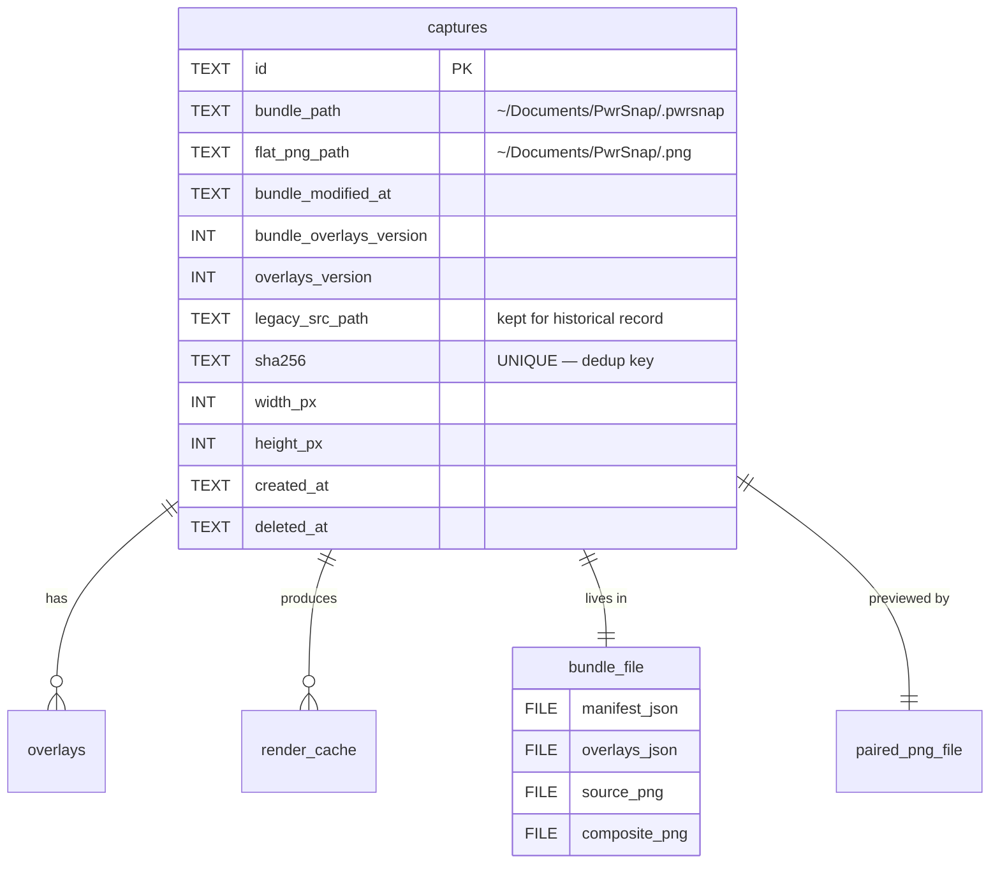
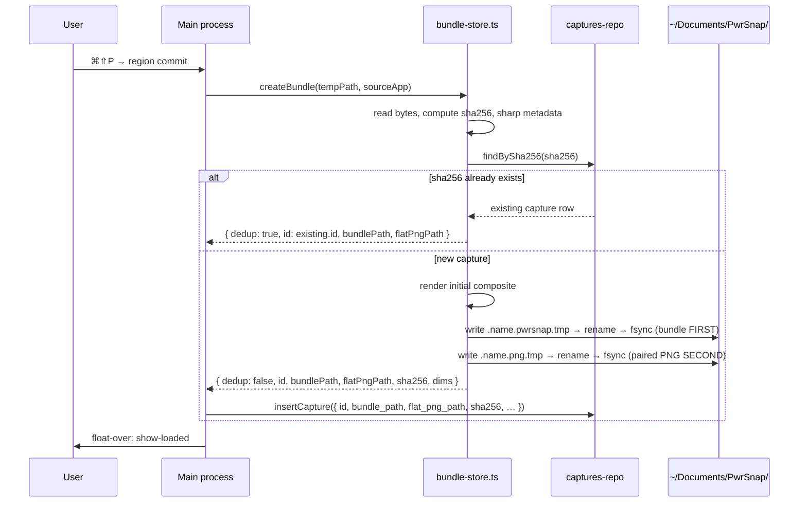

# PwrSnap bundle storage — `.pwrsnap` files in `~/Documents`

## Enhancement Summary

**Deepened on:** 2026-05-07
**Reviewers:** architecture-strategist, code-simplicity-reviewer, data-integrity-guardian, security-sentinel

### Key changes vs. first-cut plan

| Change | Driver |
|---|---|
| **Phases 5 → 3.** Foundation + Migration + Trash collapsed into Phase 1; cleanup folded into Phase 3. | Code-simplicity (Phase 3 of v1 was 3-4h; not a phase). Architecture (Phase 1-only window left a data-loss gap before doctor existed). |
| **Schema gap fixed.** Added `bundle_overlays_version INTEGER` to 0003. Renamed `src_path` → `legacy_src_path` so every reader breaks loudly at typecheck rather than silently mis-resolving. | Data-integrity. The convergence-on-boot rule referenced a column that didn't exist. |
| **HIGH-severity security guards added.** Bundle entry allowlist (yauzl does NOT auto-validate filenames — Zip-Slip is our responsibility); `lstat` + symlink rejection on every `readdir`; explicit "trust boundary" — anything in `~/Documents/PwrSnap/` is untrusted input; quarantine path for schema-fail bundles; `0o600` on temp files; sanitized `Result.error.cause`. | Security-sentinel. |
| **Eliminated speculative scaffolding.** Deleted `bundle-pack-queue.ts` (inline as `scheduleRepack` in `bundle-store.ts`); deleted `data-migrations.ts` framework + `0004_data_migrations.sql` (one boot-time gate on `bundle_path IS NULL`); deleted IPC commands `library:rescan`, `library:rebuildIndex`, `library:repackBundle` (ship `library:doctor` + `library:revealBundle` only); deleted `.legacy/` 30d retention (delete immediately on `failures==0`); manifest 9 → 6 fields. | Code-simplicity. |
| **Cache invalidation rule corrected.** `<userData>/cache/<id>/source.png` invalidates by `manifest.source_sha256`, NOT `bundle_modified_at`. Source is immutable; conflating triggers thrash on every overlay edit. | Architecture. |
| **Bundle is single writer.** `bundle-store.ts` header invariant: only writer of `~/Documents/PwrSnap/` (parallel to existing `source-store.ts:1-9`). `scheduleRepack` is a scheduler that calls `bundleStore.repack(id)`. Forbid direct yazl use elsewhere. | Architecture + data-integrity. |
| **Doctor upsert keyed by `manifest.capture_id`.** Concurrent capture + doctor walk converges on the same row instead of racing on derived ids. iCloud "Keep both" duplicates also resolve through this key. | Data-integrity. |
| **sha256 dedup pre-check.** `bundle-store.create` calls `findBySha256` BEFORE writing the bundle. Two captures of identical pixels → one bundle, not two. | Data-integrity. |
| **Trash atomicity ordering.** PNG (regenerable) first, bundle (SoR) second; reverse on failure of second; surface to doctor as "needs attention" if reverse fails. | Data-integrity. |
| **Estimate revised down.** ~35-45h → **~22-32h** total. | Code-simplicity. |

### What survived review unchanged

The bundle/doctor/manifest core, paired-PNG asymmetric durability, atomic-rename pattern (file fsync + dir fsync), TCC deferred to first capture, manifest+overlays JSON split (cheap doctor cold-scan), `PWRSNAP_DOCUMENTS_ROOT` E2E env override, yazl/yauzl as dependency choice.

---

## Overview

PwrSnap moves its durable on-disk state from `<userData>/captures/` + `<userData>/pwrsnap.db`
to a Snagit-style ZIP bundle (`<name>.pwrsnap`) plus a paired flat composite PNG
(`<name>.png`) under `~/Documents/PwrSnap/`. The bundle becomes the durable
system of record. The sqlite DB stays the live read path that drives every
IPC, every Library render, every overlay lookup — its runtime role doesn't
change — but it's now rebuildable from the on-disk bundles. A doctor flow
reconstructs the DB whenever it's missing or stale.

Wiping `<userData>` (reinstall, machine swap, manual cleanup) costs a re-scan,
never data. Users see their screenshots as image files in Finder and
iCloud-sync them naturally. PwrSnap stops being one of those Electron apps
where "your data lives in Application Support" is a load-bearing assumption.

This plan supersedes [the buildout plan §460-466](docs/plans/2026-05-03-001-feat-pwrsnap-feature-buildout-plan.md:460-466)
and the brainstorm's problem frame ([durable-edit-storage-requirements.md](docs/brainstorms/2026-05-07-durable-edit-storage-requirements.md)).

## Problem Statement

Every overlay, tag, description, and future AI-run record lives in sqlite at
`<userData>/pwrsnap.db`. Source PNGs live alongside at
`<userData>/captures/<yyyy>/<mm>/<id>.png` ([source-store.ts:1-9](apps/desktop/src/main/persistence/source-store.ts:1-9)) — immutable, but invisible to the user
and to iCloud. If the user reinstalls the app, migrates Macs without Migration
Assistant, or wipes Application Support to clear space, every edit they've ever
made is gone. Source pixels survive only as long as `<userData>` does.

The plan already commits to overlay-as-data ([buildout-plan §1128](docs/plans/2026-05-03-001-feat-pwrsnap-feature-buildout-plan.md:1128)) — this plan decides where that data physically lives so it survives Application
Support loss.

Concurrent multi-Mac editing is acknowledged as out of scope (last-write-wins
per file is acceptable; see origin §Scope Boundaries).

## Proposed Solution

### Storage layout (after)

```
~/Documents/PwrSnap/                          # user-visible, iCloud-syncable
├── PwrSnap 2026-05-07 at 14.30.22.png        # paired flat composite (the user-shareable image)
├── PwrSnap 2026-05-07 at 14.30.22.pwrsnap    # ZIP bundle — system of record
└── …

<userData>/   (Application Support — ONLY rebuildable / regenerable / trash)
├── pwrsnap.db                               # rebuildable index
├── cache/<capture_id>/<hash>.<format>       # variant-size renders, regenerable
├── cache/<capture_id>/source.png            # extracted from bundle on demand
├── .trash/<id>/{name.png, name.pwrsnap}     # bundle pair trash, 14d retention
├── .quarantine/<id>/                        # schema-fail bundles parked here, never auto-deleted
└── settings.json, logs/, etc.
```

### Bundle internal layout (`.pwrsnap` is a ZIP)

```
<name>.pwrsnap (ZIP)
├── manifest.json          DEFLATE — bundle identity / version / source metadata
├── overlays.json          DEFLATE — overlays array + tags + description + ai_runs
├── source.png             STORE   — immutable original (already PNG-compressed)
└── composite.png          STORE   — latest baked render (matches sibling flat PNG)
```

The ZIP central directory **must contain exactly these four entries.** The
allowlist is enforced on read (yauzl does not auto-validate filenames — that's
the consumer's job). Any other entry — including any path containing `/`,
`\`, `..`, null bytes, or non-relative paths — causes the bundle to be
quarantined, not extracted.

`manifest.json` and `overlays.json` are split deliberately: doctor reconcile
reads `manifest.json` only for cold scans (cheap, just the central directory
+ one entry decompress). It only reads `overlays.json` when the DB is being
rebuilt or a row is missing. Worth the split.

(see origin: [requirements §R1](docs/brainstorms/2026-05-07-durable-edit-storage-requirements.md))

### Asymmetric durability

The bundle is the system of record. The paired flat PNG is a regenerable
derivative. If the user deletes or renames the PNG, no data is lost — doctor
regenerates it from the bundle's `composite.png`. If the user deletes the
bundle, the standalone PNG re-imports as a fresh capture with no overlays.
(see origin: [requirements §R3](docs/brainstorms/2026-05-07-durable-edit-storage-requirements.md))

### Trust boundary

`~/Documents/PwrSnap/` is **untrusted input.** Any process running as the
user (notarized or not) can write there; bundles can arrive via AirDrop,
Mail, browser download, or a compromised peer's iCloud. The plan never
assumes "we wrote this bundle." Every read path validates:

- Filename allowlist (the four entries above; reject everything else)
- `lstat` every `readdir` entry; skip symlinks; reject paths whose `realpath`
  escapes `~/Documents/PwrSnap/`
- zod-validate `manifest.json` BEFORE writing any DB row or extracting any
  other entry; on validation failure, move bundle to `<userData>/.quarantine/`
- zod-validate `overlays.json` independently; on failure, upsert capture row
  with overlays cleared and a `needs_attention` flag (capture identity is
  preserved; user can recover original `overlays.json` from the quarantined
  copy)
- `Result.error.cause` is sanitized — never embed raw user-controlled JSON
  field values in error messages that flow to the renderer

This is the single largest security delta from the first-cut plan; it lands
in Phase 1.

### The R10 invariant

After this work, `<userData>` holds nothing of value. Every byte is a
rebuildable index, a regenerable cache, short-retention trash, or a parked
quarantine bundle. Wiping `<userData>` triggers a doctor reconcile pass and
lazy cache regeneration; no data loss. **This invariant is load-bearing —
every future change in this directory must preserve it.** (see origin:
[requirements §R10](docs/brainstorms/2026-05-07-durable-edit-storage-requirements.md))

## Technical Approach

### Architecture

#### New modules

- `apps/desktop/src/main/persistence/bundle-store.ts` — single writer of
  `~/Documents/PwrSnap/`. Wraps yazl/yauzl. Owns the atomic-rename helper,
  the entry allowlist, the schedule-repack debounce, and the trash + GC
  seams that move from `source-store.ts`. **Header comment establishes
  the single-writer invariant**, parallel to [source-store.ts:1-9](apps/desktop/src/main/persistence/source-store.ts:1-9). yazl is forbidden
  outside this module.
- `apps/desktop/src/main/persistence/doctor.ts` — reconcile pass, callable
  from `library:doctor` IPC. Walks `~/Documents/PwrSnap/`, validates every
  `*.pwrsnap`, upserts the DB. Coarse mutex with `bundle-store.scheduleRepack`
  via a shared `Map<captureId, Promise>` so concurrent captures and doctor
  walks converge instead of racing.
- `packages/shared/src/bundle-manifest-schema.ts` — zod schemas for
  `manifest.json` and `overlays.json`. Mirrors the existing
  [overlay-schemas.ts](packages/shared/src/overlay-schemas.ts) discipline:
  every read AND every write validates.

**Eliminated from the first-cut plan:** `bundle-pack-queue.ts` (inline as
`bundle-store.scheduleRepack`); `data-migrations.ts` framework (one-shot
boot-time gate on `bundle_path IS NULL` is sufficient).

#### Library: yazl + yauzl

- yazl 3.3.1 (Nov 2024), yauzl 3.x; both flagged "sustainable" / "healthy"
  by Snyk. Per-entry `compress: boolean` matches our STORE-PNG /
  DEFLATE-JSON shape. yauzl `lazyEntries` lets the doctor parse only the
  central directory; ranged `openReadStream` extracts one entry without
  touching others. Pure-JS, no native deps. ([yazl on npm](https://www.npmjs.com/package/yazl), [yauzl on npm](https://www.npmjs.com/package/yauzl))
- **yauzl does NOT auto-validate filenames.** This is intentional library
  design. We provide our own filename allowlist (the four-entry rule above);
  we do not rely on yauzl for path-traversal defense.
- fflate is the credible fallback if we hit a yazl bug. Bundle format is
  unchanged either way; migration cost is `bundle-store.ts` rewrite, no
  schema change.

#### Atomic-rename pattern

```ts
// Temp file in the SAME directory as destination — never os.tmpdir() (EXDEV).
const tmp = path.join(dir, `.${name}.pwrsnap.tmp-${process.pid}-${Date.now()}`);
const fh = await fs.open(tmp, "w", 0o600);   // 0o600, not 0o644 — temp window is reader-private
await fh.writeFile(zipBuffer);
await fh.sync();          // fsync the body
await fh.close();
await fs.rename(tmp, finalPath);  // atomic on APFS, single-volume rename
const dirfd = await fs.open(dir, "r");
await dirfd.sync();       // fsync the containing directory — durable across crash
await dirfd.close();
```

Three rules baked in:
1. **Temp file in destination directory.** Avoids EXDEV ([Node #19077](https://github.com/nodejs/node/issues/19077)).
2. **fsync file before rename, fsync directory after.** Durable across crash.
3. **Single writer per bundle.** Already true by construction.

We trust no other process is writing to `~/Documents/PwrSnap/` concurrently;
the TOCTOU window between `rename` and `dir-fsync` is a documented assumption,
not a defense (sub-millisecond, requires local code execution to exploit).
`replaceItemAtURL` is not used — its xattr/ACL preservation is unused for our
opaque artifact, and forum reports flag it as less reliable than `rename(2)`
under iCloud high-frequency writers ([Apple Developer Forums #817068](https://developer.apple.com/forums/thread/817068)).

#### Bundle + paired PNG ordering

When creating a new capture:
1. Write `<name>.pwrsnap.tmp` → fsync → rename → dir-fsync. **Bundle goes first.**
2. Extract `composite.png` from the just-written bundle (or write from the
   buffer we already have); `<name>.png.tmp` → fsync → rename → dir-fsync.
3. Insert/update the DB row.

When re-packing (overlay edit):
1. Render new composite via `compose()`. Build new manifest + overlays JSON.
2. Pack new ZIP buffer with all four entries; write `<name>.pwrsnap.tmp` →
   fsync → rename. The bundle's `composite.png` is durable BEFORE step 3.
3. Write `<name>.png.tmp` → fsync → rename. Paired PNG byte-identical to bundle's `composite.png`.
4. Update `captures.bundle_modified_at` and `captures.bundle_overlays_version`.

A crash at any point leaves either old or new — never partial. Doctor
regenerates the paired PNG from `composite.png` if missing. The paired PNG
is **byte-identical** to bundle's `composite.png`; doctor uses bundle's copy
as source of truth on mismatch.

#### TCC + `~/Documents/` permissions

A notarized non-sandboxed Electron app **will trigger one TCC prompt** the
first time it touches `~/Documents/`. There is no entitlement that suppresses
this for non-sandboxed apps; it's the design intent ([eclecticlight.co](https://eclecticlight.co/2025/02/20/permissions-privacy-and-security-whos-in-control/)).

- Set `NSDocumentsFolderUsageDescription` in [electron-builder.yml](apps/desktop/electron-builder.yml). Lead with user benefit:
  *"Save your screenshots in Documents so you can find them in Finder and sync them via iCloud."*
- **Defer the first Documents read/write to the first capture**, never app
  launch. The user just hit ⌘⇧P; the float-over toast is on screen; the
  prompt context is predictable.
- **Doctor reconcile must be defensive about denial.** EPERM-class errors
  surface in Settings → Storage with a deep link to Privacy & Security →
  Files & Folders.
- For a future Mac App Store build (Phase 8+), App Sandbox has no entitlement
  for "unprompted access to a named subfolder of `~/Documents/`" — that path
  uses the app container + a security-scoped bookmark mirror UX. Bundle
  format is filesystem-agnostic; we don't paint ourselves into a corner now.

`app.getPath("documents")` returns the right path on macOS in 2026 even with
"Desktop & Documents on iCloud" enabled.

### Data model changes

#### Schema migration `0003_bundle_storage.sql`

```sql
-- Adds bundle-aware columns. Renames src_path → legacy_src_path so any reader
-- expecting the old <userData>/captures/... shape breaks loudly at typecheck
-- and runtime, rather than silently mis-resolving after the meaning shifts.
ALTER TABLE captures RENAME COLUMN src_path TO legacy_src_path;
ALTER TABLE captures ADD COLUMN bundle_path TEXT;
ALTER TABLE captures ADD COLUMN flat_png_path TEXT;
ALTER TABLE captures ADD COLUMN bundle_modified_at TEXT;
ALTER TABLE captures ADD COLUMN bundle_overlays_version INTEGER NOT NULL DEFAULT 0;

CREATE INDEX idx_captures_bundle_path ON captures (bundle_path);
```

`legacy_src_path` survives forever as historical record (~30 bytes/row,
negligible). After Phase 1 migration, `bundle_path IS NOT NULL` for every
row; reads route via `bundle_path`.

`bundle_overlays_version` is the convergence checkpoint: incremented atomically
when `overlays.json` is rewritten in the bundle. Compared against
`captures.overlays_version` (existing column, bumped by `insertOverlay` /
`rejectOverlay` at [overlays-repo.ts:90,138](apps/desktop/src/main/persistence/overlays-repo.ts:90)) to detect a crash mid-debounce: if `overlays_version > bundle_overlays_version`, re-pack on next boot.

#### Manifest + overlays JSON schemas

Defined in `packages/shared/src/bundle-manifest-schema.ts`:

```ts
export const BundleManifestV1 = z.object({
  bundle_format_version: z.literal(1),
  capture_id: z.string().min(8).max(32),
  source_sha256: z.string().regex(/^[0-9a-f]{64}$/),
  source_dimensions: z.object({
    width_px: z.number().int().positive(),
    height_px: z.number().int().positive()
  }),
  paired_png_filename: z.string()             // bare filename, used for rename detection
    .refine(s => !s.includes("/") && !s.includes("\\") && !s.includes("\0")),
  created_at: z.string().datetime(),
  bundle_modified_at: z.string().datetime()
});

export const BundleOverlaysV1 = z.object({
  overlays_format_version: z.literal(1),
  overlays_version: z.number().int().nonnegative(),  // matches captures.bundle_overlays_version
  overlays: z.array(OverlayRecordSchema),
  tags: z.array(z.string()),
  description: z.string().nullable(),
  ai_runs: z.array(AIRunRecordSchema)
});
```

**Six fields, not nine.** Dropped from first-cut: `source_byte_size` (sha256
already identifies the bytes), `source_app_name` and `source_app_bundle_id`
(no current consumer; YAGNI — add when a feature needs them).

Validated on every read AND write. Mirrors the existing `overlays-repo.ts`
re-validation pattern at [overlays-repo.ts:39](apps/desktop/src/main/persistence/overlays-repo.ts:39).

#### ER diagram (post-migration)



### Hot path — capture flow

The seam is `persistAndBroadcast` at [capture-handlers.ts:309-335](apps/desktop/src/main/handlers/capture-handlers.ts:309-335).
After:



**`findBySha256` BEFORE writing the bundle.** Two captures of identical pixels
produce one bundle, not two. Architecture's existing `captures.sha256 UNIQUE`
constraint is preserved; deduplication is now an explicit pre-write check
rather than a unique-constraint exception.

### Edit / re-pack flow

Inline in `bundle-store.ts`, no separate queue module:

```ts
// In bundle-store.ts
const repackTimers = new Map<string, NodeJS.Timeout>();

export function scheduleRepack(captureId: string): void {
  const existing = repackTimers.get(captureId);
  if (existing) clearTimeout(existing);
  repackTimers.set(captureId, setTimeout(() => {
    repackTimers.delete(captureId);
    void repack(captureId).catch(err => log.error("repack failed", { captureId, err }));
  }, 1_000));
}
```

Called from [overlays-handlers.ts:27-41](apps/desktop/src/main/handlers/overlays-handlers.ts:27-41) right after `broadcastOverlaysChanged`. The DB stays the live read path during the
debounce window; bundle and DB only need to converge eventually. A crash
during the debounce re-runs the pack on next boot via the
`overlays_version > bundle_overlays_version` check.

`repack(captureId)` reads live overlays from DB → renders new composite →
writes new ZIP → atomic rename (bundle first, paired PNG second) → updates
`bundle_modified_at` and `bundle_overlays_version`.

### Read paths

- `">` ([protocols.ts:134-154](apps/desktop/src/main/protocols.ts:134-154)):
  resolver materializes `source.png` from the bundle into
  `<userData>/cache/<id>/source.png` on first hit. **Cache invalidates by
  `manifest.source_sha256`**, NOT by `bundle_modified_at` — source pixels
  are immutable; conflating these triggers needless thrash on every overlay
  edit. Returns the cached path thereafter.
- `/<w>w.<fmt>">` ([protocols.ts:181-201](apps/desktop/src/main/protocols.ts:181-201)):
  unchanged — variant renders still resolve via [coordinator.ts](apps/desktop/src/main/render/coordinator.ts).
- `library:list`, `library:byId`: unchanged at the surface; bundle and
  paired-PNG paths are exposed as new fields on the capture record.

### Doctor reconcile flow

```mermaid
sequenceDiagram
    participant Doctor as doctor.ts
    participant FS as ~/Documents/PwrSnap/
    participant DB as captures-repo

    Doctor->>FS: readdir, lstat each entry, skip symlinks
    Doctor->>FS: filter to *.pwrsnap and *.png
    loop for each .pwrsnap
        Doctor->>FS: yauzl.open(lazyEntries)
        Doctor->>Doctor: validate central directory entries (allowlist)
        alt entries fail allowlist
            Doctor->>FS: move bundle to <userData>/.quarantine/<id>/
        else allowlist passes
            Doctor->>FS: extract manifest.json (validate zod)
            alt manifest invalid
                Doctor->>FS: move bundle to <userData>/.quarantine/<id>/
            else manifest valid
                Doctor->>DB: upsert by manifest.capture_id
                opt DB row missing or bundle_modified_at newer
                    Doctor->>FS: extract overlays.json (validate zod)
                    alt overlays invalid
                        Doctor->>DB: mark capture needs_attention; preserve original entry under .quarantine/
                    else overlays valid
                        Doctor->>DB: replace overlays for capture_id
                    end
                end
                Doctor->>FS: ensure paired .png exists; regenerate from composite if missing
            end
        end
    end
    loop for each orphan .png (no .pwrsnap)
        Doctor->>FS: hash bytes
        Doctor->>DB: upsert as flat-import capture (no overlays)
    end
    loop for each DB row with bundle missing
        Doctor->>DB: surface to user as "missing bundle" before deleting
    end
```

Triggered by:
- App boot, only if DB schema version mismatch / explicit "rebuild index" flag
- User-invoked from Settings → Storage → "Re-scan library"
- Programmatic via `library:doctor` IPC

**Upserts keyed on `manifest.capture_id`**, never on derived ids. Prevents
races between concurrent captures and an in-flight doctor walk; iCloud
"Keep both" duplicates (`<name> 2.pwrsnap`) resolve to the same DB row,
with `bundle_path` pointing at whichever has the newer `bundle_modified_at`
and the duplicate surfaced to the user as "needs attention" — never
silently overwriting.

**Coarse mutex with `scheduleRepack`** via a shared `Map<captureId, Promise>`
in `bundle-store.ts` so a doctor walk doesn't race a debounced re-pack on
the same capture.

Performance: not a v1 target. Lazy-entries technique is free; we pay the
30s-for-1000 cost only when someone actually has 1000 bundles AND hits the
reconcile path, which is rare. Drop the SLA; revisit if a real bug shows up.

### Trash semantics

Bundle pair trash extends the existing 14-day flow:

- `library:delete` ([library-handlers.ts:36](apps/desktop/src/main/handlers/library-handlers.ts:36)) calls `bundleStore.moveBundlePairToTrash(captureId)`.
- Implementation:
  1. Create `<userData>/.trash/<id>/` directory + dir-fsync.
  2. Atomic rename: paired PNG (regenerable derivative) FIRST.
  3. Atomic rename: bundle (system of record) SECOND.
  4. On step-3 failure: reverse the step-2 rename. On reverse failure:
     surface to doctor as "needs attention" — never silently delete the bundle.
- Boot-time GC ([index.ts:167-178](apps/desktop/src/main/index.ts:167-178)) extends `sweepTrash` to walk per-id directories and `rm -rf` after retention.
- Restore from trash: reverse-rename both files. Doctor picks them up on next reconcile.

### Cache layer (unchanged)

`<userData>/cache/<capture_id>/<hash>.<format>` continues to hold variant-size
renders. Regenerable from the bundle's `source.png` + `overlays.json` via
the existing `compose()` pipeline ([compose.ts:1-459](apps/desktop/src/main/render/compose.ts:1-459)). The `pwrsnap-cache://` protocol resolver and `coordinator.ts` single-flight map are untouched. Cache invalidates when `captures.overlays_version`
bumps (already wired).

### New IPC commands

Registered in [command-bus.ts](apps/desktop/src/main/command-bus.ts), per
the bare `<domain>:<verb>` convention:

- `library:doctor` — full reconcile from `~/Documents/PwrSnap/`. Result includes counts (rebuilt rows, orphans found, missing bundles, quarantined bundles).
- `library:revealBundle` — Finder reveal of a capture's `.pwrsnap`.

**Eliminated from first-cut**: `library:rescan` (incremental — premature),
`library:rebuildIndex` (= delete DB + library:doctor; no separate command
needed), `library:repackBundle` (dev ceremony; `NODE_ENV === "development"`
gate or just don't ship). Add when needed.

### Implementation Phases

#### Phase 1 — Foundation + Migration + Trash (15-20h)

The whole "captures live in `~/Documents/PwrSnap/`" reality lands here. No
intermediate "bundles emitted alongside DB" half-state is shipped — that
window had a data-loss gap if `<userData>` was wiped before Phase 2 (doctor)
existed. After Phase 1 ships, `~/Documents/PwrSnap/` has a complete bundle
for every capture; the DB stays the live read path that drives the UI, and
Phase 2 adds the rebuild-from-bundles recovery path.

Files added:
- [`packages/shared/src/bundle-manifest-schema.ts`](packages/shared/src/bundle-manifest-schema.ts) — zod schemas (six manifest fields).
- [`apps/desktop/src/main/persistence/bundle-store.ts`](apps/desktop/src/main/persistence/bundle-store.ts) — yazl/yauzl wrapper, atomic-rename helper, entry allowlist, `scheduleRepack`, trash + GC seams. Header invariant declares this the only writer of `~/Documents/PwrSnap/`.
- [`apps/desktop/src/main/persistence/migrations/0003_bundle_storage.sql`](apps/desktop/src/main/persistence/migrations/0003_bundle_storage.sql) — schema migration (rename `src_path → legacy_src_path`, add four new columns).
- [`apps/desktop/src/main/__tests__/bundle-store.test.ts`](apps/desktop/src/main/__tests__/bundle-store.test.ts) — pack/unpack roundtrip, atomic-rename test, allowlist rejection, sha256 dedup, symlink rejection.
- [`apps/desktop/src/main/__tests__/bundle-manifest-schema.test.ts`](apps/desktop/src/main/__tests__/bundle-manifest-schema.test.ts).

Files updated:
- [`apps/desktop/src/main/persistence/db.ts`](apps/desktop/src/main/persistence/db.ts:48-58) — add `getDocumentsBundleRoot()`, `getQuarantineRoot()`, `getCacheSourceDir(id)`. Update top-of-file path comment.
- [`apps/desktop/src/main/handlers/capture-handlers.ts`](apps/desktop/src/main/handlers/capture-handlers.ts:309-335) — replace `putCaptureSource → insertOrFindCapture` with `bundleStore.create → (sha256 dedup pre-check) → insertOrFindCapture(with bundle_path)`.
- [`apps/desktop/src/main/handlers/overlays-handlers.ts`](apps/desktop/src/main/handlers/overlays-handlers.ts:27-41) — call `bundleStore.scheduleRepack(captureId)` after `broadcastOverlaysChanged`.
- [`apps/desktop/src/main/handlers/library-handlers.ts`](apps/desktop/src/main/handlers/library-handlers.ts:36) — call `bundleStore.moveBundlePairToTrash` in `library:delete`.
- [`apps/desktop/src/main/protocols.ts`](apps/desktop/src/main/protocols.ts:134-154) — `pwrsnap-capture://` resolver materializes `source.png` from bundle into cache; cache key is `manifest.source_sha256`.
- [`apps/desktop/electron-builder.yml`](apps/desktop/electron-builder.yml) — `NSDocumentsFolderUsageDescription` (lead with user benefit).
- [`apps/desktop/src/main/index.ts`](apps/desktop/src/main/index.ts:167-178) — boot wiring; one-shot legacy-data migration gated on `EXISTS (SELECT 1 FROM captures WHERE bundle_path IS NULL)`.

**Legacy-data migration (one-shot):**
1. `SELECT id, legacy_src_path, sha256 FROM captures WHERE bundle_path IS NULL`.
2. For each row: read source PNG from `legacy_src_path`, read live overlays
   from DB, render composite, build manifest + overlays JSON, pack `.pwrsnap`,
   write paired `.png`, UPDATE captures with `bundle_path`, `flat_png_path`,
   `bundle_modified_at`, `bundle_overlays_version = overlays_version`.
3. Per-row try/catch. On row-level failure: log, increment failure counter,
   leave `bundle_path NULL`, continue. **Do NOT delete the row** — the FK
   cascade would drop overlays. Surface failures in Settings → Storage.
4. **Per-row schema downgrade tolerance:** if `overlays.json` zod-fails for a
   row (e.g., a future overlay shape on an old build), pack the bundle
   WITHOUT that bad overlay — preserving source pixels and other overlays —
   and tag the capture `needs_attention`. Don't let one bad overlay block
   migration of the source.
5. **Only on `failures === 0`**: `mv <userData>/captures <userData>/.legacy-pre-bundle/`,
   schedule unconditional cleanup at boot+30d (later phases) or just delete
   immediately. We chose **delete immediately** on success — bytes are
   byte-identical to bundle's `source.png`, recovery scenario is zero.
6. Idempotent — re-runs no-op on rows already migrated (`bundle_path IS NOT NULL`).

Success criteria:
- New captures land as `<name>.pwrsnap` + `<name>.png` in `~/Documents/PwrSnap/`.
- Existing dev-state captures migrate cleanly on first boot of new build.
- Editor flow reads source via `pwrsnap-capture://` (now backed by bundle).
- Overlay edits trigger bundle re-pack within ~1s after last input.
- Bundle pack/unpack roundtrip unit tests pass.
- Atomic-rename test pulls the plug mid-write — no partial bundle visible.
- Allowlist test: malicious bundle with `../../etc/passwd` entry is quarantined, never extracted.
- Symlink test: bundle is a symlink → skipped on readdir; symlink inside `~/Documents/PwrSnap/` → skipped.
- `NSDocumentsFolderUsageDescription` prompt appears at first capture, not at app launch.
- `library:delete` moves both bundle and paired PNG to `<userData>/.trash/<id>/`.
- 14-day retention sweep handles per-id directories.
- Two captures of identical pixels → one bundle (sha256 dedup pre-check verified).

#### Phase 2 — Doctor + reconcile flow (8-10h)

Files added:
- [`apps/desktop/src/main/persistence/doctor.ts`](apps/desktop/src/main/persistence/doctor.ts).
- [`apps/desktop/src/main/__tests__/doctor.test.ts`](apps/desktop/src/main/__tests__/doctor.test.ts).

Files updated:
- [`apps/desktop/src/main/handlers/library-handlers.ts`](apps/desktop/src/main/handlers/library-handlers.ts) — register `library:doctor`, `library:revealBundle`.
- [`apps/desktop/src/main/index.ts`](apps/desktop/src/main/index.ts:167-178) — boot calls `doctor.reconcile()` if DB schema mismatch / empty / explicit flag.
- Renderer Settings → Storage UI — affordances for "Re-scan library", current path display, permission state, quarantine count.

Success criteria:
- Wiping `<userData>/pwrsnap.db` and relaunching produces an identical library state after reconcile.
- Wiping `<userData>` entirely and relaunching: app starts, doctor runs, library renders identically (R10 test).
- Orphan PNGs (no paired bundle) re-import as flat captures.
- Bundle with malicious entry quarantined to `<userData>/.quarantine/<id>/`, surfaced to user.
- DB rows with missing bundles surface to user before deletion.
- Doctor walks concurrent with active capture: no row collisions; iCloud-duplicate `<name> 2.pwrsnap` resolves to same `manifest.capture_id` row.

#### Phase 3 — E2E + cleanup + plan supersession (4-6h)

Files added:
- [`apps/desktop/e2e/storage-doctor.spec.ts`](apps/desktop/e2e/storage-doctor.spec.ts) — wipe DB, restart, verify reconcile.
- [`apps/desktop/e2e/bundle-disaster-recovery.spec.ts`](apps/desktop/e2e/bundle-disaster-recovery.spec.ts) — wipe `<userData>` entirely, verify rebuild from bundles.

Files updated:
- [`apps/desktop/e2e/fixtures/electron-app.ts`](apps/desktop/e2e/fixtures/electron-app.ts) — add `PWRSNAP_DOCUMENTS_ROOT` env override (parallel to existing `PWRSNAP_USER_DATA`).
- [`apps/desktop/src/main/index.ts`](apps/desktop/src/main/index.ts) — read `PWRSNAP_DOCUMENTS_ROOT` env override.
- [`docs/plans/2026-05-03-001-feat-pwrsnap-feature-buildout-plan.md`](docs/plans/2026-05-03-001-feat-pwrsnap-feature-buildout-plan.md:460-466) — supersede storage-layout paragraph; cite this plan as authority.

Files deleted:
- [`apps/desktop/src/main/persistence/source-store.ts`](apps/desktop/src/main/persistence/source-store.ts) — fully superseded by `bundle-store.ts`. Remove `getCapturesRoot()` from `db.ts` and any remaining call sites (notably [export-handler.ts:70](apps/desktop/src/main/handlers/export-handler.ts:70)).

Success criteria:
- E2E disaster-recovery spec passes: a packaged dev build with `<userData>` wiped boots, runs doctor, paints the library identically to pre-wipe.
- No remaining references to `getCapturesRoot()` or `legacy_src_path` outside the schema and historical-only paths.
- Plan §460-466 explicitly cites this plan as the new source of truth.

## Alternative Approaches Considered

These were evaluated and rejected during the brainstorm phase. Preserved here
so future readers don't re-litigate.

- **Lightroom-style sidecar JSON** (`<id>.png` + `<id>.json`). Production-proven
  pattern with the most durability evidence over the last 20 years (Lightroom
  Classic, Apple Photos AAE, Capture One). Rejected on aesthetic preference —
  the founder explicitly preferred a single self-describing project artifact
  over an exposed `.json` sidecar. (see origin: [requirements §Key Decisions](docs/brainstorms/2026-05-07-durable-edit-storage-requirements.md))
- **Embedded PNG metadata (iTXt chunk)**. Single-image-with-data approach.
  Rejected based on industry research: Skitch is the only example at any
  scale, no living successor.
- **Status quo + DB backup file in `~/Documents`**. Cheap, but restore is manual
  and concurrent-Mac is broken. Doesn't satisfy R10.
- **macOS package directory (`<name>.pwrsnap/` as a folder Finder treats as
  a single file)**. Atomic incremental writes are easier, but iCloud sync of
  package directories has a long history of failure modes; cross-platform
  Phase 8 won't recognize packages. ZIP wins on portability.
- **fflate for ZIP**. Faster microbenchmarks. Rejected for now in favor of
  yazl/yauzl's better-aged maintenance posture and cleaner ranged-extract
  API. Bundle format unchanged; revisit if throughput becomes an issue.
- **`bundle-pack-queue.ts` as a separate module with priority/backoff**.
  YAGNI — collapsed to ~10 lines inline in `bundle-store.ts`. Add file when
  tracking state grows.
- **`data_migrations(version)` table + framework**. YAGNI — gate the one-shot
  legacy migration on `EXISTS (... bundle_path IS NULL)` instead. One column,
  zero new tables.

## System-Wide Impact

### Interaction Graph

`capture:interactive` ([capture-handlers.ts:67](apps/desktop/src/main/handlers/capture-handlers.ts:67))
→ `pickRegion` → `cropScreenSnapshot`/`screencapture` CLI → `persistAndBroadcast`
→ `bundleStore.create()` (sha256 dedup pre-check → render composite → atomic
write bundle → atomic write paired PNG) → `insertOrFindCapture`
→ `setFloatOverState({show-loaded})` → `broadcastCapturesChanged` →
renderer `useLibrary.subscribe` re-fetches → grid paints.

Edit flow: renderer → `overlays:upsert` → `insertOverlay` ([overlays-repo.ts:90](apps/desktop/src/main/persistence/overlays-repo.ts:90)) bumps `overlays_version` → `broadcastOverlaysChanged` →
`bundleStore.scheduleRepack(captureId)` → ≥1s debounce → `bundleStore.repack()`
(reads live overlays → `compose()` → atomic rename bundle → atomic rename
paired PNG → bumps `bundle_modified_at` and `bundle_overlays_version`).

Doctor flow: `library:doctor` IPC → `doctor.reconcile()` → readdir + lstat
filter + allowlist validate + zod validate → upsert by `manifest.capture_id`
→ broadcasts `capturesChanged` to renderers.

### Error & Failure Propagation

- Bundle write errors return `Result<…, { kind: "bundle", code, message, cause }>`.
  **`cause` is sanitized** — never embed raw user-controlled JSON field values
  in messages that flow to renderer logs.
- TCC denial → `EPERM` from `mkdir(~/Documents/PwrSnap/)` → bundle creation
  fails → capture flow surfaces "PwrSnap can't write to Documents — open
  Settings → Privacy & Security to grant access" with deep link.
- Bundle-corrupt asymmetry:
  - **Manifest-corrupt** → never write a DB row; bundle moves to `.quarantine/`.
  - **Overlays-corrupt** → upsert capture row with overlays cleared and
    `needs_attention` flag; preserve original `overlays.json` content under
    `.quarantine/<id>/overlays.json.corrupt-<timestamp>`.
- `overlays_version > bundle_overlays_version` on boot → re-pack the bundle
  before serving reads.
- iCloud "Optimize Mac Storage" evicts a bundle → `readFile` returns `ENOENT`
  initially, then iCloud materializes; doctor retries with backoff.
- iCloud duplicate bundles (`<name> 2.pwrsnap`) → resolved to same DB row by
  `manifest.capture_id`; user notified, never silently overwriting.

### State Lifecycle Risks

- **Crash between bundle write and DB insert.** Bundle in Documents, no DB
  row. Boot doctor reconciles → row inserted. No data loss.
- **Crash between bundle write and paired-PNG write.** Bundle in place, PNG
  missing. Doctor regenerates from bundle's `composite.png`. No data loss.
- **Crash mid-bundle-rewrite.** `.tmp` orphan + old bundle still in place
  (atomic-rename guarantee). Boot GC sweeps `.tmp` files >1h old (extends
  `sweepStaleTempFiles` from [source-store.ts:146-173](apps/desktop/src/main/persistence/source-store.ts:146-173)).
- **Crash mid-debounce.** `overlays_version > bundle_overlays_version` fires
  on boot → re-pack runs.
- **User renames `<name>.png`.** Pair lookup via filename match fails.
  Manifest's `paired_png_filename` still says original. Doctor regenerates
  the expected paired PNG; renamed PNG re-imports as orphan flat capture.
  Cosmetic duplication, not data loss. Documented behavior.
- **User deletes the bundle, keeps the PNG.** Doctor imports standalone PNG
  as a new flat capture. Original DB row deleted on next reconcile after
  user confirms.
- **Migration failure mid-flight.** Per-row try/catch; legacy data preserved
  until `failures === 0`. Re-runs idempotent.

### API Surface Parity

The renderer URL contracts (`pwrsnap-capture://r/<id>`, `pwrsnap-cache://r/<id>/<w>w.<fmt>`) survive unchanged. The IPC contracts for `library:list`,
`library:byId`, `overlays:list`, `overlays:upsert`, `overlays:delete` survive
unchanged at the call surface. Existing renderer code in
[useLibrary.ts](apps/desktop/src/renderer/src/lib/useLibrary.ts), [FloatOverHost.tsx](apps/desktop/src/renderer/src/features/float-over/FloatOverHost.tsx), and [Editor.tsx](apps/desktop/src/renderer/src/features/editor/Editor.tsx) needs no changes for Phases 1-3. New IPC commands (`library:doctor`,
`library:revealBundle`) consume in Settings → Storage UI.

### Integration Test Scenarios

E2E scenarios that unit tests with mocks would not catch:

1. **Disaster recovery.** `rm -rf <userData>` between test runs; restart;
   verify library renders identically. (Phase 3 spec.)
2. **Concurrent capture + edit.** Capture, immediately edit before debounce
   fires. Bundle converges to correct state with no race.
3. **iCloud eviction.** `brctl evict` a bundle; open in Editor; verify
   materialization works.
4. **TCC denial path.** Test fixture denies `~/Documents/`; capture surfaces
   clear remediation, no crash.
5. **Migration of pre-bundle data.** Seed `<userData>/captures/...` as a
   v0.x build would have; run new build's boot; verify all rows migrate to
   bundles, legacy directory deleted on success.
6. **Malicious bundle ingestion.** Drop a `.pwrsnap` containing a
   `../../etc/passwd` entry; verify quarantine path, no extraction, no
   DB row.
7. **Symlink injection.** Create `~/Documents/PwrSnap/evil.pwrsnap → /etc/something`;
   verify doctor skips it.
8. **Concurrent doctor + capture.** Run `library:doctor` while a capture
   is in flight; verify no duplicate rows and no data loss on either side.

## Acceptance Criteria

### Functional Requirements

- [ ] Every new capture writes a `.pwrsnap` bundle + paired `.png` to `~/Documents/PwrSnap/` (R1, R2).
- [ ] Bundle is system of record; paired PNG is regenerable derivative (R3).
- [ ] DB rebuildable from bundles via doctor reconcile after Phase 2 (R4). Runtime role of the DB unchanged — it still drives the UI as the live read path.
- [ ] `library:doctor` reconcile flow works at boot and on demand (R5).
- [ ] Overlay edits trigger debounced bundle re-pack within ~1s (R6).
- [ ] Source PNG lives inside the bundle (R7).
- [ ] Trash semantics extend to bundle pairs (R8).
- [ ] Existing dev-state captures migrate cleanly on first boot of the new build (R9).
- [ ] `<userData>` holds nothing of value — wiping triggers reconcile, no data loss (R10).
- [ ] All new IPC commands route through the single command bus and return `Result<…>`.

### Non-Functional Requirements

- [ ] Atomic-rename pattern verified — no half-written bundle visible during write.
- [ ] Bundle pack/unpack roundtrip preserves all overlay data with byte-exact `source.png`.
- [ ] No prompt at app launch for `~/Documents/` access — first prompt at first capture.
- [ ] zod validation runs on every manifest + overlays read AND write.
- [ ] yazl + yauzl pure-JS dependency only; no native build required.
- [ ] **Bundle entry allowlist enforced.** Only `manifest.json`, `overlays.json`, `source.png`, `composite.png`. No `..`, `/`, `\`, null bytes, absolute paths.
- [ ] **lstat + symlink rejection.** Doctor never follows symlinks; never extracts to a path outside `~/Documents/PwrSnap/` or `<userData>/cache/`.
- [ ] **Trust boundary documented in code.** `bundle-store.ts` and `doctor.ts` headers state `~/Documents/PwrSnap/` is untrusted input.
- [ ] **0o600 on temp files.** No world-readable temp window.
- [ ] **Sanitized error messages.** `Result.error.cause` never carries raw user-controlled JSON.

### Quality Gates

- [ ] Unit tests for `bundle-store.ts`, `bundle-manifest-schema.ts`, `doctor.ts`.
- [ ] E2E spec for disaster recovery (wipe `<userData>`, verify reconcile).
- [ ] E2E spec for migration (pre-bundle data → bundles).
- [ ] E2E spec for malicious bundle ingestion (quarantine path).
- [ ] Lint + typecheck pass.
- [ ] [docs/plans/2026-05-03-001-feat-pwrsnap-feature-buildout-plan.md:460-466](docs/plans/2026-05-03-001-feat-pwrsnap-feature-buildout-plan.md:460-466) updated to cite this plan.

## Success Metrics

- A user can `rm -rf ~/Library/Application\ Support/PwrSnap` and relaunch; library state rebuilds with zero loss.
- A user moves to a new Mac, restores `~/Documents/PwrSnap/` from iCloud, opens the app — library is intact.
- Capture-flow latency unchanged within ±10ms vs. pre-bundle baseline (bundle write happens after DB insert / float-over paint, off the user's perceived path).
- Zero TCC prompts at app launch (verified on a fresh user account).
- Zero unit test regressions in `__tests__/` after Phase 3 cleanup.
- Malicious bundle ingestion never extracts attacker-controlled paths.

## Dependencies & Prerequisites

- **yazl ^3.3.1** (write) and **yauzl ^3.x** (read) — new dependencies in `apps/desktop/package.json`. Pure-JS, no native build. Pin versions; record the SHA in lockfile.
- Existing `sharp`, `better-sqlite3`, `zod` continue to be used — no version bumps required.

No blocking external dependencies.

## Risk Analysis & Mitigation

| Risk | Likelihood | Impact | Mitigation |
|---|---|---|---|
| TCC denial breaks capture flow | Med | High | Prompt deferred to first capture; clear `NSDocumentsFolderUsageDescription`; defensive doctor with deep-link remediation. |
| Atomic-rename invariant violated (cross-volume temp) | Low | High | `bundle-store.ts` constructs temp paths *only* in destination directory; unit test asserts `dirname(tmp) === dirname(final)`. |
| **Zip Slip via malicious bundle ingestion** | Med | High | Filename allowlist on every yauzl read; explicit "yauzl does not auto-validate" comment in code; E2E test for malicious bundle quarantine. |
| **Symlink attack on `~/Documents/PwrSnap/`** | Low | High | `lstat` every readdir entry; skip symlinks; realpath escape check. |
| iCloud eviction during read | Med | Med | Reads tolerate `ENOENT` with backoff; iCloud materializes transparently. |
| Bundle corrupt on read | Low | Med | zod validation surfaces it as `needs_attention`; never silent corruption. Manifest-corrupt vs overlays-corrupt have asymmetric recovery (capture identity preserved when possible). |
| yazl maintenance lapse | Low | Low | fflate is the credible fallback; bundle format unchanged. |
| Migration of legacy data fails partway | Med | Med | Per-row try/catch; idempotent re-run (`bundle_path IS NULL` filter); legacy directory retained until `failures === 0`. Per-row schema downgrade tolerance — bad overlay doesn't block source migration. |
| Doctor performance regresses on large libraries | Low | Med | Lazy entry parsing — manifest-only reads via yauzl `lazyEntries`. |
| Concurrent doctor + capture race | Med | Med | Upsert keyed on `manifest.capture_id` (not derived id); coarse mutex via shared `Map<captureId, Promise>` between `scheduleRepack` and `doctor.reconcile`. |
| iCloud "Keep both" duplicate bundles | High over time | Low | Doctor deduplicates by `manifest.capture_id`; surfaces dup to user; `bundle_path` follows newest `bundle_modified_at`. |
| User renames paired PNG | Med | Low | Manifest's `paired_png_filename` is source of truth; doctor regenerates expected PNG. |
| Concurrent multi-Mac edits via iCloud (out of scope) | High over time | Med | Documented as out of scope; LWW per file accepted; future brainstorm needed. |
| **TOCTOU between rename and dir-fsync** | Very Low | High | Documented as assumption; sub-ms window; requires local code execution to exploit. Combined with trust-boundary statement, accepted as a residual risk. |
| **Bundle file leaks unredacted source via AirDrop** | Med | Med | Documented in `docs/architecture/bundle-storage.md`. Recommend users share via paired flat PNG (composite, redactions baked) when redaction matters. Future "share-safe export" path planned separately. |

## Resource Requirements

Solo founder + Claude. Total estimate **~22-32h** of focused work across 3
phases (down from 35-45h after YAGNI cuts and phase consolidation). Phase 1
alone (~15-20h) reaches "captures durably stored in `~/Documents/PwrSnap/`,
existing data migrated, no data-loss window if `<userData>` wiped after
this lands". Phase 2 (~8-10h) adds the doctor reconcile flow that rebuilds
the DB from bundles. Phase 3 (~4-6h) is disaster-recovery test + cleanup.

## Future Considerations

- **Cross-platform Phase 8.** Bundle format is intentionally portable — ZIP
  everywhere, PNG everywhere, JSON everywhere.
- **Mac App Store distribution.** App Sandbox path differs significantly —
  app container + security-scoped bookmark mirror UX. Bundle format unchanged.
- **Concurrent multi-Mac sync.** Future brainstorm needed.
- **Bundle format v2.** `bundle_format_version` field enables additive
  migrations. Likely v2 additions: voice-describe Opus attachment (Phase 5+),
  sizzle-reel composition metadata (Phase 6).
- **`composites/<variant>.png` layout for share-safe export.** Future v2 may
  organize composites under `composites/default.png`, `composites/share-safe.png`
  (the latter with blur/redact at higher strength) so reorg is unnecessary.
- **AI-driven bundle filenames.** Default uses macOS Screenshot convention;
  future enhancement uses Codex description to generate human-friendly
  names. Out of scope.
- **`library:export` semantics.** Becomes "ship a collection to someone else"
  rather than "backup path." Defer to a separate plan.
- **Share-safe export path.** Strips `source.png` and ships only `composite.png`
  + manifest. Privacy-respecting share. Defer to a separate plan; document
  the residual leak in user-facing docs in the meantime.

## Documentation Plan

- New: `docs/architecture/bundle-storage.md` — bundle layout, manifest schemas,
  doctor reconcile rules, atomic-rename rationale, **trust boundary**, **share
  considerations note** (bundle leaks unredacted source via AirDrop; share via
  paired flat PNG when redaction matters), bundle mtime/xattr metadata leak
  transparency note.
- Update: [`AGENTS.md`](AGENTS.md) — "PwrSnap on-disk layout" section with
  `~/Documents/PwrSnap/` and the R10 invariant.
- Update: [`docs/plans/2026-05-03-001-feat-pwrsnap-feature-buildout-plan.md`](docs/plans/2026-05-03-001-feat-pwrsnap-feature-buildout-plan.md:460-466)
  — supersede storage paragraph; link to this plan.
- Add to `docs/solutions/` after implementation: a learning on the iCloud +
  atomic-rename pattern with the three-rule pattern (temp in same dir, fsync
  file, fsync dir) preserved verbatim. Also a learning on Zip-Slip — yauzl
  does not auto-validate filenames; this is the consumer's job.

## Sources & References

### Origin

- **Origin document:** [docs/brainstorms/2026-05-07-durable-edit-storage-requirements.md](docs/brainstorms/2026-05-07-durable-edit-storage-requirements.md). Key decisions carried forward:
  - Snagit-style `.pwrsnap` ZIP bundle + paired flat PNG (origin §Key Decisions)
  - Source PNG lives inside the bundle (origin §Key Decisions)
  - DB stays the live read path; bundles are the durable record; DB is rebuildable from bundles (origin §R4)
  - `<userData>` holds nothing of value (origin §R10)
  - Embedded-PNG-metadata path rejected (origin §Key Decisions)

### Internal References

- [apps/desktop/src/main/persistence/source-store.ts:1-9](apps/desktop/src/main/persistence/source-store.ts:1-9) — current source-immutability invariant; preserved in `bundle-store.ts` semantics.
- [apps/desktop/src/main/persistence/db.ts:38-58](apps/desktop/src/main/persistence/db.ts:38-58) — current root-getter shape.
- [apps/desktop/src/main/handlers/capture-handlers.ts:309-335](apps/desktop/src/main/handlers/capture-handlers.ts:309-335) — `persistAndBroadcast`; the bundle-writer seam.
- [apps/desktop/src/main/persistence/captures-repo.ts](apps/desktop/src/main/persistence/captures-repo.ts) — DB surface.
- [apps/desktop/src/main/persistence/overlays-repo.ts:90,138](apps/desktop/src/main/persistence/overlays-repo.ts) — `overlays_version` bumps drive bundle re-pack.
- [apps/desktop/src/main/render/compose.ts:1-459](apps/desktop/src/main/render/compose.ts:1-459) — composite render pipeline.
- [apps/desktop/src/main/protocols.ts:134-201](apps/desktop/src/main/protocols.ts:134-201) — protocol resolvers.
- [apps/desktop/src/main/command-bus.ts](apps/desktop/src/main/command-bus.ts) — single command bus.
- [apps/desktop/electron-builder.yml](apps/desktop/electron-builder.yml) — `NSDocumentsFolderUsageDescription`.
- [apps/desktop/src/main/index.ts:167-178,234-237,286-331](apps/desktop/src/main/index.ts) — boot wiring, env override, test bridge.
- [apps/desktop/e2e/fixtures/electron-app.ts](apps/desktop/e2e/fixtures/electron-app.ts) — E2E fixture.
- [docs/plans/2026-05-03-001-feat-pwrsnap-feature-buildout-plan.md:460-466](docs/plans/2026-05-03-001-feat-pwrsnap-feature-buildout-plan.md:460-466) — superseded storage paragraph.

### External References

**ZIP libraries:**
- [yazl on npm](https://www.npmjs.com/package/yazl) — write; per-entry `compress` flag.
- [yauzl on npm](https://www.npmjs.com/package/yauzl) — read; `lazyEntries` mode.
- [yauzl issue #38 — ranged openReadStream](https://github.com/thejoshwolfe/yauzl/issues/38).
- [Node.js issue #45434](https://github.com/nodejs/node/issues/45434) — confirms still no built-in ZIP framing.

**Atomic rename + iCloud:**
- [Node.js issue #19077](https://github.com/nodejs/node/issues/19077) — `fs.rename` cross-device fallback.
- [Apple — NSFileCoordinator](https://developer.apple.com/documentation/foundation/nsfilecoordinator).
- [Apple Developer Forums #817068](https://developer.apple.com/forums/thread/817068) — `replaceItemAtURL` repeated-save failures support rename-not-replace.
- [Khanlou — File Coordination](https://khanlou.com/2019/03/file-coordination/).
- [Carlo Zottmann — iCloud Drive deep dive](https://zottmann.org/2025/09/08/ios-icloud-drive-synchronization-deep.html).

**TCC + macOS permissions:**
- [eclecticlight.co — Privacy & Security](https://eclecticlight.co/2025/02/20/permissions-privacy-and-security-whos-in-control/).
- [Apple — Hardened Runtime](https://developer.apple.com/documentation/xcode/configuring-the-hardened-runtime).
- [Apple — App Sandbox entitlement reference](https://developer.apple.com/documentation/bundleresources/entitlements/com.apple.security.app-sandbox).
- [Electron — app.getPath](https://www.electronjs.org/docs/latest/api/app).

**Industry precedent:**
- [Snagit `.snagx` reverse-engineering notes](https://github.com/Hacksore/snagit-file-extension).

### Related Work

- [docs/brainstorms/2026-05-07-durable-edit-storage-requirements.md](docs/brainstorms/2026-05-07-durable-edit-storage-requirements.md) — origin document.
- [docs/plans/2026-05-03-001-feat-pwrsnap-feature-buildout-plan.md](docs/plans/2026-05-03-001-feat-pwrsnap-feature-buildout-plan.md) — master plan; storage section superseded by this plan.
