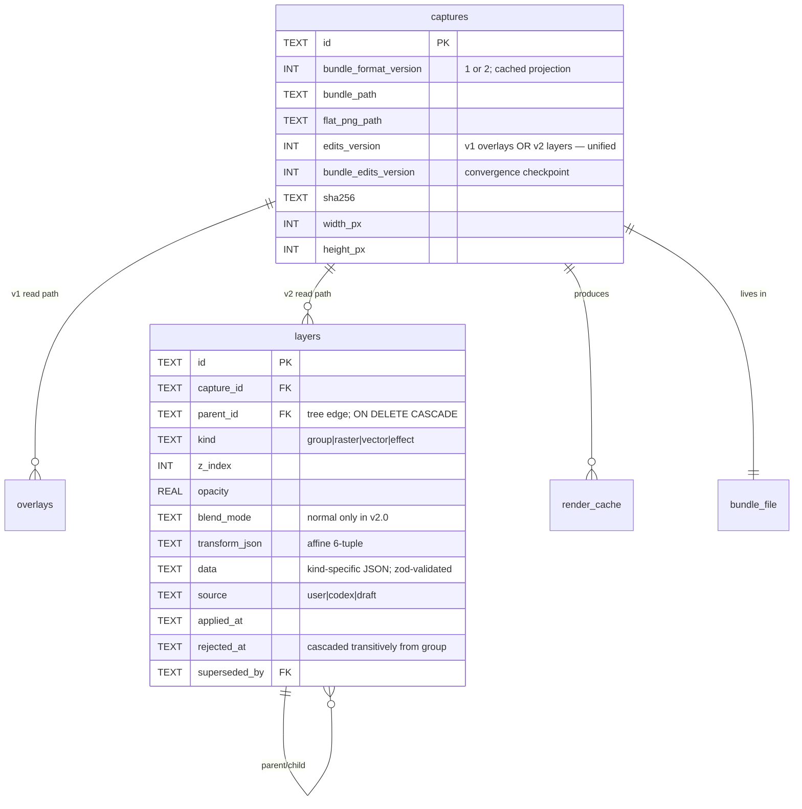

# Bundle format v2 — multi-source canvas + layer tree + contextual effects

## Shipping Status — v2 is the default

**UPDATE 2026-05-28 — v1 fully removed.** The library converged to v2
(eager boot sweep, PR #153), then the entire v1 path was deleted: the
v1→v2 doctor, the v1 linear compositor, `overlays-repo`, the
`overlays:*` IPC verbs, the renderer v1 model arm + doctor banners,
`legacy-bundle-migration`, the v1 bundle read handle, the v1 zod
schemas (`bundle-manifest-schema.ts`), and the `overlays` SQLite table
(migration `0020`). `coordinator.ts` is v2-only and throws on non-v2;
`compose.ts` survives only as the v2 SVG-helper holder. The
bullets below are **historical** — `feature-flags.ts`, the
`PWRSNAP_BUNDLE_V2` env var, and the dual-format read path they
describe no longer exist. See AGENTS.md §"Bundle format v2 — the only
bundle format" for current state.

**As of 2026-05-24** v2 is the default for new captures. The flip
happened as v2-editor §Phase 6 (moved up before Phases 4-5 so the
v2-only feature work — smart blur, multi-image — would ship against
a real v2 install base instead of dogfood-only).

- Source of truth: [apps/desktop/src/main/feature-flags.ts](../../apps/desktop/src/main/feature-flags.ts)
- Default: **on** (v2 write path); the lazy v1→v2 doctor wraps
  existing v1 captures on first edit-open.
- Escape hatch: `PWRSNAP_BUNDLE_V2=0` forces the legacy v1 write
  path. Debug-only — used for bisecting v2-codepath regressions.
- Read path: **always dual-format** — both v1 and v2 captures render
  correctly via `coordinator.ts:resolveCacheFile` branching on
  `record.bundle_format_version`.
- Clipboard `copyLayerFragment` / `pasteLayerFragment`: refuse v1
  captures (paste targets the v2 layer tree; v1 captures will be
  promoted by the doctor on first edit-open and only then accept a
  fragment paste).

### Rollout history

The original gate (2026-05-12) shipped Phases 1–5 of the v2 data
layer behind `PWRSNAP_BUNDLE_V2=1` while the renderer still only
spoke `overlays:upsert`. The blockers to flipping the default were:

1. Layer-editor UI in the renderer (resolved by v2-editor Phases
   1-3 + 6 — dual-dispatch on `bundle_format_version`).
2. v1→v2 doctor promotion (resolved by v2-editor Phase 3 — lazy
   wrap on first edit-open).
3. Phase 6 E2E specs covering capture → edit → repack → reload.
4. Cross-instance UTI roundtrip verification.

The flip landed with the env var inverted: `=0` is now the escape
hatch instead of `=1` being the opt-in.

## Enhancement Summary

**Deepened on:** 2026-05-07
**Reviewers:** architecture-strategist, code-simplicity-reviewer, data-integrity-guardian, security-sentinel, performance-oracle

### Key changes vs. first-cut plan

| Change | Driver |
|---|---|
| **Layer kinds 5 → 3.** Dropped `MaskLayer` (no v2.0 UX consumes it); dropped `AdjustmentEffect` slot (speculative; `z.record(z.unknown())` was a validation hole). Surviving: `raster`, `vector`, `effect`, `group`. | Simplicity + security. |
| **BlendMode enum 12 → 1.** v2.0 ships `"normal"` only. Migration sets it. Other modes land non-breaking when an editor feature exposes them. | Simplicity. |
| **DB columns trimmed.** `overlays_version` / `layers_version` collapse to **`edits_version`**; `bundle_overlays_version` / `bundle_layers_version` collapse to **`bundle_edits_version`**. Same semantics work for v1 (overlays table) and v2 (layers table) — the table being read is already gated by `bundle_format_version`. | Architecture + simplicity. |
| **Schema fields stripped.** Removed `color_profile`, `source_count`, `layer_count`, `thumbnails/` from v2.0 manifest + path validator. Add when a feature needs them. | Simplicity + security (every unused field is a validation hole or a denormalization-drift bug). |
| **Per-layer cache deleted.** Single composite cache `cache/<capture_id>/<treeHash>.<format>` like v1. Per-layer cache had estimated <15% hit rate vs. ~70% for single-composite; cache orphan accumulation risk dropped. `render-hash-tree` machinery kept (load-bearing for contextual-effect correctness). | Architecture + simplicity + performance (all three reviewers converged). |
| **`BundleReadHandle` hidden internally; expose `BundleView` adapter.** Most callers (doctor, library, capture-handlers) only need canvas dims + capture_id + paired filename — fields *both* versions carry. v1/v2 awareness pushed down to the two functions that genuinely need it (`composeV2` vs `compose`, migration). | Architecture. |
| **HIGH-severity security guards added.** Content-integrity verification (sha256(zipEntryBytes) === filenameSha on every `sources/<sha>.png` read); `z.number().finite()` on every numeric schema field; canvas + image dimensions capped at 32768²; clipboard UTI defense-in-depth (zod validate, 64 MiB size cap, 4096-layer count cap, sha256-verify `pngBytes`, sharp decode-probe); SVG masks deferred (originally `MaskLayer.svg_path` was a `<script>`/XXE attack surface — dropping `MaskLayer` closes this entire class). | Security-sentinel. |
| **CRITICAL data-integrity fixes.** (1) Transitive soft-delete cascade in `rejectLayer` (groups → children get same `rejected_at`). (2) Reparent in `BEGIN IMMEDIATE` + recursive-CTE cycle check (not a TS walk outside a TX). (3) `bundle_format_version`, `bundle_modified_at`, `bundle_edits_version` are **derived from bundle at doctor reconcile** (not authoritatively stored) — closes the rename-vs-UPDATE crash gap. (4) `layers:rasterize` uses deterministic recovery (re-render from live tree if bundle write fails). | Data-integrity. |
| **CRITICAL `walkLayerTree` contract.** Returns `{ data: Buffer; raw: { width, height, channels: 4 } }`, **raw RGBA throughout**. Single PNG encode at root. Preserves v1's two-pass discipline ([compose.ts:135-179](apps/desktop/src/main/render/compose.ts:135-179)). Stream-fold not accumulate; max 4 retained RGBA buffers; OOM-guard at canvas-dim cap. Plan's first-cut pseudocode showed `Promise<Buffer>` with no encoding declared — would have caused ~250MB transient buffers + libpng-deflate per layer. | Architecture + performance (both flagged independently). |
| **Debounce + iCloud tuning.** `scheduleRepack` bumps 1s → **3-5s for v2** (continuous-pointer-edit gestures coalesce; v2 repack cost is 1.5-3s vs v1's ~50ms). Newer `scheduleRepack` calls cancel in-flight repacks. **iCloud-aware gating**: when bundle is iCloud-active (`NSURLUbiquitousItemIsUploadingKey`), defer auto-repack to 30s idle. | Performance. |
| **v1→v2 doctor migration deferred** to a separate plan. v1 Phase 2 (doctor) doesn't exist yet; planning a hook into nonexistent code was planning-theater. v2.0 ships writing v2; existing v1 bundles continue to read normally via the dual-read path. Migration plan files in a follow-up once doctor lands. | Simplicity. |
| **`packBundleV1` deleted post-Phase 4.** Roundtrip tests consume a checked-in fixture v1 `.pwrsnap`. Production code shouldn't exist solely to serve tests. | Simplicity. |
| **`transformation-matrix` npm dep.** Replaces custom `affine-transform.ts`. ~1KB, zero deps, battle-tested. | Simplicity. |
| **Phase count 5 → 6.** Split Phase 5 into clipboard (Phase 5) and E2E+cleanup (Phase 6). Independent landings; smaller PRs. | Simplicity. |
| **Estimate revised down.** ~42-54h → **~33-46h** total. | Cumulative of cuts. |

### What survived review unchanged

The bundle ZIP layout (additive on v1's), canvas-pixel-coordinate decision, flat-list-plus-parent_id layer-tree storage (newly justified by AI-staging index `idx_layers_capture_pending`), sample-below contextual-effect semantics, the `VectorLayer.shape` reuse of `OverlaySchema`, `RasterSourceRef` kind-discriminator with `"linked"` reserved, lazy v1→v2 migration model (just deferred to a follow-up plan), per-version path validator with all v1 Zip-Slip rules carried forward.

---

## Overview

PwrSnap moves from a screenshot annotator to a compound editor. The bundle
format bumps from v1 to v2: a single source PNG + flat overlay array becomes
a canvas + multiple sources + layer tree + live (sampled-below) effects.
v1 bundles remain valid forever; v2-aware builds read them via a uniform
adapter that hides the version discrimination from most callers.

This plan supersedes nothing in [v1's plan](docs/plans/2026-05-07-001-feat-pwrsnap-bundle-storage-plan.md) —
v2 builds on it. Phase 1 of v1 (durability + atomic-rename + Zip-Slip
defenses + sha256 dedup + paired flat PNG) carries forward verbatim. v2
extends the *content* of a bundle, not its physical packaging or its
durability semantics.

See origin: [docs/brainstorms/2026-05-07-bundle-format-v2-requirements.md](docs/brainstorms/2026-05-07-bundle-format-v2-requirements.md)
for the WHAT-to-build decisions.

## Problem Statement

v1's data model assumes **source == canvas**. Overlay coordinates normalize
to source W×H ([overlay-schemas.ts](packages/shared/src/overlay-schemas.ts)).
`OVERLAY_RENDER_ORDER` ([overlay-schemas.ts:91-99](packages/shared/src/overlay-schemas.ts:91-99))
bakes a single fixed composite. `compose.ts` ([:128](apps/desktop/src/main/render/compose.ts:128))
iterates a flat array. Blur is `sharp(srcPath).extract(rect).blur(sigma)` —
the **raw source** ([:415-454](apps/desktop/src/main/render/compose.ts:415-454)).

Three shapes this can't carry (see origin §Problem Frame):

1. **Multi-source documents.** Paste an image onto a canvas → there's no
   slot for it. The bundle holds one `source.png`.
2. **Independent layer transforms.** Each pasted image needs its own
   position / rotation / scale / opacity. The flat overlay array carries
   none.
3. **Contextual effects.** Blur reads from the raw source today.
   Users intuitively expect "move the photo below the blur and the blur
   follows." That requires the effect to sample **what's beneath it at
   composite time**, not raw source — adjustment-layer semantics
   (Photoshop / Affinity).

## Proposed Solution

### Storage layout (after v2)

v2 bundles drop into the same `~/Documents/PwrSnap/` as v1. No path
changes. The paired flat `<id>.png` stays — for v1 it's the baked
source-with-overlays; for v2 it's the flattened layer tree.

```
~/Documents/PwrSnap/                          # unchanged from v1
├── <id>.png                                  # flat composite (v1 or v2)
├── <id>.pwrsnap                              # bundle (v1 or v2)
└── …

<userData>/   (unchanged structurally)
├── pwrsnap.db                               # gains `layers` table in 0004
├── cache/<capture_id>/source.png            # v1: source bytes
├── cache/<capture_id>/sources/<sha>.png     # v2: per-source bytes (NEW)
├── cache/<capture_id>/<treeHash>.<format>   # composite cache (SINGLE — not per-layer)
├── .trash/<id>/{…}                          # unchanged
└── .quarantine/<id>/                        # unchanged
```

### Bundle internal layout (`.pwrsnap` v2)

```
<id>.pwrsnap (ZIP, bundle_format_version: 2)
├── manifest.json        DEFLATE — v2 identity + canvas dimensions
├── document.json        DEFLATE — flat layer list (replaces overlays.json)
├── sources/<sha>.png    STORE   — content-addressable raw inputs; sha256 verified on read
├── layers/<id>.png      STORE   — raster layer content (rasterized effects, future raster brush strokes)
└── composite.png        STORE   — final flattened render
```

Three top-level fixed entries + two prefix-allowlisted directories. **No
`thumbnails/`** — defer until a layer-panel feature needs preview blobs.
`layers/<id>.png` filename uses **nanoid format** (URL-safe alphabet,
16 chars) — matches PwrSnap's existing id convention; **NOT** UUID v4 as
the first-cut plan mistakenly specified (correctness fix from security review).

(see origin: [R5, R7](docs/brainstorms/2026-05-07-bundle-format-v2-requirements.md))

### Layer model

**Three kinds** (down from five) — `raster`, `vector`, `effect`, `group`.
`MaskLayer` and `AdjustmentEffect` deferred to v2.x:

```ts
type LayerNode = RasterLayer | VectorLayer | EffectLayer | GroupLayer;

type CommonProps = {
  id: string;                            // nanoid(16)
  capture_id: string;
  parent_id: string | null;              // null = root
  name: string;                          // max 256 chars
  visible: boolean;
  locked: boolean;
  opacity: number;                       // .min(0).max(1).finite()
  blend_mode: "normal";                  // v2.0: only normal
  transform: AffineTransform;            // tuple of 6 finite numbers
  z_index: number;                       // .int()
  source: "user" | "codex" | "draft";
  ai_run_id: string | null;              // max 64 chars
  applied_at: string | null;
  rejected_at: string | null;
  superseded_by: string | null;          // max 64 chars
  created_at: string;
};

type RasterLayer = CommonProps & {
  kind: "raster";
  source_ref: { kind: "embedded"; sha256: string };  // → sources/<sha>.png
  natural_width_px: number;              // .int().positive().lte(32768)
  natural_height_px: number;             // .int().positive().lte(32768)
};

type VectorLayer = CommonProps & {
  kind: "vector";
  shape: ArrowShape | RectShape | TextShape | StepShape | CropShape | HighlightShape;
  // Existing OverlaySchema discriminated union, coords now in canvas pixels.
};

type EffectLayer = CommonProps & {
  kind: "effect";
  effect: BlurEffect | HighlightEffect;  // AdjustmentEffect deferred
  clip_rect: CanvasRect | null;          // null = entire canvas
};

type GroupLayer = CommonProps & {
  kind: "group";
  collapsed: boolean;                    // UI state
};
```

Soft-delete + supersede-by chains mirror v1's `overlays` table verbatim.

**Critical: soft-delete cascades transitively.** `rejectLayer(groupId)`
stamps `rejected_at = now()` on every descendant in one transaction.
Mirror restore: `restoreLayer(groupId)` clears it transitively only when
descendants' `rejected_at` matches the group's. Without this, soft-deleted
groups leave orphaned-but-live children that the live-rows filter
(`WHERE applied_at IS NOT NULL AND rejected_at IS NULL AND superseded_by IS NULL`)
treats as legitimate.

**Critical: reparent runs in `BEGIN IMMEDIATE` + recursive CTE.** Walking
the parent_id chain in TypeScript outside a transaction is racy under
concurrent reparents from different layers. Inside one IMMEDIATE TX:

```sql
WITH RECURSIVE chain(id) AS (
  SELECT :newParentId
  UNION ALL
  SELECT l.parent_id FROM layers l JOIN chain ON l.id = chain.id
  WHERE l.parent_id IS NOT NULL
)
SELECT 1 FROM chain WHERE id = :movingId;
```

Refuse the reparent if the result is non-empty. SQLite's serialized
writer makes this race-free.

**Critical: layer-tree depth + cycle bound.** `walkLayerTree` and
`listLayerTree` reject trees deeper than 32 levels at the build step.
Malicious bundles can ship 100k-layer adversarial parent_id chains;
without a depth bound, compose stalls.

### Render contract — tree-walking compositor with sample-below

**Critical contract:** `walkLayerTree` operates on **raw RGBA buffers**,
not PNG-encoded buffers. v1's [compose.ts:135-179](apps/desktop/src/main/render/compose.ts:135-179)
already implements this two-pass discipline (composite at source resolution
→ raw RGBA → resize + encode). v2 preserves it.

```ts
type RenderAccum = { data: Buffer; raw: { width: number; height: number; channels: 4 } };

async function walkLayerTree(
  node: LayerNode,
  sampleUnder: RenderAccum,              // raw RGBA accumulator
  ctx: RenderCtx                         // canvas dims, depth budget, source resolver
): Promise<RenderAccum> {                // returns mutated raw RGBA
  if (ctx.depth > MAX_TREE_DEPTH) throw new BundleError("tree depth exceeded");
  if (ctx.retainedBuffers > 4) throw new BundleError("layer composite memory pressure");

  switch (node.kind) {
    case "group": {
      let acc = sampleUnder;
      for (const child of childrenInZOrder(node, ctx)) {
        acc = await walkLayerTree(child, acc, { ...ctx, depth: ctx.depth + 1 });
      }
      return applyTransformOpacity(acc, node);
    }
    case "raster": {
      const source = await loadSourceRaw(node.source_ref.sha256, ctx);
      return compositeRawIntoAcc(sampleUnder, source, node);  // mutates in place when safe
    }
    case "vector": {
      const svg = rasterizeVectorToRaw(node.shape, ctx);
      return compositeRawIntoAcc(sampleUnder, svg, node);
    }
    case "effect": {
      // Sample sampleUnder inside clip_rect, apply operation, composite back.
      // Does NOT read raw source — reads the running accumulator.
      const clipped = extractRectRaw(sampleUnder, node.clip_rect ?? ctx.canvasRect);
      const operated = applyEffect(clipped, node.effect);
      return compositeAtRaw(sampleUnder, operated, node.clip_rect, node);
    }
  }
}

// composeV2 is the single entry point: walks the tree, encodes once at the end.
async function composeV2(req: ComposeRequest): Promise<RenderResult> {
  const tree = listLayerTree(req.captureId);                  // depth-bounded build
  const canvas = blankRgba(req.canvas.width_px, req.canvas.height_px);
  const final = await walkLayerTree(tree.root, canvas, {
    depth: 0, retainedBuffers: 1, ...req
  });
  // SINGLE encode at the end — sharp's two-pass discipline preserved.
  return sharp(final.data, { raw: final.raw })
    .resize(req.targetWidth)
    .toFormat(req.format)
    .toBuffer();
}
```

**Single-output cache key.** Render result keys at
`<userData>/cache/<capture_id>/<treeHash>.<format>` — single file per
(capture, render-config). `render-hash-tree` machinery survives (it's
load-bearing for contextual-effect correctness: an effect node's hash
must include hash-of-layers-below or moving a layer beneath produces
stale renders), but the cache is single-composite. Per-layer cache
deferred until a measured workload demands it.

(see origin: §R6, §R8)

### Read path — version-aware dispatch, hidden from callers

`openAndValidateBundle` is the chokepoint. v2 introduces a `BundleView`
adapter that hides the version discriminant from most callers:

```ts
// Internal — used by bundle-store itself and the migration script.
type BundleReadHandle =
  | { version: 1; manifest: BundleManifestV1; entries: Map<string, yauzl.Entry>; zipFile: yauzl.ZipFile }
  | { version: 2; manifest: BundleManifestV2; entries: Map<string, yauzl.Entry>; zipFile: yauzl.ZipFile };

// Public — what 90% of callers consume.
export type BundleView = {
  version: 1 | 2;
  capture_id: string;
  canvas: { width_px: number; height_px: number };
  paired_png_filename: string;
  bundle_modified_at: string;
};

export async function openAndValidateBundle(path: string): Promise<BundleReadHandle>;  // internal
export async function readBundleView(path: string): Promise<BundleView>;                // public
export async function readBundleManifest(path: string): Promise<BundleManifestV1 | BundleManifestV2>;
export async function readBundleDocument(path: string): Promise<BundleDocumentV2>;      // v2 only
export async function readBundleOverlays(path: string): Promise<BundleOverlaysV1>;      // v1 only
export async function readBundleEntry(path: string, entryName: string): Promise<Buffer>;
```

Doctor, library handlers, capture-handlers consume `BundleView` — they
get canvas dims + capture_id + paired filename without `switch (version)`.
Only `composeV2` / `compose` (separate compositors) and the future
migration touch the discriminated union.

**Critical: content-integrity verification on read.** Every
`sources/<sha>.png` extraction recomputes the sha256 of the bytes and
verifies it matches the filename:

```ts
async function readSourceFromBundle(handle: BundleReadHandle, sha: string): Promise<Buffer> {
  const entry = handle.entries.get(`sources/${sha}.png`);
  if (!entry) throw new BundleError(`bundle missing source ${sha.slice(0, 8)}…`);
  const bytes = await readEntryToBuffer(handle.zipFile, entry);
  const computed = createHash("sha256").update(bytes).digest("hex");
  if (computed !== sha) {
    quarantineBundle(handle.path);
    throw new BundleError(`bundle source content-hash mismatch`);  // sanitized — no attacker bytes in message
  }
  return bytes;
}
```

Without this, an attacker who ships a v2 bundle (AirDrop, peer's iCloud)
can put attacker-controlled bytes at `sources/<known-good-sha>.png`,
poisoning the dedup invariant and the effect cache.

### v2 path validator — regex prefix allowlist

```ts
const V2_FIXED_ENTRIES = new Set(["manifest.json", "document.json", "composite.png"]);
const V2_PATTERNS: readonly RegExp[] = [
  /^sources\/[0-9a-f]{64}\.png$/,                     // sha256-hex
  /^layers\/[A-Za-z0-9_-]{16}\.png$/                  // nanoid (16-char URL-safe)
];

export function validateBundleZipEntryNamesV2(names: readonly string[]): BundleEntryValidation {
  const bad: string[] = [];
  const seen = new Set<string>();
  const duplicates: string[] = [];

  for (const name of names) {
    // v1 Zip-Slip rules carried forward.
    if (name.includes("..") || name.startsWith("/") || name.includes("\\") || name.includes("\0")) {
      bad.push(name);
      continue;
    }
    if (path.posix.normalize(name) !== name) { bad.push(name); continue; }
    if (V2_FIXED_ENTRIES.has(name) || V2_PATTERNS.some((re) => re.test(name))) {
      if (seen.has(name)) duplicates.push(name);
      else seen.add(name);
    } else {
      bad.push(name);
    }
  }

  const missing = ["manifest.json", "document.json", "composite.png"].filter((n) => !seen.has(n));

  if (bad.length === 0 && duplicates.length === 0 && missing.length === 0) {
    return { ok: true };
  }
  return { ok: false, badEntries: bad, missingEntries: missing, duplicateEntries: duplicates };
}
```

Error messages flowing to the renderer carry only **counts**, never
attacker-controlled entry names (sanitized error rule from v1).

### Write path — v2 packBundle + persistCaptureFromTempV2

`packBundle` ([bundle-store.ts:454-486](apps/desktop/src/main/persistence/bundle-store.ts:454-486))
gets a v2 sibling. Critically: `packBundleV1` is **scheduled for deletion
post-Phase 4**. Production never writes v1 again after the cutover; v1
read paths remain forever for unmigrated bundles. v1 roundtrip tests
consume a checked-in fixture bundle.

```ts
export type PackBundleV2Args = {
  manifest: BundleManifestV2;
  document: BundleDocumentV2;
  sources: Map<string, Buffer>;          // sha256 → bytes
  layerBytes: Map<string, Buffer>;       // nanoid → bytes (rasterized effects, future raster strokes)
  compositePng: Buffer;
};

export async function packBundleV2(args: PackBundleV2Args): Promise<Buffer>;
```

### Doctor reconcile — bundle as authoritative source for version fields

**Critical: `bundle_format_version`, `bundle_modified_at`, and
`bundle_edits_version` are derived from bundle at doctor reconcile, not
stored authoritatively.** Closes the rename-vs-UPDATE crash gap:

> Plan §v1→v2 migration originally specified: `atomicWriteBundle(record.bundle_path, bundleBuf)` THEN `UPDATE captures SET bundle_format_version = 2`. Between these two operations is a non-atomic window. On crash, on-disk bundle is v2; DB row claims v1. Next reader's `resolveCacheFile` branch on `record.bundle_format_version` calls legacy `compose()` on a v2 capture → blank composite.

Resolution rule the doctor enforces on every reconcile pass:

```ts
async function reconcileRow(record: CaptureRecord): Promise<void> {
  const view = await readBundleView(record.bundle_path);
  const driftFields: Partial<CaptureUpdateColumns> = {};
  if (view.version !== record.bundle_format_version) {
    driftFields.bundle_format_version = view.version;
  }
  if (view.bundle_modified_at !== record.bundle_modified_at) {
    driftFields.bundle_modified_at = view.bundle_modified_at;
  }
  // Pull bundle_edits_version from bundle's document/overlays version.
  // Bundle is SoR (R10); the DB row catches up.
  if (Object.keys(driftFields).length > 0) {
    updateCaptureColumns(record.id, driftFields);
  }
}
```

R10 invariant preserved: bundle wins on disagreement. The DB row's
version columns are *cached projections*, not authoritative state.

### Convergence + recovery semantics

R10 precedence is **time-windowed**, codified for v2:

1. **Within the debounce window:** DB is authoritative. `layers:upsert`
   commits to DB; `scheduleRepack` queues; bundle catches up.
2. **At boot / on doctor reconcile:** bundle is authoritative for
   *content* (`bundle_format_version`, `bundle_modified_at`,
   `bundle_edits_version`); DB is authoritative for *pending edits*
   (`edits_version > bundle_edits_version` means a re-pack is owed).
3. **On `<userData>` wipe:** bundle wins everything; pending in-flight
   edits are lost (acceptable per R10).

The single `edits_version` / `bundle_edits_version` pair (renamed from
v1's `overlays_version` / `bundle_overlays_version`) tracks this for
both formats. The table being read (overlays for v1, layers for v2) is
already gated by `bundle_format_version`.

**Guard rail:** `insertOverlay` / `rejectOverlay` throw on v2 captures:

```ts
export function insertOverlay(input: UpsertOverlay): OverlayRow {
  const record = getCaptureById(input.captureId);
  if (record?.bundle_format_version === 2) {
    throw new Error("overlays:* IPC called on a v2 capture; use layers:* instead");
  }
  // ... existing v1 path
}
```

Symmetric guard on `insertLayer` for v1 captures.

### `layers:rasterize` — deterministic recovery

Rasterize converts a live effect into a baked raster layer. Three steps:

1. Walk tree at current state, render effect output at canvas dimensions.
2. In a single DB transaction: `INSERT layers` for new RasterLayer,
   `UPDATE layers SET superseded_by = newId WHERE id = oldEffectId`.
3. Schedule repack (next debounce tick packs the new bundle including
   `layers/<nanoid>.png`).

**Recovery semantics:** if crash occurs after step 2 commits but before
the bundle re-pack lands, on next boot the new RasterLayer references a
sha that doesn't exist in `layers/`. The recovery rule:
**re-render the raster bytes from the live tree before re-pack.**
Rasterize is deterministic from current tree state, so the bytes are
identical to what was originally computed. No staging directory needed;
no two-phase commit dance.

### Source + layer orphan policy

Symmetric policy for `sources/<sha>.png` and `layers/<id>.png`:

- **Keep** as long as ANY layer row (live OR soft-deleted) references the sha/id.
- **Drop** at bundle re-pack time only when ALL referencing rows are
  hard-deleted (no row in the table references this sha/id anymore).
- v2.0 has no per-row hard-delete sweep for layers. Soft-deleted layers
  retain refs indefinitely; bundles can grow. **Trade-off documented**:
  acceptable for v2.0 because dedup-by-sha keeps repeat-use cheap, and
  the editor's "trash" UI for hard-deleting whole captures (existing v1
  flow) is the eventual cleanup path. Per-layer hard-delete sweep
  deferred.

### Clipboard — private UTI with defense-in-depth

Five layers of defense against hostile clipboard payloads:

1. **Hard size cap** before `JSON.parse`: 64 MiB. Guards renderer OOM.
2. **Layer count cap**: 4096 layers max per paste. Guards DoS on tree-build.
3. **Zod schema validation** of the decoded JSON against `BundleLayerNode[]`
   + `RasterSourceRef[]` discriminated union. Catches structural attacks.
4. **sha256 verification**: recompute `sha256(pngBytes)` and reject on
   mismatch against the claimed sha. Without this, a malicious payload
   could claim a known-good sha while shipping attacker bytes.
5. **Sharp decode-probe**: every `pngBytes` Buffer must successfully
   decode as a PNG (sharp `metadata()` succeeds, dimensions ≤ 32768²)
   before being accepted.

Wire format:

```ts
type ClipboardLayerFragment = {
  format_version: 1;
  layers: BundleLayerNode[];
  source_refs: Array<{ sha256: string; png_base64: string }>;
};
```

Always co-write standard PNG bytes via `clipboard.writeImage()` so
non-PwrSnap consumers (Slack, Messages, Mail) get the flattened
selection. The private UTI is opt-in for PwrSnap-to-PwrSnap fidelity.

UTI registration in `electron-builder.yml` `extendInfo`:

```yaml
UTExportedTypeDeclarations:
  - UTTypeIdentifier: com.pwrdrvr.pwrsnap.layer-fragment
    UTTypeDescription: "PwrSnap Layer Fragment"
    UTTypeConformsTo: [public.data]
    UTTypeTagSpecification:
      "public.mime-type": [application/vnd.pwrsnap.layer-fragment+json]
```

(see origin: §R10)

### Debounce + iCloud-aware repack gating

`scheduleRepack` REPACK_DEBOUNCE_MS bumps **1s → 5s for v2 captures**.
v1 captures stay at 1s. v2 repack cost is ~1.5-3s (pack a 20-layer
40MB-sources bundle); a 1s window queues overlapping repacks during
continuous drawing. Newer `scheduleRepack` calls **cancel in-flight
repacks** (replace, not append).

iCloud awareness: when the bundle's URL has `NSURLUbiquitousItemIsUploadingKey`
set (Apple's iCloud upload indicator), defer auto-repack to 30s idle.
Without this, a 100MB bundle re-uploads on every edit, saturating uplink
on hotel WiFi. Sample-below correctness is preserved — the user just
waits longer for the on-disk artifact to sync.

```ts
const REPACK_DEBOUNCE_MS_V1 = 1_000;
const REPACK_DEBOUNCE_MS_V2 = 5_000;
const REPACK_DEBOUNCE_MS_ICLOUD = 30_000;

function scheduleRepackV2(captureId: string): void {
  const existing = repackTimers.get(captureId);
  if (existing !== undefined) clearTimeout(existing);
  // Cancel any in-flight repack — newer state supersedes.
  const inFlight = repackInFlight.get(captureId);
  if (inFlight !== undefined) inFlight.cancel?.();

  const delay = isBundleICloudActive(captureId) ? REPACK_DEBOUNCE_MS_ICLOUD : REPACK_DEBOUNCE_MS_V2;
  const timer = setTimeout(() => {
    repackTimers.delete(captureId);
    void runRepack(captureId).catch(/* … */);
  }, delay);
  repackTimers.set(captureId, timer);
}
```

(see origin: §R12)

## Technical Approach

### Architecture

#### New modules

- `packages/shared/src/bundle-manifest-schema-v2.ts` — v2 zod schemas
  (BundleManifestV2, BundleDocumentV2, BundleLayerNode discriminated
  union with 4 kinds, kind-specific shape schemas), `validateBundleZipEntryNamesV2`.
  All numeric fields use `.finite()`; canvas + image dimensions capped
  at 32768; string fields capped.
- `apps/desktop/src/main/persistence/layers-repo.ts` — `listLayerTree`
  (depth-bounded), `insertLayer`, `updateLayer`, `reparent` (BEGIN
  IMMEDIATE + recursive CTE), `reorderSiblings`, `rejectLayer`
  (transitive cascade), `restoreLayer`.
- `apps/desktop/src/main/handlers/layers-handlers.ts` — `layers:list`,
  `layers:upsert`, `layers:reparent`, `layers:reorder`, `layers:delete`,
  `layers:rasterize`. Mirrors `overlays-handlers.ts`.
- `apps/desktop/src/main/render/compose-tree.ts` — `walkLayerTree`
  (raw RGBA discipline + depth/buffer-count caps), `composeV2`,
  bottom-up render hash propagation. **`render-hash-tree.ts` is
  inlined here** (one recursive function, one consumer — no separate
  file).
- `apps/desktop/src/main/persistence/migrations/0004_layers.sql` —
  schema migration.

#### Modules that extend (no rewrite)

- `apps/desktop/src/main/persistence/bundle-store.ts` —
  `openAndValidateBundle` becomes version-aware (two-stage validation);
  new `readBundleView`, `readBundleDocument`, `readSourceFromBundle`
  (with content-integrity check), `packBundleV2`, `persistCaptureFromTempV2`.
  `packBundleV1` deleted post-Phase 4.
- `apps/desktop/src/main/persistence/captures-repo.ts` — `CaptureRecord`
  gains `bundle_format_version`, `edits_version`, `bundle_edits_version`
  via the 0004 migration. Existing `overlays_version` and
  `bundle_overlays_version` columns are **renamed** to the unified pair
  (not duplicated).
- `apps/desktop/src/main/handlers/clipboard-handlers.ts` — adds
  layer-fragment copy/paste with the 5-layer defense.
- `apps/desktop/src/main/render/coordinator.ts` — `resolveCacheFile`
  branches on `view.version` (now via `BundleView` adapter, not the
  internal handle).
- `apps/desktop/electron-builder.yml` — UTI declaration.

#### Dependencies

- **`transformation-matrix`** (~1 KB, zero deps, MIT) — affine math.
  Replaces a custom `affine-transform.ts`. Battle-tested.
- `yazl` / `yauzl` / `archiver` / `sharp` — unchanged from v1.

### Data Model

#### Schema migration `0004_layers.sql`

```sql
-- 0004_layers — Bundle format v2 + layer tree + unified edits-version columns.
-- See docs/plans/2026-05-07-002-feat-bundle-format-v2-layer-tree-plan.md.

-- Rename v1 columns to unify v1/v2 convergence semantics. Same columns
-- work for both formats; the table being read is already gated by
-- bundle_format_version.
ALTER TABLE captures RENAME COLUMN overlays_version TO edits_version;
ALTER TABLE captures RENAME COLUMN bundle_overlays_version TO bundle_edits_version;

-- v2 format gate. Derived-from-bundle at doctor reconcile; stored as
-- a cached projection.
ALTER TABLE captures ADD COLUMN bundle_format_version INTEGER NOT NULL DEFAULT 1;

CREATE TABLE layers (
  id              TEXT NOT NULL PRIMARY KEY,    -- nanoid(16)
  capture_id      TEXT NOT NULL,
  parent_id       TEXT,                          -- NULL = root group
  kind            TEXT NOT NULL CHECK (kind IN ('group','raster','vector','effect')),
  z_index         INTEGER NOT NULL DEFAULT 0,
  name            TEXT NOT NULL DEFAULT '',
  visible         INTEGER NOT NULL DEFAULT 1,
  locked          INTEGER NOT NULL DEFAULT 0,
  opacity         REAL NOT NULL DEFAULT 1.0,
  blend_mode      TEXT NOT NULL DEFAULT 'normal',
  transform_json  TEXT NOT NULL DEFAULT '[1,0,0,1,0,0]',
  data            TEXT NOT NULL,                 -- kind-specific JSON (zod-validated)
  schema_version  INTEGER NOT NULL DEFAULT 1,
  source          TEXT NOT NULL CHECK (source IN ('user','codex','draft')),
  ai_run_id       TEXT,
  applied_at      TEXT,
  rejected_at     TEXT,
  superseded_by   TEXT,
  created_at      TEXT NOT NULL,
  FOREIGN KEY (capture_id) REFERENCES captures(id) ON DELETE CASCADE,
  FOREIGN KEY (parent_id) REFERENCES layers(id) ON DELETE CASCADE,
  FOREIGN KEY (superseded_by) REFERENCES layers(id) ON DELETE SET NULL
);

CREATE INDEX idx_layers_capture_tree
  ON layers (capture_id, parent_id, z_index, created_at)
  WHERE applied_at IS NOT NULL
    AND rejected_at IS NULL
    AND superseded_by IS NULL;

-- AI-suggestion staging index — the actual justification for storing
-- layers as rows (not a JSON blob on captures).
CREATE INDEX idx_layers_capture_pending
  ON layers (capture_id, ai_run_id)
  WHERE applied_at IS NULL
    AND rejected_at IS NULL
    AND superseded_by IS NULL;
```

#### Manifest + document v2 zod schemas

```ts
// Defined in packages/shared/src/bundle-manifest-schema-v2.ts.
import { Matrix } from "transformation-matrix";

const FiniteNumber = z.number().finite();
const Sha256Hex = z.string().regex(/^[0-9a-f]{64}$/);
const NanoId16 = z.string().regex(/^[A-Za-z0-9_-]{16}$/);

export const AffineTransform = z.tuple([
  FiniteNumber, FiniteNumber,                                 // a, b
  FiniteNumber, FiniteNumber,                                 // c, d
  FiniteNumber, FiniteNumber                                  // tx, ty
]);

export const CanvasRect = z.object({
  x: FiniteNumber, y: FiniteNumber,
  w: FiniteNumber.nonnegative(), h: FiniteNumber.nonnegative()
});

export const RasterSourceRef = z.object({
  kind: z.literal("embedded"),
  sha256: Sha256Hex
});

const CommonLayerProps = {
  id: NanoId16,
  parent_id: z.string().max(64).nullable(),
  name: z.string().max(256),
  visible: z.boolean(),
  locked: z.boolean(),
  opacity: FiniteNumber.min(0).max(1),
  blend_mode: z.literal("normal"),                            // v2.0: only "normal"
  transform: AffineTransform,
  z_index: z.number().int().finite(),
  source: z.enum(["user", "codex", "draft"]),
  ai_run_id: z.string().max(64).nullable(),
  applied_at: z.iso.datetime().nullable(),
  rejected_at: z.iso.datetime().nullable(),
  superseded_by: z.string().max(64).nullable(),
  created_at: z.iso.datetime()
};

export const GroupLayer = z.object({
  kind: z.literal("group"), collapsed: z.boolean(), ...CommonLayerProps
});
export const RasterLayer = z.object({
  kind: z.literal("raster"),
  source_ref: RasterSourceRef,
  natural_width_px: z.number().int().positive().lte(32768),
  natural_height_px: z.number().int().positive().lte(32768),
  ...CommonLayerProps
});
export const VectorLayer = z.object({
  kind: z.literal("vector"),
  shape: Overlay,                                             // existing OverlaySchema
  ...CommonLayerProps
});
export const BlurEffect = z.object({
  type: z.literal("blur"),
  radius_px: FiniteNumber.positive().lte(200)
});
export const HighlightEffect = z.object({
  type: z.literal("highlight"),
  tint_hex: z.string().regex(/^#[0-9a-f]{6}$/i),
  opacity: FiniteNumber.min(0).max(1)
});
export const EffectLayer = z.object({
  kind: z.literal("effect"),
  effect: z.discriminatedUnion("type", [BlurEffect, HighlightEffect]),
  clip_rect: CanvasRect.nullable(),
  ...CommonLayerProps
});

export const BundleLayerNode = z.discriminatedUnion("kind", [
  GroupLayer, RasterLayer, VectorLayer, EffectLayer
]);

export const BundleManifestV2 = z.object({
  bundle_format_version: z.literal(2),
  capture_id: z.string().min(8).max(32),
  canvas_dimensions: z.object({
    width_px: z.number().int().positive().lte(32768),
    height_px: z.number().int().positive().lte(32768)
  }),
  paired_png_filename: PairedFilename,
  created_at: z.iso.datetime(),
  bundle_modified_at: z.iso.datetime()
});

export const BundleDocumentV2 = z.object({
  document_format_version: z.literal(1),
  edits_version: z.number().int().nonnegative(),              // mirrors captures.edits_version
  layers: z.array(BundleLayerNode).max(4096),                 // depth + count bounds
  tags: z.array(z.string().max(64)).max(256),
  description: z.string().max(4096).nullable(),
  ai_runs: z.array(BundleAIRunRecord).max(1024)
});
```

#### ER diagram (post-v2)



### Implementation Phases

#### Phase 1 — v2 schemas + types + schema migration (no behavior change) (~4-6h)

Foundation. App still writes v1 bundles. Sets up types + DB for
subsequent phases.

Files added:
- `packages/shared/src/bundle-manifest-schema-v2.ts` — v2 zod schemas
  + `validateBundleZipEntryNamesV2`
- `apps/desktop/src/main/persistence/migrations/0004_layers.sql`
- `packages/shared/src/__tests__/bundle-manifest-schema-v2.test.ts`

Files updated:
- `packages/shared/src/index.ts` — barrel export
- `packages/shared/package.json` — subpath export `./bundle-manifest-v2`
- `packages/shared/src/protocol.ts` — `CaptureRecord` gains
  `bundle_format_version`, renames `overlays_version` →
  `edits_version`, renames `bundle_overlays_version` →
  `bundle_edits_version`
- `apps/desktop/src/main/persistence/captures-repo.ts` — row → record
  mapping for new + renamed columns
- `apps/desktop/src/main/handlers/overlays-handlers.ts` — `insertOverlay`
  / `rejectOverlay` throw on `bundle_format_version === 2` rows

New dependency: `transformation-matrix` ^2.x added to `apps/desktop/package.json`.

Success criteria:
- 0004 migration applies cleanly; column rename preserves existing values
- Every v2 zod schema round-trips
- `validateBundleZipEntryNamesV2` rejects every Zip-Slip case + new v2-specific cases (homograph, URL-encoded traversal, mixed-case sha)
- All numeric schemas reject NaN, +Inf, -Inf
- Canvas + image dimensions reject values >32768
- `insertOverlay` throws on a v2 capture
- TypeScript strict clean; existing tests pass

#### Phase 2 — Dual-read in bundle-store + content-integrity (~5-7h)

`openAndValidateBundle` becomes version-aware. `BundleView` adapter
exposed to callers; `BundleReadHandle` stays internal. Every
`sources/<sha>.png` extraction verifies content-integrity.

Files updated:
- `apps/desktop/src/main/persistence/bundle-store.ts`:
  - `openAndValidateBundle` returns internal `BundleReadHandle` discriminated by version
  - new public `readBundleView(path) → BundleView`
  - new public `readBundleDocument(path) → BundleDocumentV2`
  - new internal `readSourceFromBundle(handle, sha) → Buffer` with sha256 verification
  - existing `readBundleManifest` widens return type
  - existing `readBundleOverlays` errors clearly if called on v2 bundle

Files added:
- `apps/desktop/src/main/__tests__/bundle-store-pack-v2.test.ts` — hand-construct v2 bundles via raw yazl/archiver
- `apps/desktop/src/main/__tests__/bundle-store-content-integrity.test.ts` — bundle with tampered `sources/<sha>.png` quarantined

Success criteria:
- Reading a v1 bundle returns `{ version: 1, … }`
- Reading a v2 bundle returns `{ version: 2, … }`
- `readBundleView` returns the same shape regardless of version
- Malicious v2 bundle with `sources/../../etc/passwd` quarantined
- Malicious v2 bundle with `sources/<known-sha>.png` containing different bytes → quarantined, content-hash mismatch
- Error messages flowing to renderer contain only counts; no attacker-controlled strings

#### Phase 3 — Layers repo + handlers + tree-walking compositor (~10-14h)

The largest phase. Layers table read/write surface, v2 IPC contract,
`composeV2` with raw-RGBA discipline + sample-below contextual effects.

Files added:
- `apps/desktop/src/main/persistence/layers-repo.ts`:
  - `listLayerTree` (depth-bounded build, max 32 levels)
  - `insertLayer`, `updateLayer`
  - `reparent` (BEGIN IMMEDIATE + recursive-CTE cycle check inside the TX)
  - `reorderSiblings`
  - `rejectLayer` (transitive cascade to descendants)
  - `restoreLayer` (transitive uncascade matching cascade rule)
- `apps/desktop/src/main/handlers/layers-handlers.ts`
- `apps/desktop/src/main/render/compose-tree.ts`:
  - `walkLayerTree(node, sampleUnder, ctx)` — raw RGBA throughout; depth + buffer-count caps
  - `composeV2(req)` — single PNG encode at root
  - `renderHashTree` (bottom-up hash propagation; INLINE in this file)
- `apps/desktop/src/main/__tests__/layers-repo.test.ts`:
  - Transitive soft-delete cascade
  - Reparent cycle prevention under concurrent calls (simulated TX serialization)
  - Reorder atomicity
- `apps/desktop/src/main/__tests__/compose-tree.test.ts`:
  - Sample-below blur semantics (move raster under blur; effect re-renders against new position)
  - Tree depth bound (33-deep tree refused)
  - Memory bound (refuse when retained buffers >4)
- `apps/desktop/src/main/__tests__/render-hash-tree.test.ts` — folded into compose-tree.test.ts

Files updated:
- `packages/shared/src/protocol.ts` — new commands: `layers:list`, `layers:upsert`, `layers:reparent`, `layers:reorder`, `layers:delete`, `layers:rasterize`
- `apps/desktop/src/main/render/coordinator.ts` — `resolveCacheFile` branches via `readBundleView().version`
- `apps/desktop/src/main/index.ts` — register `layers-handlers`

Success criteria:
- Insert a 3-layer tree (group → raster + vector + effect); list back; verify shape + z_index
- Reorder siblings; verify atomic
- Reparent a leaf; FK cascade behaves
- Soft-delete a group; children's `rejected_at` matches the group's (transitive cascade)
- Restore a group; children unstamp only if their `rejected_at` matches
- Reparent that would create cycle: refused inside the TX, tree untouched
- Reparent under concurrent dispatch from two IPC clients: serialized; cycle still prevented
- Compose a tree with blur over raster; move the raster; verify cache invalidates and re-renders against new position
- 33-level tree refused at `listLayerTree` build
- `walkLayerTree` raw-RGBA discipline holds (no intermediate PNG encodes); single encode at composeV2 end

#### Phase 4 — v2 write path + new captures default to v2 + iCloud-aware repack (~10-13h)

Switches capture flow to v2. `bundle_format_version`,
`bundle_modified_at`, `bundle_edits_version` become bundle-derived at
doctor reconcile. `scheduleRepack` tuned for v2 + iCloud.

Files added:
- `apps/desktop/src/main/persistence/bundle-store.ts` — new exports:
  - `packBundleV2(args)`
  - `persistCaptureFromTempV2(args)` — single-source root group + raster layer document
  - `scheduleRepackV2(captureId)` — 5s debounce, in-flight cancellation, iCloud-aware
  - `isBundleICloudActive(captureId)` — checks `NSURLUbiquitousItemIsUploadingKey` via `xattr` or Node bindings
- `apps/desktop/src/main/__tests__/bundle-store-v2-write.test.ts`

Files updated:
- `apps/desktop/src/main/handlers/capture-handlers.ts` — `persistAndBroadcast` always dispatches v2 (post-Phase 4, no feature flag — v1 write deleted)
- `apps/desktop/src/main/persistence/legacy-bundle-migration.ts` — produces v2 bundles for legacy captures (skips v1 hop)
- `apps/desktop/src/main/handlers/layers-handlers.ts` — `layers:upsert` / `layers:delete` etc. call `scheduleRepackV2`
- **DELETE `packBundleV1`** — tests now consume a checked-in fixture `.pwrsnap` v1 file

Success criteria:
- New captures land as v2 bundles
- DB row's `bundle_format_version = 2` (set initially; thereafter bundle-derived)
- `layers:upsert` triggers `scheduleRepackV2`; debounce 5s; concurrent edits coalesce; in-flight repack cancelled by newer schedule call
- iCloud-active bundle: repack defers to 30s idle
- A row inserted with `edits_version > bundle_edits_version` on boot triggers automatic re-pack (recovery from mid-debounce crash)
- Doctor reconcile (when v1 Phase 2 doctor exists) trusts the bundle on `bundle_format_version` / `bundle_modified_at` / `bundle_edits_version` mismatch
- `layers:rasterize` on a live blur: new RasterLayer inserted, effect superseded; bundle re-pack writes `layers/<nanoid>.png`; subsequent layer moves below don't change the rasterized region
- Crash between rasterize TX commit and bundle re-pack: next boot's re-render-from-live-tree path produces correct bytes (deterministic recovery)

#### Phase 5 — Clipboard private UTI with 5-layer defense (~4-6h)

Independent of Phase 4. Could ship in parallel.

Files updated:
- `apps/desktop/electron-builder.yml` — UTI declaration in `extendInfo`
- `apps/desktop/src/main/handlers/clipboard-handlers.ts`:
  - `clipboard:copyLayerFragment` — serialize selection + co-write flat PNG
  - `clipboard:pasteLayerFragment` — read private UTI first, fall back to PNG ingest
  - Defense-in-depth: 64 MiB size cap, 4096-layer count cap, zod validation, sha256 verification, sharp decode-probe

Files added:
- `apps/desktop/src/main/__tests__/clipboard-handlers-v2.test.ts`:
  - Oversize payload rejected (64 MiB cap)
  - Layer count cap rejected (4096+ layers)
  - Tampered sha256 rejected
  - Non-PNG bytes rejected (sharp decode failure)
  - Malformed JSON rejected (parse failure before zod)
  - Valid round-trip preserves transforms + effects

Success criteria:
- Copy 3 layers in PwrSnap A; paste into PwrSnap B; layer tree preserved
- Non-PwrSnap consumers get the flat PNG
- 5 defense layers each independently exercised by a test

#### Phase 6 — E2E + cleanup + plan supersession (~4-5h)

Files added:
- `apps/desktop/e2e/bundle-v2-roundtrip.spec.ts` — capture → layer edit → re-pack → close-and-reopen via Playwright
- `apps/desktop/e2e/clipboard-layer-fragment.spec.ts` — copy from instance A, paste into B
- A checked-in fixture `apps/desktop/e2e/fixtures/bundles/v1-sample.pwrsnap` for v1 read tests post-`packBundleV1` deletion

Files updated:
- `docs/plans/2026-05-07-001-feat-pwrsnap-bundle-storage-plan.md` — Future Considerations references v2 plan
- `docs/architecture/bundle-format-v2.md` (NEW) — manifest + document shapes, layer kinds, tree-walking compositor with raw-RGBA discipline, sample-below semantics, cache key construction, soft-delete cascade rules, reparent cycle prevention
- `AGENTS.md` — extends "PwrSnap on-disk layout" with v2; reaffirms R10
- `apps/desktop/src/main/__tests__/bundle-store-pack.test.ts` — v1 pack tests rewritten to consume the fixture (since `packBundleV1` is deleted)

**Explicitly deferred to a follow-up plan:** v1→v2 lazy migration via the
doctor. v1 Phase 2 (doctor) doesn't exist yet; that plan is the natural
home for the migration step. v2.0 read path handles v1 bundles correctly
forever — migration is a polish item, not a v2.0 blocker.

Success criteria:
- E2E disaster-recovery: wipe `<userData>`, restart; mix of v1 + v2 bundles renders correctly (relies on v1 Phase 2 doctor; deferred if not yet shipped)
- E2E layer-fragment round-trip passes
- No remaining references to `packBundleV1` outside the fixture-based test
- Plan §460-466 of v1 buildout cites this plan as authority for the v2 future

## Alternative Approaches Considered

These were evaluated and rejected during the brainstorm + deepen phases.
Preserved here so future readers don't re-litigate.

- **PSD or Affinity compatibility as the bundle layout.** Rejected: PSD's
  monolithic binary is the *worse* model; Affinity is closed. Our
  ZIP-with-known-shape gives strictly more control. Defer interop.

- **Nested children arrays in document.json.** Rejected: harder
  incremental update (move-layer rewrites whole document.json); worse
  DB mapping. Flat list + parent_id + the AI-staging index
  `idx_layers_capture_pending` is the actual justification.

- **Normalized [0,1] coordinates everywhere.** Rejected: fine when
  source == canvas; ambiguous once they diverge. Absolute canvas pixels
  are unambiguous.

- **Bake effects at write time instead of sample-below at composite
  time.** Rejected: moving a layer beneath a blur would produce stale
  renders. Sample-below + hash-of-layers-below cache key is the
  Photoshop / Affinity model.

- **Per-layer cache directory** (was in first-cut plan). Dropped:
  ≤15% hit rate vs. ~70% for single-composite cache; cache orphan risk;
  defer until measured workload demands it.

- **`MaskLayer` as first-class kind** (was in first-cut plan). Dropped:
  no v2.0 UX consumes it; adding a fifth `kind` enum value later is
  cheap; ripping it out post-release is expensive. `mask_id` slot can
  return when a feature ships.

- **`AdjustmentEffect`** with `params: z.record(z.unknown())` (was in
  first-cut plan). Dropped: pure speculative scaffolding; `z.record(z.unknown())`
  is a validation hole.

- **12 blend modes** (was in first-cut plan). Trimmed to 1 (`normal`).
  Non-breaking enum extension when an editor feature exposes them.

- **`color_profile`, `source_count`, `layer_count`, `thumbnails/`** (all
  in first-cut plan). Dropped: speculative slots add validation surface,
  denormalization-drift bugs, and path-fuzzing attack surface; add when
  a feature needs them.

- **`BundleReadHandle` exposed publicly** (was in first-cut plan).
  Hidden behind a `BundleView` adapter — most callers don't need version
  awareness.

- **`packBundleV1` preserved forever for roundtrip tests** (was in
  first-cut plan). Scheduled for deletion post-Phase 4; tests consume
  a checked-in fixture.

- **Custom `affine-transform.ts`** (was in first-cut plan). Replaced
  with `transformation-matrix` npm dep (~1KB, zero deps, MIT).

- **ZIP append-on-write** (origin §R13). Same rejection as v1: creates
  duplicate central-directory entries; incompatible with our
  shadow-entry-attack defense. Reserved as a future optimization.

- **Package-directory mode** (origin §R15). Reserved for v3-class
  workflows where iCloud sync of single-ZIP becomes painful.

- **Linked external sources.** Schema slot reserved via
  `RasterSourceRef.kind` (locked to `"embedded"` in v2.0). Adding
  `"linked"` later is non-breaking.

- **Skia (`@napi-rs/canvas`) for full Photoshop blend-mode parity.**
  v2.0 ships sharp-native (and only `"normal"`). Skia lands when a
  feature requires it.

## System-Wide Impact

### Interaction Graph

**Capture flow (v2 default after Phase 4):**
`capture:interactive` → `pickRegion` → `cropScreenSnapshot` /
`screencapture` CLI → `persistAndBroadcast` → `persistCaptureFromTempV2`
→ hash, sharp metadata, build single-source v2 layer tree → `packBundleV2`
→ atomic-rename bundle FIRST, paired PNG SECOND → `insertOrFindCapture`
(`bundle_format_version = 2`) → `insertLayerTree` → broadcast.

**Edit flow:**
Renderer → `layers:upsert` → `insertLayer` (bumps `edits_version`) →
`broadcastLayersChanged` + `broadcastCapturesChanged` →
`scheduleRepackV2(captureId)` → 5s debounce (or 30s if iCloud-active) →
`composeV2` → `walkLayerTree` (recursive, raw RGBA) → re-pack bundle →
update `bundle_edits_version` (doctor-overrideable from bundle).

**Cache resolution:**
Renderer `/<w>w.<fmt>">` → coordinator
→ `readBundleView(path).version` branches: v1 → `compose()`; v2 →
`composeV2()`.

### Error & Failure Propagation

- **Bundle-corrupt asymmetry:**
  - Manifest-corrupt → quarantine; no DB row created/updated
  - Document-corrupt → upsert capture row, mark `needs_attention`,
    preserve original `document.json` under `.quarantine/<id>/document.json.corrupt-<ts>`
- **v2-specific failure modes:**
  - Unknown layer `kind` → quarantine (forward-compat for future kinds)
  - `RasterLayer.source_ref.sha256` references missing `sources/<sha>.png` → quarantine
  - `sources/<sha>.png` content sha doesn't match filename sha → quarantine
  - Layer tree depth > 32 → reject at build, surface needs_attention
  - Reparent cycle attempted → IPC returns `{ kind: "validation", code: "would_create_cycle" }`, tree untouched
- **Cache miss** → compute on demand (slow path acceptable)
- **`Result.error.cause` sanitization:** never embed attacker-controlled
  entry names, file paths, or sha256 values. Counts + truncated hex
  prefixes only.

### State Lifecycle Risks

- **Crash mid-bundle-rewrite during edit:** atomic-rename guarantee
  unchanged. Doctor regenerates paired PNG from bundle's `composite.png`
  if mid-debounce crash leaves them out of sync. `bundle_format_version`,
  `bundle_modified_at`, `bundle_edits_version` re-derived from bundle.
- **Crash mid-rasterize after TX commit, before bundle re-pack:** new
  RasterLayer in DB references a sha not in any bundle. Recovery path:
  re-render raster bytes from live tree (rasterize is deterministic);
  next re-pack writes the missing `layers/<id>.png`.
- **Reparenting cycles:** prevented inside `BEGIN IMMEDIATE` TX + recursive CTE.
- **Soft-delete cascade:** rejecting a group cascades to all descendants
  in one TX. Restore reverses only matching `rejected_at` stamps.
- **Source / layer orphan accumulation:** `sources/<sha>.png` and
  `layers/<id>.png` survive at re-pack time as long as ANY layer row
  (live or soft-deleted) references them. Acceptable trade-off for v2.0;
  per-row hard-delete sweep deferred.
- **`edits_version` / `bundle_edits_version` drift:** doctor enforces
  on every reconcile pass; bundle wins. Within debounce window, DB wins
  (uncommitted bundle catch-up). Mid-debounce crash → DB has the latest
  edits, bundle is behind; doctor sees `edits_version > bundle_edits_version`
  and re-packs.

### API Surface Parity

Renderer URL contracts unchanged (`pwrsnap-capture://`, `pwrsnap-cache://`).
IPC contracts for `library:*`, `capture:*`, existing `overlays:*` survive
unchanged. New `layers:*` namespace for v2. Renderer branches editor UI
on `record.bundle_format_version`:
- v1: existing editor (overlay tool palette)
- v2: layer-tree editor (deferred; this plan does NOT ship the editor UI)

`layers:rasterize` available for the future "freeze this effect" UX
command. The runtime behavior is there; the button is a renderer-side
feature for a separate plan.

### Integration Test Scenarios

1. **v2 capture round-trip.** Seed a v2 capture; restart app; verify
   library renders; verify `composeV2` produces byte-equivalent output
   to the bundle's `composite.png`.

2. **Concurrent layer edits + repack.** User upserts 3 layers rapidly;
   verify debounce coalesces into ONE re-pack; verify in-flight repack
   is cancelled by newer schedule call.

3. **Effect sample-below correctness.** Insert raster + blur above it.
   Verify cache is blurred-raster (not raw source). Move raster
   transform. Verify cache invalidates AND new render shows blur over
   new position.

4. **Clipboard fragment cross-instance round-trip.** Spawn two
   PwrSnap processes (different `PWRSNAP_USER_DATA`),
   `clipboard:copyLayerFragment` in A, `clipboard:pasteLayerFragment`
   in B. Verify layer tree round-trips.

5. **Disaster recovery with mixed v1 + v2 bundles.** Pre-populate
   `~/Documents/PwrSnap/` with mix; wipe `<userData>`; restart;
   verify Library renders all (relies on v1 Phase 2 doctor).

6. **Malicious v2 bundle ingestion.** Drop a `.pwrsnap` with:
   - `sources/../../etc/passwd` entry → quarantined
   - `sources/<known-sha>.png` containing wrong bytes → quarantined (content-integrity)
   - `layers/<sha>.png` with bad UUID format → quarantined (path validator)
   - 33-level deep parent_id chain in document.json → quarantined (depth bound)

7. **Reparent cycle prevention under concurrent dispatch.** Build tree
   `A → B`, `C → D`; dispatch two reparents that would create cycle
   `A → D → C → B → A`. Verify exactly one succeeds; tree state consistent.

8. **Transitive soft-delete cascade.** Reject a group with 5 children;
   verify all 5 have matching `rejected_at`. Restore; verify all 5
   unstamp.

9. **Rasterize crash recovery.** Mid-rasterize crash after TX commit;
   restart; verify the new RasterLayer's bytes are recomputed from
   live tree; bundle converges.

10. **iCloud-aware debounce.** Mark a bundle iCloud-active; verify
    repack defers to 30s idle, not 5s.

## Acceptance Criteria

### Functional Requirements

- [ ] `bundle_format_version: 2` introduced; v1 bundles remain readable forever (R1)
- [ ] `canvas_dimensions` top-level on v2 manifest (R2)
- [ ] All coordinates in canvas-pixel space (R3)
- [ ] Flat layer list + `parent_id` + `z_index` (R4)
- [ ] **Three** layer kinds in v2.0: raster, vector, effect, group (R5; reduced from 5)
- [ ] Common props (opacity, blend_mode, transform, visibility, locked, name) on every layer (R6)
- [ ] Bundle ZIP layout supports `sources/` and `layers/` prefixes; `thumbnails/` deferred (R7)
- [ ] Contextual effects sample from layers below at composite time (R8)
- [ ] `layers:rasterize` IPC freezes a live effect (R9)
- [ ] Clipboard PNG + private UTI for layer-fragment paste with 5-layer defense (R10)
- [ ] Sources embedded only; `linked` reserved for future (R11)
- [ ] Bundle rewrite stays the write model; scheduleRepack debounce tuned for v2 (R12)
- [ ] ZIP append-on-write NOT in v2.0 (R13)
- [ ] v1 → v2 doctor migration deferred to a follow-up plan (R14 partial)
- [ ] Package-directory mode reserved (R15)

### Non-Functional Requirements

- [ ] v1 capture flow performance unchanged (±10ms)
- [ ] v2 capture flow performance within ±20ms of v1 baseline
- [ ] Tree-walking compositor uses raw RGBA throughout; single PNG encode at root
- [ ] `walkLayerTree` refuses trees deeper than 32 levels
- [ ] `walkLayerTree` refuses when retained RGBA buffer count exceeds 4
- [ ] Canvas + image dimensions capped at 32768² in schemas
- [ ] All numeric schema fields use `.finite()` (no NaN/Inf accepted)
- [ ] Zip-Slip defenses extend cleanly to v2 path validator + every v1 case + new v2-specific cases (homograph, URL-encoded traversal, mixed-case sha)
- [ ] `sources/<sha>.png` content-hash verified on read
- [ ] Clipboard layer-fragment paste: 64 MiB size cap, 4096-layer count cap, zod validation, sha256 verification, sharp decode-probe — all enforced
- [ ] Sanitized error messages — attacker-controlled entry names, paths, sha256 values never echoed
- [ ] Source-immutability invariant preserved: `sources/<sha>.png` write-once-at-create per content; never modified

### Quality Gates

- [ ] Unit tests for: v2 schemas, path validator (with full Zip-Slip grid), layers-repo (cascade, reparent cycle, atomic reorder), compose-tree (sample-below + depth bound + memory bound), bundle-store-content-integrity, clipboard-handlers-v2 (all 5 defense layers)
- [ ] E2E spec for v2 capture round-trip
- [ ] E2E spec for clipboard layer-fragment paste
- [ ] E2E spec for disaster recovery (if v1 Phase 2 doctor exists)
- [ ] Lint + typecheck pass across all 3 workspace packages
- [ ] v1 capture tests still pass (no regression on existing surface)
- [ ] Acceptance: doctor reconcile (v1 Phase 2) reads `bundle_format_version` from bundle, not DB row, when they disagree

## Success Metrics

- A user pastes an image onto a v2 canvas; the image lands as a raster layer with independent transform; persists across app restart
- A user adds a blur layer above a raster, drags the raster — blur visibly re-renders against new position (proving sample-below)
- A user converts a live blur to a rasterized layer (`layers:rasterize`); subsequent moves below it no longer affect the blurred region
- Copy a layer fragment in PwrSnap A; paste into PwrSnap B; layer tree preserved
- Wiping `<userData>` and re-launching rebuilds the library with no data loss (relies on v1 Phase 2 doctor for v1 bundles; v2 bundles handled by v2 doctor extension when it lands)
- A malicious v2 bundle dropped via AirDrop is quarantined; no extraction; no DB row created

## Dependencies & Prerequisites

- **v1 Phase 2 (doctor)** is NOT a hard prerequisite for v2.0; v2 ships
  read + write + clipboard + rasterize without it. The follow-up
  `v1→v2 migration` plan needs the doctor and lands once it exists.
- **sharp** — continues; v2.0 ships sharp-native blend modes; `normal` is the only mode exposed
- **yazl ^3.3.1 / yauzl ^3.x** — already pinned from Phase 1
- **archiver ^7.0.1** — devDep for adversarial test fixtures (Phase 1)
- **`transformation-matrix`** (NEW dep, ~1KB, MIT, zero deps) — affine math
- No new native dependencies

## Risk Analysis & Mitigation

| Risk | Likelihood | Impact | Mitigation |
|---|---|---|---|
| Tree-walking compositor regresses v1 perf | Low | Med | `composeV2` is a NEW module; v1 captures use existing `compose()`. Branch via `BundleView`. |
| Reparenting cycles corrupt layer tree | Med | High | `reparent` runs in `BEGIN IMMEDIATE` + recursive-CTE check inside the TX. Integration test required. |
| Soft-deleted group leaves live orphan children | Med | High | `rejectLayer` cascades transitively to descendants in the same TX. Integration test required. |
| **`walkLayerTree` allocates ~250MB transient buffers per render** | High (if not addressed) | High | Plan now mandates raw RGBA throughout, single encode at root, max 4 retained buffers. Tested at Phase 3. |
| Source orphan accumulation | Med | Low | Re-pack drops orphans only on hard-delete. Trade-off documented; per-layer hard-delete sweep deferred. |
| **`bundle_format_version` rename-vs-UPDATE crash gap** | Med | High | Doctor-derived from bundle, not authoritatively stored. Plan §"Doctor reconcile" codifies. |
| **`sources/<sha>.png` content tampered by attacker bundle** | Med | High | sha256(zipEntryBytes) verified against filename on every read. Test required. |
| **`AffineTransform` NaN/Inf crashes sharp downstream** | Med | High | All numeric schemas use `.finite()`. |
| **Canvas dimensions DoS (3.7TB allocation)** | Low | High | Schema caps at 32768² for canvas + image dimensions. |
| **Clipboard private UTI accepts malicious payload** | Med | High | 5-layer defense: size cap, count cap, zod, sha256-verify, sharp decode-probe. |
| **Layer tree depth DoS** | Low | High | `listLayerTree` and `walkLayerTree` cap depth at 32. |
| Cache key for contextual effects produces stale renders | Med | High | Bottom-up hash propagation in compose-tree.ts. Dedicated test. |
| yazl maintenance lapse | Low | Low | fflate is the fallback. Bundle format unchanged. |
| Concurrent doctor + capture race | Med | Med | `awaitInFlightRepack` (Phase 1 primitive) extends to layer flow. |
| iCloud sync saturation on edit | High (editor workload) | Med | iCloud-aware debounce: defer to 30s idle when bundle is iCloud-active. |
| **v2 builds writing rows that v1 builds can't read** | Med | Med | `bundle_format_version` stored on row; v1 builds see this column post-0004 migration; v1 builds refuse to open v2 bundles cleanly. |
| `packBundleV1` deletion breaks v1 read tests | Low | Low | Checked-in fixture v1 `.pwrsnap` replaces synthesis. |
| `transformation-matrix` dep introduces supply-chain risk | Very Low | Low | ~1KB, zero deps, MIT, well-known. Pin minor; review on upgrade. |

## Resource Requirements

Solo founder + Claude. Total estimate **~33-46h** of focused work across
6 phases (down from ~42-54h after deepening cuts). Phase 3 (layers +
tree compositor) remains the bulk (~10-14h). Phases sequenced so each
boundary is a shippable state.

## Future Considerations

- **v1 → v2 doctor migration.** Separate plan; depends on v1 Phase 2.
- **Mask layers as first-class kind.** Add when an editor mask tool ships.
- **Adjustment layers (curves, levels, hue/sat, etc.).** Add when an
  editor adjustment feature ships; non-breaking schema extension.
- **Blend modes beyond `"normal"`.** Non-breaking enum extension when an
  editor blend-mode picker ships.
- **Per-layer cache.** Re-introduce if measured workload shows
  >30% hit rate; current estimate ~15%.
- **PSD / Affinity / Sketch import-export.** Separate plan.
- **Skia integration for full blend-mode parity.** Drops in when a
  feature requests an unsupported mode.
- **ZIP append-on-write** (R13). Optimization for large bundles.
- **Package-directory mode** (R15). Lightroom-style folder-of-files for
  editor-class workloads.
- **Smart objects / linked external sources** (R11). Schema slot reserved.
- **`thumbnails/` in bundle.** Add when a layer-panel preview feature
  requires fast small renders.
- **Vector strokes / brush engines.** Separate plans; new `VectorLayer.shape`
  kinds or layer-content mutation.
- **Undo tree / branching history.** Currently linear via
  `superseded_by`; proper operation log is its own design.
- **Color profile support.** Add `color_profile` field at the v2.x
  bump that ships ICC machinery.

## Documentation Plan

- New: `docs/architecture/bundle-format-v2.md` — manifest + document
  shapes, layer kinds, tree-walking compositor with raw-RGBA discipline,
  sample-below semantics, cache key, soft-delete cascade rules, reparent
  cycle prevention, content-integrity verification, clipboard private
  UTI defense-in-depth
- Update: [`AGENTS.md`](AGENTS.md) — "PwrSnap on-disk layout" section
  with v2 bundle internals; reaffirm R10 + R10 precedence in time-windowed terms
- Update: [`docs/plans/2026-05-07-001-feat-pwrsnap-bundle-storage-plan.md`](docs/plans/2026-05-07-001-feat-pwrsnap-bundle-storage-plan.md)
  — reference v2 plan in Future Considerations
- Add to `docs/solutions/` after implementation:
  - Bottom-up hash-of-layers-below cache key — load-bearing for contextual-effect correctness
  - Raw RGBA discipline in `walkLayerTree` — easy to get wrong; preserves v1's two-pass pipeline
  - `BEGIN IMMEDIATE` + recursive-CTE pattern for cycle prevention under concurrent dispatch

## Sources & References

### Origin

- **Origin document:** [docs/brainstorms/2026-05-07-bundle-format-v2-requirements.md](docs/brainstorms/2026-05-07-bundle-format-v2-requirements.md). Key decisions carried forward:
  - bundle_format_version 2; v1 stays valid; v2-aware builds read both (origin §R1)
  - Canvas dimensions independent of source; canvas-pixel coords (origin §R2-R3)
  - Flat layer list + parent_id + z_index, justified by AI-staging index (origin §R4)
  - Three layer kinds in v2.0: raster, vector, effect, group (origin §R5, deepened)
  - Contextual effects sample-below at composite time (origin §R6, §R8)
  - Bundle rewrite is the write model; ZIP append deferred (origin §R12-R13)
  - v1 → v2 lazy migration via doctor (origin §R14; deferred to follow-up plan)
  - Clipboard: PNG + private UTI with 5-layer defense (origin §R10, deepened)
  - Embedded sources only in v2.0; linked reserved (origin §R11)

### Internal References

- [apps/desktop/src/main/render/compose.ts:66-179](apps/desktop/src/main/render/compose.ts:66-179) — current linear compositor; `composeV2` preserves it for v1
- [apps/desktop/src/main/render/compose.ts:135-179](apps/desktop/src/main/render/compose.ts:135-179) — two-pass discipline `composeV2` must preserve
- [apps/desktop/src/main/render/compose.ts:415-454](apps/desktop/src/main/render/compose.ts:415-454) — current blur reads raw source; v2 effect kind reads sample-below
- [apps/desktop/src/main/persistence/overlays-repo.ts:57-138](apps/desktop/src/main/persistence/overlays-repo.ts:57-138) — repo pattern for `layers-repo.ts`
- [apps/desktop/src/main/handlers/overlays-handlers.ts:28-83](apps/desktop/src/main/handlers/overlays-handlers.ts:28-83) — broadcast + scheduleRepack pattern
- [apps/desktop/src/main/persistence/bundle-store.ts:267-303](apps/desktop/src/main/persistence/bundle-store.ts:267-303) — `openAndValidateBundle` seam
- [apps/desktop/src/main/persistence/bundle-store.ts:454-486](apps/desktop/src/main/persistence/bundle-store.ts:454-486) — `packBundle` becomes `packBundleV1` (deleted Phase 4)
- [apps/desktop/src/main/persistence/bundle-store.ts:516-617](apps/desktop/src/main/persistence/bundle-store.ts:516-617) — `persistCaptureFromTemp` pattern
- [apps/desktop/src/main/persistence/legacy-bundle-migration.ts](apps/desktop/src/main/persistence/legacy-bundle-migration.ts) — per-row migration pattern
- [packages/shared/src/protocol.ts:14-63](packages/shared/src/protocol.ts:14-63) — `CaptureRecord` gains `bundle_format_version`; `overlays_version` renamed
- [packages/shared/src/bundle-manifest-schema.ts:1-13](packages/shared/src/bundle-manifest-schema.ts:1-13) — schema discipline for v2
- [packages/shared/src/overlay-schemas.ts:73-99](packages/shared/src/overlay-schemas.ts:73-99) — `Overlay` becomes `VectorLayer.shape`
- [apps/desktop/src/main/handlers/clipboard-handlers.ts:27-65](apps/desktop/src/main/handlers/clipboard-handlers.ts:27-65) — clipboard surface
- [apps/desktop/electron-builder.yml:90-97](apps/desktop/electron-builder.yml:90-97) — UTI declaration target
- [apps/desktop/src/main/__tests__/bundle-store-guards.test.ts](apps/desktop/src/main/__tests__/bundle-store-guards.test.ts) — v1 Zip-Slip test grid

### External References

**ZIP + path validation:**
- [yazl on npm](https://www.npmjs.com/package/yazl), [yauzl on npm](https://www.npmjs.com/package/yauzl) — write/read library, MIT
- [transformation-matrix on npm](https://www.npmjs.com/package/transformation-matrix) — affine math, MIT, ~1KB

**Layer model precedents (surveyed):**
- [OpenRaster spec](https://www.freedesktop.org/wiki/Specifications/OpenRaster/) — open ZIP-based layered raster format; closest precedent
- [Apple — UTType Declarations](https://developer.apple.com/documentation/uniformtypeidentifiers/defining_file_and_data_types_for_your_app)
- [Electron — clipboard API](https://www.electronjs.org/docs/latest/api/clipboard)
- [Apple — NSURLUbiquitousItemIsUploadingKey](https://developer.apple.com/documentation/foundation/nsurl/nsurlubiquitousitemisuploadingkey)

**Compositor precedents:**
- [sharp — composite() docs](https://sharp.pixelplumbing.com/api-composite/)
- [Photoshop / Affinity adjustment-layer semantics](https://helpx.adobe.com/photoshop/using/adjustment-fill-layers.html)

### Related Work

- [docs/brainstorms/2026-05-07-bundle-format-v2-requirements.md](docs/brainstorms/2026-05-07-bundle-format-v2-requirements.md) — origin
- [docs/plans/2026-05-07-001-feat-pwrsnap-bundle-storage-plan.md](docs/plans/2026-05-07-001-feat-pwrsnap-bundle-storage-plan.md) — v1 plan
- [PR #14](https://github.com/pwrdrvr/PwrSnap/pull/14) — v1 Phase 1 implementation
