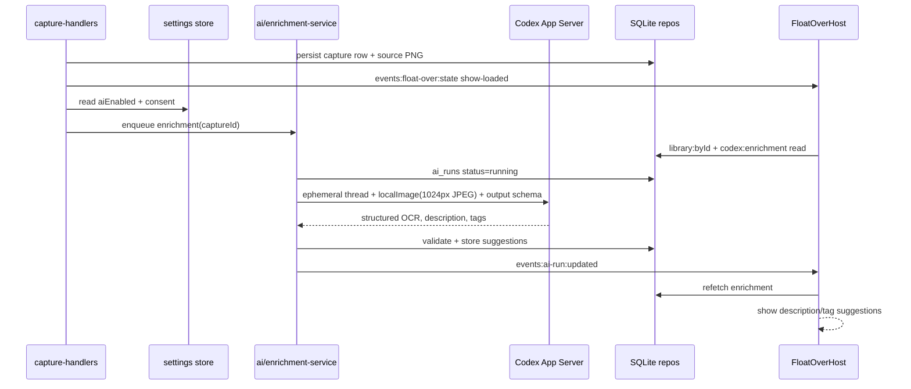
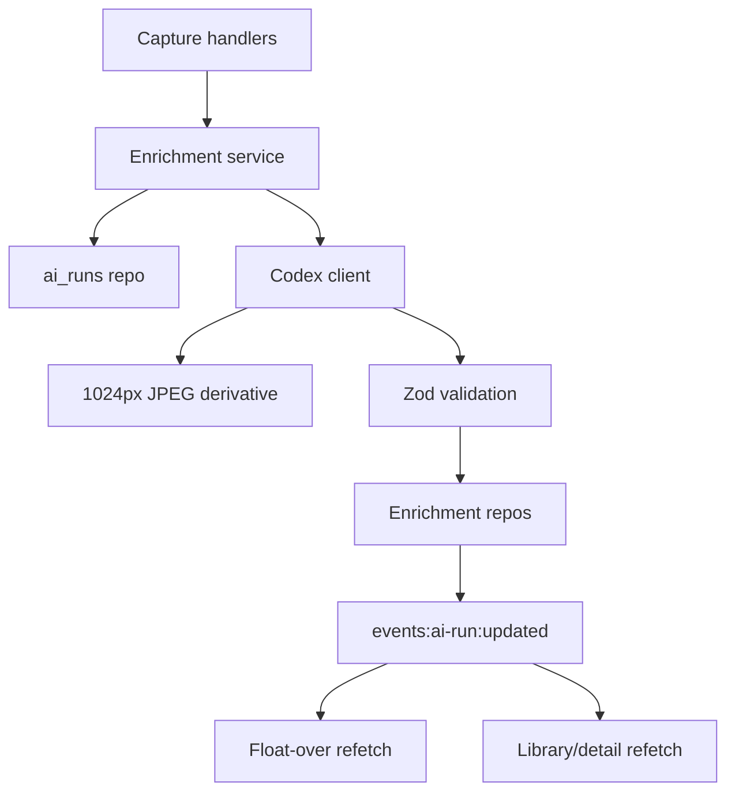

# feat: Add Codex capture enrichment

## Overview

Add a Codex App Server-backed enrichment pipeline that runs after each image capture, sends a bounded downsampled copy of the screenshot to the user's local Codex install, and stores OCR text, a suggested description, and suggested tags. The post-capture float-over should appear immediately in its current flow, show Codex reading state while enrichment is in flight, and update in place when suggestions arrive.

The implementation should preserve the existing PwrSnap invariant: every AI feature goes through Codex App Server over stdio JSON-RPC, never direct provider APIs.

## Problem Frame

Captured images become hard to search or triage unless the user manually writes a description and tags immediately. The current float-over has local-only description/tag state and mocked Codex suggestions; the Library detail rail has a Codex caption stub and OCR placeholder. PwrSnap already has the generated Codex App Server protocol package, a lifted stdio transport, discovery code, and `codex:*` command placeholders, but no high-level client or persistence for AI enrichment.

This plan narrows Phase 4 to the feature requested now: OCR + description + tag suggestions at capture time. It intentionally avoids the larger Phase 4 scope of auto-annotation overlays, sensitive-data blur gating, filename generation, long-lived chat, voice, and pHash caching except where the data model should not block those later additions.

## Requirements Trace

- R1. After each newly persisted image capture, PwrSnap starts an AI enrichment run automatically when AI is enabled and consent has been accepted.
- R2. Enrichment uses Codex App Server through the local Codex CLI / Codex Desktop binary selected by existing discovery rules.
- R3. The image sent to Codex is bounded in size so OCR remains useful without sending source-resolution screenshots.
- R4. A single enrichment run produces OCR text, one suggested description, and suggested content tags for the capture.
- R5. The float-over appears in the existing post-capture flow, shows in-flight status, and updates with the suggested description and tags when the run completes.
- R6. Suggested tags and description can be accepted or edited by the user and persisted separately from raw AI suggestions.
- R7. Failures, cancellation, missing Codex, disabled AI, or missing consent do not break capture, copy, edit, or Library browsing.
- R8. Every wire response from Codex is schema-validated before it changes persistent state.
- R9. The user has a minimal consent/settings path before any screenshot leaves PwrSnap for Codex enrichment.

## Scope Boundaries

- This plan does not implement direct OpenAI, Anthropic, xAI, or cloud OCR calls.
- This plan does not implement sensitive-data detection, blur overlays, or clipboard gating. Those remain a later Codex pipeline.
- This plan does not implement AI overlay annotation, filename suggestions, long-lived "ask Codex about this snap", voice describe, or sizzle composition.
- This plan does not hand-edit generated files under `packages/codex-app-server-protocol/src/`.
- This plan does not require delaying the float-over until enrichment completes; the user should see the toast promptly and receive suggestions asynchronously.
- This plan does not require full Library search over OCR text, though the persistence shape should make that a straightforward follow-up.

## Context & Research

### Relevant Code and Patterns

- `docs/plans/2026-05-03-001-feat-pwrsnap-feature-buildout-plan.md` defines the canonical AI direction: PwrSnap is a Codex App Server client only, and Phase 4 background pipelines use ephemeral threads with image input and structured output.
- `packages/codex-app-server-protocol/src/v2/ThreadStartParams.ts`, `TurnStartParams.ts`, `UserInput.ts`, and `ServerRequest.ts` show the local generated protocol surface for ephemeral threads, image/localImage input, output schemas, and dynamic tool calls.
- `apps/desktop/src/main/codex-app-server/json-rpc.ts` and `apps/desktop/src/main/codex-app-server/stdio-transport.ts` already provide the transport foundation for a high-level PwrSnap client.
- `apps/desktop/src/main/settings/codex-discovery.ts` already discovers Codex binaries and honors `PWRSNAP_CODEX_COMMAND`.
- `packages/shared/src/protocol.ts` already declares settings fields for `aiEnabled` and `aiConsentAcceptedAt`, an `events:ai-run:updated` event channel, and placeholder `codex:*` command-bus commands.
- `apps/desktop/src/main/handlers/capture-handlers.ts` owns the capture commit seam and calls `setFloatOverState({ kind: "show-loaded", captureId })` after persistence.
- `apps/desktop/src/renderer/src/features/float-over/FloatOverHost.tsx` keeps the float-over renderer mounted and fetches `library:byId` on `show-loaded`, making it a natural subscriber for enrichment updates.
- `apps/desktop/src/renderer/src/features/float-over/FloatOver.tsx` already has local description, tag, thinking, and Codex suggestion UI states to replace with persisted data.
- `apps/desktop/src/main/persistence/db.ts` runs numbered SQL migrations; `captures-repo.ts` and `overlays-repo.ts` keep table access behind repository modules.
- `apps/desktop/src/main/persistence/migrations/0002_overlays.sql` already reserves `source='codex'`, `ai_run_id`, and suggestion lifecycle concepts for later AI work.

### Institutional Learnings

- No `docs/solutions/` directory exists in this worktree, so there are no solution notes to carry forward.
- The root guidance is load-bearing for this plan: AI goes through Codex App Server only; command handlers return `Result`; renderers stay sandboxed; all commands route through `apps/desktop/src/main/command-bus.ts`; and popover sizing must keep the existing inline-block measurement pattern.

### External References

- No external research was used. The relevant Codex protocol facts are grounded in the committed generated package, which is the repository's local source of truth for the currently generated protocol surface.

## Key Technical Decisions

- Use one combined enrichment pipeline for OCR, description, and tags: This sends one downsampled image per capture instead of three separate turns, which directly reduces token and provider cost while keeping the first feature coherent.
- Start with a 1024px-long-edge JPEG input, stripped of metadata, quality around 75, and a hard byte cap: The canonical buildout plan already names a 1024px JPEG for AI request retention. This is the conservative first pass for token control. If implementation-time OCR testing shows small UI text is unreadable, adjust the cap upward in one place rather than changing pipeline shape.
- Persist AI suggestions separately from accepted user metadata: The user should be able to accept, edit, reject, or ignore suggestions without losing the original run record needed for debugging and future acceptance analytics.
- Treat auto-enrichment as best-effort and non-blocking: Capture, preview, copy, reveal, edit, and delete continue to work when Codex is unavailable, disabled, rate-limited, or slow.
- Use Codex `outputSchema` first and keep dynamic-tool handling compatible: The generated protocol includes `TurnStartParams.outputSchema` and dynamic tool calls. For this feature, a single JSON final output is simpler than a tool-call round trip. The high-level client should still centralize notification handling so later overlay/sensitive-scan DynamicToolCall pipelines can plug in without rewriting transport.
- Introduce a PwrSnap-specific high-level client instead of expanding transport primitives: `json-rpc.ts` and `stdio-transport.ts` stay generic; `apps/desktop/src/main/ai/codex-client.ts` owns PwrSnap-specific thread lifecycle, notification collection, timeouts, and typed enrichment requests.
- Emit events and let renderers refetch: This matches `events:captures:changed` and `useLibrary.ts`. Main sends `events:ai-run:updated` and `events:captures:changed` where accepted metadata affects visible capture rows; renderers use command-bus reads instead of receiving full mutable snapshots.
- Keep `library:list` focused and add batch enrichment reads: Do not inflate `CaptureRecord` with optional AI fields in the first pass. Add `codex:enrichment` for one capture and `codex:enrichmentsForCaptures` for list/detail surfaces so the Library can avoid N+1 IPC without changing the capture row contract.
- Ship a narrow SQLite-backed settings/consent store with this feature: `Settings` already has `aiEnabled` and `aiConsentAcceptedAt`, but the repo does not currently show registered settings handlers. Implement the minimal durable settings path needed for consent, Codex command selection, and AI enable/disable before auto-enrichment is wired.
- Do not create `ai_runs` rows for disabled or no-consent auto-enrichment: No screenshot-derived AI work has started in those states, so the correct behavior is no Codex subprocess, no temp derivative, and no run ledger row. Explicit user-invoked `codex:enrich` can return a `consent_required` or `ai_disabled` error result.

## Open Questions

### Resolved During Planning

- Should OCR, description, and tags be separate Codex turns? No. A combined pipeline is the better first implementation because it avoids sending the same screenshot multiple times and is sufficient for one post-capture suggestion surface.
- Should the float-over wait for enrichment before showing? No. The existing capture choreography is optimized to make the toast visible immediately after commit; enrichment should update it asynchronously.
- Should this feature add local OCR as a fallback? No. Local OCR would violate the "all AI goes through Codex" product direction and adds a second AI path to maintain.
- Should Library metadata ride on `library:list`? No for the first pass. Use a batch enrichment read command keyed by capture ids so `CaptureRecord` stays stable and the renderer avoids per-row IPC calls.

### Deferred to Implementation

- Exact Codex notification sequence for a completed `turn/start`: The client should be written against generated types and verified against the installed Codex binary during implementation.
- Exact OCR quality threshold for 1024px inputs: Start at 1024px long edge, then adjust the constant only if implementation testing shows unacceptable text loss.
- Exact model routing hint: Prefer a vision-capable default through Codex when available, but leave provider and final model routing to the user's Codex configuration.

## High-Level Technical Design

> *This illustrates the intended approach and is directional guidance for review, not implementation specification. The implementing agent should treat it as context, not code to reproduce.*

## Implementation Units

- [ ] **Unit 1: Add AI enrichment persistence**

**Goal:** Create durable tables and repository modules for run status, OCR text, description suggestions, tag suggestions, and accepted user metadata.

**Requirements:** R4, R6, R7, R8

**Dependencies:** None

**Files:**
- Create: `apps/desktop/src/main/persistence/migrations/0003_ai_enrichment.sql`
- Create: `apps/desktop/src/main/persistence/ai-runs-repo.ts`
- Create: `apps/desktop/src/main/persistence/enrichment-repo.ts`
- Modify: `packages/shared/src/protocol.ts`
- Test: `apps/desktop/src/main/__tests__/ai-enrichment-repo.test.ts`
- Test: `packages/shared/src/__tests__/ai-enrichment-schemas.test.ts`

**Approach:**
- Add `ai_runs` as the generic execution ledger: `id`, `capture_id`, `kind='enrich'`, status, timestamps, latency, error, Codex command/version/protocol version, prompt version, request metadata, and response JSON.
- Add enrichment-specific persisted state without overloading `captures`: OCR text, suggested description, accepted description, suggested tags, accepted tags, rejection timestamps, confidence scores, and `ai_run_id` provenance.
- Add relational `tags` and `capture_tags` if they do not already exist at implementation time. Use unique constraints on normalized labels and `(capture_id, tag_id)` to prevent duplicate chips.
- Keep image request bytes out of long-lived rows. If request metadata is stored, retain dimensions, byte size, prompt version, and the temporary preview path or redaction state, not base64 image content.
- Treat OCR and descriptions as sensitive local data. Store them only in the local SQLite database, never log their full text, and ensure capture purge cascades remove them with the source image.
- Expose shared types for `AiRunStatus`, `CaptureEnrichment`, `SuggestedTag`, and accept/reject request shapes.

**Patterns to follow:**
- `apps/desktop/src/main/persistence/migrations/0001_init.sql`
- `apps/desktop/src/main/persistence/migrations/0002_overlays.sql`
- `apps/desktop/src/main/persistence/captures-repo.ts`
- `packages/shared/src/overlay-schemas.ts`

**Test scenarios:**
- Happy path: storing a completed enrichment run with OCR, description, and three tags for a live capture returns those values from the enrichment read API.
- Happy path: accepting one suggested tag marks only that tag accepted and leaves other suggestions pending.
- Happy path: editing the suggested description before accepting stores the user-edited text while preserving the original AI suggestion and `ai_run_id`.
- Edge case: inserting the same suggested tag label twice for the same capture does not create duplicate visible chips.
- Error path: attempting to store enrichment for a deleted or missing capture fails without orphan rows.
- Error path: malformed response JSON is recorded as a failed `ai_runs` row and does not update OCR, description, or tags.
- Integration: deleting or purging a capture cascades run and enrichment rows without violating foreign keys.
- Integration: logs for completed enrichment include ids/status/latency only, not OCR text, descriptions, tag labels, or image paths beyond existing capture identifiers.

**Verification:**
- The migration applies cleanly on a fresh database and an existing Phase 2 database.
- Repository tests prove accepted metadata and raw suggestions are distinct.
- Shared schemas reject invalid statuses, empty tag labels, and overlong description/OCR payloads.

- [ ] **Unit 2: Build the Codex App Server enrichment client**

**Goal:** Implement the PwrSnap-specific high-level Codex client and image preparation pipeline for a bounded OCR/description/tag request.

**Requirements:** R2, R3, R4, R7, R8

**Dependencies:** Unit 1

**Files:**
- Create: `apps/desktop/src/main/ai/codex-client.ts`
- Create: `apps/desktop/src/main/ai/enrichment-image.ts`
- Create: `apps/desktop/src/main/ai/enrichment-schema.ts`
- Create: `apps/desktop/src/main/ai/__tests__/enrichment-image.test.ts`
- Create: `apps/desktop/src/main/ai/__tests__/enrichment-schema.test.ts`
- Modify: `apps/desktop/src/main/codex-app-server/json-rpc.ts`
- Modify: `apps/desktop/src/main/codex-app-server/stdio-transport.ts`

**Approach:**
- Build on the existing JSON-RPC and stdio transport modules; do not fold PwrSnap business logic into them.
- Prepare a temporary JPEG derivative from `CaptureRecord.src_path` with max long edge 1024px, metadata stripped, bounded quality, and a hard byte cap. Store it under the existing temp/cache root and delete it after the run unless retention settings later say otherwise.
- Start an ephemeral Codex thread, send one turn with text instructions plus a `localImage` input pointing at the derivative, and constrain the final response with a JSON schema for OCR, description, and tags.
- Validate Codex output with local Zod schemas before returning it to persistence.
- Handle timeouts, subprocess exit, unsupported image/model errors, schema mismatch, and cancellation as typed PwrSnap errors. The client should surface enough detail for `ai_runs.error` without throwing across IPC.
- Keep the client compatible with future DynamicToolCall pipelines by centralizing notification/request handling, including `item/tool/call`, even if this first enrichment path uses `outputSchema`.

**Patterns to follow:**
- `apps/desktop/src/main/codex-app-server/json-rpc.ts`
- `apps/desktop/src/main/codex-app-server/stdio-transport.ts`
- `apps/desktop/src/main/settings/codex-discovery.ts`
- `apps/desktop/src/main/render/compose.ts`

**Test scenarios:**
- Happy path: a 2880x1800 PNG produces a JPEG derivative whose long edge is 1024px and whose file size is under the configured cap.
- Happy path: a small capture below the max size is not upscaled.
- Edge case: transparent or odd-aspect images still produce a valid RGB JPEG derivative.
- Error path: source image read failure returns a typed error and leaves no temp derivative behind.
- Error path: Codex returns JSON missing required fields, and validation reports `schema_mismatch`.
- Error path: stdio transport closes mid-turn, and the run returns a retryable Codex error.
- Integration: cancelling the provided `AbortSignal` interrupts the Codex turn or closes transport and prevents a completed result from being persisted.

**Verification:**
- Image-prep tests prove the token/cost guardrail is enforced independent of source resolution.
- Client tests use a fake JSON-RPC transport to cover success, timeout, schema mismatch, and cancellation without requiring a live Codex install.

- [ ] **Unit 3: Add AI settings and consent gate**

**Goal:** Provide the minimal durable settings and consent surface required before screenshots are sent through Codex.

**Requirements:** R1, R2, R7, R9

**Dependencies:** Unit 1

**Files:**
- Create: `apps/desktop/src/main/settings/settings-store.ts`
- Create: `apps/desktop/src/main/handlers/settings-handlers.ts`
- Create: `apps/desktop/src/main/persistence/migrations/0004_settings.sql`
- Modify: `apps/desktop/src/main/index.ts`
- Modify: `packages/shared/src/protocol.ts`
- Modify: `apps/desktop/src/renderer/src/features/float-over/FloatOverHost.tsx`
- Modify: `apps/desktop/src/renderer/src/features/float-over/FloatOver.tsx`
- Test: `apps/desktop/src/main/__tests__/settings-handlers.test.ts`

**Approach:**
- Implement `settings:read` and `settings:write` against a small SQLite-backed settings table, using the existing `Settings` shape from `packages/shared/src/protocol.ts`.
- Keep defaults privacy-preserving: `aiEnabled` false and `aiConsentAcceptedAt` null on fresh install.
- Support Codex command selection through the existing `codexCommand` field and `apps/desktop/src/main/settings/codex-discovery.ts`; auto-discovery can still select newest when no explicit path is set.
- Add a minimal consent affordance in the float-over's AI strip on the first eligible capture. It should have three states: not asked, accepted, and declined/not now. The copy should state that PwrSnap sends a downsampled screenshot to the user's local Codex install, and Codex may route to the user's configured provider.
- Make consent acceptance an explicit settings write. Until accepted, auto-enrichment does not enqueue, does not create an `ai_runs` row, and must not spawn Codex.

**Patterns to follow:**
- `packages/shared/src/protocol.ts`
- `apps/desktop/src/main/settings/codex-discovery.ts`
- `apps/desktop/src/main/handlers/library-handlers.ts`
- `apps/desktop/src/renderer/src/features/float-over/FloatOver.tsx`

**Test scenarios:**
- Happy path: fresh settings read returns AI disabled with no consent timestamp.
- Happy path: accepting consent persists `aiConsentAcceptedAt` and enabling AI persists `aiEnabled`.
- Happy path: configured Codex command round-trips through `settings:write` and `settings:read`.
- Edge case: partial settings patch updates one field without clearing omitted fields.
- Error path: malformed settings file or row falls back to safe defaults and reports a typed settings error.
- Integration: no-consent float-over state renders an enable/consent affordance without blocking copy/edit/dismiss.

**Verification:**
- Settings handlers are registered at bootstrap and callable through the existing command bus.
- Tests prove consent is explicit and defaults cannot accidentally enable AI.

- [ ] **Unit 4: Orchestrate enrichment from capture commit**

**Goal:** Start enrichment automatically for new captures, apply settings/consent gates, update run status, and broadcast state changes to renderers.

**Requirements:** R1, R5, R7

**Dependencies:** Unit 1, Unit 2, Unit 3

**Files:**
- Create: `apps/desktop/src/main/ai/enrichment-service.ts`
- Create: `apps/desktop/src/main/handlers/codex-handlers.ts`
- Modify: `apps/desktop/src/main/handlers/capture-handlers.ts`
- Modify: `apps/desktop/src/main/handlers/library-handlers.ts`
- Modify: `apps/desktop/src/main/index.ts`
- Modify: `packages/shared/src/ipc.ts`
- Modify: `packages/shared/src/protocol.ts`
- Test: `apps/desktop/src/main/__tests__/enrichment-service.test.ts`

**Approach:**
- Register command-bus handlers for `codex:enrich`, `codex:enrichment`, `codex:enrichmentsForCaptures`, `codex:acceptDescription`, `codex:acceptTag`, `codex:rejectTag`, and `codex:cancel`.
- Enqueue enrichment only when `insertOrFindCapture` returns a new image capture. Dedup hits should reuse existing metadata rather than re-running Codex.
- Respect `settings.aiEnabled` and `settings.aiConsentAcceptedAt` from Unit 3 before doing any image preparation or Codex process work.
- Apply a short post-capture debounce and a low concurrency cap so rapid capture bursts do not spawn unlimited Codex subprocesses.
- Key cancellation by `captureId` using the command bus's cancellation model; capture delete, purge, or explicit cancel should prevent later writes.
- Broadcast `events:ai-run:updated` with lightweight identifiers, not full OCR payloads. Renderers refetch via command-bus reads.
- Preserve the existing order in `capture:interactive`: persist capture, populate float-over, then enqueue enrichment. Enrichment must not block `setFloatOverState`.

**Patterns to follow:**
- `apps/desktop/src/main/handlers/capture-handlers.ts`
- `apps/desktop/src/main/handlers/overlays-handlers.ts`
- `apps/desktop/src/main/handlers/library-handlers.ts`
- `apps/desktop/src/main/command-bus.ts`

**Test scenarios:**
- Happy path: new capture with AI enabled and consent accepted enqueues exactly one enrichment run and broadcasts running then completed updates.
- Happy path: duplicate capture by SHA-256 does not enqueue a second Codex call.
- Edge case: rapid sequence of five captures respects the configured concurrency cap while all eligible captures eventually complete or queue.
- Error path: AI disabled causes auto-enrichment to no-op without spawning Codex or creating a run row; explicit `codex:enrich` returns a typed disabled error.
- Error path: consent missing causes auto-enrichment to no-op without spawning Codex or creating a run row; explicit `codex:enrich` returns a typed consent-required error.
- Error path: capture deleted while enrichment is running marks the run cancelled and does not store suggestions.
- Integration: `capture:interactive` still emits `show-loaded` before enrichment completes, so the float-over can render immediately.

**Verification:**
- Unit tests use fake repositories and a fake Codex client to prove gating, queueing, event emission, and cancellation.
- Main bootstrap registers the new handlers exactly once with the existing command bus.

- [ ] **Unit 5: Wire float-over suggestions and acceptance**

**Goal:** Replace mocked float-over AI state with live enrichment status, suggested description, suggested tags, and persistence-backed accept/edit behavior.

**Requirements:** R5, R6, R7

**Dependencies:** Unit 1, Unit 3, Unit 4

**Files:**
- Modify: `apps/desktop/src/renderer/src/features/float-over/FloatOverHost.tsx`
- Modify: `apps/desktop/src/renderer/src/features/float-over/FloatOver.tsx`
- Modify: `apps/desktop/src/renderer/src/styles/float-over.css`
- Modify: `apps/desktop/src/renderer/src/preload-types.d.ts`
- Test: `apps/desktop/src/renderer/src/features/float-over/__tests__/FloatOverHost.test.tsx`

**Approach:**
- `FloatOverHost` should fetch capture data and enrichment data when a capture loads, then subscribe to `events:ai-run:updated` for that capture and refetch enrichment when it changes.
- `FloatOver` should receive controlled props for description text, accepted tags, pending suggested tags, AI status, and callbacks for accept/edit/reject.
- Keep the current "Codex is reading the snap" thinking treatment for in-flight runs. When AI is disabled, consent is missing, or a run fails, avoid noisy error copy in the toast; provide a small retry, enable, or settings affordance only if the status is actionable.
- Accepting the description writes either the AI suggestion or the user's edited text through command-bus. Accepting a tag persists it and removes the dashed suggestion state.
- User typing pauses auto-dismiss as it does today. Incoming AI suggestions must not overwrite user-typed text once the user has started editing the description.
- Do not disturb the inline-block wrapper measurement in `FloatOverHost`; AI state changes should rely on the existing ResizeObserver and `float-over:resize` path.

**Patterns to follow:**
- `apps/desktop/src/renderer/src/features/float-over/FloatOverHost.tsx`
- `apps/desktop/src/renderer/src/features/float-over/FloatOver.tsx`
- `packages/shared/src/ipc.ts`
- `apps/desktop/src/renderer/src/lib/pwrsnap.ts`

**Test scenarios:**
- Happy path: loaded capture enters running state and renders "Codex is reading" without delaying copy buttons.
- Happy path: completed enrichment displays the suggested description and two suggested tag chips.
- Happy path: clicking a suggested tag persists it and removes it from pending suggestions.
- Happy path: editing the description then clicking Use persists the edited text, not the original suggestion.
- Edge case: a completed enrichment event for a previous capture does not update the currently visible toast.
- Edge case: user has typed a description before Codex completes; incoming suggestion does not clobber the user's draft.
- Error path: failed enrichment leaves copy/edit/dismiss controls usable and shows no broken placeholder.
- Error path: missing consent shows the consent affordance and does not display a fake Codex failure.
- Integration: AI state changes cause the popover to remeasure without reverting to fixed heights.

**Verification:**
- Renderer tests prove stale events and user-edit races are handled.
- Manual smoke: capture an image, see the toast immediately, watch AI status update, accept a tag, dismiss, reopen Library, and see accepted metadata persisted.

- [ ] **Unit 6: Surface enrichment in Library and detail rail**

**Goal:** Make accepted tags, accepted/suggested description, and OCR available outside the transient float-over.

**Requirements:** R4, R6, R7

**Dependencies:** Unit 1, Unit 4

**Files:**
- Modify: `apps/desktop/src/main/handlers/library-handlers.ts`
- Modify: `apps/desktop/src/renderer/src/lib/useLibrary.ts`
- Modify: `apps/desktop/src/renderer/src/features/library/adapter.ts`
- Modify: `apps/desktop/src/renderer/src/features/library/Library.tsx`
- Modify: `apps/desktop/src/renderer/src/features/library/DetailRail.tsx`
- Modify: `apps/desktop/src/renderer/src/styles/library.css`
- Test: `apps/desktop/src/renderer/src/features/library/__tests__/adapter.test.ts`
- Test: `apps/desktop/src/renderer/src/features/library/__tests__/library-view.test.ts`

**Approach:**
- Keep `library:list` returning capture records. After `useLibrary` receives visible captures, call `codex:enrichmentsForCaptures` with the visible ids to fetch accepted tags and compact enrichment status in one command-bus round trip.
- Use `codex:enrichment` for the selected detail rail capture so full OCR text is loaded only when needed.
- Show accepted tags in grid cells and the detail rail. Keep pending AI suggestions visually distinct where they appear.
- Replace the static "Codex caption" stub in `DetailRail.tsx` with real accepted/suggested description state and a status indicator.
- Populate the OCR tab or placeholder area with stored OCR text for selected captures. Keep long OCR text scrollable and out of the grid.
- Search over OCR can remain a follow-up, but do not choose a schema that prevents adding an indexed OCR query later.

**Patterns to follow:**
- `apps/desktop/src/renderer/src/lib/useLibrary.ts`
- `apps/desktop/src/renderer/src/features/library/DetailRail.tsx`
- `apps/desktop/src/renderer/src/features/library/adapter.ts`
- `apps/desktop/src/renderer/src/styles/library.css`

**Test scenarios:**
- Happy path: accepted tags from persistence appear on the capture grid cell.
- Happy path: Library fetches enrichment summaries for visible captures in one batch command, not one command per row.
- Happy path: selected capture detail rail shows accepted description and OCR text.
- Happy path: capture with pending suggestions but no accepted tags does not render pending tags as ordinary accepted tags in the grid.
- Edge case: no enrichment row renders the existing neutral Codex-not-run state.
- Error path: enrichment read failure leaves the detail rail usable and does not crash Library.
- Integration: accepting a tag from the float-over triggers a Library refresh via events and updates visible metadata.

**Verification:**
- Renderer tests cover adapter mapping and selected-record detail rendering.
- Manual smoke confirms grid, focus/detail rail, and float-over agree on accepted metadata after refresh.

- [ ] **Unit 7: Add privacy, failure, and lifecycle verification**

**Goal:** Lock down the high-risk paths: consent silence, no direct provider calls, bounded image inputs, cancellation, and non-blocking UX.

**Requirements:** R1, R2, R3, R7, R8, R9

**Dependencies:** Units 1-6

**Files:**
- Create: `apps/desktop/src/main/__tests__/codex-consent-gate.test.ts`
- Create: `apps/desktop/src/main/__tests__/codex-capture-lifecycle.test.ts`
- Create: `apps/desktop/e2e/codex-enrichment.spec.ts`
- Modify: `apps/desktop/src/main/index.ts`
- Modify: `docs/plans/2026-05-03-001-feat-pwrsnap-feature-buildout-plan.md` only if implementation discovers this focused plan supersedes a stale Phase 4 detail

**Approach:**
- Add tests or fakes around `child_process.spawn` so "AI disabled" and "no consent" prove zero Codex subprocess launches.
- Verify the high-level client uses only the selected Codex command and local stdio transport; there should be no direct provider SDKs or HTTP clients in `apps/desktop/src/main/ai/`.
- Exercise capture/delete/cancel lifecycle with a delayed fake client to prove stale Codex results do not write to deleted captures.
- Add one E2E-style path with a fake Codex transport: capture fixture image, see float-over running state, complete fake enrichment, accept tag/description, verify Library reflects it.
- Document any implementation-time adjustment to the image size constant if OCR quality forces a change from the 1024px starting point.

**Patterns to follow:**
- `apps/desktop/src/main/__tests__/overlay-hash.test.ts`
- `apps/desktop/src/renderer/src/features/library/__tests__/library-view.test.ts`
- `apps/desktop/e2e/fixtures/electron-app.ts`

**Test scenarios:**
- Happy path: with fake Codex enabled and consent accepted, a capture completes enrichment and persists OCR, description, and tag suggestions.
- Happy path: accepting suggestions persists accepted metadata and refreshes both float-over and Library.
- Edge case: AI disabled across five captures produces no Codex subprocess launch and no failed-user-visible noise.
- Edge case: missing consent across five captures produces no Codex subprocess launch and no network/provider access.
- Error path: fake Codex timeout marks run failed and leaves capture/copy/edit working.
- Error path: capture purge during delayed fake Codex run prevents result persistence.
- Integration: downsampled derivative size is bounded for large retina screenshots before the fake Codex client receives it.

**Verification:**
- Automated coverage proves privacy and lifecycle invariants.
- Manual smoke confirms the feature remains useful if Codex is missing: capture and copy still work, with an actionable AI unavailable state rather than a broken toast.

## System-Wide Impact

- **Interaction graph:** `capture:interactive` and `capture:region` persist a capture, show/broadcast normal capture state, enqueue enrichment, and later broadcast `events:ai-run:updated`. Float-over and Library refetch enrichment state through command-bus reads.
- **Error propagation:** Codex failures stay in `ai_runs` and user-facing AI status. They do not propagate as capture failures unless the user explicitly invokes a Codex retry command and needs that command result.
- **State lifecycle risks:** The main risks are stale completion after capture deletion, duplicate enrichment on SHA dedup, user edits racing incoming AI suggestions, and temp JPEG cleanup. Each unit includes coverage for those cases.
- **API surface parity:** Renderer access goes through the existing command bus. Future HTTP RPC and MCP transports inherit the same `codex:*` handlers once those transports exist.
- **Integration coverage:** Unit tests with fake Codex clients cover deterministic states; one E2E-style flow should verify the renderer event/refetch path.
- **Unchanged invariants:** Renderers remain sandboxed; no image bytes cross IPC; source PNGs remain immutable; `packages/codex-app-server-protocol/src/` remains generator output; command-bus remains the only command registration point.

## Risks & Dependencies

| Risk | Mitigation |
|------|------------|
| OCR quality is poor at 1024px long edge | Keep the size cap in one image-prep module, add test coverage for the actual derivative dimensions, and adjust after implementation-time OCR smoke if needed. |
| Codex protocol behavior differs from generated type expectations | Isolate all protocol handling in `codex-client.ts`, use fake-transport tests, and verify with the locally installed Codex binary during implementation. |
| User text gets overwritten by late AI suggestions | Float-over tracks dirty user edits and treats incoming suggestions as suggestions only, never as forced textarea values after user input. |
| AI disabled or missing consent still launches Codex | Add explicit spawn/network silence tests around the gate. |
| OCR text stores sensitive screen content | Keep OCR local, never log full OCR/description/tag content, cascade-delete on capture purge, and defer export/search exposure until those surfaces have their own privacy review. |
| Duplicate captures produce duplicate suggestions | Enqueue only when the capture insert path reports `isNew`; dedup hits reuse persisted data. |
| Deleted captures receive late AI writes | Re-check capture liveness in the same transaction that stores completed enrichment. |
| Scope drifts into all of Phase 4 | Keep sensitive scan, overlay annotation, filenames, chat, voice, and pHash cache out of this plan except for schema-compatible foundations. |

## Documentation / Operational Notes

- Settings and consent copy should explain that PwrSnap sends the downsampled screenshot to the user's local Codex install, and Codex may route it according to the user's Codex provider configuration.
- The AI run ledger should be user-visible in a later settings/history surface, but this plan only needs enough persistence for debugging and support.
- If implementation changes the 1024px image cap, update this plan or the canonical buildout plan so future agents do not rediscover the token/cost tradeoff.

## Sources & References

- Related plan: `docs/plans/2026-05-03-001-feat-pwrsnap-feature-buildout-plan.md`
- Related plan: `docs/plans/2026-05-04-001-fix-capture-flow-window-choreography-plan.md`
- Related plan: `docs/plans/2026-05-05-001-feat-library-three-state-view-model-plan.md`
- Codex protocol package: `packages/codex-app-server-protocol/src/v2/`
- Shared command/event contracts: `packages/shared/src/protocol.ts`, `packages/shared/src/ipc.ts`
- Codex stdio foundation: `apps/desktop/src/main/codex-app-server/json-rpc.ts`, `apps/desktop/src/main/codex-app-server/stdio-transport.ts`
- Codex discovery: `apps/desktop/src/main/settings/codex-discovery.ts`
- Capture seam: `apps/desktop/src/main/handlers/capture-handlers.ts`
- Float-over renderer: `apps/desktop/src/renderer/src/features/float-over/FloatOverHost.tsx`, `apps/desktop/src/renderer/src/features/float-over/FloatOver.tsx`
- Library detail surface: `apps/desktop/src/renderer/src/features/library/DetailRail.tsx`
