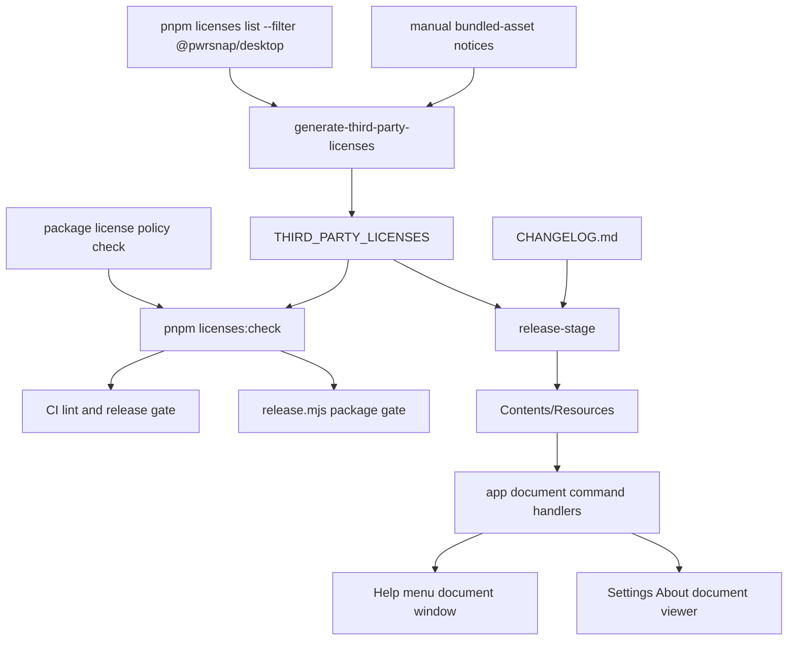

# Third-party License Notices and Help Documents

## Summary

Add a PwrAgnt-style license compliance workflow to PwrSnap: generated third-party notices, CI/release freshness checks, packaged notice resources, and user-visible Help/About entry points for the changelog and third-party licenses. The implementation should preserve PwrSnap's proprietary desktop licensing while explicitly handling the existing MIT public package exception.

---

## Problem Frame

PwrSnap now self-hosts Geist font assets and ships npm production dependencies inside the desktop app, but it does not ship a user-viewable third-party notices file. `CHANGELOG.md` already exists and release metadata checks require it, but the packaged app does not expose it through the Help menu the way PwrAgnt does.

The compliance gap is broader than Geist: every packaged desktop release should carry current notices for shipped dependencies and bundled assets, and the release pipeline should fail before publication when those notices drift.

---

## Requirements

- R1. Generate a root `THIRD_PARTY_LICENSES` file from the production dependency graph for `@pwrsnap/desktop`, including the Electron runtime package.
- R2. Include notices for bundled non-npm distributable assets, starting with the self-hosted Geist font files emitted by the renderer build.
- R3. Add a license policy check that preserves PwrSnap's intended first-party license split: desktop/internal workspace packages remain `UNLICENSED`, while the public `packages/pwrsnap` placeholder package remains MIT unless product policy changes.
- R4. Fail CI and release/package runs when package license policy or generated third-party notices are stale.
- R5. Ship `THIRD_PARTY_LICENSES` and `CHANGELOG.md` with packaged macOS builds as user-viewable resources outside `app.asar`.
- R6. Add Help menu items for Changelog and Third-party Licenses, using the same app document surface as Settings/About instead of raw filesystem reveals.
- R7. Extend Settings -> About so users can view bundled third-party licenses and open the changelog from inside the app.
- R8. Keep all renderer-facing document access behind PwrSnap's command bus and Result-pattern IPC boundary.
- R9. Add focused tests for generator behavior, package policy, command handlers, renderer document routing, About actions, and packaged resource inclusion.

---

## Scope Boundaries

- This plan does not create or revise PwrSnap's proprietary end-user license/EULA. About continues to state the current `UNLICENSED` product posture.
- This plan does not append Chromium's large generated credits HTML into `THIRD_PARTY_LICENSES`; it should mirror PwrAgnt's approach by referencing Electron/Chromium's packaged upstream credits separately.
- This plan does not audit Codex App Server's Rust dependency tree; PwrSnap invokes the user's installed Codex distribution and does not vendor those Rust crates.
- This plan does not implement a legal approval workflow. It adds engineering controls and user-visible notices, with final legal review still available before release.
- Build-time-only assets that are not distributed as font/software files in the final app, such as a font used only to render the DMG background image, do not need to appear as shipped app notices unless implementation finds they are copied into the packaged app.

### Deferred to Follow-Up Work

- A richer open-source acknowledgements screen with search/filtering can follow later if the plain document viewer becomes unwieldy.
- An SBOM or vulnerability-audit workflow is adjacent but separate from license notice generation.
- Notarized-release inspection for every installer artifact can be expanded later beyond the resource-presence checks in this plan.

---

## Context & Research

### Relevant Code and Patterns

- PwrAgnt pattern source. Paths in this subsection are repo-relative to the PwrAgnt checkout the user named:
  - `THIRD_PARTY_LICENSES`
  - `scripts/generate-third-party-licenses.mjs`
  - `scripts/check-package-licenses.mjs`
  - `apps/desktop/electron-builder.yml`
  - `apps/desktop/scripts/release.mjs`
  - `apps/desktop/src/main/changelog-window.ts`
  - `apps/desktop/src/main/ipc/app-metadata.ts`
  - `apps/desktop/src/renderer/src/features/settings/AboutSettings.tsx`
- PwrSnap release/package surfaces to extend:
  - `package.json`
  - `scripts/check-desktop-release-metadata.mjs`
  - `.github/workflows/ci.yml`
  - `.github/workflows/release.yml`
  - `.github/workflows/preview-build.yml`
  - `apps/desktop/electron-builder.yml`
  - `apps/desktop/scripts/release.mjs`
  - `apps/desktop/scripts/verify-asar-contents.mjs`
- PwrSnap app surfaces to extend:
  - `packages/shared/src/protocol.ts`
  - `apps/desktop/src/main/handlers/app-handlers.ts`
  - `apps/desktop/src/main/index.ts`
  - `apps/desktop/src/main/window.ts`
  - `apps/desktop/src/renderer/src/App.tsx`
  - `apps/desktop/src/renderer/src/features/settings/pages/AboutPage.tsx`
  - `apps/desktop/src/renderer/src/lib/pwrsnap.ts`
- Current dependency evidence: `pnpm licenses list --json --filter @pwrsnap/desktop --prod` already reports `@fontsource/geist-sans` and `@fontsource/geist-mono` under `OFL-1.1`, plus production npm dependencies under their declared licenses.

### Institutional Learnings

- `docs/solutions/2026-05-12-settings-substrate.md` documents that renderer actions must go through command-bus handlers and typed shared protocol entries; new app document reads should follow that pattern rather than adding one-off preload methods.
- `docs/plans/2026-05-04-002-feat-release-infrastructure-dmg-signing-plan.md` established that `release.mjs` owns staging resources for electron-builder and that post-build verification should catch packaging regressions loudly.
- `AGENTS.md` marks `UNLICENSED` as load-bearing for the closed-source desktop app and warns against removing license disclosures without explicit policy direction.

### External References

- SIL's OFL FAQ states OFL fonts can be bundled with commercial applications, with license/copyright notice obligations.
- Google Open Source's third-party license guidance describes bundled notice files as an accepted way to provide viewable notices.
- PwrAgnt's generated notices intentionally include Electron's MIT runtime license and reference Chromium's upstream generated credits rather than embedding an enormous Chromium credits file.

---

## Key Technical Decisions

- Generate notices from `pnpm licenses list` rather than hand-writing a Geist-only notice: this fixes the immediate font concern and prevents future dependencies from silently expanding the compliance gap.
- Keep `THIRD_PARTY_LICENSES` at the repo root: PwrAgnt uses that path, release staging can copy it easily, and reviewers can diff changes when dependencies move.
- Treat non-npm bundled assets as explicit manual entries in the generator: `pnpm licenses list` sees package dependencies, but not arbitrary vendored/bundled assets. The first manual entry should cover Geist font software if the generated npm package license text alone is not sufficient for emitted renderer font files.
- Distinguish shipped font software from build-time rendered output: renderer-emitted `.woff`/`.woff2` files need notices; a generated PNG that contains text rendered with a font does not distribute the font software itself.
- Add a PwrSnap-specific package license policy script instead of copying PwrAgnt's all-MIT check: PwrSnap intentionally has `UNLICENSED` desktop/internal packages and an MIT public placeholder package.
- Serve app documents through command-bus verbs: this preserves PwrSnap's single-command-bus invariant and keeps future HTTP/MCP transports able to expose the same metadata if needed.
- Use a shared document window route for changelog and license notices: one sandboxed BrowserWindow and renderer document component avoids two bespoke windows and keeps Help/About behavior consistent.
- Ship notices and changelog as `extraResources`, not inside `app.asar`: they remain directly user-viewable under `Contents/Resources`, while the renderer can still read them through main-process document commands.

---

## Open Questions

### Resolved During Planning

- Should this be a minimum Geist-only fix or a fuller compliance system? The user chose the broader route, including dependency scanning/generation where appropriate.
- Should PwrAgnt be treated as authoritative input? Yes. Its generator/check/release/About patterns are the local precedent, adapted for PwrSnap's different package license policy and command-bus architecture.

### Deferred to Implementation

- Exact manual notice text for Geist: use the installed package license files as source material during implementation, then verify the generated output includes the relevant copyright and OFL text.
- Exact renderer markdown/plaintext rendering component: implementation can choose a minimal `<pre>` viewer or reuse/introduce a small markdown renderer depending on what fits the existing CSS without adding unnecessary dependencies.
- Whether packaged Electron already carries `LICENSES.chromium.html` in the final app bundle: implementation should inspect the built `.app` before deciding whether to add a direct resource-presence assertion or just retain the explanatory reference in `THIRD_PARTY_LICENSES`.

---

## High-Level Technical Design

> *This illustrates the intended approach and is directional guidance for review, not implementation specification. The implementing agent should treat it as context, not code to reproduce.*

---

## Implementation Units

### U1. License Generator and Package Policy

**Goal:** Create a PwrSnap-specific license generation/check workflow that produces `THIRD_PARTY_LICENSES` and enforces first-party package license policy.

**Requirements:** R1, R2, R3, R4, R9

**Dependencies:** None

**Files:**
- Create: `scripts/generate-third-party-licenses.mjs`
- Create: `scripts/check-package-license-policy.mjs`
- Create: `THIRD_PARTY_LICENSES`
- Create: `scripts/__tests__/third-party-licenses.test.mjs`
- Modify: `package.json`
- Modify: `vitest.workspace.ts`

**Approach:**
- Port PwrAgnt's generator shape: read `pnpm licenses list --json --filter @pwrsnap/desktop --prod`, flatten records, enrich from installed package `package.json`, find license files, group duplicate license texts by hash, and emit a deterministic notice file.
- Include Electron from the all-dependencies report, matching PwrAgnt's explicit runtime inclusion.
- Add a small manual-notice section/source list for bundled assets that are not reliably represented by npm dependency license files. Geist should be covered either by the `@fontsource` records or by an explicit manual asset section if implementation finds the emitted font binaries need clearer attribution.
- Add `--check` behavior that compares generated output to the committed `THIRD_PARTY_LICENSES` and exits non-zero on drift.
- Add a package policy script that walks repo `package.json` files while skipping generated/build/dependency directories. The expected policy is:
  - root `package.json`: `UNLICENSED`
  - `apps/desktop/package.json`: `UNLICENSED`
  - `packages/shared/package.json`: `UNLICENSED`
  - `packages/codex-app-server-protocol/package.json`: `UNLICENSED`
  - `packages/pwrsnap/package.json`: `MIT`
- Add root scripts: `licenses:generate` and `licenses:check`, and include `licenses:check` in `lint`.
- Extend Vitest config to include root script tests, or place tests where the existing desktop-main project includes them. Keep the final location consistent with the chosen script/module layout.

**Execution note:** Implement the generator with deterministic pure helpers first, then add the CLI wrapper. That keeps sorting/grouping/manual-notice behavior testable without spawning `pnpm` in unit tests.

**Patterns to follow:**
- PwrAgnt `scripts/generate-third-party-licenses.mjs`
- PwrAgnt `scripts/check-package-licenses.mjs`
- PwrSnap `scripts/check-desktop-release-metadata.mjs`

**Test scenarios:**
- Happy path: given a fixture `pnpm licenses` report with two packages sharing the same license text, generator output groups the text once and lists both packages under "Applies to".
- Happy path: given `@fontsource/geist-sans` and `@fontsource/geist-mono` fixture records, output includes `OFL-1.1` in the dependency summary and includes the relevant OFL license text.
- Happy path: `--check` exits success when the committed file content matches generated output.
- Error path: `--check` exits non-zero and prints an actionable "run licenses:generate" message when output differs.
- Edge case: package without a license file but declaring MIT gets the fallback MIT text with a deterministic copyright holder.
- Edge case: package without a license file and non-MIT declared license emits a clear placeholder warning instead of silently omitting notice text.
- Error path: package policy check fails when a desktop/internal package declares a license other than `UNLICENSED`.
- Happy path: package policy check allows `packages/pwrsnap/package.json` to remain MIT.

**Verification:**
- `pnpm licenses:generate` creates deterministic output.
- `pnpm licenses:check` passes immediately after generation and fails after a deliberate fixture/package-policy mismatch.
- `pnpm lint` includes the license check.

---

### U2. Release and Packaging Integration

**Goal:** Ensure notices and changelog are shipped in packaged builds and release/package runs fail before publication when notices drift.

**Requirements:** R4, R5, R9

**Dependencies:** U1

**Files:**
- Modify: `apps/desktop/electron-builder.yml`
- Modify: `apps/desktop/scripts/release.mjs`
- Modify: `apps/desktop/scripts/verify-asar-contents.mjs`
- Modify: `.github/workflows/ci.yml`
- Modify: `.github/workflows/release.yml`
- Modify: `.github/workflows/preview-build.yml`
- Test: `apps/desktop/scripts/verify-asar-contents.test.mjs`

**Approach:**
- Add `THIRD_PARTY_LICENSES` and `CHANGELOG.md` to `extraResources` so they land in `Contents/Resources`.
- In `release.mjs`, run `pnpm licenses:check` before `electron-vite build`, matching PwrAgnt's early "license notices check" release step.
- Copy `THIRD_PARTY_LICENSES` and `CHANGELOG.md` from repo root into `release-stage` alongside `electron-builder.yml` before invoking electron-builder.
- Extend packaged verification to assert the expected resource files exist in the built `.app` and are not accidentally inside `app.asar` only.
- Keep `CHANGELOG.md` excluded from ASAR content; the current ASAR verifier's markdown ban should remain valid because the changelog is an external resource.
- Ensure CI gets the license check through `pnpm lint`; preview and release workflows also get it through `release.mjs`.

**Patterns to follow:**
- PwrAgnt `apps/desktop/electron-builder.yml` `extraResources`
- PwrAgnt `apps/desktop/scripts/release.mjs` license check and stage-copy steps
- PwrSnap `apps/desktop/scripts/release.mjs` staged native sidecar flow

**Test scenarios:**
- Happy path: ASAR verification passes when `THIRD_PARTY_LICENSES` and `CHANGELOG.md` are present under a fake app `Contents/Resources` directory and absent from `app.asar`.
- Error path: packaged resource verification fails with a clear message when `THIRD_PARTY_LICENSES` is missing.
- Error path: packaged resource verification fails with a clear message when `CHANGELOG.md` is missing.
- Integration: release script ordering runs the license check before build/package steps, so a stale notice blocks both preview and real release packaging.

**Verification:**
- Packaged dry run produces a `.app` whose `Contents/Resources` contains `THIRD_PARTY_LICENSES` and `CHANGELOG.md`.
- Existing ASAR leakage checks still reject markdown/docs inside `app.asar`.

---

### U3. App Document Command Handlers

**Goal:** Add typed command-bus verbs for reading and opening app documents, with robust dev/packaged path resolution.

**Requirements:** R6, R7, R8, R9

**Dependencies:** U2 for final packaged paths; can develop against repo-root fallbacks before packaging lands.

**Files:**
- Modify: `packages/shared/src/protocol.ts`
- Modify: `apps/desktop/src/main/handlers/app-handlers.ts`
- Create: `apps/desktop/src/main/app-documents.ts`
- Test: `apps/desktop/src/main/handlers/__tests__/app-handlers.test.ts`

**Approach:**
- Add shared types for app document kind and document payload. Expected kinds: `changelog` and `third-party-licenses`.
- Add command entries:
  - `app:readDocument` with `{ kind }` -> `{ kind, title, content }`
  - `app:openDocumentWindow` with `{ kind }` -> `void`
- Implement a resolver that checks packaged `process.resourcesPath`, app-relative paths, and repo-root/dev paths. The resolver should be deterministic and easy to test by injecting candidate roots or helper functions.
- Return Result-pattern errors for unknown kinds, missing files, and read failures. Do not throw across IPC.
- Keep `app:version` intact and colocated with these app-level handlers.

**Patterns to follow:**
- PwrSnap `apps/desktop/src/main/handlers/app-handlers.ts`
- PwrSnap `apps/desktop/src/main/settings/*` Result-pattern handlers
- PwrAgnt `apps/desktop/src/main/ipc/app-metadata.ts` document path fallback strategy

**Test scenarios:**
- Happy path: reading `changelog` returns title `Changelog` and the file contents from a test fixture path.
- Happy path: reading `third-party-licenses` returns title `Third-Party Licenses` and the notice file contents.
- Error path: unknown document kind returns a validation Result error.
- Error path: missing document file returns a not-found/internal Result error with the attempted kind in the message.
- Integration: command handlers register `app:version`, `app:readDocument`, and `app:openDocumentWindow` without duplicate registration.

**Verification:**
- Renderer calls to the new commands receive typed Result envelopes.
- Existing About version loading still works through `app:version`.

---

### U4. Shared Document Window and Help Menu Entries

**Goal:** Add app-visible Help menu items for Changelog and Third-party Licenses, both opening a sandboxed document window.

**Requirements:** R5, R6, R8, R9

**Dependencies:** U3

**Files:**
- Modify: `apps/desktop/src/main/index.ts`
- Modify: `apps/desktop/src/main/window.ts`
- Modify: `apps/desktop/src/renderer/src/App.tsx`
- Create: `apps/desktop/src/renderer/src/features/documents/AppDocumentWindow.tsx`
- Modify: `apps/desktop/src/renderer/src/styles/app.css` or create `apps/desktop/src/renderer/src/styles/documents.css`
- Test: `apps/desktop/src/renderer/src/features/documents/__tests__/AppDocumentWindow.test.tsx`
- Test: `apps/desktop/e2e/help-documents.spec.ts`

**Approach:**
- Add an app-document BrowserWindow helper modeled on `createSettingsWindow`: fixed usable size, `contextIsolation: true`, `sandbox: true`, `nodeIntegration: false`, and an explicit `stage=document&kind=<kind>` hash.
- Track document windows by kind so repeated Help menu clicks focus existing windows instead of spawning duplicates.
- Add Help menu items:
  - `Changelog`
  - `Third-party Licenses`
  - keep existing `About PwrSnap` and `Visit Website`.
- Have menu clicks dispatch `app:openDocumentWindow` through the command bus so the menu path exercises the same app command as renderer buttons.
- Extend `App.tsx` stage parsing for `document`, parse the document kind from the hash, and render `AppDocumentWindow`.
- Render changelog as readable markdown if a local renderer already exists or can be added cheaply; render third-party notices in a monospace/preformatted body so license text formatting is preserved.

**Patterns to follow:**
- PwrAgnt `apps/desktop/src/main/changelog-window.ts`
- PwrAgnt `apps/desktop/src/renderer/src/features/changelog/ChangelogWindow.tsx`
- PwrSnap `createSettingsWindow` in `apps/desktop/src/main/window.ts`
- PwrSnap `App.tsx` stage routing

**Test scenarios:**
- Happy path: document window component dispatches `app:readDocument` with kind `changelog` and renders returned content.
- Happy path: document window component dispatches `app:readDocument` with kind `third-party-licenses` and preserves notice text in a readable document body.
- Error path: read failure renders an inline error instead of a blank window.
- Edge case: missing/invalid document kind renders an error state and does not dispatch an unknown command repeatedly.
- Integration: Help menu contains Changelog and Third-party Licenses items.
- Integration: selecting each Help item opens or focuses the matching document window.

**Verification:**
- Help -> Changelog opens the changelog document.
- Help -> Third-party Licenses opens the generated notices.
- Re-clicking a Help item focuses the existing document window for that kind.

---

### U5. Settings About Integration

**Goal:** Surface bundled notices and changelog from Settings -> About, reusing the app document commands and/or document window.

**Requirements:** R6, R7, R8, R9

**Dependencies:** U3, U4

**Files:**
- Modify: `apps/desktop/src/renderer/src/features/settings/pages/AboutPage.tsx`
- Modify: `apps/desktop/src/renderer/src/styles/settings.css`
- Create: `apps/desktop/src/renderer/src/features/settings/pages/__tests__/AboutPage.test.tsx`

**Approach:**
- Keep the existing build/runtime metadata card.
- Update the license card copy to distinguish PwrSnap's proprietary license from third-party notices.
- Add controls to:
  - open the changelog document window
  - open or inline-view third-party licenses
- Prefer opening the shared document window for long documents. If inline viewing is added, keep it behind an explicit button and preserve formatting in a scrollable region.
- Continue to use `dispatch` from `apps/desktop/src/renderer/src/lib/pwrsnap.ts`; no new preload methods.

**Patterns to follow:**
- PwrAgnt `AboutSettings.tsx` release-notes and license action sections
- PwrSnap `AboutPage.tsx` card/row component style
- PwrSnap renderer tests using React DOM/manual fake `window.pwrsnapApi`

**Test scenarios:**
- Happy path: About loads `app:version` and displays version/runtime rows as it does today.
- Happy path: clicking "Open changelog" dispatches `app:openDocumentWindow` with kind `changelog`.
- Happy path: clicking "Third-party licenses" dispatches `app:openDocumentWindow` or `app:readDocument` with kind `third-party-licenses`, depending on the chosen UI shape.
- Error path: a failed document command surfaces an inline error without breaking the version card.
- Regression: the proprietary `UNLICENSED` product row remains visible and is not replaced by third-party notices.

**Verification:**
- Settings -> About gives users a discoverable path to both release notes and third-party notices.
- Existing Settings page navigation and About version behavior remain unchanged.

---

### U6. Documentation and Release Runbook Updates

**Goal:** Document the license-notice workflow so future dependency changes update notices before release.

**Requirements:** R3, R4, R5

**Dependencies:** U1, U2

**Files:**
- Create: `docs/third-party-license-notices.md`
- Modify: `docs/desktop-release-runbook.md`
- Modify: `AGENTS.md`

**Approach:**
- Document when to run `pnpm licenses:generate`, what `pnpm licenses:check` covers, and why committed notice diffs are expected after dependency changes.
- Capture the scope boundaries inherited from PwrAgnt: npm production dependencies, Electron runtime package, manually listed bundled assets, Chromium credits reference, Codex distribution exclusion.
- Add a short AGENTS note that `THIRD_PARTY_LICENSES` is load-bearing release metadata and must not be removed or hand-edited casually.
- Update the release runbook to include Help menu/About spot checks for changelog and third-party license documents.

**Patterns to follow:**
- PwrAgnt `docs/third-party-license-notices.md`
- PwrAgnt `CONTRIBUTING.md` references to `pnpm licenses:generate` and `pnpm licenses:check`
- PwrSnap `docs/desktop-release-runbook.md`

**Test scenarios:**
- Test expectation: none -- documentation-only changes are verified by review and by the executable checks from U1/U2.

**Verification:**
- A developer changing dependencies has clear instructions for regenerating and checking notices.
- Release checklist includes app-visible document checks.

---

## System-Wide Impact

- **Interaction graph:** New document paths cross root scripts, CI workflows, release staging, main command handlers, Help menu clicks, Settings/About, and renderer stage routing.
- **Error propagation:** Generator/check failures should be process exits with actionable messages. App document read/open failures should return `Result<_, PwrSnapError>` and render inline errors in the renderer.
- **State lifecycle risks:** Document windows should be singleton-per-kind to avoid duplicate window buildup. Generated notice output must be deterministic to prevent noisy diffs.
- **API surface parity:** Command-bus verbs make document reads available through IPC now and future RPC/MCP transports later, matching the repo's single-command-bus rule.
- **Integration coverage:** Unit tests can cover generator and handler logic; packaged dry-run verification is needed to prove resources land outside ASAR in the final `.app`.
- **Unchanged invariants:** BrowserWindows remain sandboxed; renderer still has one generic `dispatch` method; PwrSnap desktop remains closed-source proprietary.

---

## Risks & Dependencies

| Risk | Mitigation |
|------|------------|
| Notice generation misses non-npm assets | Add explicit manual asset notices and document the rule for future bundled assets. |
| License policy check accidentally rejects the MIT public package | Encode package-specific expected licenses rather than a single repo-wide license value. |
| Generated file churn from nondeterministic ordering | Sort licenses, packages, records, and grouped texts deterministically; test fixture output. |
| Changelog/notices copied to stage but not final app | Add post-build resource-presence verification against the built `.app`. |
| Long license document is hard to read in Settings | Prefer opening a dedicated document window and keep any inline view scrollable/preformatted. |
| Chromium credits scope becomes unclear | Mirror PwrAgnt's explicit note: Electron runtime MIT notice is included; Chromium generated credits are referenced separately. |

---

## Documentation / Operational Notes

- Dependency changes should include a `THIRD_PARTY_LICENSES` diff when production desktop dependencies or relevant bundled assets change.
- Release candidates should verify Help -> Changelog, Help -> Third-party Licenses, and Settings -> About document actions before publishing.
- The generated notices are compliance metadata, not product marketing copy; avoid editing by hand except through the generator/manual-notice source data.

---

## Alternative Approaches Considered

- **Geist-only static notice:** Fastest immediate fix, but it leaves npm dependency notices and future asset drift unresolved. Rejected because the user explicitly chose the broader compliance system.
- **Copy PwrAgnt scripts verbatim:** Useful starting point, but PwrSnap has different first-party license policy and command-bus architecture. Rejected in favor of an adapted port.
- **Expose raw files with `shell.openPath`:** Simple, but it gives inconsistent UX and bypasses the app's command/document surface. Rejected in favor of a sandboxed document window.
- **Inline all Chromium credits into `THIRD_PARTY_LICENSES`:** More exhaustive in one file, but PwrAgnt intentionally avoids appending an enormous Chromium credits file. Use the same scoped reference unless legal review asks for a different distribution shape.

---

## Sources & References

- PwrAgnt generator: `scripts/generate-third-party-licenses.mjs` in the PwrAgnt reference checkout
- PwrAgnt package policy check: `scripts/check-package-licenses.mjs` in the PwrAgnt reference checkout
- PwrAgnt release staging: `apps/desktop/scripts/release.mjs` in the PwrAgnt reference checkout
- PwrAgnt document UI: `apps/desktop/src/renderer/src/features/settings/AboutSettings.tsx` in the PwrAgnt reference checkout
- PwrSnap settings learning: `docs/solutions/2026-05-12-settings-substrate.md`
- PwrSnap release plan: `docs/plans/2026-05-04-002-feat-release-infrastructure-dmg-signing-plan.md`
- SIL OFL FAQ: https://software.sil.org/fonts/faq/
- Google Open Source license notice guidance: https://opensource.google/documentation/reference/thirdparty/licenses
