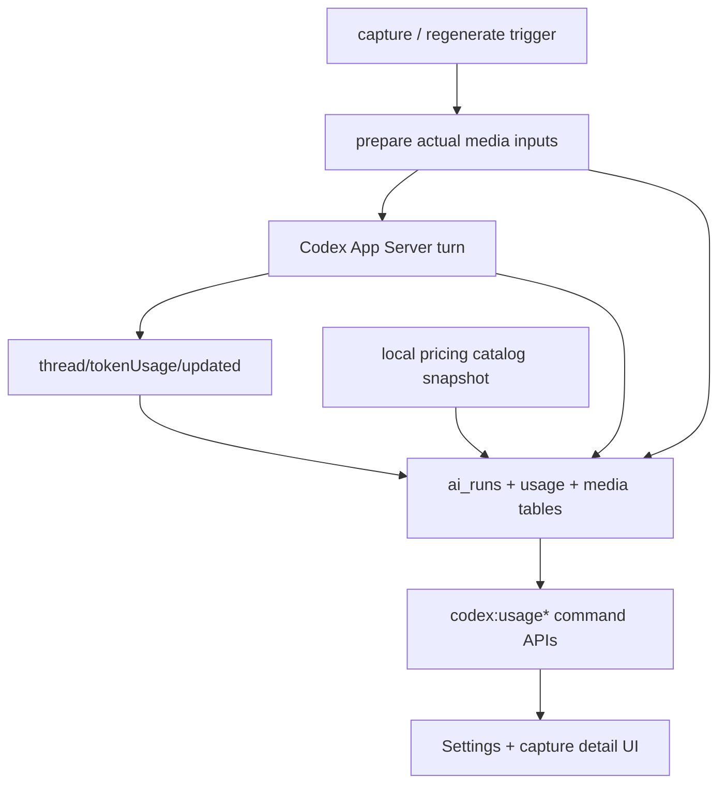
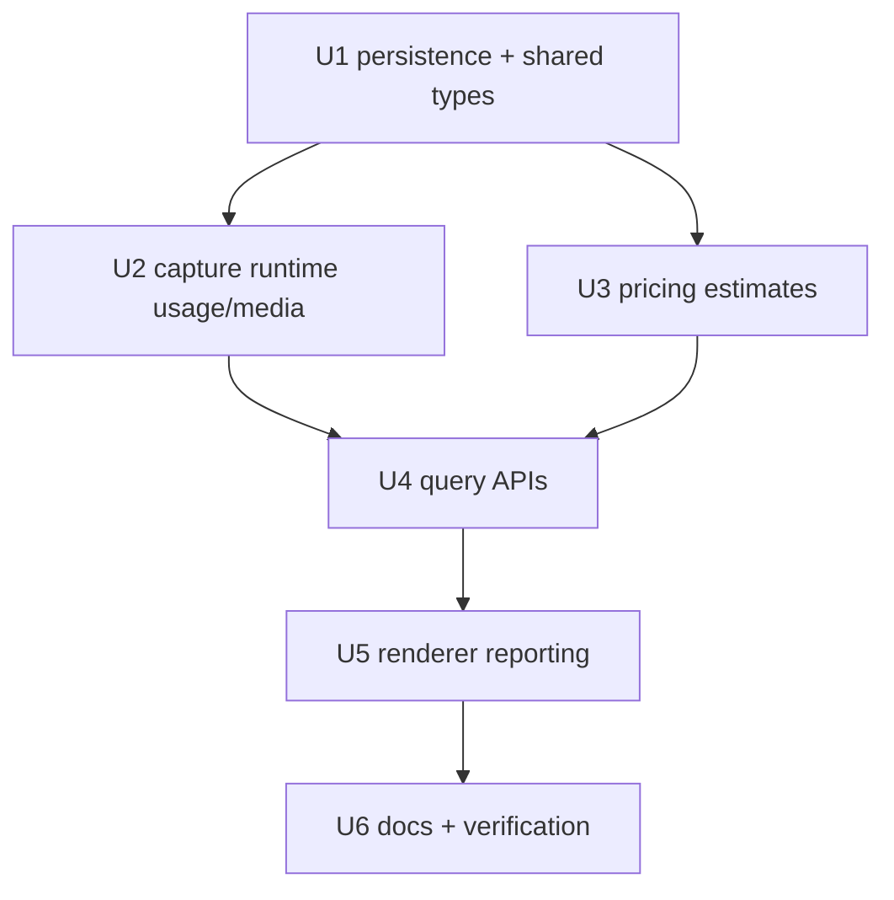

# Add AI Usage and Cost Observability

## Summary

Add first-class accounting for PwrSnap-originated Codex work so users can see what the app sent to the model, what token usage Codex reported, and what that usage would cost at current OpenAI list prices. The implementation should persist per-run model, token, media, and pricing facts, then surface them in Settings and capture-level detail without trying to infer total account billing.

---

## Problem Frame

The current budget breaker protects users from runaway background enrichment attempts, but it does not answer the cost question users actually have: "what is PwrSnap spending, or what would this have cost on a metered API/Codex seat?" Image-heavy enrichment makes that harder because resolution, encoded format, compression, and sample count materially affect input tokens, while the current app only logs a small prepared-media summary and discards Codex token usage notifications.

---

## Requirements

- R1. Persist PwrSnap-originated AI usage per run, including capture id, trigger source, task kind, status, Codex thread/turn ids, model id, model provider, service tier, and usage availability.
- R2. Capture Codex-reported token usage when available, with separate total, input, cached input, output, and reasoning output token counts.
- R3. Estimate list-price-equivalent cost per run from the exact model/rate snapshot used at completion, separating uncached input, cached input, output, and total estimated cost.
- R4. Persist media accounting for the actual inputs sent to Codex, including original dimensions, sent dimensions, MIME/format, JPEG quality or compression setting where known, byte size, max-edge policy, video frame sample position, and source-to-sent scale.
- R5. Report "usage unavailable" and "price unavailable" explicitly when Codex or the local pricing catalog cannot support an estimate; do not silently guess token usage from file size.
- R6. Add command-bus APIs that let renderers query recent AI usage, aggregate usage by time/model/task, and inspect a single run's usage/media detail.
- R7. Surface the usage and cost data in the Settings AI page and capture detail surfaces with wording that distinguishes actual observed PwrSnap usage from whole-account billing.
- R8. Preserve existing AI flow invariants: all model calls still go through Codex App Server, secrets stay out of renderer-visible data, image bytes are not persisted for accounting, and the existing budget breaker behavior remains stable.

---

## Scope Boundaries

- This plan does not read or reconcile the user's total OpenAI/Codex/ChatGPT account invoice.
- This plan does not guarantee actual billed amount for Pro, Team, Enterprise, promotional, scale-tier, regional, priority, or future bundled Codex plans; it reports an observed usage plus list-price-equivalent estimate.
- This plan does not add dollar-denominated enforcement to the budget circuit breaker. It creates the accounting substrate needed for that future work.
- This plan does not make direct OpenAI, Anthropic, xAI, or provider API calls from `apps/desktop`.
- This plan does not persist sent image bytes, base64 payloads, OCR text in new accounting tables, or plaintext secrets.
- This plan does not rewrite the capture-enrichment prompt or model selection policy except where needed to record the selected/actual model.

### Deferred to Follow-Up Work

- Dollar-denominated monthly caps and alerts: use the persisted usage data after users have seen reporting semantics.
- Organization-level invoice reconciliation: requires authenticated provider APIs and account-level trust boundaries that are outside PwrSnap's current Codex App Server client role.
- Usage reporting for future long-lived Library Chat and voice/realtime surfaces: reuse the same accounting schema once those flows produce stable run/thread lifecycles.

---

## Context & Research

### Relevant Code and Patterns

- `apps/desktop/src/main/ai/codex-client.ts` starts ephemeral Codex threads, sends image data URLs, waits for structured output, and currently ignores `thread/tokenUsage/updated`.
- `packages/codex-app-server-protocol/src/ServerNotification.ts` already includes `thread/tokenUsage/updated`; `TokenUsageBreakdown` exposes `totalTokens`, `inputTokens`, `cachedInputTokens`, `outputTokens`, and `reasoningOutputTokens`.
- `packages/codex-app-server-protocol/src/v2/ThreadStartResponse.ts` returns the actual `model`, `modelProvider`, and `serviceTier` selected by Codex.
- `apps/desktop/src/main/ai/enrichment-image.ts` currently sends a metadata-stripped JPEG derivative at a 1024px max edge, `quality: 75`, and a 1 MB byte cap. Video enrichment sends three JPEG frames at 15%, 50%, and 85%.
- `apps/desktop/src/main/persistence/ai-runs-repo.ts` and migration `0006_ai_enrichment.sql` provide the existing `ai_runs` lifecycle table but expose only a compact `AiRunSnapshot`.
- `apps/desktop/src/main/handlers/codex-handlers.ts` records queued/running/completed/failed runs, stores enrichment results, aliases `codex:annotate`/`codex:describe`/`codex:tag`/`codex:filename`/`codex:sensitiveScan` through `codex:enrich`, and broadcasts run updates.
- `packages/shared/src/protocol.ts` defines `settings.codex.captionModel` and `DEFAULT_CODEX_CAPTION_MODEL`, but runtime reporting should trust Codex's returned actual model rather than assuming the setting was applied.
- `packages/shared/src/protocol.ts` is the single command-bus contract source for renderer-visible types and commands.
- `apps/desktop/src/renderer/src/features/settings/pages/AIProvidersPage.tsx` already displays AI status and the budget token bucket, making it the natural first reporting surface.

### Institutional Learnings

- The settings substrate guidance in `AGENTS.md` applies if user-configurable pricing/reporting preferences are added: settings go through `DesktopSettingsService`, command bus, typed shared protocol, and renderer context.
- Existing AI architecture guidance in `AGENTS.md` is load-bearing: PwrSnap is a Codex App Server client only, and all AI features in `apps/desktop` must continue to go through the user's installed Codex instance.

### External References

- OpenAI API pricing docs list per-1M-token rates by model and separate input, cached input, and output prices: https://developers.openai.com/api/docs/pricing
- The OpenAI model catalog currently lists `gpt-5.4-mini` as a lower-cost model with text/image input and text output, at $0.75 input and $4.50 output per 1M tokens: https://developers.openai.com/api/docs/models
- The OpenAI pricing page currently lists `gpt-5.4-mini` standard short-context rates at $0.75 input, $0.075 cached input, and $4.50 output per 1M tokens: https://developers.openai.com/api/docs/pricing
- OpenAI's image and vision guide documents that image inputs are tokenized and that image token cost depends on size/detail; this supports reporting the actual sent resolution/format/compression alongside token usage: https://developers.openai.com/api/docs/guides/images-vision

---

## Key Technical Decisions

- Use Codex token usage notifications as the usage source of truth: `thread/tokenUsage/updated` is already in the generated protocol and avoids inventing local token estimators.
- Persist usage and media details in dedicated tables linked to `ai_runs`, not only inside JSON blobs, so summaries can be queried without parsing every run response.
- Store the pricing rate snapshot used for each run. Historical estimates should not change when OpenAI pricing changes later.
- Calculate cost only when the exact model/tier/rate is known. Unknown model aliases, missing cached-input rates, or unsupported tiers should produce `priceStatus: "unavailable"` with a reason.
- Treat `reasoningOutputTokens` as explanatory output-token detail, not an extra billing bucket, unless Codex/OpenAI later exposes a separate billable rate. The estimate should bill output from `outputTokens` and show reasoning tokens as included-in-output.
- Report actual sent media properties, not idealized capture properties. For enrichment today this means the prepared 1024px-long-edge JPEG or sampled video frames; for annotation-style commands that send the bare image later, the media row should say so explicitly.
- Keep pricing catalog data local, typed, versioned, and easy to update. Runtime network calls for pricing would create another trust and availability dependency inside a local-first desktop app.
- Name estimates plainly as "list-price equivalent" and keep the UI caveat close to the dollar figure, because subscription seats and enterprise plans can diverge from public API rates.

---

## Open Questions

### Resolved During Planning

- Should this update the completed Codex capture enrichment plan or be a new plan? It should be a new plan because the enrichment buildout is already implemented and this is a cross-cutting observability feature.
- Should PwrSnap estimate total account usage? No. The scope is PwrSnap-originated runs only.
- Should PwrSnap guess token usage when Codex does not report it? No. It should report usage unavailable and keep media metadata available for explanation.

### Deferred to Implementation

- Does the current Codex App Server always emit `thread/tokenUsage/updated` for ephemeral image turns? Tests should cover both present and absent notifications; manual dogfood should confirm behavior against the installed Codex version.
- Does `ThreadStartResponse.serviceTier` distinguish standard, batch, flex, priority, or subscription-backed Codex execution in a way that maps directly to API prices? Implementation should start with known tiers and mark unknown tiers price-unavailable.
- Should per-run UI show estimated image tokens from OpenAI's public image-token formula as a secondary explanation? Only add this if the sent detail mode and model formula are explicit; otherwise show actual reported input tokens plus media dimensions.

---

## Output Structure

    apps/desktop/src/main/ai/
      ai-usage-cost.ts
      pricing-catalog.ts
    apps/desktop/src/main/persistence/
      ai-usage-repo.ts
      migrations/0022_ai_usage_accounting.sql

---

## High-Level Technical Design

> *This illustrates the intended approach and is directional guidance for review, not implementation specification. The implementing agent should treat it as context, not code to reproduce.*

---

## Implementation Units

### U1. Add AI Usage Accounting Persistence

**Goal:** Create durable, queryable storage and shared types for per-run usage, cost, and media-input accounting.

**Requirements:** R1, R2, R3, R4, R5, R8

**Dependencies:** None

**Files:**
- Create: `apps/desktop/src/main/persistence/migrations/0022_ai_usage_accounting.sql`
- Create: `apps/desktop/src/main/persistence/ai-usage-repo.ts`
- Modify: `apps/desktop/src/main/persistence/ai-runs-repo.ts`
- Modify: `packages/shared/src/protocol.ts`
- Test: `apps/desktop/src/main/__tests__/ai-usage-repo.test.ts`

**Approach:**
- Add or backfill run-level task metadata (`trigger_source`, logical task surface, selected caption model if applicable) so reports can distinguish auto-enrichment, regenerate, annotation, describe, tag, filename, and sensitive-scan usage even while several commands route through `codex:enrich`.
- Add an `ai_run_usage` table keyed by `ai_run_id` with model/provider/tier, thread/turn ids, usage status, token fields, price status, currency, rate snapshot JSON, estimated cost in micros or another integer unit, and timestamps.
- Add an `ai_run_media_inputs` table keyed by generated id with `ai_run_id`, ordinal, media role, media transform (`prepared-jpeg`, `bare-image`, `video-frame`, etc.), source/sent dimensions, sent MIME type, format, JPEG quality or encoder setting, byte size, max-edge policy, source-to-sent scale, and optional video sample metadata.
- Keep `ai_runs.response_json` for model output and add richer snapshot/detail query functions instead of forcing renderers to parse JSON.
- Extend shared protocol with serializable `AiUsageTokenBreakdown`, `AiUsageCostEstimate`, `AiRunMediaInput`, `AiRunUsageDetail`, and summary bucket types.

**Execution note:** Start with repository and migration tests before wiring runtime code; this reduces risk around SQLite schema shape and cascade behavior.

**Patterns to follow:**
- Existing migration style in `apps/desktop/src/main/persistence/migrations/0006_ai_enrichment.sql`.
- Existing result snapshots in `apps/desktop/src/main/persistence/ai-runs-repo.ts`.

**Test scenarios:**
- Happy path: inserting usage and media rows for a completed run returns the same values through the detail query.
- Edge case: usage-unavailable run stores null token counts and a concrete unavailable reason.
- Edge case: unknown price stores token usage but `priceStatus: "unavailable"`.
- Integration: deleting a capture cascades associated run usage and media rows through `ai_runs`.

**Verification:**
- New migrations are idempotent.
- Existing AI enrichment tests pass without needing usage rows for legacy fixtures.

---

### U2. Capture Codex Token Usage and Actual Sent Media

**Goal:** Wire runtime enrichment so each run records the actual Codex model/turn metadata, latest token usage notification, and prepared media facts.

**Requirements:** R1, R2, R4, R5, R8

**Dependencies:** U1

**Files:**
- Modify: `apps/desktop/src/main/ai/codex-client.ts`
- Modify: `apps/desktop/src/main/ai/enrichment-image.ts`
- Modify: `apps/desktop/src/main/handlers/codex-handlers.ts`
- Test: `apps/desktop/src/main/ai/__tests__/codex-client.test.ts`
- Test: `apps/desktop/src/main/ai/__tests__/enrichment-image.test.ts`
- Test: `apps/desktop/src/main/__tests__/codex-handlers.test.ts`

**Approach:**
- Track `thread/tokenUsage/updated` notifications for the active `threadId` and `turnId` in `CodexAppServerClient`; return the last matching usage in `CodexCaptureEnrichmentResponse`.
- Include `threadResponse.model`, `modelProvider`, `serviceTier`, `threadId`, and `turnId` in the enrichment response.
- Extend `PreparedEnrichmentImage` and video-frame objects with source dimensions, output MIME/format, JPEG quality, max-edge policy, byte cap, and scale ratio.
- Persist media rows immediately after preparation and usage rows when the turn completes, fails after a Codex turn starts, or completes without a token notification.
- Ensure cancelled or pre-Codex failures do not fabricate token usage; they may still record media rows if preparation completed.

**Execution note:** Characterize current notification handling first. The client currently handles item/raw response/turn completion; usage notification support should be narrowly added to that state machine.

**Patterns to follow:**
- Existing `PendingTurn` lifecycle and notification dispatch in `codex-client.ts`.
- Existing prepared-media logging in `codex-handlers.ts`, but move accounting facts into persistence rather than logs.

**Test scenarios:**
- Happy path: mocked Codex sends token usage before `turn/completed`; response includes model metadata and token breakdown.
- Edge case: multiple usage notifications arrive; the final matching notification wins.
- Edge case: usage notification for another turn is ignored.
- Error path: turn completes without usage; run detail says usage unavailable.
- Integration: image run records one JPEG media row at 1024 max edge with quality 75.
- Integration: video run records three JPEG frame rows with sample positions 15/50/85.

**Verification:**
- Runtime still archives ephemeral threads.
- No sent image bytes or base64 payloads are persisted.

---

### U3. Add Versioned Pricing Catalog and Cost Estimator

**Goal:** Convert observed token usage into stable list-price-equivalent estimates without putting pricing logic in renderer code.

**Requirements:** R3, R5, R8

**Dependencies:** U1

**Files:**
- Create: `apps/desktop/src/main/ai/pricing-catalog.ts`
- Create: `apps/desktop/src/main/ai/ai-usage-cost.ts`
- Modify: `apps/desktop/src/main/handlers/codex-handlers.ts`
- Test: `apps/desktop/src/main/ai/__tests__/ai-usage-cost.test.ts`

**Approach:**
- Define a typed pricing catalog with `catalogVersion`, `effectiveDate`, `sourceUrl`, `currency`, `model`, `serviceTier`, `contextClass` where needed, and per-million rates for uncached input, cached input, and output.
- Seed the catalog with the current PwrSnap-supported model: `gpt-5.4-mini`, standard short-context list rates of $0.75 input, $0.075 cached input, and $4.50 output per 1M tokens as of 2026-05-30.
- Estimate uncached input as `max(inputTokens - cachedInputTokens, 0)`, cached input as `cachedInputTokens`, and output as `outputTokens`.
- Store the rate snapshot and computed integer micro-dollar cost on the run so historical displays remain stable.
- If model, service tier, context class, or a required rate is unknown, store `priceStatus: "unavailable"` and a specific reason while retaining tokens.

**Execution note:** Do not add runtime web fetches for pricing. Updating the catalog should be a normal code change tied to official pricing docs.

**Patterns to follow:**
- Keep main-process-only calculation similar to existing main-only AI preparation code; renderers receive finished data.

**Test scenarios:**
- Happy path: known `gpt-5.4-mini` usage produces separate cached/uncached/output costs and a total.
- Edge case: `cachedInputTokens > inputTokens` clamps uncached input to zero and records an anomaly reason or warning.
- Edge case: unknown model returns price unavailable without throwing.
- Edge case: null service tier falls back only if the catalog declares that fallback valid.

**Verification:**
- No floating-point dollars are persisted as the only source of truth.
- Renderer-visible cost formatting can derive from integer micros and currency.

---

### U4. Add Usage Query Command APIs

**Goal:** Expose usage summaries and run-level detail through the existing command bus.

**Requirements:** R6, R7, R8

**Dependencies:** U2, U3

**Files:**
- Modify: `packages/shared/src/protocol.ts`
- Modify: `packages/shared/src/ipc.ts`
- Modify: `apps/desktop/src/main/handlers/codex-handlers.ts`
- Create or modify: `apps/desktop/src/main/handlers/codex-usage-validators.ts`
- Test: `apps/desktop/src/main/__tests__/codex-handlers.test.ts`

**Approach:**
- Add `codex:usageSummary` for aggregate windows such as last 24h, 7d, and 30d, grouped by model and trigger/task.
- Add `codex:usageRuns` for paginated recent runs with capture id, completed time, trigger source, model, usage status, token totals, and estimated cost.
- Add `codex:usageRunDetail` for a single run's token breakdown, price snapshot, media inputs, and unavailable reasons.
- Validate time windows, pagination limits, and ids at the bus boundary.
- Keep eventing simple for v1: existing `events:ai-run:updated` can prompt refetch; add a dedicated usage event only if the UI needs live aggregate updates independent of run updates.

**Execution note:** Make queries read-only and renderer-safe; they should expose metadata and counts, not prompts, OCR text, or image payloads.

**Patterns to follow:**
- Command map and validator patterns in `packages/shared/src/protocol.ts` and existing handler tests.

**Test scenarios:**
- Happy path: summary groups completed runs by model/task and totals tokens/cost.
- Edge case: failed runs with media but no usage appear with usage unavailable.
- Edge case: pagination clamps excessive limits.
- Error path: unknown run id returns `null` detail or typed not-found behavior consistently with existing run status APIs.

**Verification:**
- Renderer can retrieve enough data for Settings and capture detail without direct database access.

---

### U5. Surface Usage and Cost in Settings and Capture Detail

**Goal:** Make PwrSnap's AI usage understandable to the user without overstating billing precision.

**Requirements:** R5, R7, R8

**Dependencies:** U4

**Files:**
- Modify: `apps/desktop/src/renderer/src/features/settings/pages/AIProvidersPage.tsx`
- Modify: relevant Settings CSS under `apps/desktop/src/renderer/src/features/settings/`
- Modify: capture detail rail components that already show enrichment/regenerate state
- Test: renderer component tests for the Settings page and detail usage rows

**Approach:**
- Add an "AI usage" section to Settings with recent total list-price estimate, token totals split into uncached input/cached input/output, runs by task, and model breakdown.
- Show a recent-run table with status, trigger source, model, token totals, cost, and a detail affordance for media facts.
- In capture detail, show the latest run's model, usage/cost status, token summary, sent media dimensions/format/quality/bytes, and a "list-price equivalent" label.
- Use explicit fallback copy: "Usage unavailable from Codex", "Price unavailable for model", or "Estimate uses OpenAI public list price, not your subscription invoice."
- Keep the UI dense and operational; this belongs in Settings and detail rails, not a marketing-style page.

**Execution note:** Build the smallest useful reporting surface first. Avoid charts unless the summary table cannot communicate the data.

**Patterns to follow:**
- Existing Settings AI page state management and command dispatch patterns.
- Existing DetailRail enrichment status conventions.

**Test scenarios:**
- Happy path: known-priced completed run displays token split and formatted cost.
- Edge case: usage unavailable displays no dollar total and a clear reason.
- Edge case: price unavailable displays tokens without a misleading zero-dollar estimate.
- Edge case: media rows for video show three sampled frames rather than one generic image.

**Verification:**
- Text fits in the Settings layout at typical desktop widths.
- Existing enable/disable, regenerate, and budget status interactions still work.

---

### U6. Document Semantics and Verify End-to-End

**Goal:** Lock down the user-facing meaning of reported usage and prove the full path from Codex notification to UI.

**Requirements:** R1, R2, R3, R4, R5, R6, R7, R8

**Dependencies:** U5

**Files:**
- Modify: `docs/plans/2026-05-12-001-feat-codex-capture-enrichment-plan.md` only if a short cross-reference is useful; do not rewrite completed history.
- Create or modify: `docs/solutions/` note if implementation uncovers a reusable Codex usage-accounting gotcha.
- Test: targeted main tests, renderer tests, and one desktop integration/e2e path if the harness already covers AI settings flows.

**Approach:**
- Add concise developer documentation for the distinction between observed PwrSnap usage, list-price equivalent, and actual provider billing.
- Include a catalog-update note pointing to official OpenAI pricing/model docs.
- Run typecheck and the affected test suites.
- Manually dogfood a mocked or real Codex enrichment run when available and confirm the Settings page reports media and usage states correctly.

**Execution note:** If a real Codex run cannot be performed in CI, keep the deterministic tests mocked and document the manual validation path.

**Patterns to follow:**
- Existing `docs/solutions/` style only when a real implementation lesson emerges.

**Test scenarios:**
- Integration: run completes with mocked token notification and appears in Settings summary and run detail.
- Integration: run completes without token notification and appears as usage unavailable.
- Regression: budget breaker slow/safety-disabled state remains independent from cost reporting.

**Verification:**
- `pnpm --filter @pwrsnap/desktop typecheck`
- Relevant `pnpm --filter @pwrsnap/desktop test -- <affected tests>` command based on repo test scripts.
- Desktop smoke or e2e test for Settings AI usage if practical.

---

## System-Wide Impact

- **Interaction graph:** Capture enqueue, image preparation, Codex App Server notifications, AI run persistence, command-bus queries, Settings UI, and capture detail UI now share an accounting lifecycle.
- **Error propagation:** Missing Codex usage and missing pricing data are data states, not thrown errors. Persistence failures should fail the run only when they prevent required accounting writes inside the run transaction; summary query failures should return typed command errors.
- **State lifecycle risks:** Runs can fail before media prep, after media prep, after thread start, or after usage notification. The schema and UI must represent partial data without implying completion.
- **API surface parity:** All renderer-visible data goes through `packages/shared/src/protocol.ts` and the command bus. No new raw IPC channel is needed unless live usage events prove necessary.
- **Integration coverage:** Unit tests can prove calculation and persistence; at least one handler-level integration should prove token notifications flow into queryable summaries.
- **Unchanged invariants:** AI calls still go through Codex App Server, settings/secrets still use the existing substrate, image bytes are transient, and the budget breaker remains attempt-based for this plan.

---

## Risks & Dependencies

| Risk | Mitigation |
|------|------------|
| Codex App Server does not emit usage for some installed versions or flows. | Represent usage availability explicitly and test both notification-present and notification-absent paths. |
| Public pricing changes after the release. | Store catalog version/source/effective date and rate snapshot per run; update catalog through normal code changes. |
| Model aliases or service tiers do not map cleanly to public API pricing. | Require exact catalog matches for estimates; otherwise show tokens with price unavailable. |
| UI dollar figures look like actual invoices. | Use "list-price equivalent" labels and keep subscription/billing caveats next to totals. |
| Accounting tables accidentally expose sensitive text or image data. | Persist only metadata, counts, ids, and price snapshots; add tests or grep assertions if needed. |
| Future annotation/chat surfaces diverge from enrichment accounting. | Model usage/media rows around generic AI runs with task/trigger metadata rather than enrichment-only fields. |

---

## Alternative Approaches Considered

| Approach | Why Not |
|----------|---------|
| Estimate tokens locally from image size and prompt text only. | This would be misleading for multimodal Codex runs and cached tokens; Codex-reported usage is the better source of truth. |
| Query OpenAI organization usage APIs. | PwrSnap is not the user's account administrator and should not request account-wide billing credentials for local capture enrichment reporting. |
| Store accounting only in `ai_runs.request_json` / `response_json`. | JSON blobs are useful audit context but poor for summaries, grouping, and renderer queries. |
| Put pricing logic in the renderer. | Pricing is business logic tied to observed model ids and should be tested in main, with renderers only formatting results. |

---

## Success Criteria

- A completed PwrSnap enrichment run can be inspected and shows the actual Codex model/provider/tier, thread/turn ids, token breakdown when reported, and sent media dimensions/format/quality/bytes.
- Settings shows recent PwrSnap AI usage totals and list-price-equivalent estimates split by cached input, uncached input, and output.
- Runs without token notifications or known prices are still visible and clearly labeled unavailable rather than hidden or guessed.
- Existing AI enrichment, regenerate, cancellation, and budget circuit-breaker tests continue to pass.
