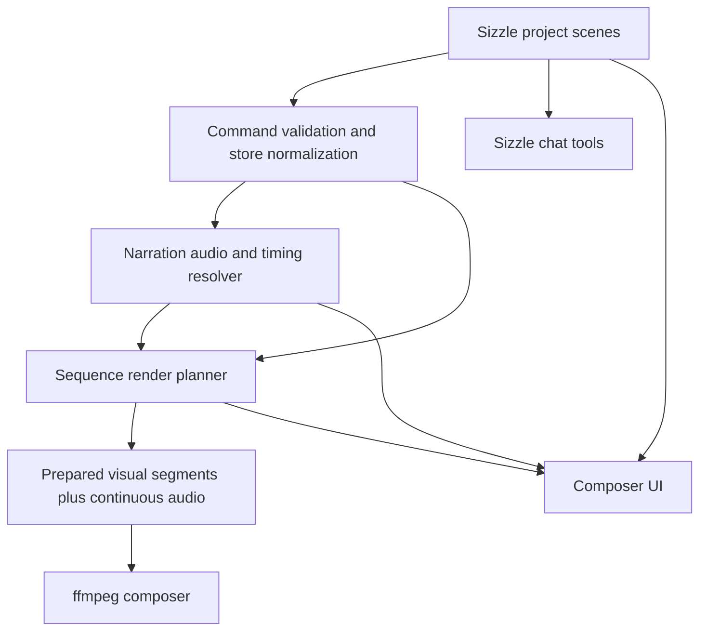
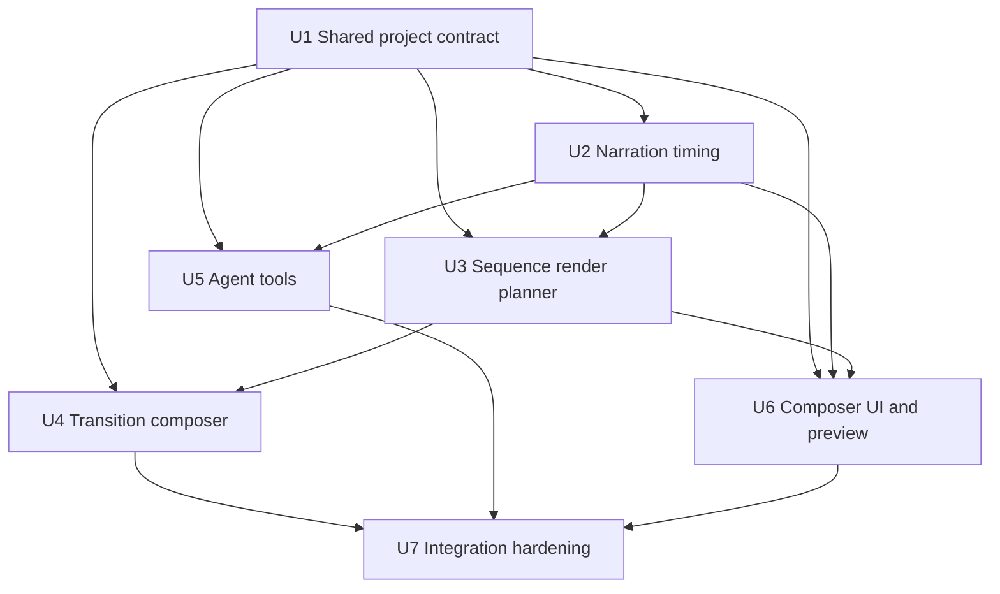

# feat: Add Sizzle sequence scenes

## Summary

Add sequence scenes to Sizzle Reels by extending the existing project format, render prep, ffmpeg composition, chat tools, and composer UI around one narration block with multiple timed visual beats. The plan keeps the shipped ffmpeg render path, adds speech-timing as a capability with an editable fallback, and avoids pulling in the deferred WebCodecs/NLE preview work for the first shippable version.

---

## Problem Frame

The existing scene model pairs one capture with one script line. That works for simple image slideshows, but it makes narrated app workflows awkward and makes short video clips visibly stall when their voiceover is longer than the trim. The origin requirements define sequence scenes as the product shape that lets one smooth narration drive many fast visual beats.

---

## Requirements

- R1. A Sizzle project supports a sequence scene containing one narration block and an ordered list of image/video beats.
- R2. Each beat references one capture and defines when it appears within the sequence.
- R3. Beat timing supports explicit second offsets and narration-relative phrase anchors.
- R4. Existing single-capture scenes remain compatible and can be represented as one-beat sequences.
- R5. Video beats declare a fit policy for source-duration versus intended-duration mismatch.
- R6. Default video fit behavior avoids silent final-frame holds when better options are available.
- R7. Fit policies include normal trim, freeze-end, loop, ping-pong, speed-to-fit, and smart-fit.
- R8. Smart-fit choices are inspectable and overridable.
- R9. Automatic duration adaptation has sane speed, loop, and repetition limits.
- R10. Narration timing is stored or derived well enough to align beats to spoken phrases.
- R11. The agent can propose timing in human terms before the system resolves concrete seconds.
- R12. Low-confidence or unavailable speech timing falls back to editable approximate timing.
- R13. Transitions exist at both scene boundaries and beat boundaries.
- R14. Beat transitions default to fast choices suitable for UI walkthroughs.
- R15. Beat boundaries can use no visual transition.
- R16. Transition definitions include type and duration.
- R17. The initial transition set prioritizes practical app-demo transitions: cut, crossfade, dip-to-black, dip-to-white, push/slide, and simple zoom-cut.
- R18. Sequence narration owns audio continuity so beat transitions do not chop speech.
- R19. The Sizzle composer agent can create and edit sequence scenes.
- R20. The agent can set beat order, timing, transition, video fit policy, and narration text.
- R21. Agent-created timing is presented as an editable proposal.
- R22. The agent prefers sequence scenes for workflows, progressions, setup flows, and "show this sequence" requests.
- R23. The composer UI makes sequence scenes understandable without requiring video-editor thinking.
- R24. A sequence scene shows narration and visual beats together.
- R25. The author can preview a sequence scene before rendering the full reel.
- R26. Warnings appear for risky fit policy, extreme speed, very short duration, or unresolved narration anchor.

**Origin actors:** A1 Reel author, A2 Sizzle composer agent, A3 Viewer, A4 Renderer
**Origin flows:** F1 Compose a narrated UI sequence, F2 Fit a short video beat to narration timing, F3 Time visuals against speech
**Origin acceptance examples:** AE1 continuous narration over multiple beats, AE2 phrase anchor timing, AE3 short video smart-fit, AE4 beat transitions without audio seams, AE5 editable agent timing warnings

---

## Scope Boundaries

- This plan does not build a full nonlinear video editor. It stays focused on guided app-demo sequencing.
- This plan does not require every possible transition style. It adds the small transition family needed by the origin requirements and keeps exact ffmpeg mapping pragmatic.
- This plan does not make precise word timing a hard render prerequisite. It supports precise timing when available and an editable heuristic fallback when unavailable.
- This plan does not mix or duck native video audio under narration. Sequence narration is the continuous audio track.
- This plan does not replace the existing single-scene authoring flow. Legacy/simple scenes remain editable in their current shape.

### Deferred to Follow-Up Work

- WebCodecs or NLE-style preview: still deferred from the parent Sizzle plan; sequence preview here should be good enough to validate timing, not a full timeline editor.
- Non-linear speed-ramp fitting: defer until loop, ping-pong, speed-to-fit, freeze-end, and smart-fit prove insufficient.
- Native clip audio mixing/ducking: defer until sequence narration and visual timing are stable.

---

## Context & Research

### Relevant Code and Patterns

- `packages/shared/src/protocol.ts` owns the current `SizzleScene`, `SizzleProject`, transition, audio-source, and command types. It is the first contract surface to extend.
- `apps/desktop/src/main/sizzle/sizzle-store.ts` normalizes stored scenes on read/write with backward-compatible defaults. Sequence compatibility should follow this pattern rather than requiring a destructive migration.
- `apps/desktop/src/main/handlers/sizzle-validators.ts` hand-validates Sizzle updates at the command-bus boundary. New scene/beat/timing/transition fields need the same explicit allow-list and range checks.
- `apps/desktop/src/main/handlers/sizzle-handlers.ts` currently loads captures, resolves per-scene audio source, prepares `SceneInput[]`, and calls `compose`. Sequence scenes should be flattened into a render plan before composition.
- `apps/desktop/src/main/sizzle/composer.ts` currently normalizes image/video scene inputs, chains visual transitions, and concatenates audio. It is the right final-output layer, but it should consume a lower-level prepared segment graph rather than know about authoring concepts.
- `apps/desktop/src/main/sizzle/tts.ts` caches TTS by provider/model/voice/text. Sequence narration should reuse this cache shape and add timing metadata beside audio rather than embedding timing in the project on every render.
- `apps/desktop/src/main/ai/sizzle-tool-allowlist.ts` and `apps/desktop/src/main/ai/sizzle-chat-system-prompt.ts` currently describe one scene as one capture plus one script line. The agent tool contract needs to move to sequence-aware operations.
- `apps/desktop/src/renderer/src/features/sizzle/SizzleApp.tsx` is the current composer UI. It already handles scene editing, audio preview, trim warnings, and transition chips; sequence editing should extend that surface before inventing a separate timeline app.

### Institutional Learnings

- `AGENTS.md` bans reading or depending on Remotion. This plan keeps composition in PwrSnap's existing ffmpeg path and does not introduce Remotion-derived patterns.
- `AGENTS.md` requires AI features to route through Codex App Server. The sequence composer agent remains a Codex-driven chat/tool surface; no direct LLM calls are introduced.
- `docs/solutions/2026-05-28-bake-render-cache-orphans.md` frames cache orphaning as acceptable when pipeline versions change. Sequence render/timing caches should be content-addressed and tolerate orphaned artifacts rather than sweeping aggressively during normal render.

### External References

- OpenAI Text to Speech docs: `https://developers.openai.com/api/docs/guides/text-to-speech`
  - Current TTS endpoint produces audio output and supports newer `gpt-4o-mini-tts` voices/instructions, but it is not a word-timestamp source.
- OpenAI Speech to Text docs: `https://developers.openai.com/api/docs/guides/speech-to-text`
  - `whisper-1` with `verbose_json` and word timestamp granularity is the first precise alignment path for generated narration audio.
- OpenAI Audio API reference: `https://developers.openai.com/api/reference/resources/audio`
  - Word timestamp objects include word/start/end fields; speech models include both current `tts-1`/`tts-1-hd` and newer TTS models.
- FFmpeg filters docs: `https://www.ffmpeg.org/ffmpeg-filters.html`
  - Existing filters cover crossfades, frame loops, timestamp rewriting, trimming, padding, and concat-style composition needed for this plan.

---

## Key Technical Decisions

- Extend the Sizzle project contract in place rather than create a separate sequence-project type: sequence scenes are a new scene shape inside the existing project lifecycle, so Library, cart, render progress, and chat stay attached to one project model.
- Keep authoring concepts separate from render segments: scenes and beats should be validated as product data, then lowered into normalized visual/audio segments for `composer.ts`.
- Use generated-audio transcription for precise timing: because current TTS output does not expose word timestamps, the first precise path is "synthesize narration, transcribe it for word timings, cache the result."
- Make heuristic timing an accepted fallback: sequence creation should not block on alignment failure; the editor can show unresolved/low-confidence anchors and let the user or agent adjust.
- Treat smart-fit as a resolver, not a new render primitive: smart-fit should choose among explicit policies under limits, then store or expose the resolved policy so users and tests can inspect it.
- Keep beat-level audio silent under sequence narration: visual beats do not own speech audio, which prevents per-beat audio cuts and matches the origin requirement for continuous narration.
- Start sequence UI as a compact narration-plus-beat editor: a mini timeline can follow later, but a structured beat list with timing controls, warnings, and preview is enough for v1.

---

## Open Questions

### Resolved During Planning

- Speech timing source: use generated-audio transcription with word timestamps as the precise path, and heuristic editable timing as fallback.
- Video fit limits: smart-fit should prefer subtle speed-to-fit first, then bounded loop/ping-pong, then freeze-end only when explicit or when better options exceed limits.
- Transition scope: expand the transition contract and renderer to cover the practical app-demo family now; defer broad transition catalogs and preview-engine-specific effects.
- Sequence editor shape: use a compact beat list tied to narration text for this plan; defer full timeline/NLE UI.
- Native audio mixing: out of scope for this plan; sequence narration is primary.

### Deferred to Implementation

- Exact speed and loop thresholds: start with conservative guardrails and tune based on tests/render samples without changing the product contract.
- Exact ffmpeg transition mapping: map PwrSnap transition names to supported ffmpeg filters where cleanly available, and emulate or degrade to crossfade/cut where necessary.
- Phrase anchor matching tolerance: implementation should choose practical fuzzy matching and expose unresolved anchors rather than making matching brittle.
- Cache layout for timing metadata: should follow existing content-addressed cache patterns, but exact filenames and invalidation details can be settled while wiring the service.

---

## High-Level Technical Design

> *This illustrates the intended approach and is directional guidance for review, not implementation specification. The implementing agent should treat it as context, not code to reproduce.*



The intended layering is:

- Project/store layer: owns durable authoring data such as sequence scene, narration, beats, anchors, transitions, and fit-policy choices.
- Timing layer: turns narration text/audio into word/phrase timing when possible and marks fallback timing when not.
- Planner layer: resolves beats into concrete start/end windows, applies fit-policy decisions, and emits normalized render segments.
- Composer layer: renders prepared segments and continuous audio; it should not need to understand chat-agent phrase anchors.
- UI/agent layers: author and edit sequence scenes through the same durable contract.

---

## Implementation Units



### U1. Shared Project Contract and Compatibility

**Goal:** Extend the Sizzle contract so projects can store legacy/simple scenes and sequence scenes with beats, timing anchors, transition objects, and video fit policies.

**Requirements:** R1, R2, R3, R4, R5, R7, R13, R16

**Dependencies:** None

**Files:**
- Modify: `packages/shared/src/protocol.ts`
- Modify: `packages/shared/src/__tests__/sizzle-audio-source.test.ts`
- Modify: `apps/desktop/src/main/sizzle/sizzle-store.ts`
- Modify: `apps/desktop/src/main/sizzle/__tests__/sizzle-store.test.ts`
- Modify: `apps/desktop/src/main/handlers/sizzle-validators.ts`
- Modify: `apps/desktop/src/main/handlers/__tests__/sizzle-validators.test.ts`
- Modify: `apps/desktop/src/main/handlers/__tests__/sizzle-toggle-scene.test.ts`
- Modify: `apps/desktop/src/main/handlers/cart-handlers.ts`
- Modify: `apps/desktop/src/main/handlers/__tests__/cart-handlers.test.ts`

**Approach:**
- Introduce a discriminated scene model while preserving the old one-capture scene shape as the simple case.
- Add beat-level fields for capture reference, timing mode, transition, media trim, audio policy where applicable, and video fit policy.
- Replace the fixed crossfade-only transition contract with a transition object that carries type and duration, while preserving old string values on read.
- Add validation limits for sequence length, beat count, narration length, beat duration, transition duration, and fit-policy values.
- Normalize older projects so missing scene kind, string transitions, and old media-trim fields still render and edit.
- Keep cart and toggle-scene defaults producing the simple scene shape unless the caller explicitly creates a sequence.

**Execution note:** Start with contract/normalization tests before touching render behavior. This is the compatibility boundary for every later unit.

**Patterns to follow:**
- `apps/desktop/src/main/sizzle/sizzle-store.ts` `sanitizeScenes` read-path normalization.
- `apps/desktop/src/main/handlers/sizzle-validators.ts` explicit allow-list validation and server-owned field rejection.
- `packages/shared/src/protocol.ts` shared resolver functions used by both main and renderer.

**Test scenarios:**
- Happy path: a sequence scene with narration and multiple image/video beats validates and round-trips through `sizzle:update`.
- Happy path: an old project scene without new fields reads back with defaults and remains renderable.
- Happy path: an old string transition normalizes into the new transition contract.
- Edge case: a one-beat sequence remains equivalent to a simple scene for project counts, cart display, and render prep.
- Error path: too many beats, invalid transition duration, invalid fit policy, or invalid anchor shape is rejected at the validator.
- Error path: client attempts to set server-owned project fields alongside sequence changes and the update is rejected.
- Integration: cart commit still creates simple scenes in cart order, and those scenes can later be converted to sequence form.

**Verification:**
- Existing Sizzle projects continue to list, edit, and render.
- New sequence scene payloads are accepted only when all beat/timing/fit constraints are valid.

---

### U2. Narration Timing Resolver

**Goal:** Add a timing capability that produces word/phrase timing for sequence narration when possible and deterministic fallback timing when not.

**Requirements:** R3, R10, R11, R12, R21, R26, F3, AE2

**Dependencies:** U1

**Files:**
- Modify: `apps/desktop/src/main/sizzle/tts.ts`
- Test: `apps/desktop/src/main/sizzle/__tests__/tts.test.ts`
- Create: `apps/desktop/src/main/sizzle/speech-timing.ts`
- Create: `apps/desktop/src/main/sizzle/__tests__/speech-timing.test.ts`
- Modify: `apps/desktop/src/main/handlers/sizzle-handlers.ts`
- Modify: `apps/desktop/src/main/handlers/__tests__/sizzle-handlers.test.ts`
- Modify: `packages/shared/src/protocol.ts`

**Approach:**
- Extend the TTS path so narration audio can have an associated timing sidecar keyed by provider/model/voice/text and audio hash.
- Add a timing resolver that first attempts precise timing by transcribing generated narration audio with word timestamps when a compatible provider/key is available.
- Add a fallback resolver that splits narration into words/phrases and spreads timing over measured audio duration.
- Represent timing quality in the result so the UI and agent can warn on heuristic or unresolved anchors.
- Keep timing cache failures non-fatal: render can continue with fallback timing unless the user explicitly requires precise timing later.
- Reuse the existing OpenAI secret path for the first precise timing implementation; do not add a new settings field unless implementation proves a separate provider credential is necessary.
- Keep provider specifics behind this service so a future TTS provider with native timings can plug in without changing project data.

**Patterns to follow:**
- `apps/desktop/src/main/sizzle/tts.ts` content-addressed cache and provider error handling.
- `apps/desktop/src/main/sizzle/audio-extract.ts` cache helper style for generated artifacts.
- `apps/desktop/src/main/handlers/sizzle-handlers.ts` Result-pattern error propagation and render-progress broadcasting.

**Test scenarios:**
- Happy path: timing resolver returns word timings from a mocked precise transcription response and marks confidence precise.
- Happy path: timing resolver falls back to duration-based approximate timing when transcription is unavailable.
- Covers AE2. Happy path: a phrase anchor resolves near the matching word timing returned by the precise path.
- Edge case: repeated words in narration resolve anchors by occurrence order rather than all matching the first occurrence.
- Edge case: punctuation and case differences do not prevent phrase-anchor matching.
- Error path: transcription API failure is captured as low-confidence timing, not a render-stopping exception.
- Integration: preview/render preparation can request sequence narration audio and timing without re-fetching TTS when audio is cached.

**Verification:**
- Sequence scenes can produce timing metadata without making existing per-scene audio preview slower or less reliable.
- Failed timing lookup results in warnings and editable approximate timing, not blocked reel creation.

---

### U3. Sequence Render Planner and Video Fit Policies

**Goal:** Lower sequence scenes into prepared visual/audio segments with concrete timings and inspectable fit-policy decisions before the ffmpeg composer runs.

**Requirements:** R1, R2, R5, R6, R7, R8, R9, R18, F1, F2, AE1, AE3

**Dependencies:** U1, U2

**Files:**
- Create: `apps/desktop/src/main/sizzle/sequence-planner.ts`
- Create: `apps/desktop/src/main/sizzle/__tests__/sequence-planner.test.ts`
- Create: `apps/desktop/src/main/sizzle/video-fit.ts`
- Create: `apps/desktop/src/main/sizzle/__tests__/video-fit.test.ts`
- Modify: `apps/desktop/src/main/handlers/sizzle-handlers.ts`
- Modify: `apps/desktop/src/main/handlers/__tests__/sizzle-handlers.test.ts`
- Modify: `apps/desktop/src/main/sizzle/composer.ts`
- Modify: `apps/desktop/src/main/sizzle/__tests__/composer.test.ts`

**Approach:**
- Add a sequence planner that takes validated scenes, loaded captures, narration audio/timing, and project settings, then emits prepared visual segments plus one continuous narration audio input per sequence scene.
- Resolve beat start/end windows from explicit offsets first, phrase anchors second, and fallback distribution last.
- Implement fit-policy resolution as a pure function that returns a concrete action: trim, freeze-end, loop, ping-pong, speed-to-fit, or smart-fit's selected policy.
- Keep smart-fit conservative: choose subtle speed adjustment when within limits, bounded loop/ping-pong for short clips, and freeze-end only when explicit or when safer policies exceed limits.
- For video beats, preserve source trim semantics and apply adaptation inside the segment plan rather than by stretching narration.
- For image beats, keep static/ken-burns behavior but bind duration to the beat window instead of to a separate script line.
- Record planner diagnostics for unresolved anchors, extreme durations, and auto-chosen fit policy so UI and tests can inspect them.

**Technical design:** The planner should produce a renderer-facing plan with concrete timing and diagnostics. Directionally:

```text
project scene -> validated sequence -> timing resolution -> beat windows
beat windows + capture metadata -> fit-policy resolution -> visual segments
sequence narration -> continuous audio segment
visual segments + audio segment -> composer request
```

**Patterns to follow:**
- `apps/desktop/src/main/handlers/sizzle-handlers.ts` pre-load/validate-all-before-expensive-work posture.
- `apps/desktop/src/main/recording/recording-exporter.ts` pure helper tests around video range/dimension calculations.
- `apps/desktop/src/main/sizzle/__tests__/composer.test.ts` cross-platform filter-graph assertions plus macOS-only ffmpeg invocation tests.

**Test scenarios:**
- Covers AE1. Happy path: one sequence scene with five beats renders as one continuous narration audio segment and five visual segments.
- Covers AE3. Happy path: one-second source video in a four-second beat resolves to loop/ping-pong/speed-fit under smart-fit rather than default freeze-end.
- Happy path: explicit freeze-end remains available and produces the old-style held frame intentionally.
- Edge case: a beat anchor that resolves beyond narration duration is clamped or warned without negative/empty segment duration.
- Edge case: a video trim shorter than the minimum useful loop window warns and falls back predictably.
- Error path: missing capture in any beat fails the render with a beat-specific validation error before TTS/transcription work.
- Integration: mixed simple scenes and sequence scenes produce one ordered render plan with correct total duration and scene-boundary transitions.

**Verification:**
- Render prep can explain every beat's final time window and fit choice.
- Current simple scene rendering continues through the same composer path without behavior regressions.

---

### U4. Expanded Transition Rendering

**Goal:** Add scene- and beat-level transitions with type and duration while preserving simple fast defaults for app demos.

**Requirements:** R13, R14, R15, R16, R17, R18, F1, AE4

**Dependencies:** U1, U3

**Files:**
- Modify: `apps/desktop/src/main/sizzle/composer.ts`
- Modify: `apps/desktop/src/main/sizzle/__tests__/composer.test.ts`
- Modify: `packages/shared/src/protocol.ts`
- Modify: `apps/desktop/src/main/handlers/sizzle-validators.ts`
- Modify: `apps/desktop/src/main/handlers/__tests__/sizzle-validators.test.ts`
- Modify: `apps/desktop/src/renderer/src/features/sizzle/SizzleApp.tsx`
- Modify: `apps/desktop/src/renderer/src/features/sizzle/__tests__/SizzleApp.test.tsx`

**Approach:**
- Support transition objects at both sequence beat boundaries and scene boundaries.
- Keep beat defaults terse: cut/none by default for rapid screenshot progressions, short fade only when explicitly chosen or agent-selected.
- Keep scene defaults visually smoother than beat defaults: crossfade remains reasonable at larger topic boundaries.
- Map PwrSnap transition names to ffmpeg-supported filters or small filter compositions, with graceful fallback to cut/crossfade when a transition cannot apply safely.
- Ensure continuous sequence narration is not split by beat transitions. Audio transitions remain scene-level/future work unless native audio mixing returns.
- Make transition duration validation relative to adjacent visual durations so a transition cannot consume the entire beat.

**Patterns to follow:**
- Existing `buildTransitionChain` duration tracking in `apps/desktop/src/main/sizzle/composer.ts`.
- Existing transition-chip UI in `apps/desktop/src/renderer/src/features/sizzle/SizzleApp.tsx`.

**Test scenarios:**
- Covers AE4. Happy path: rapid sequence beats using cut/none do not create audio seams or separate narration segments.
- Happy path: crossfade/dip/slide transition objects produce the expected filter-graph shape for supported inputs.
- Happy path: old string crossfade scenes still produce a crossfade with the default duration.
- Edge case: transition duration longer than adjacent beat duration is rejected or clamped according to validator policy.
- Edge case: first beat transition is ignored or treated as none because nothing precedes it.
- Error path: invalid transition type or negative duration is rejected at the command boundary.
- Integration: a sequence beat transition and a following scene transition both appear at the correct visual boundary.

**Verification:**
- Transition behavior is explicit in the project data and visible in tests.
- Existing crossfade reels still render with compatible behavior.

---

### U5. Sequence-Aware Sizzle Chat Tools

**Goal:** Teach the Sizzle composer agent to create, inspect, and edit sequence scenes, beats, timing anchors, transitions, and fit policies.

**Requirements:** R11, R19, R20, R21, R22, F1, AE5

**Dependencies:** U1, U2

**Files:**
- Modify: `apps/desktop/src/main/ai/sizzle-chat-system-prompt.ts`
- Modify: `apps/desktop/src/main/ai/sizzle-tool-allowlist.ts`
- Modify: `apps/desktop/src/main/ai/sizzle-tool-catalog.ts`
- Modify: `apps/desktop/src/main/ai/__tests__/sizzle-tool-allowlist.test.ts`
- Modify: `apps/desktop/src/main/handlers/__tests__/sizzle-chat-handlers.test.ts`
- Modify: `apps/desktop/src/renderer/src/features/sizzle/SizzleChatPanel.tsx`
- Modify: `apps/desktop/src/renderer/src/features/sizzle/__tests__/SizzleChatPanel.test.tsx`

**Approach:**
- Update the system prompt so the agent understands sequence scenes as the preferred shape for workflows and progressions.
- Extend existing scene mutation tools or add focused sequence tools so the agent can set narration, beats, phrase anchors, fit policy, and beat transitions.
- Keep project scoping unchanged: mutation tools still derive the project from the chat thread anchor and never accept a project id.
- Return project views that include sequence diagnostics and timing quality so the agent can explain what it changed and what needs user review.
- Ensure tool labels distinguish sequence edits from simple scene edits without overwhelming the transcript.

**Patterns to follow:**
- Existing project-scoped mutation closure in `apps/desktop/src/main/ai/sizzle-tool-allowlist.ts`.
- Existing friendly tool labels in `apps/desktop/src/main/ai/sizzle-tool-catalog.ts`.
- `apps/desktop/src/main/ai/__tests__/sizzle-tool-allowlist.test.ts` shape and scoping tests.

**Test scenarios:**
- Happy path: agent creates a sequence scene with narration and multiple beats using library capture ids.
- Happy path: agent updates one beat's phrase anchor, transition, and fit policy without replacing unrelated beats.
- Happy path: project_get returns enough sequence detail for the agent to reason about current timing.
- Error path: agent attempts invalid fit policy, invalid transition, or empty beat list and receives a validation error.
- Error path: agent cannot target a different project even if it supplies a stray project id-like value in tool input.
- Integration: chat transcript shows sequence-edit tool activity and the Sizzle project list updates through existing broadcasts.

**Verification:**
- The agent can build the Telegram-style workflow sequence from captures without splitting narration into many one-line scenes.
- All sequence mutations remain bounded by the current chat's project.

---

### U6. Composer UI, Warnings, and Sequence Preview

**Goal:** Add an authoring UI that shows narration and beats together, supports editable timing/fit/transition controls, and previews a sequence scene before full render.

**Requirements:** R8, R12, R21, R23, R24, R25, R26, F3, AE5

**Dependencies:** U1, U2, U3

**Files:**
- Modify: `apps/desktop/src/renderer/src/features/sizzle/SizzleApp.tsx`
- Modify: `apps/desktop/src/renderer/src/features/sizzle/sizzle.css`
- Modify: `apps/desktop/src/renderer/src/features/sizzle/__tests__/SizzleApp.test.tsx`
- Modify: `apps/desktop/src/preload/index.ts`
- Modify: `packages/shared/src/ipc.ts`
- Modify: `packages/shared/src/protocol.ts`
- Modify: `apps/desktop/src/main/handlers/sizzle-handlers.ts`
- Modify: `apps/desktop/src/main/handlers/__tests__/sizzle-handlers.test.ts`

**Approach:**
- Add a sequence editor row that contains narration text plus an ordered beat list.
- Let authors add/remove/reorder beats, set timing by seconds or phrase anchor, choose transition, choose video fit policy, and inspect resolved diagnostics.
- Keep the current simple scene UI for old/simple scenes; add convert-to-sequence or append-beat affordances where useful.
- Add a sequence preview command that prepares one sequence scene and returns enough media/timing data for the renderer to preview without rendering the whole MP4.
- Surface warnings for heuristic timing, unresolved phrase anchors, extreme speed changes, too-short beat windows, and smart-fit fallback to freeze-end.
- Keep layout dense and utilitarian, consistent with the existing Sizzle composer rather than introducing a large decorative timeline.

**Patterns to follow:**
- Existing scene preview audio flow in `SizzleApp.tsx`, including generation counters and stale-response discard.
- Existing inline video-overrun hint in `SizzleApp.tsx`.
- Existing command/event typing in `packages/shared/src/ipc.ts` and `packages/shared/src/protocol.ts`.

**Test scenarios:**
- Covers AE5. Happy path: agent-created sequence with approximate timing displays editable beats and warning diagnostics.
- Happy path: user edits narration text and stale preview/timing responses do not overwrite newer local state.
- Happy path: user changes a beat from phrase-anchor timing to explicit seconds and warnings update.
- Happy path: sequence preview plays/advances multiple beats under one narration block.
- Edge case: missing capture in one beat displays a localized missing-beat state without breaking the rest of the scene editor.
- Error path: preview command failure surfaces in the sequence editor and does not mutate the project.
- Integration: renderer dispatches the same validated project update shape that chat tools use, so UI and agent edits stay compatible.

**Verification:**
- A user can inspect and adjust the sequence timing proposed by the agent before rendering.
- The UI does not require a full timeline to satisfy the origin acceptance examples.

---

### U7. Integration Hardening and Documentation

**Goal:** Tie the feature together with cross-layer tests, compatibility checks, and documentation updates so sequence scenes are safe to ship incrementally.

**Requirements:** R4, R6, R18, R21, R25, R26, AE1, AE2, AE3, AE4, AE5

**Dependencies:** U4, U5, U6

**Files:**
- Modify: `docs/plans/2026-05-26-001-feat-sizzle-reels-plan.md`
- Modify: `docs/plans/2026-05-28-001-feat-sizzle-cart-and-chat-plan.md`
- Modify: `apps/desktop/src/main/handlers/__tests__/sizzle-handlers.test.ts`
- Modify: `apps/desktop/src/main/sizzle/__tests__/composer.test.ts`
- Modify: `apps/desktop/src/renderer/src/features/sizzle/__tests__/SizzleApp.test.tsx`
- Modify: `apps/desktop/src/main/ai/__tests__/sizzle-tool-allowlist.test.ts`
- Optional: `apps/desktop/e2e/`

**Approach:**
- Add integration tests that cover mixed simple/sequence projects through validate, store, agent mutation, render prep, composer args, UI inspection, and preview.
- Update existing Sizzle docs/plans to point at this plan for the next phase rather than duplicating the sequence design.
- Keep tests focused on behavior and contracts; use macOS-only ffmpeg invocation tests only where actual render output matters.
- Add one manual verification script to the plan/docs for the Telegram-style sequence flow, but do not automate every UI timing nuance in this pass.

**Patterns to follow:**
- Existing Darwin-gated ffmpeg tests in `apps/desktop/src/main/sizzle/__tests__/composer.test.ts`.
- Existing renderer unit tests around Sizzle editor state and chat panel events.
- Existing plan update style in `docs/plans/2026-05-26-001-feat-sizzle-reels-plan.md`.

**Test scenarios:**
- Covers AE1. Integration: sequence with five beats renders with continuous narration and expected visual duration.
- Covers AE2. Integration: phrase anchor resolves from word timing and places the referenced beat near the spoken phrase.
- Covers AE3. Integration: short video smart-fit avoids unintentional long final-frame hold.
- Covers AE4. Integration: beat-level cuts/short fades do not split sequence audio.
- Covers AE5. Integration: agent-created approximate timing appears with editable warnings in UI.
- Regression: existing single-scene image and video reels render as before.
- Regression: existing Sizzle chat tools still mutate simple scenes.

**Verification:**
- Sequence scenes can be created by chat, edited by UI, previewed, rendered, and reopened from disk.
- Existing Sizzle reels and cart-created projects remain compatible.

---

## System-Wide Impact

- **Interaction graph:** Shared project types feed command validators, JSON store normalization, renderer editor state, chat tool schemas, render prep, and composer filters. Changes must be coordinated across all of these surfaces.
- **Error propagation:** Validation errors should remain command-bus `Result` failures; timing/transcription failures should usually degrade into warnings unless render cannot determine any visual timing.
- **State lifecycle risks:** Sequence scenes add cached narration timing, resolved planner diagnostics, and potentially generated preview artifacts. Cache keys should be content-addressed and stale outputs should be harmless.
- **Privacy and provider exposure:** Precise timing may send generated narration audio back through transcription. This should use the already-configured OpenAI secret path and remain visible as part of Sizzle's AI voiceover behavior.
- **API surface parity:** Renderer UI, Sizzle chat tools, cart-created projects, project list/project rail summaries, and render handlers must all agree on scene counts, scene kind, and compatibility behavior.
- **Integration coverage:** Unit tests alone will not prove this; at least one cross-layer sequence flow must cover store -> tool/UI mutation -> render prep -> composer args.
- **Unchanged invariants:** PwrSnap remains a Codex App Server client only; no direct LLM composition calls are added. Packaged video render remains on the existing ffmpeg binary path and LGPL-clean codecs.

---

## Risks & Dependencies

| Risk | Mitigation |
|------|------------|
| Project format expansion breaks older reels | Normalize on read/write, keep simple scenes valid, and add compatibility tests before renderer changes. |
| Word timing is unavailable, slow, or inaccurate | Treat precise timing as optional; cache successful timing and fall back to editable heuristic timing with warnings. |
| Smart-fit makes clips look strange | Keep auto limits conservative, expose resolved policy, warn on risky choices, and allow manual override. |
| ffmpeg filter graph becomes too complex | Lower sequences into normalized render segments and keep composer concerns at the segment/transition level. |
| UI becomes a hidden video editor | Use compact beat list and preview for v1; defer full timeline/NLE controls. |
| Agent mutates sequences destructively | Keep project-scoped tools, validate every mutation, and return project views with diagnostics after edits. |
| TTS/transcription costs increase | Cache audio/timing by content, reuse the existing OpenAI secret path, and avoid re-running precise alignment when narration audio is unchanged. |
| Provider capabilities shift while implementation is underway | Keep timing behind a capability boundary and verify current OpenAI audio docs before adding or changing model/voice enums. |

---

## Alternative Approaches Considered

- Wait for WebCodecs/NLE preview first: rejected for this plan because the origin problem is the scene/beat model and render semantics; WebCodecs can improve preview fidelity later.
- Require precise word timestamps before rendering: rejected because it would make a provider/tooling limitation block the core workflow.
- Model every visual beat as a separate scene: rejected because it preserves the choppy TTS/audio seam problem the origin requirements are trying to remove.
- Add transition polish first, sequence scenes later: rejected because transitions improve surface appearance but do not fix narration flow or short-video duration mismatch.

---

## Documentation / Operational Notes

- Update the existing Sizzle plans to reference this plan as the next sequence-scene phase.
- Document that sequence narration is AI-generated TTS under the same disclosure posture as existing Sizzle voiceover.
- Keep dependency licensing clean: do not add Remotion or any source-available/restricted composition dependency.
- If newer TTS models are added while implementing timing, validate provider/model/voice support through official docs before changing shared enums.

---

## Sources & References

- **Origin document:** [docs/brainstorms/2026-05-30-sizzle-sequence-scenes-requirements.md](../brainstorms/2026-05-30-sizzle-sequence-scenes-requirements.md)
- Parent Sizzle plan: [docs/plans/2026-05-26-001-feat-sizzle-reels-plan.md](2026-05-26-001-feat-sizzle-reels-plan.md)
- Sizzle cart/chat plan: [docs/plans/2026-05-28-001-feat-sizzle-cart-and-chat-plan.md](2026-05-28-001-feat-sizzle-cart-and-chat-plan.md)
- Shared Sizzle protocol: [packages/shared/src/protocol.ts](../../packages/shared/src/protocol.ts)
- Sizzle render handler: [apps/desktop/src/main/handlers/sizzle-handlers.ts](../../apps/desktop/src/main/handlers/sizzle-handlers.ts)
- Sizzle composer: [apps/desktop/src/main/sizzle/composer.ts](../../apps/desktop/src/main/sizzle/composer.ts)
- Sizzle composer UI: [apps/desktop/src/renderer/src/features/sizzle/SizzleApp.tsx](../../apps/desktop/src/renderer/src/features/sizzle/SizzleApp.tsx)
- Sizzle agent tools: [apps/desktop/src/main/ai/sizzle-tool-allowlist.ts](../../apps/desktop/src/main/ai/sizzle-tool-allowlist.ts)
- OpenAI Text to Speech docs: https://developers.openai.com/api/docs/guides/text-to-speech
- OpenAI Speech to Text docs: https://developers.openai.com/api/docs/guides/speech-to-text
- OpenAI Audio API reference: https://developers.openai.com/api/reference/resources/audio
- FFmpeg filters docs: https://www.ffmpeg.org/ffmpeg-filters.html
