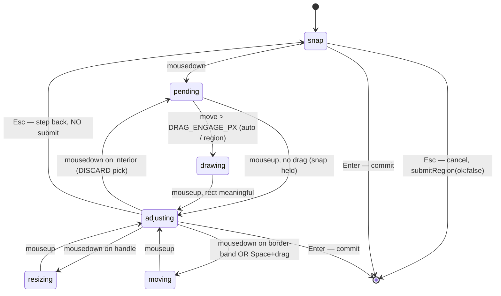

# Capture Selection-Mode Affordances — Plan

## Summary

The screen-capture overlay does not make it obvious that the user is in a
"pick something" selection mode, nor does it give a graceful way out of a
mis-pick. This plan adds three behavior changes to the region/window
selector, all renderer + CSS only:

1. **Cursor-tracking crosshair guide-lines** — thin tangerine (`var(--accent)`)
   full-viewport lines that follow the cursor across the frozen-screen overlay
   in the drawing-capable modes (Quick Capture + Region), so the selection mode
   reads unmistakably as "you are aiming at something." Suppressed in the pure
   window-picker (a crosshair implies a draw gesture window mode can't honor).
2. **Multi-step Escape** — Esc becomes a step-back. With a window/region
   committed, the first Esc clears the selection back to "pick something"
   (snap) mode and the second Esc exits the capture entirely. When nothing is
   committed yet, a single Esc still exits outright (today's behavior).
3. **Interior drag discards + redraws** — once something is picked, dragging
   the interior of the selection discards the current pick and free-draws a
   brand-new region instead of translating the existing one. Moving is
   relegated to a border drag-band plus the existing `Space`+drag and
   arrow-key nudge.

The entire change lands in
`apps/desktop/src/renderer/src/features/region/RegionSelector.tsx`,
`apps/desktop/src/renderer/src/styles/region.css`, and (for one pure helper)
`apps/desktop/src/renderer/src/features/region/region-math.ts`. No
main-process changes are required.

---

## Problem Frame

When the selector opens, the only selection-mode signal is the cursor and a
hint pill at the bottom — and the cursor is weaker than it looks. During the
aiming phase (`snap`/`pending`), `region.css` overrides the cursor to `pointer`
(`body[data-stage="region"][data-snap="window"|"display"] { cursor: pointer }`);
the native `crosshair` only reasserts in `adjusting`, after a pick is committed.
So in the exact phase where the user is choosing what to grab, the cursor is a
generic pointer with no "you are targeting" cue. New users do not realize they
can click-drag a region, and the affordance is especially weak in Quick Capture
(`auto`) and Region (`region`) modes where dragging is the primary action.

Two interaction problems compound this:

- **Escape is all-or-nothing.** Both Escape paths — the renderer's own
  `onKeyDown` (RegionSelector.tsx line 432) and the globally-forwarded
  `onSelectorKey` (line 747) — call `cancel()` unconditionally, which fires
  `submitRegion({ ok: false })` and tears the whole capture down. A user who
  accidentally clicks the wrong window has no way to back up one step; their
  only option is to abort and re-trigger capture.
- **Interior drag moves the pick.** In the `adjusting` state, an interior
  mousedown enters the `moving` sub-state (lines 542–552) and translates the
  selection. For a window snap this makes no sense — the user picked a window,
  not a draggable object — and it blocks the natural "no, let me just draw a
  region instead" gesture.

The selector is one of the densest, most-revisited subsystems in the app (see
`docs/plans/2026-05-04-001-fix-capture-flow-window-choreography-plan.md` and the
"how we keep losing this" inline comments). The state machine, the two
Escape entry points, and the macOS focus-withholding workaround are all
load-bearing and must be preserved.

---

## Scope Boundaries

In scope:

- Crosshair guide-lines in the drawing-capable modes (`auto`, `region`) as a
  "you are aiming at something" cue; suppressed in pure `window` mode.
- Multi-step Escape (step-back → exit) in the modes that have a committed
  `adjusting` state (`auto`, `region`).
- Interior-drag-discards-and-redraws for any committed selection (window snap
  or free-drawn region).
- Component + E2E test coverage for all of the above.

The three confirmed behaviors (crosshair, multi-step Escape, interior-drag
redraw) are U1–U3. After U3, `Space`+drag and arrow-key nudge are the complete
move story — nothing the user can do today becomes impossible. U4 (border
drag-band) is an **optional enhancement**, not a required deliverable: the user
framed restoring a mouse-move affordance as "if you wanted." Treat U4 as the
cut-line — ship it if cheap, defer it without blocking U1–U3 otherwise.

Out of scope (unchanged behavior):

- What actually gets captured — the commit payload shape, `fullWindow`/`screencapture -l`
  routing, scale-correction math, and `snappedWindowId` tagging in `commit()`
  are untouched.
- The post-capture float-over toast and the selector teardown choreography
  (selector still does not hide itself; `capture-handlers.ts` hides it after
  the float-over reaches `show-loaded`).
- Window enumeration / hit-testing (`window-list.ts`, `findWindowAt`).
- Main-process selector window construction and the
  `region-selector-window-flags.test.ts` guard.
- The `intent: "video"` recording variant — crosshair + Esc behavior apply,
  but no recording-specific copy or visuals change beyond what falls out of
  the shared paths.

### Instant window-picker (`window` mode) coverage

Per the resolved scope fork: the crosshair is **suppressed** in pure `window`
mode. A full crosshair is the universal "you can draw a box" cue, but window
mode commits on a single click and cannot draw — so the crosshair would teach a
gesture that does nothing. The existing window highlight is the targeting cue
there. The step-back and drag-to-redraw behaviors likewise do not apply: window
mode commits on click and has no `adjusting` state to back out of, so
multi-step Escape is a no-op there by construction.

### Deferred to Follow-Up Work

- Capture a `docs/solutions/` learnings note for the selector's Esc-step-back
  semantics, the interior-discard decision, and the crosshair, via
  `/ce-compound` after this lands. Research flagged that this heavily-revisited
  subsystem has no solution doc despite repeated incidents.

---

## High-Level Technical Design

The state machine is unchanged in shape; two transitions change meaning and
one new sub-state trigger is added. The bold edges below are the behavior
changes in this plan.

Key shape notes:

- **`adjusting --> pending` on interior mousedown** replaces today's
  `adjusting --> moving`. Routing into `pending` reuses the existing, tested
  click-vs-drag arbitration: a mouseup before `DRAG_ENGAGE_PX` re-commits the
  same selection (click = keep), and crossing the threshold enters `drawing`
  (drag = redraw). No new state is introduced.
- **Esc is state-dependent and single-sourced.** A new `handleEscape()` reads
  the live interaction kind: anything other than `snap` resets to `snap`
  client-side (no IPC); `snap` calls the existing `cancel()`. Both `onKeyDown`
  and `onSelectorKey` call `handleEscape()` so the direct and forwarded key
  paths cannot drift.
- **Crosshair lines are not part of the state machine.** They are two
  `pointer-events: none` fixed elements whose position is written directly
  from `lastMouseRef` on every `mousemove`; visibility is gated declaratively
  by `body[data-interaction]` (and suppressed when `data-mode="window"`) in CSS.
- **`adjusting --> moving`** has two triggers in the diagram: `Space`+drag
  (always available, ships in U3) and border-band drag (the **optional** U4
  path). If U4 is deferred, the border-band trigger simply does not exist;
  `Space`+drag and arrow-nudge remain the move story.

---

## Key Technical Decisions

- KTD1 — **Crosshair: direct DOM writes, not React state.** The two guide-lines
  are rendered once and repositioned by writing `style.left` / `style.top` via
  element refs inside the existing `onMouseMove` handler, reading
  `lastMouseRef`. This mirrors the component's established ref-driven design
  (global handlers registered once, reading refs) and avoids per-frame
  re-renders — critical because in `adjusting` the `onMouseMove` switch
  currently early-returns and does no `setState`. The line elements must stay
  mounted across all states (never conditionally unmounted) or the direct
  writes would target detached nodes; visibility is handled in CSS via
  `body[data-interaction="…"]` and `body[data-mode]` selectors (hidden on
  `moving`/`resizing`, and hidden entirely when `data-mode="window"`), so no
  render is needed to show/hide.
  Mirrors the crop-guide line pattern in
  `apps/desktop/src/renderer/src/features/editor/editor.css` (`.pse-crop-guide`).
  Three concrete visual decisions the implementer must not have to guess:
  - **Color/weight:** `var(--accent)` (never a hard-coded hex) at reduced
    opacity — recommend `color-mix(in srgb, var(--accent) 40%, transparent)`,
    1px on the cross axis — so the lines read as a subtle targeting aid over the
    `rgba(0,0,0,0.62)` dim mask without colliding with the solid 1.5px accent
    rect border where they cross it.
  - **Z-order:** `.region-dim` has no `z-index` and `.region-handle` is
    `z-index: 2`. Give the crosshair `z-index: 1` so it sits above the dim mask
    and frozen image but below the handles and dims-chip. Layer order:
    frozen-image (0) → dim mask (0, DOM order) → crosshair (1) → rect + interior
    (1) → handles (2) → dims-chip / hint (top).
  - **Extent:** full CSS viewport (`width: 100vw` / `height: 100vh`), consistent
    with the frozen-screenshot `` which also fills the viewport. On
    multi-display overlays the lines span the full overlay; this is intended for
    V1 (no per-display clamping).

- KTD2 — **Escape is single-sourced and step-back is client-only.** A shared
  `handleEscape()` is the only place that decides step-back vs exit. Step-back
  performs a local `resetToSnap()` (set interaction → `snap`, snap target →
  display, rect → display-snap, clear `shiftHeld`/`spaceHeld`) and must **not**
  call `submitRegion`. Only the `snap`-state branch calls `cancel()` (which
  fires `submitRegion({ ok: false })`). Rationale: per the choreography plan and
  inline guards, `submitRegion` triggers the main-side cancel choreography
  (float-over cancel → 50 ms compositor wait → `hideSelector` → previous-app
  reactivation). A step-back must stay entirely renderer-side. Both `onKeyDown`
  and `onSelectorKey` must call `handleEscape()` because macOS may withhold
  keyboard focus from the freshly-shown panel, making the forwarded path the
  only live one until the user clicks.

  **Same-tick double-fire guard (load-bearing).** Today a single physical Esc
  can fire *both* `onKeyDown` and the forwarded `onSelectorKey`, and that is
  harmless only because `cancel()` is state-independent (second call is an
  idempotent no-op after the first submits). State-dependent `handleEscape()`
  breaks that: the first call resets `interactionRef` to `snap`, then the
  second call reads `snap` and fires `cancel()` → `submitRegion` → teardown —
  i.e. one Esc from a committed pick would step back *and* exit. `handleEscape()`
  must therefore be idempotent against same-tick double-delivery: capture the
  interaction kind once, decide step-back-vs-exit, and set a short-lived guard
  (a ref flag cleared on the next macrotask / next `mousemove`) so a second
  invocation for the same press cannot fall through to `cancel()`. Whether macOS
  actually double-delivers Esc to both a focused renderer keydown and the
  registered `globalShortcut` is environment-dependent (see Open Questions); the
  guard makes the behavior correct regardless.

- KTD3 — **Interior mousedown in `adjusting` routes into `pending`, not `moving`.**
  This reuses the existing "click-outside → drop to snap → fall through to
  pending" template (lines 554–573), generalized to the interior. A click that
  does not exceed `DRAG_ENGAGE_PX` re-commits the current selection (keep); a
  drag past threshold enters `drawing` and free-draws a replacement region.
  Applies uniformly to both committed-selection shapes that can reach
  `adjusting`: an **auto-mode window snap** (`snapTarget.kind === "window"`) and
  a **free-drawn region**. Note that pure `window` mode never reaches this
  branch — it commits on click (`pending → commit`), so it has no `adjusting`
  state to discard from. The interior cursor changes from `move` to `crosshair`
  to advertise the redraw affordance.

  **Click-keeps must not lose a free-drawn rect (correctness).** The naive reuse
  of the click-outside template breaks the "keep" case for free-drawn regions: a
  free-drawn rect's committed `snapTarget` is `{ kind: "display" }`
  (`RegionSelector.tsx:724`), and the existing no-drag mouseup restores
  `rectForSnap(snapAtPress)`, which for a display target returns the **full
  display** rect — so a plain click would silently blow the user's region up to
  the whole screen, the opposite of "keep." Fix: when entering `pending` from an
  interior mousedown, stash the current committed rect (`rectRef.current`); in
  the no-drag mouseup, when `snapAtPress.kind === "display"` and a stashed rect
  exists, restore that rect instead of `rectForSnap(display)`. The window-snap
  keep case already restores correctly via `rectForSnap(window)`.

- KTD4 — **Move relocates to explicit border drag-band elements (optional unit).**
  Add thin inner-edge move-band elements carrying a `data-move` attribute,
  detected in `onMouseDown` exactly like the existing `data-handle` resize
  handles (`getHandleFromTarget` → new `getMoveBandFromTarget`). A new pure
  helper `pointInBorderBand(rect, x, y, band)` in `region-math.ts` backs the
  geometry and is unit-tested. `Space`+drag and arrow-key nudge remain as the
  always-available move affordances (they are the *complete* move story after
  U3 even if U4 never ships — see Scope Boundaries). Rationale: mirrors the
  proven, hit-test-via-`event.target` handle pattern; avoids juggling
  `document.body.style.cursor` against the handles' own hover cursors.
  - **Band width:** `MOVE_BAND_PX = 8`. With handles 10px (extending 5px outside
    / 5px inside the rect edge), the move band starts at the inner edge of the
    handle zone and reaches ~8px deeper. On selections smaller than ~40px in
    either axis the opposite-edge bands would overlap — clamp so a band never
    extends past the axis midpoint. Pin the constant with an anti-regression
    test and document the small-rect floor in `region-math.ts`.
  - **Band vs interior stacking (must resolve):** `.region-rect-interior` is
    `inset: 0; pointer-events: auto`, so it covers the whole interior including
    where the band sits. `event.target` is decided by paint order, so the band
    must win its strip — either give `.region-move-band` a higher `z-index` than
    the interior, or shrink the interior to exclude the band strip. Handle
    overlap self-resolves (handles are `z-index: 2`, so a mousedown on a handle
    yields the handle as `event.target` regardless), so the only real conflict
    to design around is band-vs-interior.

- KTD5 — **No main-process changes.** The forwarded key payload stays
  `{ key: string }` (no state, no modifiers); all step-back/exit logic lives
  renderer-side reading interaction state. Selector window construction
  (`type: 'panel'`, `setVisibleOnAllWorkspaces` ordering, `screen-saver` level,
  `setSimpleFullScreen` before `show()`) is untouched and remains pinned by
  `apps/desktop/src/main/__tests__/region-selector-window-flags.test.ts`.

---

## Implementation Units

### U1. Cursor-tracking crosshair guide-lines + component-test harness

**Goal:** Render two thin tangerine guide-lines that track the cursor across
the overlay while selecting, making the selection mode obvious. Establish the
first component test for `RegionSelector.tsx` (none exists today).

**Requirements:** Advances requirement 1 (obvious selection-mode affordance).

**Dependencies:** None.

**Files:**
- `apps/desktop/src/renderer/src/features/region/RegionSelector.tsx` (modify) —
  add `hLineRef` / `vLineRef`, render the two line elements inside
  `.region-root`, write their positions in `onMouseMove` from `lastMouseRef`;
  initialize position from the window-list snapshot `cursor` when present.
- `apps/desktop/src/renderer/src/styles/region.css` (modify) — add
  `.region-crosshair-h` / `.region-crosshair-v` per KTD1: `position: fixed`,
  `pointer-events: none`, `z-index: 1`, `color-mix(in srgb, var(--accent) 40%,
  transparent)`, 1px on the cross axis, `100vw`/`100vh` on the long axis, with
  visibility gated on `body[data-interaction]` (hidden on `moving`/`resizing`)
  AND `body[data-mode]` (hidden entirely when `data-mode="window"`).
- `apps/desktop/src/renderer/src/features/region/__tests__/RegionSelector.test.tsx`
  (create) — first component test; bootstrap the `react-dom/client` + `act`
  harness and a stubbed `window.pwrsnapApi`.

**Approach:** Follow KTD1. Add a `data-testid="region-crosshair-h"` /
`"region-crosshair-v"` to each line so component + E2E can locate them. Drive
position with direct `style` writes (no React state) at the top of
`onMouseMove`, before the interaction switch, so it runs in every state.
Visibility: lines render always, but CSS hides them when
`body[data-interaction="moving"]` or `"resizing"` (a drag is in progress and
the lines would clutter), AND whenever `body[data-mode="window"]` (the pure
window-picker cannot draw, so a crosshair there is misleading — see Scope
Boundaries); visible in `snap`/`pending`/`drawing`/`adjusting` for `auto` and
`region` modes. Never introduce a fully-transparent background region
(region.css transparent-pixel trap) and keep the lines `pointer-events: none`
so the window-level listeners still see every event.

**Patterns to follow:**
- Crop guide lines: `.pse-crop-guide.is-h` / `.is-v` in
  `apps/desktop/src/renderer/src/features/editor/editor.css` and their JSX in
  `apps/desktop/src/renderer/src/features/editor/CropTool.tsx`.
- Component-test harness: `apps/desktop/src/renderer/src/features/editor/__tests__/CropTool.test.tsx`
  (raw `react-dom/client` + `act`, dispatch native events on `window`, stub
  `window.pwrsnapApi`). The repo does **not** use `@testing-library/react`.
- Accent token: `--accent` in `apps/desktop/src/renderer/src/styles/tokens.css`.

**Test scenarios** (`RegionSelector.test.tsx`):
- Happy path: after a `mousemove` to (x, y) in `snap` mode, both crosshair
  elements exist; the vertical line's `style.left` and horizontal line's
  `style.top` reflect the cursor coordinates.
- Position update: a second `mousemove` repositions both lines to the new
  coordinates.
- Visibility by state: lines are present in `snap` and `adjusting`; assert the
  CSS-driving attribute (`body[data-interaction]`) is `moving`/`resizing` while
  a move/resize drag is active so the hide rule engages. (jsdom does not apply
  CSS, so assert the gating attribute, not computed visibility.)
- Edge case: before any `mousemove`, the component mounts without throwing and
  the lines are inert (no NaN coordinates).
- Integration: simulate an `onWindowListSnapshot` payload carrying `cursor`
  while in `snap` mode and assert the lines initialize to the scaled cursor
  position.
- Mode suppression: after an `onSelectorMode({ mode: "window" })`, assert
  `body[data-mode]` is `window` (the attribute the CSS hide rule keys on); after
  `{ mode: "auto" }` or `{ mode: "region" }` it is not, so the lines show.

**Verification:** Crosshair visibly follows the cursor in `auto` and `region`
modes and is absent in `window` mode; lines disappear during an active
move/resize drag; no console errors; existing selector E2E specs still pass.

---

### U2. Multi-step Escape (step-back → exit), single-sourced

**Goal:** Make Escape a step-back: first Esc clears a committed selection to
`snap`; second Esc exits. A single Esc still exits when nothing is committed.

**Requirements:** Advances requirement 2 (graceful exit from a mis-pick).

**Dependencies:** U1 (extends the `RegionSelector.test.tsx` harness).

**Files:**
- `apps/desktop/src/renderer/src/features/region/RegionSelector.tsx` (modify) —
  extract `resetToSnap()`; add shared, same-tick-idempotent `handleEscape()`
  (KTD2); route the `onKeyDown` Escape branch (line 432) and the `onSelectorKey`
  Escape branch (line 748) through it. **Hint copy:** the `esc` affordance is
  *not* in the per-state `hint` block — it is an unconditional trailing chip
  rendered in every state at ~lines 1008–1011 (`<kbd>esc</kbd>cancel`). Make
  that trailing chip state-dependent: `interaction.kind === "adjusting"` →
  `esc back`, else `esc cancel`. Do not add a second esc chip inside the
  `isAdjustable` branch.
- `apps/desktop/e2e/region-selector-ui.spec.ts` (modify) — rename/tighten the
  "Escape from adjusting drops back to snap mode" test to assert the two-step
  contract; update the snap-mode hint assertion at line 61 so it asserts
  `/esc.*cancel/` in snap and `/esc.*back/` in adjusting (the current single
  `/esc.*cancel/i` assertion is satisfied by the trailing chip and would break
  silently when it becomes state-dependent).
- `apps/desktop/src/renderer/src/features/region/__tests__/RegionSelector.test.tsx`
  (modify) — add Escape-semantics cases.

**Approach:** Follow KTD2. `handleEscape()`:
- if `interactionRef.current.kind !== "snap"` → `resetToSnap()` and return
  (no `submitRegion`); optionally re-snap at `lastMouseRef` for a smoother
  feel.
- else → `cancel()` (existing; fires `submitRegion({ ok: false })`).

`resetToSnap()` is the local portion of today's `cancel()` (interaction →
`snap`, snap target → display, rect → display-snap, clear `shiftHeld` /
`spaceHeld`) with the IPC call removed. `cancel()` then becomes
`submitRegion({ ok: false })` + `resetToSnap()`. Keep the existing
`event.preventDefault()` on the Escape keydown.

**Patterns to follow:** Single-sourced `commit()` / `cancel()` already called
by both key paths — mirror that structure for `handleEscape()`.

**Test scenarios:**
- Component — first Esc from `adjusting` sets `body[data-interaction]` to
  `snap`, removes handles, and does **not** call the `submitRegion` stub.
- Component — second Esc (now in `snap`) calls `submitRegion` once with
  `{ ok: false }`.
- Component — Esc while already in `snap` (nothing committed) calls
  `submitRegion({ ok: false })` on the first press (today's behavior preserved).
- Component — the **forwarded** path: invoking the captured `onSelectorKey`
  handler with `{ key: "Escape" }` from `adjusting` steps back without
  submitting, exactly like the direct keydown (parity assertion).
- Component — **same-tick double-fire (KTD2 guard):** invoking *both*
  `onKeyDown` and `onSelectorKey` with Escape in the same synchronous tick from
  `adjusting` produces exactly one step-back to `snap` and **zero**
  `submitRegion` calls — proving the guard prevents step-back-then-cancel.
- Component — Esc during an in-progress `drawing`/`pending` (mouse down, past
  or before threshold) steps back to `snap` without submitting, and the
  subsequent `mouseup` (now in `snap`) is a no-op (no stuck state).
- Edge case — the trailing hint chip reads "esc … back" while adjusting and
  "esc … cancel" while in snap.
- E2E (`region-selector-ui.spec.ts`) — drag → `adjusting`; press Esc →
  `data-interaction` is `snap` and 0 handles; press Esc again → selector
  result is `{ ok: false }` (capture the commit payload via the existing
  `ipcMain.prependListener("region-selector:result", …)` harness pattern from
  `region-selector-snap.spec.ts`). Rename the test accordingly.
- E2E (forwarded path) — from `adjusting`, drive the production-critical path
  directly: `webContents.send("region-selector:key", { key: "Escape" })` to the
  selector window → assert `data-interaction` becomes `snap` with no result;
  send it again → assert result `{ ok: false }`. This validates the path KTD2
  calls "the only live one under macOS focus-withholding," which Playwright's
  `keyboard.press` (focused-renderer keydown) does not exercise.

**Verification:** From a committed window/region, Esc returns to snap mode and
the overlay stays open; a second Esc dismisses it. From the initial snap state,
one Esc dismisses. The forwarded-key path behaves identically.

---

### U3. Interior drag discards selection and free-draws a new region

**Goal:** In `adjusting`, an interior click-drag discards the current pick and
draws a new region; a plain interior click keeps the selection. Moving no
longer happens on interior drag.

**Requirements:** Advances requirement 3 (replace, don't move, on interior drag).

**Dependencies:** U1 (for the shared `RegionSelector.test.tsx` harness). U2 may
proceed in parallel — U3 does not call into U2's Escape logic; the only shared
artifact is the test file.

**Files:**
- `apps/desktop/src/renderer/src/features/region/RegionSelector.tsx` (modify) —
  change the `onMouseDown` `adjusting` interior branch (lines 542–552) to route
  into `pending` (mirroring the click-outside fall-through) instead of
  `moving`. Preserve the handle-drag → `resizing` branch and the `Space`-held →
  `moving` branch. Update the adjusting hint copy to advertise "drag to redraw."
- `apps/desktop/src/renderer/src/styles/region.css` (modify) — change
  `.region-rect-interior` cursor from `move` to `crosshair`; add a
  `body[data-discarding="true"]` rule dimming the rect + handles (`opacity:
  0.4`) for the discard-pending feedback.
- `apps/desktop/src/renderer/src/features/region/__tests__/RegionSelector.test.tsx`
  (modify) — add interior click-vs-drag cases.
- `apps/desktop/e2e/region-selector-snap.spec.ts` (audit/modify) — confirm the
  click-commit and snap flows are unaffected; update any assertion that relies
  on interior-drag-moves.

**Approach:** Follow KTD3. When in `adjusting` and the mousedown is on the
interior (not a handle, `Space` not held), drop the committed rect by setting a
fresh `pending` interaction anchored at the mousedown point with
`snapAtPress = current snapTarget` **and stashing `rectRef.current`** (see the
KTD3 click-keeps correctness note). On `mousemove` past `DRAG_ENGAGE_PX` the
existing `pending → drawing` path free-draws; on `mouseup` without drag the
selection is kept — for a window snap via `rectForSnap(window)`, for a
free-drawn region by restoring the stashed rect (not `rectForSnap(display)`,
which would jump to full-screen). The only structural edit is the branch that
previously set `{ kind: "moving" }`; the threshold-cross and drawing machinery
are unchanged.

**Discard-pending feedback:** while the discard is staged (interior mousedown
held, before the threshold crosses), the rect still paints as committed, so the
user has no signal their pick is tentatively dropped. Stamp a `data-discarding`
attribute on `body` when entering `pending` from `adjusting`, and dim the rect +
handles (e.g. `opacity: 0.4`) via CSS while it is set; clear it on `mouseup`.
This disambiguates "I clicked to keep" from "I'm staging a redraw."

Note: U4 is optional (see Scope Boundaries). After U3, `Space`+drag and
arrow-key nudge are the complete move story — no move capability the user has
today is removed. Reflect that in the U3 hint copy (keep the `space+drag move`
chip); do not write hint copy that anticipates the U4 border-drag affordance.

**Patterns to follow:** The existing "click outside → snap → fall through to
pending" block (RegionSelector.tsx lines 554–573) is the exact template.

**Test scenarios:**
- Happy path — from `adjusting` (auto-mode window snap), interior mousedown +
  drag past threshold + mouseup produces a new free-drawn rect at the dragged
  coordinates; `snapTarget` becomes display (no longer a window snap) and
  `snappedWindowId` would not be sent on commit.
- Happy path — from `adjusting` (free-drawn region), interior drag replaces the
  rect with the newly-drawn one.
- Click-keeps (window snap) — interior mousedown + mouseup **without** crossing
  `DRAG_ENGAGE_PX` leaves the window selection intact (rect unchanged, still in
  `adjusting`, `snappedWindowId` would still commit).
- Click-keeps (free-drawn region) — same gesture on a free-drawn region keeps
  the **original drawn rect**, NOT the full-display rect. This is the regression
  guard for the KTD3 click-keeps fix; assert `style.left/top/width/height` equal
  the pre-click rect, not `displaySnapRect()`.
- Discard-pending feedback — interior mousedown sets `body[data-discarding]`;
  mouseup clears it.
- Edge case — handle mousedown in `adjusting` still enters `resizing` (not
  discard); assert via a `data-handle` target.
- Edge case — `Space`-held interior mousedown still enters `moving` (explicit
  move intent preserved).
- Edge case — a sub-threshold drag that then crosses threshold on a later move
  transitions click → redraw correctly (no stuck `pending`).
- Cursor — `.region-rect-interior` advertises `crosshair`, not `move`.

**Verification:** Picking a window then dragging its interior throws away the
window pick and rubber-bands a new region; a plain click leaves the pick alone;
resize handles and `Space`+drag still work.

---

### U4. Relocate move to a border drag-band (optional)

**Goal:** Restore a *mouse* move affordance via the selection's border. Optional
enhancement (see Scope Boundaries) — `Space`+drag and arrow nudge already cover
move after U3; this adds back a direct-drag option the user described as "if you
wanted." Ship if cheap; defer without blocking U1–U3.

**Requirements:** Supports requirement 3 (an additional, optional move path
after interior drag becomes redraw).

**Dependencies:** U3.

**Files:**
- `apps/desktop/src/renderer/src/features/region/region-math.ts` (modify) — add
  pure `pointInBorderBand(rect, x, y, band)` and a `MOVE_BAND_PX` constant.
- `apps/desktop/src/renderer/src/features/region/__tests__/region-math.test.ts`
  (modify) — unit-test the new helper.
- `apps/desktop/src/renderer/src/features/region/RegionSelector.tsx` (modify) —
  render inner-edge move-band elements with `data-move` (only while
  `adjusting`); detect them in `onMouseDown` (new `getMoveBandFromTarget`) →
  enter `moving`. Update hint copy to mention border-drag move.
- `apps/desktop/src/renderer/src/styles/region.css` (modify) — `.region-move-band`
  rules (inner edges, `pointer-events: auto`, `cursor: move`, `z-index` above
  `.region-rect-interior` so the band wins `event.target` in its strip — see
  KTD4 band-vs-interior stacking), positioned to sit between the corner/edge
  resize handles.

**Approach:** Follow KTD4 (band width `MOVE_BAND_PX = 8`, small-rect clamp,
band-vs-interior stacking). Detect the band via `event.target` `data-move`
(declarative, consistent with `data-handle`); the `pointInBorderBand` helper
backs the geometry/tests. Handle overlap self-resolves via the handles'
`z-index: 2`; the band must explicitly out-stack the `inset: 0` interior.
`moving` translation logic and the `body[data-interaction="moving"]` →
`grabbing` cursor are unchanged. If U4 ships, update the adjusting hint to add
a `border-drag move` chip.

**Patterns to follow:** Resize-handle rendering + `data-handle` detection
(`getHandleFromTarget`, `ALL_HANDLES`, `.region-handle` CSS). Pure-helper test
style in `region-math.test.ts` (`describe` per function, `VIEWPORT` fixture,
inclusive/exclusive boundary cases, constant-pinning anti-regression tests).

**Test scenarios:**
- `region-math` — `pointInBorderBand` true for a point within `band` px inside
  any edge; false for an interior point well clear of the border; false for a
  point outside the rect; boundary cases at exactly `band` px.
- `region-math` — anti-regression: `MOVE_BAND_PX` pinned to its chosen value.
- Component — mousedown on a `data-move` band enters `moving`; a drag
  translates the rect (assert `style.left`/`top` deltas) and mouseup returns to
  `adjusting`.
- Component — move-band elements are absent outside `adjusting`.
- Component — mousedown just inside the band does not discard (it moves), while
  mousedown in the deep interior discards + redraws (U3) — the two zones do not
  overlap.

**Verification:** Dragging the selection's border edge moves it; dragging the
deep interior redraws; resize handles still resize; `Space`+drag and arrow
nudge still move.

---

## Risks & Mitigations

- **Crosshair re-render storms / jank.** Driving the lines through React state
  would re-render on every `mousemove`, including in `adjusting` where the
  component currently does not. Mitigation: KTD1 direct DOM writes via refs;
  no `setState` for position; CSS-gated visibility.
- **Crosshair stealing input.** A guide-line that captures pointer events, or a
  fully-transparent overlay region, would break the window-level listeners the
  selector depends on (region.css transparent-pixel trap). Mitigation: lines
  are `pointer-events: none`; no new transparent backgrounds; the existing
  `rgba(0,0,0,0.004)` floor is preserved.
- **Two Escape paths drifting.** If only `onKeyDown` gets the step-back logic,
  the forwarded path (the only live one under macOS focus-withholding) would
  still hard-cancel. Mitigation: KTD2 single `handleEscape()`; component test
  asserts both paths.
- **Step-back accidentally tearing down.** If step-back calls `submitRegion`,
  it triggers the main-side cancel choreography and the overlay closes instead
  of stepping back. Mitigation: `resetToSnap()` is IPC-free; only the
  snap-state branch submits; component test asserts no `submitRegion` on the
  first Esc.
- **Single Esc both steps back AND exits (double-fire).** Today's
  state-independent `cancel()` makes double-delivery (direct keydown + forwarded
  globalShortcut for one press) harmless; the new state-dependent
  `handleEscape()` would step back on the first call then exit on the second.
  Mitigation: KTD2 same-tick idempotency guard; dedicated double-fire component
  test asserts one step-back, zero submits.
- **Click-keeps blows a free-drawn region up to full-screen.** Reusing the
  click-outside template verbatim restores `rectForSnap(display)` on a no-drag
  interior click of a free-drawn region — silently replacing the user's region
  with the whole display. Mitigation: KTD3 rect-stash on entering `pending`;
  explicit free-region click-keeps regression test (U3).
- **Regressing existing selector specs.** The interior change only affects an
  already-`adjusting` mousedown; the snap→adjusting→commit happy path is
  untouched. Mitigation: audit `region-selector-snap.spec.ts` and
  `region-selector-ui.spec.ts`; the existing "drag creates rect" and "arrow
  nudge" tests start from `snap` and are unaffected.
- **TypeScript strictness.** `exactOptionalPropertyTypes` is load-bearing in
  this file (see the conditional spreads in `commit()`). Mitigation: keep
  conditional-spread patterns; `import type` for type-only imports.

---

## Dependencies / Prerequisites

- Tooling: Vitest (`desktop-renderer` jsdom project) for the component test,
  Playwright for E2E (`pnpm test:desktop-e2e`). No new dependencies.
- The selector E2E specs run on every platform (pure DOM); macOS-only
  screencapture round-trips live in `region-capture.spec.ts` and are not
  affected.

---

## Open Questions

- **Does macOS deliver a single Esc press to both the focused renderer keydown
  and the registered `globalShortcut`, or does the global registration consume
  it?** This determines whether the KTD2 double-fire is reachable in production
  or only in theory. It is a device-check, not a code-read, and the KTD2 guard
  makes the behavior correct either way — so this is verify-at-implementation,
  not a blocker. Confirm on a real device during U2.
- **Does a "keep" click on an auto-mode window snap preserve `snappedWindowId`
  on a later commit?** KTD3 keeps the window selection via `rectForSnap(window)`
  and leaves `snapTarget` a window, so `snappedWindowId` should still flow at
  commit. Confirm this is the intended semantics (a keep-click does not demote a
  window snap to a plain rect) when implementing U3.

---

## Sources & Research

- `apps/desktop/src/renderer/src/features/region/RegionSelector.tsx` — the state
  machine, both Escape entry points, the interior-move branch, ref-driven
  handler design.
- `apps/desktop/src/renderer/src/styles/region.css` — cursor map, the
  transparent-pixel hit-test trap, rect/handle/interior styling.
- `apps/desktop/src/renderer/src/features/region/region-math.ts` +
  `__tests__/region-math.test.ts` — pure-helper seam and test conventions.
- `apps/desktop/src/main/capture/region-selector.ts` — globalShortcut Esc/Enter
  forwarding and the macOS focus-withholding rationale (no changes, but the
  forwarded path constrains KTD2/KTD5).
- `docs/plans/2026-05-04-001-fix-capture-flow-window-choreography-plan.md` — the
  selector/float-over lifecycle contract: `submitRegion` triggers teardown;
  the selector does not hide itself.
- `apps/desktop/src/main/__tests__/region-selector-window-flags.test.ts` — the
  window-construction guard that must keep passing (panel / simple-fullscreen /
  screen-saver / visible-on-all-workspaces ordering).
- `apps/desktop/src/renderer/src/features/editor/CropTool.tsx` +
  `__tests__/CropTool.test.tsx` + `features/editor/editor.css` — the guide-line
  render pattern and the component-test harness to mirror.
- `apps/desktop/e2e/region-selector-ui.spec.ts`,
  `apps/desktop/e2e/region-selector-snap.spec.ts` — existing E2E coverage and
  the window-list / commit-payload injection harnesses.
