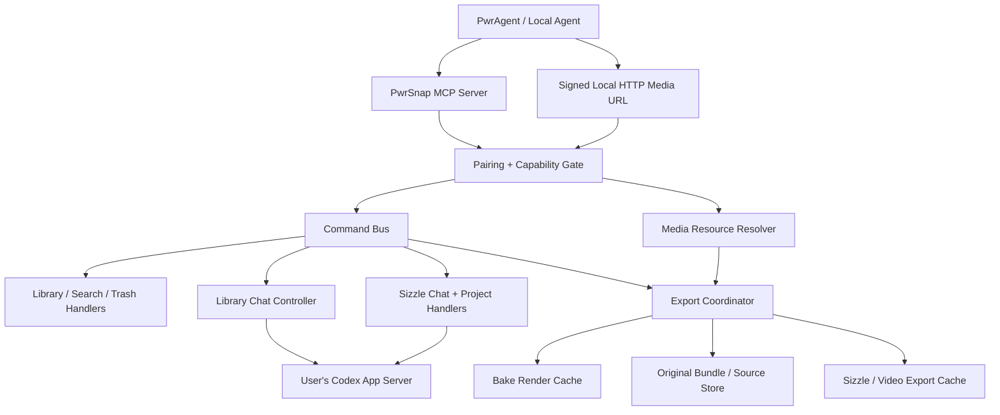

# Local Agent MCP Access for PwrSnap Library, Edits, and Sizzle Reels

## Summary

Expose PwrSnap as a local, capability-scoped MCP server so PwrAgent and
other agents on the same machine can search the library, retrieve images,
request conversions, route image edits through PwrSnap-owned Codex threads,
delete captures only into PwrSnap Trash, and create or render Sizzle Reels.

The implementation reuses the existing command bus, Library Chat tool catalog,
Sizzle Chat tool catalog, bake/render pipeline, and soft-delete model. The new
work is the external trust boundary: local pairing, capability enforcement,
MCP resources for media bytes, export/conversion verbs, and settings/audit UI.

---

## Problem Frame

PwrSnap already has the useful primitives inside the app: `library:search`,
`render:composite`, v2 layer editing tools, long-lived Library Chat threads,
project-scoped Sizzle Chat threads, and soft-delete/trash. External agents
cannot safely use them yet. A raw localhost API would expose sensitive screen
content to any local process, and original-image access can bypass redactions
shown in the composite.

The goal is to make PwrSnap an agent-native local media service without making
"local machine" equivalent to "trusted." Agents get explicit capabilities,
short-lived media grants, and PwrSnap-owned model routing. When PwrSnap has
access to Kimi or a future model and the calling agent does not, the edit still
runs through PwrSnap's configured Codex App Server connection.

---

## Requirements

**Library Search and Metadata**

- R1. External agents can search live, non-trashed captures by title,
  description, OCR text, source app, kind, date range, and OCR presence.
- R2. External agents can fetch compact capture metadata without receiving
  image bytes unless they also hold a media-read capability.
- R3. Search and metadata responses never include soft-deleted captures unless
  a future trash-read capability is added.

**Media Retrieval and Conversion**

- R4. The default image retrieval path returns the current composite with
  visible edits applied.
- R5. Original image retrieval is a separate capability because it can reveal
  content hidden by redactions or crops.
- R6. Agents can request ad hoc exports from original or composite input with
  width/height constraints, quality settings, and output formats including PNG,
  JPEG, WebP, PDF, and macOS HEIC when the local platform supports it.
- R7. Media bytes are delivered through MCP resources or short-lived signed
  local HTTP URLs, never embedded into general JSON-RPC responses for large
  artifacts.

**Image Edits**

- R8. An external agent can ask PwrSnap to edit a capture using a requested
  model name, and PwrSnap routes the request through a PwrSnap-owned Library
  Chat thread anchored to that capture.
- R9. Follow-up edit requests for the same capture can reuse the latest
  compatible PwrSnap-owned thread, with an explicit thread id override.
- R10. PwrSnap model access is authoritative for edit execution. The caller's
  own model/provider access does not limit PwrSnap-owned edits.
- R11. Agent-placed edits remain normal v2 layers so the existing editor,
  renderer, undo/reject affordances, cache invalidation, and exports see the
  same state.

**Deletion**

- R12. External agents can delete captures only by moving them into PwrSnap
  Trash via the existing soft-delete path.
- R13. External agents cannot purge a capture permanently in the first version,
  even if the calling client is paired.
- R14. PwrSnap Trash retention is standardized to 30 days for this surface and
  the existing app trash sweep is updated to match.

**Sizzle Reels**

- R15. External agents can create a Sizzle project from search results or an
  explicit capture list and start a PwrSnap-owned Sizzle Chat thread scoped to
  that project.
- R16. Sizzle mutation requests are project-scoped; an agent cannot mutate an
  unrelated project through a thread anchored to another project.
- R17. Agents can request a low-resolution preview render first, then a full
  resolution render only when explicitly requested.
- R18. Rendered reel outputs are shared through MCP resources or signed local
  HTTP URLs with capability checks.

**Local Trust Boundary**

- R19. Pairing a local agent requires a native PwrSnap approval ceremony, not
  just access to localhost.
- R20. Pairing creates a named, revocable client grant with a scoped capability
  set stored through the settings/secret substrate.
- R21. Every external request carries a client identity and capability context
  into command dispatch, media resource resolution, and audit logging.
- R22. Sensitive capability use is auditable, especially original image reads,
  export reads from original input, delete-to-trash, edit turns, and Sizzle
  full-resolution renders.

---

## Key Technical Decisions

- KTD1. MCP is the primary external agent contract; HTTP is the media fallback.
  MCP tools and resources fit PwrAgent/Codex/Claude-style agents, while signed
  HTTP URLs remain necessary for clients that need fetchable media links.

- KTD2. The command bus remains the execution floor. External MCP tools call
  command-bus verbs or existing tool-catalog dispatchers with an external
  principal and capabilities; no second library, edit, or Sizzle stack is
  introduced.

- KTD3. Composite and original are different security classes. Composite is
  the default because it reflects user-visible edits; original requires a
  distinct `capture.original.read` capability because it can bypass redaction.

- KTD4. Pairing is local approval plus per-client token, not localhost trust.
  A local browser, script, or compromised process can reach loopback. PwrSnap
  must require a user-visible grant and must support revocation.

- KTD5. Edits route through PwrSnap-owned Codex threads. The external agent is
  a requester, not the editor brain. This preserves PwrSnap model/provider
  access, existing thread persistence, and the image-edit tool allowlist.

- KTD6. Sizzle follows the same thread ownership model as image edits.
  Project-scoped Sizzle Chat already prevents cross-project mutation by
  resolving project id from the thread anchor; external requests should reuse
  that shape.

- KTD7. Export/conversion is a first-class bus surface. MCP resources should
  resolve to cached files generated by a shared export coordinator rather than
  each tool invoking sharp/ffmpeg directly.

- KTD8. External deletion is soft-delete only. Permanent purge is too easy to
  trigger accidentally from an agent loop; the UI and existing trash view remain
  the recovery path.

---

## High-Level Technical Design

External callers interact with PwrSnap through tool calls and resource reads.
Tool calls return small JSON projections, thread ids, resource URIs, or signed
URL descriptors. Actual media is streamed from a resolver that enforces the
same client grant and resource-specific capability at read time.

---

## Capability Model

Initial capabilities:

| Capability | Allows | Excludes |
|---|---|---|
| `library.read` | Search, list, metadata, OCR presence | Image bytes |
| `capture.composite.read` | Composite resource and composite-based exports | Original source bytes |
| `capture.original.read` | Original resource and original-based exports | Permanent delete |
| `capture.export` | Resize/convert permitted input classes | Source class not otherwise granted |
| `capture.edit` | PwrSnap-owned image edit chat sends | Direct DB/layer mutation outside allowlist |
| `trash.write` | `library:delete` soft-delete | `library:purge`, `library:purgeAll` |
| `sizzle.compose` | Create/update Sizzle projects through Sizzle Chat | Mutating unrelated projects |
| `sizzle.preview.read` | Low-resolution preview render resource | Full-resolution render |
| `sizzle.full.read` | Full-resolution render resource | Project mutation by itself |

The first pairing UI should ship with presets:

- **Search only:** `library.read`
- **Search and edited previews:** `library.read`, `capture.composite.read`
- **Full media access:** adds `capture.original.read` and `capture.export`
- **Editor agent:** adds `capture.edit`
- **Sizzle agent:** adds `sizzle.compose`, `sizzle.preview.read`

Full-resolution Sizzle and original-image access should be visible, separate
toggles even when a broad preset is selected.

---

## MCP Tools and Resources

### Tools

- `pwrsnap_library_search`
  - Requires: `library.read`
  - Wraps: `library:search`
  - Returns: compact rows with capture id, kind, title, description, snippet,
    source app, dimensions, captured time.

- `pwrsnap_capture_metadata`
  - Requires: `library.read`
  - Wraps: `library:byId` + `codex:enrichment`
  - Returns: metadata, accepted/suggested enrichment, tags, OCR length, and
    resource links allowed by the client grant.

- `pwrsnap_capture_resource`
  - Requires: `capture.composite.read` or `capture.original.read`
  - Returns: MCP resource URI for `variant: "composite" | "original"`.
  - Default variant is `composite`.

- `pwrsnap_capture_export`
  - Requires: `capture.export` plus the input variant's read capability.
  - Args: capture id, input variant, format, max width/height, scale, quality,
    background behavior for transparency, PDF page sizing.
  - Returns: MCP resource URI and optional signed URL.

- `pwrsnap_capture_delete_to_trash`
  - Requires: `trash.write`
  - Wraps: `library:delete`
  - Returns: deleted timestamp and restore hint.

- `pwrsnap_image_edit_send`
  - Requires: `capture.edit`
  - Args: capture id, instruction, requested model, optional thread id, reuse
    policy.
  - Wraps: Library Chat thread create/list/send substrate.
  - Returns: PwrSnap thread id, turn id, and a composite preview resource when
    the turn completes.

- `pwrsnap_sizzle_create`
  - Requires: `sizzle.compose`
  - Args: name, capture ids, optional brief/instructions.
  - Wraps: `sizzle:create`, project scene mutation, Sizzle Chat create/send.
  - Returns: project id, thread id, project view.

- `pwrsnap_sizzle_send`
  - Requires: `sizzle.compose`
  - Args: project id or thread id, instruction.
  - Wraps: Sizzle Chat send.
  - Returns: thread id and turn id.

- `pwrsnap_sizzle_render_preview`
  - Requires: `sizzle.preview.read`
  - Args: project id, low-resolution preset.
  - Returns: preview resource URI.

- `pwrsnap_sizzle_render_full`
  - Requires: `sizzle.full.read`
  - Args: project id, full-resolution preset.
  - Returns: full render resource URI.

### Resources

- `pwrsnap://capture/{captureId}/composite`
- `pwrsnap://capture/{captureId}/original`
- `pwrsnap://capture/{captureId}/export/{exportId}`
- `pwrsnap://sizzle/{projectId}/preview/{renderId}`
- `pwrsnap://sizzle/{projectId}/render/{renderId}`

Resource handlers re-check capability on read. A tool returning a resource URI
does not make the bytes readable after a grant is revoked.

---

## Implementation Units

### U1. External Principal and Capability Substrate

- **Goal:** Represent paired local clients, grants, and capabilities in one
  main-process service that command handlers and resource resolvers can query.
- **Files:**
  - `packages/shared/src/protocol.ts`
  - `apps/desktop/src/main/settings/desktop-settings-service.ts`
  - `apps/desktop/src/main/settings/desktop-secret-store.ts`
  - `apps/desktop/src/main/handlers/settings-handlers.ts`
  - `apps/desktop/src/main/handlers/settings-validators.ts`
  - `apps/desktop/src/main/command-bus.ts`
  - `apps/desktop/src/main/local-agents/local-agent-grants.ts` new
  - `apps/desktop/src/main/local-agents/local-agent-auth.ts` new
- **Patterns:** Follow the settings substrate rules in `AGENTS.md`: additive
  settings fields, secrets through `DesktopSecretStore`, serialized writes,
  broadcasts on write, validators at the bus boundary.
- **Test Scenarios:**
  - New grants persist across restart without exposing token plaintext to the
    renderer.
  - Revoking a grant prevents subsequent dispatch and resource reads.
  - Unknown capability names are rejected by settings validators.
  - A malformed or corrupted grant settings file follows the existing corrupt
    quarantine behavior.
  - Command bus context carries `principal: "mcp"` plus client id and
    capabilities without breaking existing IPC callers.
- **Verification:** Unit tests for grant parsing/storage and command-bus
  context compatibility.

### U2. Native Pairing and Settings UI

- **Goal:** Add a local pairing approval ceremony and revocation UI so the user
  can grant named external agents scoped access.
- **Files:**
  - `packages/shared/src/protocol.ts`
  - `packages/shared/src/ipc.ts`
  - `apps/desktop/src/main/handlers/settings-handlers.ts`
  - `apps/desktop/src/main/window.ts`
  - `apps/desktop/src/renderer/src/features/settings/pages/AIProvidersPage.tsx`
  - `apps/desktop/src/renderer/src/features/settings/SettingsApp.tsx`
  - `apps/desktop/src/renderer/src/features/settings/pages/LocalAgentsPage.tsx` new
  - `apps/desktop/src/renderer/src/features/settings/__tests__/LocalAgentsPage.test.tsx` new
- **Patterns:** Use Settings pages through `SettingsContext`. Window-to-renderer
  navigation uses typed event channels, never `executeJavaScript`.
- **Test Scenarios:**
  - Pairing request opens a native PwrSnap approval surface with client name,
    requested capabilities, and risk labels.
  - User approval returns a one-time pairing result to the waiting local client.
  - User denial returns a structured auth error without creating a secret.
  - Settings lists paired clients, last used time, capabilities, and revoke.
  - Original-read and full-render capabilities are visually distinct from
    lower-risk read/search capabilities.
- **Verification:** Renderer unit tests for capability display and main tests
  for approval/denial state transitions.

### U3. MCP Server Transport

- **Goal:** Run a local MCP server that exposes PwrSnap tools/resources to
  paired clients and dispatches through the capability gate.
- **Files:**
  - `apps/desktop/package.json`
  - `apps/desktop/src/main/index.ts`
  - `apps/desktop/src/main/local-agents/mcp-server.ts` new
  - `apps/desktop/src/main/local-agents/mcp-tool-registry.ts` new
  - `apps/desktop/src/main/local-agents/mcp-resource-registry.ts` new
  - `apps/desktop/src/main/local-agents/__tests__/mcp-server.test.ts` new
- **Patterns:** Keep the MCP layer as transport glue over command-bus and
  resource registries. Do not bypass existing handlers for convenience.
- **Test Scenarios:**
  - Server binds only to a local transport and refuses unpaired calls.
  - Tool schemas are generated from zod definitions and include MCP
    read-only/destructive annotations where applicable.
  - A paired client with `library.read` can search but cannot read media.
  - A paired client without `trash.write` cannot call delete-to-trash.
  - Server shutdown on app quit closes sockets and rejects in-flight requests
    cleanly.
- **Verification:** Unit tests with an in-process MCP client and fake grant
  service.

### U4. Media Export Coordinator

- **Goal:** Add a shared export/conversion coordinator for images that can
  produce cached files for MCP resources and signed HTTP URLs.
- **Files:**
  - `packages/shared/src/protocol.ts`
  - `apps/desktop/src/main/render/export-coordinator.ts` new
  - `apps/desktop/src/main/render/coordinator.ts`
  - `apps/desktop/src/main/persistence/source-store.ts`
  - `apps/desktop/src/main/handlers/render-handlers.ts`
  - `apps/desktop/src/main/__tests__/export-surface-matrix.test.ts`
  - `apps/desktop/src/main/render/__tests__/export-coordinator.test.ts` new
- **Patterns:** Use the bake render cache for composites. Use source-store or
  bundle-store paths for originals. Keep cache keys content-addressed by
  capture id, variant, edits version, dimensions, format, quality, color
  profile, and export options.
- **Test Scenarios:**
  - Composite PNG/JPEG/WebP exports include visible layers.
  - Original export excludes layers and is refused without
    `capture.original.read`.
  - JPEG export handles transparency with an explicit background.
  - PDF export creates a single-page document with expected dimensions.
  - HEIC is available on macOS when supported and returns a clear unsupported
    error elsewhere.
  - Oversize dimensions and invalid quality values are rejected before decode.
  - Repeated identical exports hit the cache.
- **Verification:** Unit tests on export options and golden-ish metadata checks
  for output format/dimensions.

### U5. Signed Local HTTP Media Fallback

- **Goal:** Serve exported media over short-lived local URLs for clients that
  cannot consume MCP resources directly.
- **Files:**
  - `apps/desktop/src/main/http-server.ts`
  - `apps/desktop/src/main/local-agents/signed-url.ts` new
  - `apps/desktop/src/main/local-agents/__tests__/signed-url.test.ts` new
  - `apps/desktop/src/main/__tests__/http-media-server.test.ts` new
- **Patterns:** Preserve Phase 7 defenses from the buildout plan: bind to
  loopback, validate Host and Origin, HMAC sign URLs, clamp dimensions, set
  `Cache-Control: private, no-store` and `X-Content-Type-Options: nosniff`.
- **Test Scenarios:**
  - Expired URL returns 403.
  - URL replay with a different Host header returns 403.
  - Revoked client grant invalidates a previously minted URL.
  - URL for original export is refused when the client lacks original-read at
    request time or read time.
  - Large media streams without buffering the entire file into JSON.
- **Verification:** HTTP integration tests using a temporary app data root.

### U6. External Library MCP Tools

- **Goal:** Implement search, metadata, composite/original resource, export,
  and delete-to-trash MCP tools.
- **Files:**
  - `apps/desktop/src/main/local-agents/library-mcp-tools.ts` new
  - `apps/desktop/src/main/ai/library-tool-allowlist.ts`
  - `apps/desktop/src/main/handlers/library-handlers.ts`
  - `apps/desktop/src/main/local-agents/__tests__/library-mcp-tools.test.ts` new
- **Patterns:** Reuse projections from `library-tool-allowlist.ts` where
  practical, but keep external tools capability-aware. External tools should
  return resource handles instead of `inputImage` content items unless the
  MCP protocol/client specifically requests inline image content.
- **Test Scenarios:**
  - Search returns the same semantic rows as `library:search` and excludes
    trash.
  - Metadata includes only resource links allowed by the grant.
  - Composite is the default resource variant.
  - Original resource requires original-read.
  - Delete-to-trash calls `library:delete` and never `library:purge`.
  - Delete-to-trash returns idempotent success or a clear already-deleted
    result for a capture already in trash.
- **Verification:** Tool-dispatch tests with mocked bus and grant service.

### U7. PwrSnap-Owned Image Edit Requests

- **Goal:** Let external agents submit edit instructions that PwrSnap executes
  through capture-anchored Library Chat threads and existing edit tools.
- **Files:**
  - `packages/shared/src/protocol.ts`
  - `apps/desktop/src/main/ai/chat-thread-store.ts`
  - `apps/desktop/src/main/ai/chat-thread-controller.ts`
  - `apps/desktop/src/main/handlers/codex-chat-handlers.ts`
  - `apps/desktop/src/main/local-agents/image-edit-mcp-tools.ts` new
  - `apps/desktop/src/main/local-agents/__tests__/image-edit-mcp-tools.test.ts` new
  - `apps/desktop/src/main/ai/__tests__/chat-thread-controller.test.ts`
- **Patterns:** Follow the Library Chat plan: dynamic tools are sticky for a
  thread, per-turn settings snapshots are frozen, approval flows route through
  existing controller plumbing, and prompt-injection defenses stay in the L1
  prompt. Thread reuse policy is service-owned, not caller-invented.
- **Test Scenarios:**
  - First edit request creates a capture-anchored PwrSnap thread.
  - Follow-up request with reuse policy reuses the latest compatible thread for
    that capture/model.
  - Explicit thread id overrides reuse when the thread is anchored to the same
    capture.
  - Explicit thread id for a different capture is rejected.
  - Requested model is passed as a PwrSnap model routing hint and does not
    require the caller to have that model.
  - Completed turn returns a fresh composite preview resource.
  - In-flight edit fails cleanly if the capture is moved to trash.
- **Verification:** Controller/store tests with fake Codex thread client and
  MCP tool tests around thread selection.

### U8. External Sizzle Requests and Preview/Full Render Resources

- **Goal:** Expose project creation, project-scoped chat sends, preview render,
  and full render to external agents.
- **Files:**
  - `packages/shared/src/protocol.ts`
  - `apps/desktop/src/main/ai/sizzle-tool-allowlist.ts`
  - `apps/desktop/src/main/handlers/sizzle-handlers.ts`
  - `apps/desktop/src/main/sizzle/composer.ts`
  - `apps/desktop/src/main/local-agents/sizzle-mcp-tools.ts` new
  - `apps/desktop/src/main/local-agents/__tests__/sizzle-mcp-tools.test.ts` new
  - `apps/desktop/src/main/ai/__tests__/sizzle-tool-allowlist.test.ts`
- **Patterns:** Preserve project scoping from `buildSizzleToolAllowlist`: the
  agent does not pass arbitrary project ids to mutation tools once a thread is
  anchored. Preview and full render are separate capabilities and cache keys.
- **Test Scenarios:**
  - Creating a Sizzle project from capture ids creates scenes in input order.
  - Creating with a brief starts a project-scoped Sizzle Chat turn.
  - A Sizzle Chat send cannot mutate a project other than the thread anchor.
  - Preview render produces a low-resolution resource and does not require
    full-render capability.
  - Full render is refused without `sizzle.full.read`.
  - Signed URL/resource read is invalidated when the client grant is revoked.
- **Verification:** Tool tests with fake project store and render coordinator;
  existing composer tests remain the render correctness backstop.

### U9. Trash Retention Standardization

- **Goal:** Change PwrSnap Trash retention from the existing 14-day references
  to 30 days and make external delete-to-trash inherit it.
- **Files:**
  - `apps/desktop/src/main/persistence/source-store.ts`
  - `apps/desktop/src/main/persistence/bundle-store.ts`
  - `apps/desktop/src/main/index.ts`
  - `packages/shared/src/protocol.ts`
  - `docs/plans/2026-05-03-001-feat-pwrsnap-feature-buildout-plan.md`
  - `docs/plans/2026-05-07-001-feat-pwrsnap-bundle-storage-plan.md`
  - `docs/plans/2026-05-07-001-feat-perf-seeder-and-library-scale-plan.md`
  - `apps/desktop/src/main/persistence/__tests__/source-store.test.ts`
  - `apps/desktop/src/main/persistence/__tests__/bundle-store.test.ts`
- **Patterns:** Keep soft-delete atomic rename behavior. Do not suggest or
  implement database wiping as recovery.
- **Test Scenarios:**
  - Trash entries newer than 30 days are retained by boot sweep.
  - Trash entries older than 30 days are purged by boot sweep.
  - Existing restore behavior still works before retention expires.
  - UI and external tool metadata report the same retention period.
- **Verification:** Persistence unit tests with controlled mtimes.

### U10. Audit Log and Activity Surfaces

- **Goal:** Record externally-triggered sensitive actions and expose them in
  Settings so the user can understand what paired agents accessed.
- **Files:**
  - `packages/shared/src/protocol.ts`
  - `apps/desktop/src/main/local-agents/local-agent-audit.ts` new
  - `apps/desktop/src/main/handlers/settings-handlers.ts`
  - `apps/desktop/src/renderer/src/features/settings/pages/LocalAgentsPage.tsx`
  - `apps/desktop/src/main/local-agents/__tests__/local-agent-audit.test.ts` new
- **Patterns:** Store metadata only. Do not log OCR text, prompts, filenames
  containing sensitive data, or image bytes. Log capture ids, project ids,
  capability used, timestamp, client id, and outcome.
- **Test Scenarios:**
  - Original-read, export-from-original, delete-to-trash, edit-send, preview
    render, and full render create audit entries.
  - Search can be summarized without storing query text by default.
  - Audit retention is bounded.
  - Revoked clients remain visible in historical audit entries as revoked.
- **Verification:** Unit tests for event shape and privacy filtering.

---

## Acceptance Examples

- AE1. A paired PwrAgent with `library.read` searches for "pairing code" and
  receives matching capture ids and snippets, but attempts to read
  `pwrsnap://capture/{id}/composite` fail with a capability error.

- AE2. A paired PwrAgent with `capture.composite.read` asks for "that capture
  as a JPG at good quality." PwrSnap returns a JPEG export resource generated
  from the composite, including arrows and redactions visible in the editor.

- AE3. The same agent asks for the original. PwrSnap refuses until the user
  grants `capture.original.read`, and the eventual read is logged as an
  original-image access.

- AE4. An agent asks, "use GPT-5.5 to add an arrow pointing at the Save
  button." PwrSnap creates or reuses a Library Chat thread anchored to that
  capture, routes the turn through PwrSnap's Codex configuration, writes normal
  v2 layers, and returns a composite preview resource.

- AE5. A follow-up says, "make that arrow thicker." PwrSnap routes to the same
  compatible capture thread unless the caller supplies a valid thread id.

- AE6. An agent deletes a capture. PwrSnap calls the soft-delete path, the
  capture appears in Trash, restore works, and no purge command is reachable
  through MCP.

- AE7. An agent creates a Sizzle Reel from five captures and asks for a preview.
  PwrSnap creates a project-scoped chat, renders a low-resolution preview, and
  refuses full-resolution render until the paired client has
  `sizzle.full.read`.

---

## Scope Boundaries

### In Scope

- Local MCP tools and resources for paired clients.
- Signed local HTTP media URLs as a compatibility layer.
- Capability-scoped pairing, revocation, and audit.
- Image exports for original/composite variants.
- PwrSnap-owned image edit and Sizzle chat requests.
- Soft-delete-only external deletion.
- Standardizing trash retention to 30 days.

### Deferred for Later

- Network/LAN sharing beyond loopback.
- Semantic embedding search.
- Batch edit macros that bypass the existing chat/tool model.
- Permanent purge through external agents.
- Trash browsing/restoration through external agents.
- Cross-device account identity or cloud SSO.

### Outside This Product's Identity

- Exposing PwrSnap's local database as a raw SQL or filesystem MCP.
- Allowing external agents to read secrets or plaintext settings.
- Letting an external agent use PwrSnap as a generic model proxy unrelated to
  PwrSnap captures or Sizzle projects.

---

## System-Wide Impact

This plan turns PwrSnap into a local service, so auth and audit become part of
the product surface. Command handlers that were previously "renderer trusted"
need capability-aware wrappers at the transport boundary. Media cache outputs
become externally addressable, so cache keys, signed URL expiry, and grant
revocation must line up.

The largest data-safety impact is original image access. Composite retrieval
matches what the user sees after edits; original retrieval can reveal hidden
content. The implementation should treat original access like a sensitive
operation even though the bytes are local.

---

## Risks and Dependencies

- **MCP transport maturity:** The exact TypeScript MCP SDK/version should be
  selected during implementation with license review before source inspection
  or dependency addition. Allowed licenses remain MIT/BSD/Apache/MPL/ISC/0BSD/
  Unlicense/CC0.
- **HEIC support:** macOS HEIC encoding may require platform-specific APIs or
  sharp/libvips support verification. The export coordinator must degrade with
  a structured unsupported-format error.
- **Prompt injection:** OCR and screenshots can contain hostile text. External
  edit requests must reuse the Library Chat prompt-injection defenses and
  content/tool separation from the existing chat plan.
- **Grant revocation races:** A URL or resource created before revocation must
  fail after revocation. Resource read time must re-check grants.
- **Long-running renders:** Sizzle full renders can outlive a single MCP call.
  The resource model should represent pending/running/done states or return a
  job id if the MCP client cannot wait.
- **User confusion over original vs composite:** The Settings UI and pairing
  prompt must make the difference concrete without burying it in technical
  wording.

---

## Documentation and Operational Notes

- Update the Phase 7 section in
  `docs/plans/2026-05-03-001-feat-pwrsnap-feature-buildout-plan.md` to point to
  this focused plan as the active external-agent access plan.
- Update trash-retention references in older plans after U9 lands so future
  agents do not reintroduce the 14-day value.
- Add a Settings help blurb explaining paired local agents, capability scopes,
  original-vs-composite access, and revocation.
- Add a short developer note near the MCP tool registry explaining that every
  external tool must declare capabilities and must not bypass the command bus.

---

## Sources and Existing Patterns

- `packages/shared/src/protocol.ts` — command contract for library search,
  render composite, chat threads, Sizzle, video export, and soft-delete.
- `packages/shared/src/ipc.ts` — typed event channels and chat event payloads.
- `apps/desktop/src/main/command-bus.ts` — single dispatch registry.
- `apps/desktop/src/main/ai/library-tool-allowlist.ts` — existing Library Chat
  tool catalog for search, metadata, render, edit, redaction, layers, and tags.
- `apps/desktop/src/main/ai/sizzle-tool-allowlist.ts` — project-scoped Sizzle
  tool catalog.
- `apps/desktop/src/main/ai/chat-thread-controller.ts` — long-lived Codex
  thread controller and approval/tool-call plumbing.
- `apps/desktop/src/main/render/coordinator.ts` — bake render cache path for
  composites.
- `apps/desktop/src/main/persistence/source-store.ts` and
  `apps/desktop/src/main/persistence/bundle-store.ts` — source/trash storage
  and sweep behavior.
- `docs/plans/2026-05-03-001-feat-pwrsnap-feature-buildout-plan.md` — original
  Phase 7 local HTTP/MCP control-plane direction.
- `docs/plans/2026-05-28-001-feat-library-chat-editor-interface-plan.md` —
  shipped Library Chat substrate and tool-catalog constraints.
- `docs/plans/2026-05-28-001-feat-sizzle-cart-and-chat-plan.md` — project
  cart and Sizzle Chat substrate.
