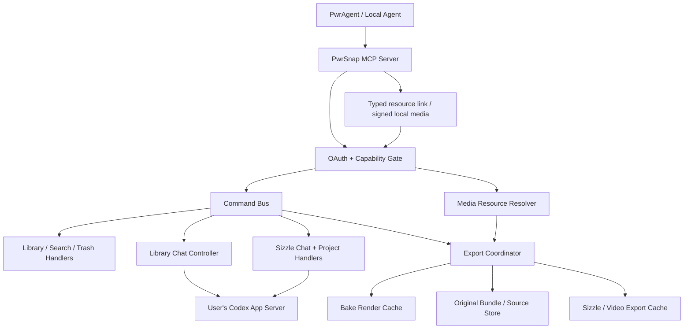

# Local Agent MCP Access for PwrSnap Library, Edits, and Sizzle Reels

## Amendment — 2026-08-01: Named Sessions and Role-Based Access Control

MCP authorization is a native PwrSnap user-presence ceremony, not a browser
consent form. The browser is an honest handoff surface: it says to continue in
PwrSnap, waits on an opaque one-time status handle, and eventually redirects
back to the registered OAuth callback. It has no approve operation and never
receives the native consent transaction id.

An OAuth software registration and a PwrSnap authorization session are
different identities. Every successful authorization creates a separately
named, revocable Session even when the same OAuth `client_id` logs in more than
once. Active Session Names are unique so audit and usage records remain
human-identifiable.

The next access-control increment borrows PwrAgent's stable-permission,
reusable-role, fail-closed resolver, danger-tier, audit, and authorization-graph
ideas. PwrSnap deliberately starts with exactly one role profile per Session.
PwrAgent's additive multi-role model works for boolean permissions, but becomes
hard to explain once roles also contain capture-age limits and sliding-window
budgets. A user can duplicate a built-in role into a custom role when a Session
needs a tailored policy.

This amendment is delivered as four native GitHub stacked PRs:

1. **Session identity and native handoff.** Unique Session Names, distinct
   authorization grants per OAuth login, and a browser page that sends the user
   into PwrSnap without accepting approval itself.
2. **RBAC policy substrate.** Stable permission definitions, built-in and
   custom role profiles, one-role-per-Session assignment, fail-closed policy
   resolution, danger tiers, and drift tests.
3. **Context and budgets.** Maximum capture age plus SQLite-backed
   sliding-window counters for search, preview reads, original/full-resolution
   reads, edits, and deletes. Authorization and accounting happen atomically at
   the execution boundary.
4. **Authorization graph UI.** A PwrAgent-style Session → Role → Permission
   graph, custom role editor, usage meters, budget windows, age-scope controls,
   and explicit rejected/unassigned end states.

## Summary

Expose PwrSnap as a local, capability-scoped MCP server so PwrAgent and
other agents on the same machine can search the library, retrieve images,
request conversions, route image edits through PwrSnap-owned Codex threads,
delete captures only into PwrSnap Trash, and create or render Sizzle Reels.

The implementation reuses the existing command bus, Library Chat tool catalog,
Sizzle Chat tool catalog, bake/render pipeline, and soft-delete model. The new
work is the external trust boundary: browser OAuth authorization, capability enforcement,
MCP resources for media bytes, export/conversion verbs, and settings/audit UI.

---

## Problem Frame

PwrSnap already has the useful primitives inside the app: `library:search`,
`render:composite`, v2 layer editing tools, long-lived Library Chat threads,
project-scoped Sizzle Chat threads, and soft-delete/trash. External agents
cannot safely use them yet. A raw localhost API would expose sensitive screen
content to any local process, and original-image access can bypass redactions
shown in the composite.

The goal is to make PwrSnap an agent-native local media service without making
"local machine" equivalent to "trusted." Agents get explicit capabilities,
short-lived media grants, and PwrSnap-owned model routing. When PwrSnap has
access to Kimi or a future model and the calling agent does not, the edit still
runs through PwrSnap's configured Codex App Server connection.

---

## Requirements

**Library Search and Metadata**

- R1. External agents can search live, non-trashed captures by title,
  description, OCR text, source app, kind, date range, and OCR presence.
- R2. External agents can fetch compact capture metadata without receiving
  image bytes unless they also hold a media-read capability.
- R3. Search and metadata responses never include soft-deleted captures unless
  a future trash-read capability is added.

**Media Retrieval and Conversion**

- R4. The default image retrieval path returns the current composite with
  visible edits applied.
- R5. Original image retrieval is a separate capability because it can reveal
  content hidden by redactions or crops.
- R6. Agents can request a PwrSnap-owned `low` / `med` / `high` export from
  original or composite input as PNG, JPEG, PDF, or macOS HEIC when the local
  platform supports it. PwrSnap owns dimensions and lossy-encoding settings.
- R7. Completed media tools attach short-lived signed localhost media through
  typed MCP `resource_link` content; canonical MCP resources are a fallback
  only for clients that genuinely support resource reads. Large artifacts are
  never embedded into general JSON-RPC responses.

**Image Edits**

- R8. An external agent can ask PwrSnap to edit a capture using a requested
  model name, and PwrSnap routes the request through a PwrSnap-owned Library
  Chat thread anchored to that capture.
- R9. Follow-up edit requests for the same capture can reuse the latest
  compatible PwrSnap-owned thread, with an explicit thread id override.
- R10. PwrSnap model access is authoritative for edit execution. The caller's
  own model/provider access does not limit PwrSnap-owned edits.
- R11. Agent-placed edits remain normal v2 layers so the existing editor,
  renderer, undo/reject affordances, cache invalidation, and exports see the
  same state.

**Deletion**

- R12. External agents can delete captures only by moving them into PwrSnap
  Trash via the existing soft-delete path.
- R13. External agents cannot purge a capture permanently in the first version,
  even if the calling client is paired.
- R14. PwrSnap Trash retention is standardized to 30 days for this surface and
  the existing app trash sweep is updated to match.

**Sizzle Reels**

- R15. External agents can create a Sizzle project from search results or an
  explicit capture list and start a PwrSnap-owned Sizzle Chat thread scoped to
  that project.
- R16. Sizzle mutation requests are project-scoped; an agent cannot mutate an
  unrelated project through a thread anchored to another project.
- R17. Agents can request a low-resolution preview render first, then a full
  resolution render only when explicitly requested.
- R18. Rendered reel outputs are delivered through typed MCP `resource_link`
  content with capability checks; canonical MCP resources remain a fallback
  for real MCP resource readers.

**Local Trust Boundary**

- R19. Authorizing a local agent requires a native PwrSnap approval window, not
  just access to localhost. The loopback browser page can initiate and observe
  a pending request, but it cannot inspect or submit the approval decision.
- R20. OAuth authorization creates a uniquely named, revocable Session grant
  stored through the settings/secret substrate. OAuth software registration is
  retained separately so repeated logins never overwrite an earlier Session.
- R21. Every external request carries a client identity and capability context
  into command dispatch, media resource resolution, and audit logging.
- R22. Protected agent actions are auditable, especially original image reads,
  export reads from original input, delete-to-trash, edit turns, and Sizzle
  full-resolution renders.
- R23. Every active Session resolves through exactly one reusable role profile;
  missing roles, unknown permissions, malformed limits, and unassigned Sessions
  fail closed.
- R24. A role can restrict captures to a maximum age. The default read/search
  lookback is 7 days; explicit profiles can widen it to 14 days, 30 days, or all
  time.
- R25. A role can define sliding-window budgets independently for searches,
  composite/preview reads, original/full-resolution reads, edits, and deletes.
  Denied attempts do not consume budget; successful protected actions do.
- R26. Budget checks and usage recording are atomic at the action boundary so
  concurrent agents cannot exceed a limit through a check-then-write race.
- R27. Settings shows Session → Role → Permission relationships, current usage,
  remaining allowance, reset horizon, and a visible rejected state for any
  Session without a valid role.

---

## Key Technical Decisions

- KTD1. MCP is the external agent contract. Completed media tools use typed
  `resource_link` content as the primary binary handoff; the signed localhost
  URI remains inside that link for direct client pass-through. A canonical MCP
  resource URI is only the fallback for clients that genuinely support
  `resources/read`.

- KTD2. The command bus remains the execution floor. External MCP tools call
  command-bus verbs or existing tool-catalog dispatchers with an external
  principal and capabilities; no second library, edit, or Sizzle stack is
  introduced.

- KTD3. Composite and original are different security classes. Composite is
  the default because it reflects user-visible edits; original requires a
  distinct `capture.original.read` capability because it can bypass redaction.

- KTD4. Authorization is native PwrSnap consent plus a per-Session token, not
  localhost trust. A local browser, script, or compromised process can reach
  loopback. The browser only carries an opaque status handle; the decision is
  accepted through IPC from the exact native approval window created for it.
  OAuth clients are public clients and use authorization code + PKCE; no client
  secret is generated or stored.

- KTD5. Edits route through PwrSnap-owned Codex threads. The external agent is
  a requester, not the editor brain. This preserves PwrSnap model/provider
  access, existing thread persistence, and the image-edit tool allowlist.

- KTD6. Sizzle follows the same thread ownership model as image edits.
  Project-scoped Sizzle Chat already prevents cross-project mutation by
  resolving project id from the thread anchor; external requests should reuse
  that shape.

- KTD7. Export/conversion is a first-class bus surface. MCP resources should
  resolve to cached files generated by a shared export coordinator rather than
  each tool invoking sharp/ffmpeg directly.

- KTD8. External deletion is soft-delete only. Permanent purge is too easy to
  trigger accidentally from an agent loop; the UI and existing trash view remain
  the recovery path.

- KTD9. Match PwrAgent's current general agent-tool transport: Streamable HTTP
  MCP with a stateless transport created per request. Bind only to the stable
  endpoint `http://127.0.0.1:51729/mcp`; if the port is occupied, disable local
  agent access and show a clear error instead of silently selecting another
  port. Do not add a generic stdio bridge; PwrAgent's remaining stdio command is
  a narrow legacy automation-inspection path, not its current agent-tool
  architecture. MCP authorization uses RFC 9728 protected-resource metadata,
  OAuth authorization-server metadata, dynamic client registration, PKCE, and
  resource indicators. There is no discovery file or custom pairing endpoint.

- KTD10. PwrSnap roles are reusable policy profiles with stable ids and stable
  permission names. Built-ins are immutable; custom roles are editable. The
  resolver is a pure, deny-by-default function whose output is the only policy
  context carried into tools and resource reads.

- KTD11. One role per Session is intentional for the first budgeted model.
  Boolean permissions, age horizons, and numeric budgets remain legible without
  inventing surprising multi-role merge arithmetic.

- KTD12. Configuration belongs in `DesktopSettingsService`; tokens remain in
  `DesktopSecretStore`; high-volume usage events belong in SQLite. Settings JSON
  is not a counter store, and a second plaintext policy file is not introduced.

---

## High-Level Technical Design

```mermaid
flowchart TB
  Agent[PwrAgent / Local Agent] --> MCP[PwrSnap MCP Server]
  MCP --> HTTP[Typed resource link / signed local media]

  MCP --> Pairing[OAuth + Capability Gate]
  HTTP --> Pairing

  Pairing --> Bus[Command Bus]
  Pairing --> Media[Media Resource Resolver]

  Bus --> Library[Library / Search / Trash Handlers]
  Bus --> Chat[Library Chat Controller]
  Bus --> Sizzle[Sizzle Chat + Project Handlers]
  Bus --> Export[Export Coordinator]

  Media --> Export
  Export --> Bake[Bake Render Cache]
  Export --> Source[Original Bundle / Source Store]
  Export --> Video[Sizzle / Video Export Cache]

  Chat --> Codex[User's Codex App Server]
  Sizzle --> Codex
```

External callers interact with PwrSnap through tool calls and resource reads.
Tool calls return small JSON projections, thread ids, canonical resource URIs,
or typed MCP resource links. Actual media is streamed from a resolver that
enforces the same client grant and resource-specific capability at read time.

---

## Capability Model

Initial capabilities:

| Capability | Allows | Excludes |
|---|---|---|
| `library.read` | Search, list, metadata, OCR presence | Image bytes |
| `capture.composite.read` | Composite resource and composite-based exports | Original source bytes |
| `capture.original.read` | Original resource and original-based exports | Permanent delete |
| `capture.export` | Resize/convert permitted input classes | Source class not otherwise granted |
| `capture.edit` | PwrSnap-owned image edit chat sends | Direct DB/layer mutation outside allowlist |
| `trash.write` | `library:delete` soft-delete | `library:purge`, `library:purgeAll` |
| `sizzle.compose` | Create/update Sizzle projects through Sizzle Chat | Mutating unrelated projects |
| `sizzle.preview.read` | Low-resolution preview render resource | Full-resolution render |
| `sizzle.full.read` | Full-resolution render resource | Project mutation by itself |

The first pairing UI should ship with presets:

- **Search only:** `library.read`
- **Search and edited-media retrieval:** `library.read`, `capture.composite.read`
- **Full media access:** adds `capture.original.read` and `capture.export`
- **Editor agent:** adds `capture.edit`
- **Sizzle agent:** adds `sizzle.compose`, `sizzle.preview.read`

Full-resolution Sizzle and original-image access should be visible, separate
toggles even when a broad preset is selected.

---

## MCP Tools and Resources

### Tools

- `pwrsnap_library_search`
  - Requires: `library.read`
  - Wraps: `library:search`
  - Returns structural summary rows by default. Callers opt into `detail:
    "enriched"` to receive generated titles, descriptions, tags, and match
    snippets. This keeps unqualified listing calls from disclosing indexed
    content unnecessarily.
  - Human application names (`sourceAppNames`, such as `"Claude"`) are the
    only source-app search filter. Bundle IDs remain optional read-only
    metadata in discovery/search results, not MCP request parameters.
  - Exact accepted-tag filtering uses `tagFilter: { labels, match }`, where
    `match` explicitly selects `"any"` or `"all"`. Accepted tags also enter
    full-text search. Ordering can be `relevance`, `newest`, or `oldest`;
    query searches default to relevance and no-query searches to newest.
  - MCP responses default to 25 rows and cap at 50. They report `hasMore` so
    callers can narrow filters instead of bloating their transcript.

- `pwrsnap_library_discover`
  - Requires: `library.read`
  - Wraps: `library:discover`
  - Returns live-only human application and accepted-tag facets ordered by
    volume, with `mostRecentCapturedAt`. Application `name` is reusable as a
    `sourceAppNames` value; `bundleId` is included only when known
    unambiguously.
  - MCP responses default to 25 applications and 25 tags, cap each list at
    50, and report per-list `hasMore` flags.

- `pwrsnap_capture_metadata`
  - Requires: `library.read`
  - Wraps: `library:byId` + `codex:enrichment`
  - Returns: compact capture metadata, its resolved title/description, accepted
    tags, and OCR length. It never returns media handles; callers use
    `pwrsnap_capture_resource`.

- `pwrsnap_capture_resource`
  - Requires: `capture.composite.read` or `capture.original.read`
  - Returns: a typed MCP `resource_link` for direct binary delivery and a
    canonical MCP resource URI fallback for `variant: "composite" |
    "original"`. The signed localhost URI exists only inside the typed link.
  - Default variant is `composite`.

- `pwrsnap_capture_export`
  - Requires: `capture.export` plus the input variant's read capability.
  - Args: capture id, input variant, PwrSnap `low` / `med` / `high` preset,
    and output format.
  - Returns: a typed MCP `resource_link` for direct binary delivery plus a
    canonical MCP resource URI fallback.

- `pwrsnap_capture_delete_to_trash`
  - Requires: `trash.write`
  - Wraps: `library:delete`
  - Returns: deleted timestamp and restore hint.

- `pwrsnap_image_edit_send`
  - Requires: `capture.edit`
  - Args: capture id, instruction, requested PwrSnap provider/model, optional
    thread id, reuse policy.
  - Wraps: Library Chat thread create/list/send substrate.
  - Returns: PwrSnap thread id, turn id, and status only.

- `pwrsnap_image_edit_status`
  - Requires: `capture.edit`
  - Args: capture id and PwrSnap thread id.
  - Returns: the persistent thread status only. Once idle, callers retrieve
    the current edited composite through `pwrsnap_capture_resource`.

- `pwrsnap_sizzle_create`
  - Requires: `sizzle.compose`
  - Args: name, capture ids, optional brief/instructions and PwrSnap
    provider/model.
  - Wraps: `sizzle:create`, project scene mutation, Sizzle Chat create/send.
  - Returns: a compact receipt: project id, name, scene count, thread id, and
    turn id.

- `pwrsnap_sizzle_send`
  - Requires: `sizzle.compose`
  - Args: project id, instruction, and an optional thread id.
  - Wraps: Sizzle Chat send.
  - Returns: thread id and turn id.

- `pwrsnap_sizzle_status`
  - Requires: `sizzle.compose`
  - Args: project id and PwrSnap thread id.
  - Returns: the persistent project-scoped composition thread status.

- `pwrsnap_sizzle_render_preview`
  - Requires: `sizzle.preview.read`
  - Args: project id.
  - Returns: a typed MCP `resource_link` plus canonical resource URI fallback.

- `pwrsnap_sizzle_render_full`
  - Requires: `sizzle.full.read`
  - Args: project id.
  - Returns: a typed MCP `resource_link` plus canonical resource URI fallback.

### Resources

- `pwrsnap://capture/{captureId}/composite`
- `pwrsnap://capture/{captureId}/original`
- `pwrsnap://capture/{captureId}/export/{exportId}`
- `pwrsnap://sizzle/{projectId}/{mode}/{renderId}`

Resource handlers re-check capability on read. A tool returning a resource URI
does not make the bytes readable after a grant is revoked.

Completed media tools return a typed `resource_link` with a short-lived signed
localhost URI; clients pass that link directly to their media handler and never
copy, reconstruct, print, or persist its URI. A canonical `pwrsnap://` URI is
the fallback only for clients that explicitly support MCP `resources/read`.
Clients must read only a URI returned by a completed media tool, never construct
one from a resource template. Signed URLs are bearer secrets and must not be
logged, persisted, or shared.

---

## Implementation Units

### U1. External Principal and Capability Substrate

- **Goal:** Represent paired local clients, grants, and capabilities in one
  main-process service that command handlers and resource resolvers can query.
- **Files:**
  - `packages/shared/src/protocol.ts`
  - `apps/desktop/src/main/settings/desktop-settings-service.ts`
  - `apps/desktop/src/main/settings/desktop-secret-store.ts`
  - `apps/desktop/src/main/handlers/settings-handlers.ts`
  - `apps/desktop/src/main/handlers/settings-validators.ts`
  - `apps/desktop/src/main/command-bus.ts`
  - `apps/desktop/src/main/local-agents/local-agent-grants.ts` new
  - `apps/desktop/src/main/local-agents/local-agent-auth.ts` new
- **Patterns:** Follow the settings substrate rules in `AGENTS.md`: additive
  settings fields, secrets through `DesktopSecretStore`, serialized writes,
  broadcasts on write, validators at the bus boundary.
- **Test Scenarios:**
  - New grants persist across restart without exposing token plaintext to the
    renderer.
  - Revoking a grant prevents subsequent dispatch and resource reads.
  - Unknown capability names are rejected by settings validators.
  - A malformed or corrupted grant settings file follows the existing corrupt
    quarantine behavior.
  - Command bus context carries `principal: "mcp"` plus client id and
    capabilities without breaking existing IPC callers.
- **Verification:** Unit tests for grant parsing/storage and command-bus
  context compatibility.

### U2. Native OAuth Consent and Settings UI

- **Goal:** Add a native OAuth approval ceremony and revocation UI so the user
  can create uniquely named Sessions with scoped access. The browser only
  explains that approval continues in PwrSnap and observes completion through
  an opaque, expiring status handle.
- **Files:**
  - `packages/shared/src/protocol.ts`
  - `packages/shared/src/ipc.ts`
  - `apps/desktop/src/main/handlers/settings-handlers.ts`
  - `apps/desktop/src/main/local-agents/local-agent-oauth.ts` new
  - `apps/desktop/src/renderer/src/features/settings/pages/AIProvidersPage.tsx`
  - `apps/desktop/src/renderer/src/features/settings/SettingsApp.tsx`
  - `apps/desktop/src/renderer/src/features/settings/pages/LocalAgentsPage.tsx` new
  - `apps/desktop/src/renderer/src/features/settings/__tests__/LocalAgentsPage.test.tsx` new
- **Patterns:** Treat the native consent broker as the user-presence boundary.
  Bind each request to the exact BrowserWindow that displays it; do not add an
  HTTP approval verb. Use OAuth authorization code + PKCE, public dynamic
  clients, exact resource indicators, and no client secrets. Keep OAuth
  software registration separate from Session grants. Use Settings pages
  through `SettingsContext` for grant review/revocation.
- **Test Scenarios:**
  - `codex mcp login pwrsnap` opens a browser handoff page and a native PwrSnap
    approval window with an editable Session Name, client-reported label,
    requested capabilities, and concrete effect descriptions.
  - Loopback HTTP can neither manufacture nor submit an approval, and the
    browser status handle does not reveal the native consent transaction id.
  - Reauthorizing the same OAuth client creates a distinct Session and does not
    overwrite or reactivate an earlier grant.
  - User approval returns a short-lived authorization code to the registered
    loopback callback; token exchange requires the original PKCE verifier.
  - User denial returns an OAuth `access_denied` response without creating a
    grant or secret.
  - Settings lists authorized clients, last used time, capabilities, and revoke.
  - Original-read and full-render capabilities are visually distinct from
    lower-risk read/search capabilities.
- **Verification:** Renderer unit tests for capability display and main tests
  for approval/denial state transitions.

### U2.1. Role Profiles, Context Scope, and Usage Budgets

- **Goal:** Replace per-Session checkbox snapshots with reusable role profiles
  and enforce contextual constraints at every MCP execution boundary.
- **Configuration:** Built-in/custom roles and Session assignments extend the
  shared `Settings` schema. Tokens continue through `DesktopSecretStore`.
- **Usage ledger:** A new SQLite migration stores normalized successful action
  events keyed by Session id, action class, timestamp, and optional resource id.
  Indexed range counts support true sliding windows and future audit drill-down.
- **Resolver output:** Session id/name, role id/name, allowed capability set,
  maximum capture age, and typed budgets. Unknown or malformed inputs resolve to
  an explicit rejection rather than a partially authorized context.
- **Enforcement:**
  - Search clamps its date range to the resolved age horizon.
  - Metadata and media reads reject captures outside that horizon even when the
    caller learned an id or retained a signed URL earlier.
  - Search, preview/composite, original/full-resolution, edit, and delete action
    classes consume independent sliding-window budgets.
  - The authorize-and-record operation is transactional for concurrency safety.
- **Verification:** Pure resolver matrix and built-in drift tests; SQLite
  boundary/expiry/concurrency tests; MCP tool/resource tests proving age and
  budget checks cannot be bypassed through alternate read paths.

### U2.2. Authorization Graph

- **Goal:** Make effective access understandable at a glance using the visual
  language of PwrAgent's authorization graph.
- **Columns:** Sessions, role profiles, and permissions/constraints. Curved
  connections show the effective path; invalid or unassigned Sessions terminate
  in a visible rejected state.
- **Role editor:** Duplicate built-ins, rename custom roles, toggle permissions,
  set capture age, and configure action count/window pairs. Dangerous access
  (originals, deletes, full-resolution renders, unbounded history) receives a
  stronger visual tier and confirmation.
- **Usage:** Each budget shows used/limit, window duration, remaining allowance,
  and when the oldest counted event leaves the window. Revocation remains
  immediate and invalidates media reads as well as tool calls.
- **Verification:** Renderer tests for graph paths and rejected states, role
  editing/validation tests, and desktop E2E for Session assignment, live usage,
  and immediate revocation.

### U3. MCP Server Transport

- **Goal:** Run a fixed-port local MCP server that exposes PwrSnap
  tools/resources to authorized clients and dispatches through the capability
  gate.
- **Files:**
  - `apps/desktop/package.json`
  - `apps/desktop/src/main/index.ts`
  - `apps/desktop/src/main/local-agents/mcp-server.ts` new
  - `apps/desktop/src/main/local-agents/mcp-tool-registry.ts` new
  - `apps/desktop/src/main/local-agents/mcp-resource-registry.ts` new
  - `apps/desktop/src/main/local-agents/__tests__/mcp-server.test.ts` new
- **Patterns:** Keep the MCP layer as transport glue over command-bus and
  resource registries. Mirror PwrAgent's stateless per-request Streamable HTTP
  transport, bind to `127.0.0.1:51729`, enforce the exact Host and loopback
  Origin, use OAuth bearer authentication, and bound request bodies. Do not
  bypass existing handlers for convenience.
- **Test Scenarios:**
  - Server binds only to the fixed loopback endpoint and refuses unauthorized
    calls.
  - Protected-resource and authorization-server metadata support normal MCP
    OAuth discovery and advertise only implemented grant/auth methods.
  - Approved client metadata and access remain valid after PwrSnap restarts.
  - Tool schemas are generated from zod definitions and include MCP
    read-only/destructive annotations where applicable.
  - A paired client with `library.read` can search but cannot read media.
  - A paired client without `trash.write` cannot call delete-to-trash.
  - Server shutdown on app quit closes sockets and rejects in-flight requests
    cleanly.
- **Verification:** Unit tests with an in-process MCP client and fake grant
  service.

### U4. Media Export Coordinator

- **Goal:** Add a shared export/conversion coordinator for images that can
  produce cached files for MCP resources and signed HTTP URLs.
- **Files:**
  - `packages/shared/src/protocol.ts`
  - `apps/desktop/src/main/render/export-coordinator.ts` new
  - `apps/desktop/src/main/render/coordinator.ts`
  - `apps/desktop/src/main/persistence/source-store.ts`
  - `apps/desktop/src/main/handlers/render-handlers.ts`
  - `apps/desktop/src/main/__tests__/export-surface-matrix.test.ts`
  - `apps/desktop/src/main/render/__tests__/export-coordinator.test.ts` new
- **Patterns:** Use the bake render cache for composites. Use source-store or
  bundle-store paths for originals. Keep cache keys content-addressed by
  capture id, variant, edits version, dimensions, format, quality, color
  profile, and export options.
- **Test Scenarios:**
  - Composite PNG/JPEG/WebP exports include visible layers.
  - Original export excludes layers and is refused without
    `capture.original.read`.
  - JPEG export handles transparency with an explicit background.
  - PDF export creates a single-page document with expected dimensions.
  - HEIC is available on macOS when supported and returns a clear unsupported
    error elsewhere.
  - Oversize dimensions and invalid quality values are rejected before decode.
  - Repeated identical exports hit the cache.
- **Verification:** Unit tests on export options and golden-ish metadata checks
  for output format/dimensions.

### U5. Typed Resource-Link Media Delivery

- **Goal:** Serve exported media over short-lived local URLs referenced only by
  typed MCP `resource_link` content. Canonical MCP resource reads are retained
  only as a fallback for clients that genuinely support them.
- **Files:**
  - `apps/desktop/src/main/http-server.ts`
  - `apps/desktop/src/main/local-agents/signed-url.ts` new
  - `apps/desktop/src/main/local-agents/__tests__/signed-url.test.ts` new
  - `apps/desktop/src/main/__tests__/http-media-server.test.ts` new
- **Patterns:** Preserve Phase 7 defenses from the buildout plan: bind to
  loopback, validate Host and Origin, HMAC sign URLs, clamp dimensions, set
  `Cache-Control: private, no-store` and `X-Content-Type-Options: nosniff`.
- **Test Scenarios:**
  - Expired URL returns 403.
  - URL replay with a different Host header returns 403.
  - Revoked client grant invalidates a previously minted URL.
  - URL for original export is refused when the client lacks original-read at
    request time or read time.
  - Large media streams without buffering the entire file into JSON.
- **Verification:** HTTP integration tests using a temporary app data root.

### U6. External Library MCP Tools

- **Goal:** Implement search, metadata, composite/original resource, export,
  and delete-to-trash MCP tools.
- **Files:**
  - `apps/desktop/src/main/local-agents/library-mcp-tools.ts` new
  - `apps/desktop/src/main/ai/library-tool-allowlist.ts`
  - `apps/desktop/src/main/handlers/library-handlers.ts`
  - `apps/desktop/src/main/local-agents/__tests__/library-mcp-tools.test.ts` new
- **Patterns:** Reuse projections from `library-tool-allowlist.ts` where
  practical, but keep external tools capability-aware. External tools should
  return resource handles instead of `inputImage` content items unless the
  MCP protocol/client specifically requests inline image content.
- **Test Scenarios:**
  - Search returns the same semantic rows as `library:search` and excludes
    trash.
  - Metadata returns no media handles; the capture-resource tool is the sole
    normal media issuer.
  - Composite is the default resource variant.
  - Original resource requires original-read.
  - Delete-to-trash calls `library:delete` and never `library:purge`.
  - Delete-to-trash returns idempotent success or a clear already-deleted
    result for a capture already in trash.
- **Verification:** Tool-dispatch tests with mocked bus and grant service.

### U7. PwrSnap-Owned Image Edit Requests

- **Goal:** Let external agents submit edit instructions that PwrSnap executes
  through capture-anchored Library Chat threads and existing edit tools.
- **Files:**
  - `packages/shared/src/protocol.ts`
  - `apps/desktop/src/main/ai/chat-thread-store.ts`
  - `apps/desktop/src/main/ai/chat-thread-controller.ts`
  - `apps/desktop/src/main/handlers/codex-chat-handlers.ts`
  - `apps/desktop/src/main/local-agents/image-edit-mcp-tools.ts` new
  - `apps/desktop/src/main/local-agents/__tests__/image-edit-mcp-tools.test.ts` new
  - `apps/desktop/src/main/ai/__tests__/chat-thread-controller.test.ts`
- **Patterns:** Follow the Library Chat plan: dynamic tools are sticky for a
  thread, per-turn settings snapshots are frozen, approval flows route through
  existing controller plumbing, and prompt-injection defenses stay in the L1
  prompt. Thread reuse policy is service-owned, not caller-invented.
- **Test Scenarios:**
  - First edit request creates a capture-anchored PwrSnap thread.
  - Follow-up request with reuse policy reuses the latest compatible thread for
    that capture/model.
  - Explicit thread id overrides reuse when the thread is anchored to the same
    capture.
  - Explicit thread id for a different capture is rejected.
  - Requested model is passed as a PwrSnap model routing hint and does not
    require the caller to have that model.
  - Completed turn returns idle status; `pwrsnap_capture_resource` then returns
    the fresh current composite through the canonical media-delivery path.
  - In-flight edit fails cleanly if the capture is moved to trash.
- **Verification:** Controller/store tests with fake Codex thread client and
  MCP tool tests around thread selection.

### U8. External Sizzle Requests and Preview/Full Render Resources

- **Goal:** Expose project creation, project-scoped chat sends, preview render,
  and full render to external agents.
- **Files:**
  - `packages/shared/src/protocol.ts`
  - `apps/desktop/src/main/ai/sizzle-tool-allowlist.ts`
  - `apps/desktop/src/main/handlers/sizzle-handlers.ts`
  - `apps/desktop/src/main/sizzle/composer.ts`
  - `apps/desktop/src/main/local-agents/sizzle-mcp-tools.ts` new
  - `apps/desktop/src/main/local-agents/__tests__/sizzle-mcp-tools.test.ts` new
  - `apps/desktop/src/main/ai/__tests__/sizzle-tool-allowlist.test.ts`
- **Patterns:** Preserve project scoping from `buildSizzleToolAllowlist`: the
  agent does not pass arbitrary project ids to mutation tools once a thread is
  anchored. Preview and full render are separate capabilities and cache keys.
- **Test Scenarios:**
  - Creating a Sizzle project from capture ids creates scenes in input order.
  - Creating with a brief starts a project-scoped Sizzle Chat turn.
  - A Sizzle Chat send cannot mutate a project other than the thread anchor.
  - Preview render produces a low-resolution resource and does not require
    full-render capability.
  - Full render is refused without `sizzle.full.read`.
  - Signed URL/resource read is invalidated when the client grant is revoked.
- **Verification:** Tool tests with fake project store and render coordinator;
  existing composer tests remain the render correctness backstop.

### U9. Trash Retention Standardization

- **Goal:** Change PwrSnap Trash retention from the existing 14-day references
  to 30 days and make external delete-to-trash inherit it.
- **Files:**
  - `apps/desktop/src/main/persistence/source-store.ts`
  - `apps/desktop/src/main/persistence/bundle-store.ts`
  - `apps/desktop/src/main/index.ts`
  - `packages/shared/src/protocol.ts`
  - `docs/plans/2026-05-03-001-feat-pwrsnap-feature-buildout-plan.md`
  - `docs/plans/2026-05-07-001-feat-pwrsnap-bundle-storage-plan.md`
  - `docs/plans/2026-05-07-001-feat-perf-seeder-and-library-scale-plan.md`
  - `apps/desktop/src/main/persistence/__tests__/source-store.test.ts`
  - `apps/desktop/src/main/persistence/__tests__/bundle-store.test.ts`
- **Patterns:** Keep soft-delete atomic rename behavior. Do not suggest or
  implement database wiping as recovery.
- **Test Scenarios:**
  - Trash entries newer than 30 days are retained by boot sweep.
  - Trash entries older than 30 days are purged by boot sweep.
  - Existing restore behavior still works before retention expires.
  - UI and external tool metadata report the same retention period.
- **Verification:** Persistence unit tests with controlled mtimes.

### U10. Audit Log and Activity Surfaces

- **Goal:** Record externally-triggered protected actions and expose them in
  Settings so the user can understand what authorized agents accessed.
- **Files:**
  - `packages/shared/src/protocol.ts`
  - `apps/desktop/src/main/local-agents/local-agent-audit.ts` new
  - `apps/desktop/src/main/handlers/settings-handlers.ts`
  - `apps/desktop/src/renderer/src/features/settings/pages/LocalAgentsPage.tsx`
  - `apps/desktop/src/main/local-agents/__tests__/local-agent-audit.test.ts` new
- **Patterns:** Store metadata only. Do not log OCR text, prompts, filenames
  containing sensitive data, or image bytes. Log capture ids, project ids,
  capability used, timestamp, client id, and outcome.
- **Test Scenarios:**
  - Original-read, export-from-original, delete-to-trash, edit-send, preview
    render, and full render create audit entries.
  - Search can be summarized without storing query text by default.
  - Audit retention is bounded.
  - Revoked clients remain visible in historical audit entries as revoked.
- **Verification:** Unit tests for event shape and privacy filtering.

---

## Acceptance Examples

- AE1. An authorized PwrAgent with `library.read` searches for "pairing code" and
  receives matching capture ids and snippets, but attempts to read
  `pwrsnap://capture/{id}/composite` fail with a capability error.

- AE2. An authorized PwrAgent with `capture.composite.read` and
  `capture.export` asks for "that capture as a medium JPEG." PwrSnap returns a
  JPEG export generated from the composite, including arrows and redactions
  visible in the editor.

- AE3. The same agent asks for the original. PwrSnap refuses until the user
  grants `capture.original.read`, and the eventual read is logged as an
  original-image access.

- AE4. An agent asks, "use GPT-5.5 to add an arrow pointing at the Save
  button." PwrSnap creates or reuses a Library Chat thread anchored to that
  capture, routes the turn through PwrSnap's Codex configuration, writes normal
  v2 layers. Once its thread is idle, the agent retrieves the current composite
  through `pwrsnap_capture_resource`.

- AE5. A follow-up says, "make that arrow thicker." PwrSnap routes to the same
  compatible capture thread unless the caller supplies a valid thread id.

- AE6. An agent deletes a capture. PwrSnap calls the soft-delete path, the
  capture appears in Trash, restore works, and no purge command is reachable
  through MCP.

- AE7. An agent creates a Sizzle Reel from five captures and asks for a preview.
  PwrSnap creates a project-scoped chat, renders a low-resolution preview, and
  refuses full-resolution render until the authorized client has
  `sizzle.full.read`.

---

## Scope Boundaries

### In Scope

- Local MCP tools and resources for authorized clients.
- Signed local HTTP media links carried by typed MCP `resource_link` content.
- Capability-scoped OAuth authorization, revocation, and audit.
- Image exports for original/composite variants.
- PwrSnap-owned image edit and Sizzle chat requests.
- Soft-delete-only external deletion.
- Standardizing trash retention to 30 days.

### Deferred for Later

- Network/LAN sharing beyond loopback.
- Semantic embedding search.
- Batch edit macros that bypass the existing chat/tool model.
- Permanent purge through external agents.
- Trash browsing/restoration through external agents.
- Cross-device account identity or cloud SSO.

### Outside This Product's Identity

- Exposing PwrSnap's local database as a raw SQL or filesystem MCP.
- Allowing external agents to read secrets or plaintext settings.
- Letting an external agent use PwrSnap as a generic model proxy unrelated to
  PwrSnap captures or Sizzle projects.

---

## System-Wide Impact

This plan turns PwrSnap into a local service, so auth and audit become part of
the product surface. Command handlers that were previously "renderer trusted"
need capability-aware wrappers at the transport boundary. Media cache outputs
become externally addressable, so cache keys, signed URL expiry, and grant
revocation must line up.

All library access can expose private screen content. The distinct data-safety
impact of original image access is that composite retrieval matches what the
user sees after edits, while original retrieval can bypass visible crops and
redactions. Consent copy should state that concrete boundary instead of marking
an arbitrary subset of permissions as generically sensitive.

---

## Risks and Dependencies

- **MCP transport maturity:** The exact TypeScript MCP SDK/version should be
  selected during implementation with license review before source inspection
  or dependency addition. Allowed licenses remain MIT/BSD/Apache/MPL/ISC/0BSD/
  Unlicense/CC0.
- **HEIC support:** macOS HEIC encoding may require platform-specific APIs or
  sharp/libvips support verification. The export coordinator must degrade with
  a structured unsupported-format error.
- **Prompt injection:** OCR and screenshots can contain hostile text. External
  edit requests must reuse the Library Chat prompt-injection defenses and
  content/tool separation from the existing chat plan.
- **Grant revocation races:** A URL or resource created before revocation must
  fail after revocation. Resource read time must re-check grants.
- **Long-running renders:** Sizzle full renders can outlive a single MCP call.
  The resource model should represent pending/running/done states or return a
  job id if the MCP client cannot wait.
- **User confusion over original vs composite:** The Settings UI and OAuth
  consent page must make the difference concrete without burying it in
  technical wording.

---

## Documentation and Operational Notes

- Update the Phase 7 section in
  `docs/plans/2026-05-03-001-feat-pwrsnap-feature-buildout-plan.md` to point to
  this focused plan as the active external-agent access plan.
- Update trash-retention references in older plans after U9 lands so future
  agents do not reintroduce the 14-day value.
- Add a Settings help blurb explaining authorized local agents, capability scopes,
  original-vs-composite access, and revocation.
- Codex installation is stable and contains no generated pairing URL:
  `codex mcp add pwrsnap --url http://127.0.0.1:51729/mcp`, followed once by
  `codex mcp login pwrsnap` to open browser consent.
- Add a short developer note near the MCP tool registry explaining that every
  external tool must declare capabilities and must not bypass the command bus.

---

## Sources and Existing Patterns

- `packages/shared/src/protocol.ts` — command contract for library search,
  render composite, chat threads, Sizzle, video export, and soft-delete.
- `packages/shared/src/ipc.ts` — typed event channels and chat event payloads.
- `apps/desktop/src/main/command-bus.ts` — single dispatch registry.
- `apps/desktop/src/main/ai/library-tool-allowlist.ts` — existing Library Chat
  tool catalog for search, metadata, render, edit, redaction, layers, and tags.
- `apps/desktop/src/main/ai/sizzle-tool-allowlist.ts` — project-scoped Sizzle
  tool catalog.
- `apps/desktop/src/main/ai/chat-thread-controller.ts` — long-lived Codex
  thread controller and approval/tool-call plumbing.
- `apps/desktop/src/main/render/coordinator.ts` — bake render cache path for
  composites.
- `apps/desktop/src/main/persistence/source-store.ts` and
  `apps/desktop/src/main/persistence/bundle-store.ts` — source/trash storage
  and sweep behavior.
- `docs/plans/2026-05-03-001-feat-pwrsnap-feature-buildout-plan.md` — original
  Phase 7 local HTTP/MCP control-plane direction.
- `docs/plans/2026-05-28-001-feat-library-chat-editor-interface-plan.md` —
  shipped Library Chat substrate and tool-catalog constraints.
- `docs/plans/2026-05-28-001-feat-sizzle-cart-and-chat-plan.md` — project
  cart and Sizzle Chat substrate.
