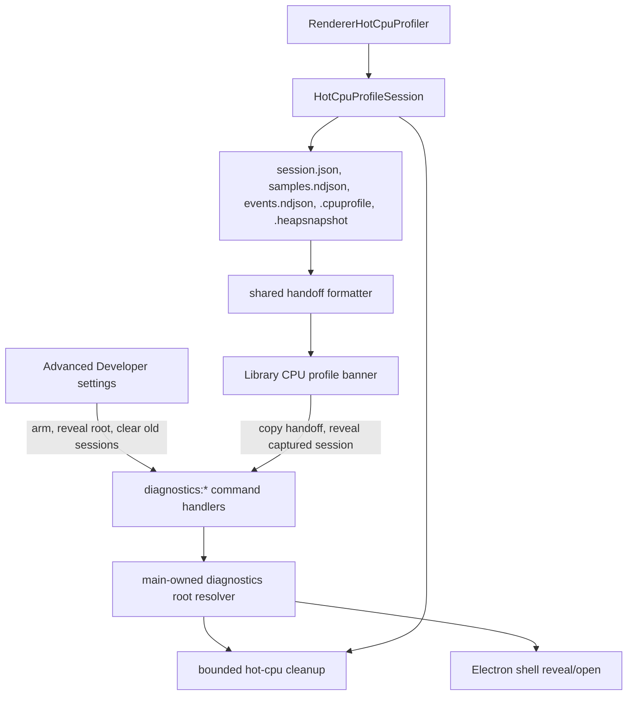

# Developer Diagnostics Followup - Plan

## Goal Capsule

| Field | Decision |
|---|---|
| Objective | Make the merged hot renderer CPU diagnostics workflow easier to use, hand off, verify in packaged builds, and clean up safely. |
| Authority | User request and the shipped developer diagnostics behavior are the source of truth; this plan must not chase or fix the already-resolved CPU issue. |
| Execution profile | Standard followup across shared protocol text, command-bus diagnostics actions, renderer controls, main-process artifact lifecycle, docs, and tests. |
| Stop conditions | Stop if implementation requires deleting non-diagnostics persisted state, widening renderer access to arbitrary filesystem paths, or changing profiler trigger semantics beyond usability/cleanup needs. |

---

## Product Contract

### Summary

This plan follows the merged developer diagnostics feature with a usability and operability pass: document how to use captured artifacts, make copied handoff text more useful, add a reveal action for the diagnostics folder, verify packaged-build profiles, and add bounded cleanup for large hot CPU sessions.
It intentionally does not investigate or fix the CPU behavior that prompted the capture.

### Problem Frame

The first captured session produced valid artifacts, but the workflow still depends on a developer reading long copied text and manually navigating app-data paths.
Heap snapshots are intentionally large, and repeated diagnostics sessions can accumulate in `diagnostics/hot-cpu` unless the app owns a clear cleanup policy.
The feature was validated in a dev renderer; packaged-build validation should be a formal exit criterion because packaged profile URLs and source maps can differ from `localhost` dev output.

### Requirements

**Artifact Handoff**

- R1. The copied hot CPU handoff text should stay complete enough for an agent or human to find the session, CPU profile, heap snapshots, and sidecar logs without repeating redundant basename/path pairs.
- R2. The handoff text should tell the recipient to analyze the artifacts as evidence, not assume the captured issue is still active.
- R3. The Library banner should expose a one-click action to reveal the captured diagnostics session in Finder when a session is available.

**Artifact Lifecycle**

- R4. Hot CPU diagnostics cleanup must delete only files under the app-owned hot CPU diagnostics root and must never touch captures, settings, secrets, render cache, or the app database.
- R5. The app should bound old hot CPU sessions automatically so repeated heap-snapshot captures do not grow without limit.
- R6. Developer settings should provide a clear manual cleanup or reveal-root affordance for the hot CPU diagnostics directory.

**Verification and Documentation**

- R7. Documentation should explain where hot CPU artifacts live, how to open `.cpuprofile` and `.heapsnapshot` files, what `session.json`, `samples.ndjson`, and `events.ndjson` are for, and when to turn heap capture off.
- R8. Packaged-build verification should confirm that a captured `.cpuprofile` is valid, opens in DevTools, and contains useful renderer attribution before any source-map or packaging changes are made.

### Scope Boundaries

#### Deferred to Follow-Up Work

- Shared-library extraction between PwrSnap and PwrAgent remains deferred until both implementations have stabilized through real troubleshooting use.
- Rich in-app diagnostics browsing, profile visualization, and automatic profile analysis are deferred; this pass only improves capture handoff, reveal, cleanup, and docs.

#### Outside This Plan

- Fixing the historical high-CPU behavior is outside this plan.
- Changing the hot CPU trigger algorithm, sample interval defaults, or heap snapshot capture mechanics is outside this plan except where cleanup needs metadata already produced by the current mechanism.
- Deleting any persisted user data outside `diagnostics/hot-cpu` is outside this plan.

---

## Planning Contract

### Key Technical Decisions

- KTD1. Add a diagnostics command namespace instead of passing paths through generic app commands. Renderer actions should call command-bus verbs such as `diagnostics:revealHotCpuSession`, `diagnostics:revealHotCpuRoot`, and `diagnostics:clearHotCpuSessions`; main resolves all paths from its own diagnostics root.
- KTD2. Use session directory names as renderer-provided identifiers, not raw filesystem paths. Main should reject names with separators, traversal, or unknown session directories before calling Electron shell APIs or deleting anything.
- KTD3. Put retention in the hot CPU session lifecycle, not only in the UI. Session creation is the natural point to prune old sessions because it runs when diagnostics are active and can keep the root bounded even if the user never opens Settings.
- KTD4. Keep cleanup conservative and diagnosable. Default retention should prefer deleting oldest complete session directories under `diagnostics/hot-cpu`, preserving the newest sessions and logging failures rather than failing profile capture because cleanup could not remove an old directory.
- KTD5. Treat packaged-build profile quality as a validation gate before changing packaging. If the packaged `.cpuprofile` is valid and usable, the plan ends with documentation; if attribution is poor, implementation should add the minimum source-map or artifact packaging change needed and test it.

### High-Level Technical Design

### Assumptions

- The hot CPU diagnostics root remains `app.getPath("userData")/diagnostics/hot-cpu` unless an env override is already active for profiling tests.
- Keeping a small number of recent sessions is better than age-only cleanup because a single troubleshooting day can produce several useful captures.
- Existing command-bus and result-pattern conventions are sufficient; no new IPC channel is needed.
- The packaged-build smoke can be manual or semi-automated during implementation, but the result should be recorded in the docs note or PR description.

### Sources and Research

- `apps/desktop/src/renderer/src/features/settings/pages/DeveloperPage.tsx` already owns Advanced → Developer controls for hot CPU capture and heap snapshot settings.
- `apps/desktop/src/renderer/src/features/library/HotCpuProfileBanner.tsx` already receives captured-profile events and copies the shared handoff text.
- `packages/shared/src/protocol.ts` already owns `HotCpuProfileCapturedEvent`, trigger formatting, and `buildHotCpuProfileHandoffMessage`.
- `apps/desktop/src/main/diagnostics/hot-cpu-profile-session.ts` already writes session manifests and artifact lists.
- `apps/desktop/src/main/diagnostics/renderer-hot-cpu-profiler.ts` already appends lifecycle events, writes CPU profiles, writes heap snapshots, and auto-disables heap capture after the limit.
- `apps/desktop/src/main/handlers/capture-handlers.ts` and `apps/desktop/src/main/handlers/sizzle-handlers.ts` show existing `shell.showItemInFolder` reveal patterns behind command-bus handlers.
- `docs/solutions/2026-06-12-library-startup-black-window-profiling.md` establishes that profiling artifacts are useful but must be opt-in, bounded, and safe around user data.

### System-Wide Impact

This work adds a narrow diagnostics command surface visible to sandboxed renderers, so validation must prevent arbitrary path reveal or deletion.
It also adds filesystem cleanup under app data, so the implementation must keep the target root narrow and covered by tests.
No database schema, capture bundle format, settings schema migration, or startup profiling behavior is required.

### Risks and Mitigations

| Risk | Mitigation |
|---|---|
| Renderer can trick main into revealing or deleting arbitrary paths. | Accept only session directory names or root-level actions and resolve them under the main-owned hot CPU diagnostics root. |
| Cleanup deletes an in-progress capture. | Prune before creating a new session or skip directories with missing/active-looking manifests; never delete the current session. |
| Cleanup failure prevents capture. | Log cleanup failures and continue profiling unless session creation itself fails. |
| Packaged profiles lack useful source attribution. | Treat packaged-build inspection as a required validation gate and add source-map packaging only if the smoke proves the need. |
| Handoff copy becomes too terse for agent use. | Preserve exact session/profile paths, heap paths, and sidecar directory guidance while cutting redundant basename/path repetition. |

---

## Implementation Units

### U1. Document the Hot CPU Diagnostics Workflow

- **Goal:** Add a durable runbook for using hot CPU diagnostics after a capture.
- **Requirements:** R7, R8
- **Dependencies:** None
- **Files:** `docs/solutions/2026-07-05-hot-cpu-diagnostics-workflow.md`
- **Approach:** Document the artifact directory shape, DevTools opening steps for CPU and heap artifacts, sidecar log meanings, heap snapshot cautions, packaged-build smoke expectations, and the rule that diagnostics should not be used as proof that an already-fixed bug is still active.
- **Patterns to follow:** Mirror the practical runbook shape in `docs/solutions/2026-06-12-library-startup-black-window-profiling.md`, but keep this note focused on hot CPU sessions rather than startup profiling.
- **Test scenarios:** Test expectation: none -- documentation-only unit.
- **Verification:** A developer can read the note and know which file to open first, how to inspect memory snapshots, where sidecars live, and how to capture packaged-build evidence.

### U2. Tighten the Shared Handoff Message

- **Goal:** Make the copied hot CPU profile text shorter, clearer, and more agent-useful while preserving exact artifact paths.
- **Requirements:** R1, R2
- **Dependencies:** U1
- **Files:** `packages/shared/src/protocol.ts`, `packages/shared/src/__tests__/hot-cpu-profile-handoff.test.ts`
- **Approach:** Revise `buildHotCpuProfileHandoffMessage` to group fields by session, CPU profile, heap snapshots, and sidecars. Keep full paths for machine handoff, remove redundant basename lines where the path already contains the basename, and include wording that asks the recipient to analyze artifacts as evidence rather than assume the issue is live.
- **Patterns to follow:** Keep formatting helpers in `@pwrsnap/shared` so renderer and tests consume one source of truth, matching the current `formatHotCpuProfileTriggerSummary` and `buildHotCpuProfileHandoffMessage` placement.
- **Test scenarios:**
  - Happy path: an event with no heap snapshots produces a message with trigger summary, session directory, CPU profile path, sidecar guidance, and no heap section.
  - Happy path: an event with start/stop heap snapshots includes both heap paths and the heap count.
  - Edge case: a trigger CPU value above 100% remains formatted in the trigger line without clamping.
  - Regression: the message does not include duplicate basename-only lines when the same filename already appears in a path.
- **Verification:** Copy output remains pasteable as plain text and all tests around the formatter pass.

### U3. Add Safe Reveal Commands for Diagnostics Artifacts

- **Goal:** Let the Library banner and Developer settings reveal diagnostics locations without exposing arbitrary filesystem access to renderers.
- **Requirements:** R3, R6
- **Dependencies:** U2
- **Files:** `packages/shared/src/protocol.ts`, `apps/desktop/src/main/handlers/diagnostics-handlers.ts`, `apps/desktop/src/main/handlers/__tests__/diagnostics-handlers.test.ts`, `apps/desktop/src/main/index.ts`, `apps/desktop/src/main/process-split/command-routing.ts`, `apps/desktop/src/main/__tests__/command-routing.test.ts`
- **Approach:** Add command-bus handlers for revealing the hot CPU root and a specific hot CPU session by directory name. Resolve all paths in main from the diagnostics root, reject invalid or unknown session names, and use Electron shell reveal/open APIs only after validation. Register the handlers in the same process role that owns Library diagnostics so split mode can answer the renderer dispatch.
- **Technical design:** Directionally, the command shape is:
  - root reveal takes no renderer path input and opens or reveals the hot CPU diagnostics root.
  - session reveal takes `sessionDirectoryName` and resolves it as a direct child of the hot CPU root.
  - validation rejects absolute paths, separators, traversal, empty values, and missing sessions.
- **Patterns to follow:** Follow command-bus result handling from `apps/desktop/src/main/handlers/app-handlers.ts` and reveal behavior from `capture:reveal` and `sizzle:revealOutput`.
- **Test scenarios:**
  - Happy path: revealing the root calls the Electron shell with the main-owned hot CPU root.
  - Happy path: revealing a known session name resolves to the expected child directory or manifest path.
  - Error path: traversal input, absolute paths, and names with path separators return validation errors and do not call Electron shell.
  - Error path: a missing session returns a validation/not-found error and does not call Electron shell.
  - Integration scenario: command routing recognizes the new `diagnostics:*` handlers as bus-owned commands.
- **Verification:** Renderer code can dispatch reveal commands without ever sending a raw path, and the main tests prove invalid paths cannot escape the diagnostics root.

### U4. Wire Reveal Actions into the Banner and Developer Page

- **Goal:** Surface the safe reveal commands where developers naturally look after capture.
- **Requirements:** R3, R6
- **Dependencies:** U3
- **Files:** `apps/desktop/src/renderer/src/features/library/HotCpuProfileBanner.tsx`, `apps/desktop/src/renderer/src/features/library/__tests__/HotCpuProfileBanner.test.tsx`, `apps/desktop/src/renderer/src/features/settings/pages/DeveloperPage.tsx`, `apps/desktop/src/renderer/src/features/settings/pages/__tests__/DeveloperPage.test.tsx`
- **Approach:** Add a secondary action to the capture banner for revealing the captured session. Add a Developer page action to reveal the diagnostics root. Keep actions disabled while settings are unavailable and show compact status text rather than a new explanatory panel.
- **Patterns to follow:** Reuse the existing banner button style from update banners and the existing settings `Row`/`Card` pattern from `DeveloperPage`.
- **Test scenarios:**
  - Happy path: receiving a hot CPU captured event renders Copy, Reveal, and Dismiss actions.
  - Happy path: clicking Reveal dispatches the session reveal command with the session directory name from the event.
  - Error path: failed reveal dispatch does not dismiss the banner or mark copy state as successful.
  - Happy path: Developer settings root reveal dispatches the root reveal command.
  - Accessibility: banner actions remain keyboard buttons with clear labels and the status region remains `aria-live`.
- **Verification:** A captured session can be revealed from the banner and the diagnostics root can be revealed from Settings without hand-copying app-data paths.

### U5. Add Bounded Hot CPU Session Retention and Manual Cleanup

- **Goal:** Keep hot CPU diagnostics from accumulating indefinitely while preserving recent troubleshooting sessions.
- **Requirements:** R4, R5, R6
- **Dependencies:** U3
- **Files:** `apps/desktop/src/main/diagnostics/hot-cpu-profile-retention.ts`, `apps/desktop/src/main/diagnostics/__tests__/hot-cpu-profile-retention.test.ts`, `apps/desktop/src/main/diagnostics/hot-cpu-profile-session.ts`, `apps/desktop/src/main/handlers/diagnostics-handlers.ts`, `apps/desktop/src/main/handlers/__tests__/diagnostics-handlers.test.ts`, `apps/desktop/src/renderer/src/features/settings/pages/DeveloperPage.tsx`, `apps/desktop/src/renderer/src/features/settings/pages/__tests__/DeveloperPage.test.tsx`
- **Approach:** Introduce a small retention helper that lists direct child directories matching the hot CPU session naming shape, reads available `session.json` timestamps when present, and prunes oldest sessions after session creation. Use conservative constants for max retained sessions and optional max total bytes; manual cleanup should call the same helper with a mode that removes all inactive hot CPU sessions under the root, and Developer settings should dispatch that manual cleanup action with a compact result status.
- **Technical design:** Directionally, retention should:
  - operate only on direct children under the hot CPU diagnostics root.
  - skip the current session and any directory it cannot classify safely.
  - prefer `session.json.createdAt` for ordering and fall back to directory stat time.
  - return a summary with deleted count, skipped count, freed bytes when knowable, and non-fatal errors.
- **Patterns to follow:** Follow the narrow-root cleanup discipline from render-cache maintenance and the defensive filesystem handling style in cart export cleanup tests.
- **Test scenarios:**
  - Happy path: creating a new session prunes oldest matching sessions beyond the retention limit and preserves the newest sessions.
  - Edge case: non-matching files and directories under the diagnostics root are ignored.
  - Error path: filesystem errors are reported in the cleanup summary but do not delete outside the root or crash session creation.
  - Error path: traversal-like names are never considered valid session candidates.
  - Integration scenario: manual cleanup removes inactive hot CPU session directories and returns a summary the renderer can display.
- **Verification:** Repeated hot CPU sessions remain bounded under the app-owned diagnostics root, and cleanup tests prove no non-diagnostics path is targeted.

### U6. Verify and Document Packaged-Build Profile Quality

- **Goal:** Prove that the workflow remains useful outside the dev renderer before adding packaging/source-map changes.
- **Requirements:** R8
- **Dependencies:** U1, U2, U3, U4, U5
- **Files:** `docs/solutions/2026-07-05-hot-cpu-diagnostics-workflow.md`
- **Approach:** During implementation, run a packaged or built-app smoke with hot CPU profiling armed, inspect the resulting `.cpuprofile`, and update the docs note with the expected packaged profile shape. Only change packaging/source-map behavior if the smoke shows the profile is valid but too opaque to troubleshoot PwrSnap renderer code.
- **Patterns to follow:** Use the built-output profiling posture from `docs/solutions/2026-06-12-library-startup-black-window-profiling.md`; keep the runtime feature env-gated/settings-gated rather than adding default-on diagnostics.
- **Test scenarios:** Test expectation: none -- packaged-build quality is a manual/runtime verification gate rather than a unit-testable behavior unless implementation discovers a concrete packaging change.
- **Verification:** The PR records whether packaged `.cpuprofile` artifacts open in DevTools and whether source attribution is sufficient for troubleshooting.

---

## Verification Contract

| Gate | Scope | Done Signal |
|---|---|---|
| `pnpm typecheck` | Shared protocol, main handlers, renderer settings/banner changes | TypeScript accepts new diagnostics commands, event formatting, and renderer dispatches. |
| `pnpm test` | Unit and renderer tests | Formatter, retention, command validation, settings, and banner tests pass with the existing suite. |
| `pnpm build` | Desktop build | Main/renderer bundles compile with the new diagnostics command surface. |
| Packaged/built-app smoke | Runtime diagnostic usefulness | A hot CPU capture from built output produces a valid `.cpuprofile`; source attribution is documented as sufficient or a followup packaging change is made. |
| Manual safety inspection | Filesystem cleanup | Cleanup targets only `diagnostics/hot-cpu` session children and never capture storage, settings, secrets, render cache, or SQLite files. |

---

## Definition of Done

- The hot CPU diagnostics docs note exists and explains artifact usage, heap snapshot caution, cleanup, and packaged-build expectations.
- The copied handoff text is shorter, still includes exact artifact paths, and frames artifacts as evidence for analysis.
- The Library banner can reveal the captured session, and Developer settings can reveal the diagnostics root.
- Hot CPU sessions are bounded by conservative retention and can be manually cleaned from Developer settings.
- Renderer-originated reveal and cleanup requests cannot carry arbitrary filesystem paths.
- Packaged-build profile usefulness is verified and recorded.
- All unit tests and build/typecheck gates in the Verification Contract pass.
- Dead-end implementation attempts and temporary diagnostics code are removed from the final diff.
